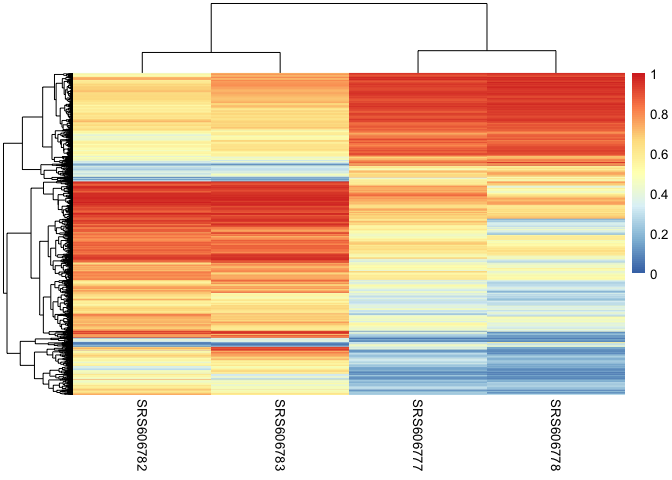
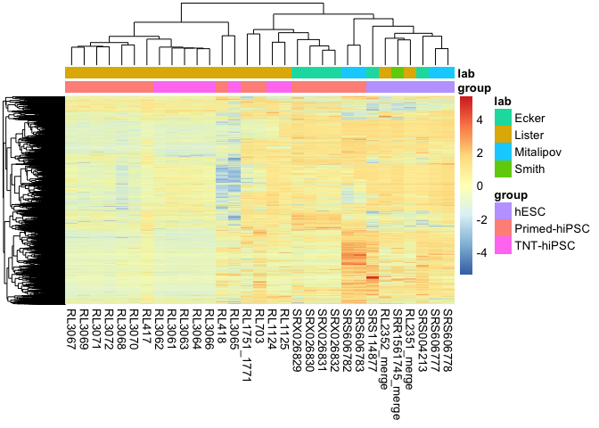

CG-DMR analyses
================
Sam Buckberry
2022-08-03

**This part of the analysis is run on external HPC**

``` r
source("R/server_libraries_and_functions.R")
```

Sync required files (too large for git)

``` bash
rsync -av --progress --partial-dir=/tmp --files-from=wgbs/dmrs/dmr_bsseq_CG_obj_list.txt hg19ips_samb@dug:/d/home/hg19ips/hg19ips_samb/mcc_hg19ips/sam/hs-reprogram/wgbs/CG_bsobj/ wgbs/CG_bsobj/
```

``` bash
rsync -av --progress --partial-dir=/tmp  hg19ips_samb@dug:/d/home/hg19ips/hg19ips_samb/mcc_hg19ips/sam/hs-reprogram/wgbs/CG_bsobj/ wgbs/CG_bsobj/
```

Read in the sample data

``` r
mdat <- read.csv("wgbs/metadata/wgbs_metadata_local.csv")
```

### Merge ESC replicates for DMR calling

Merge and collapse H9 ESC KSR replicates from Smith lab

``` r
smith_primed_files <- mdat$BSseq_CG[mdat$Background == "H9" &
                                   mdat$Media == "KSR" &
                                   mdat$Lab == "Smith"]

stopifnot(all(file.exists(smith_primed_files)))

smith_primed_list <- lapply(X = smith_primed_files, FUN = readRDS)

smith_primed_obj <- bsseq::combineList(smith_primed_list)

merge_vec <- c("H9_KSR", "H9_KSR", "H9_KSR")
names(merge_vec) <- sampleNames(smith_primed_obj)

smith_collapsed_obj <- bsseq::collapseBSseq(BSseq = smith_primed_obj,
                                            group = merge_vec)

saveRDS(object = smith_collapsed_obj, file = "wgbs/CG_bsobj/Smith_H9_Primed_KSR_combined_CG_bsseq.Rds")
```

Merge MEL1 ESC E8 replicates

``` r
mel1_esc_files <- mdat$BSseq_CG[mdat$Background == "MEL1" &
                                   mdat$Media == "E8" &
                                   mdat$State == "ESC"]

stopifnot(all(file.exists(mel1_esc_files)))

mel1_esc_list <- lapply(X = mel1_esc_files, FUN = readRDS)

mel1_esc_obj <- bsseq::combineList(mel1_esc_list)

merge_vec <- c("MEL1_ESC_E8", "MEL1_ESC_E8")
names(merge_vec) <- sampleNames(mel1_esc_obj)

mel1_collapsed_obj <- bsseq::collapseBSseq(BSseq = mel1_esc_obj,
                                            group = merge_vec)

saveRDS(object = mel1_collapsed_obj,
        file = "wgbs/CG_bsobj/MEL1_ESC_E8_combined_CG_bsseq.Rds")
```

Merge H9 ESC E8 replicates

``` r
h9_esc_files <- mdat$BSseq_CG[mdat$Background == "H9" &
                                   mdat$Media == "E8" &
                                   mdat$State == "ESC"]

stopifnot(all(file.exists(h9_esc_files)))

h9_esc_list <- lapply(X = h9_esc_files, FUN = readRDS)

h9_esc_obj <- bsseq::combineList(h9_esc_list)

merge_vec <- c("H9_ESC_E8", "H9_ESC_E8")
names(merge_vec) <- sampleNames(h9_esc_obj)

mel1_collapsed_obj <- bsseq::collapseBSseq(BSseq = h9_esc_obj,
                                            group = merge_vec)

saveRDS(object = mel1_collapsed_obj,
        file = "wgbs/CG_bsobj/H9_ESC_E8_combined_CG_bsseq.Rds")
```

### DMR calling

DMRs called using the script `"wgbs/dmrs/run_dmrseq_dug.R"`

### DMR assessment

    ## Loading required package: BiocGenerics

    ## 
    ## Attaching package: 'BiocGenerics'

    ## The following objects are masked from 'package:stats':
    ## 
    ##     IQR, mad, sd, var, xtabs

    ## The following objects are masked from 'package:base':
    ## 
    ##     anyDuplicated, append, as.data.frame, basename, cbind, colnames,
    ##     dirname, do.call, duplicated, eval, evalq, Filter, Find, get, grep,
    ##     grepl, intersect, is.unsorted, lapply, Map, mapply, match, mget,
    ##     order, paste, pmax, pmax.int, pmin, pmin.int, Position, rank,
    ##     rbind, Reduce, rownames, sapply, setdiff, sort, table, tapply,
    ##     union, unique, unsplit, which.max, which.min

    ## Welcome to Bioconductor
    ## 
    ##     Vignettes contain introductory material; view with
    ##     'browseVignettes()'. To cite Bioconductor, see
    ##     'citation("Biobase")', and for packages 'citation("pkgname")'.

    ## Loading required package: ggplot2

    ## Loading required package: lattice

    ## Loading required package: GenomicRanges

    ## Loading required package: stats4

    ## Loading required package: S4Vectors

    ## 
    ## Attaching package: 'S4Vectors'

    ## The following objects are masked from 'package:base':
    ## 
    ##     expand.grid, I, unname

    ## Loading required package: IRanges

    ## Loading required package: GenomeInfoDb

    ## Loading required package: SummarizedExperiment

    ## Loading required package: MatrixGenerics

    ## Loading required package: matrixStats

    ## 
    ## Attaching package: 'matrixStats'

    ## The following objects are masked from 'package:Biobase':
    ## 
    ##     anyMissing, rowMedians

    ## 
    ## Attaching package: 'MatrixGenerics'

    ## The following objects are masked from 'package:matrixStats':
    ## 
    ##     colAlls, colAnyNAs, colAnys, colAvgsPerRowSet, colCollapse,
    ##     colCounts, colCummaxs, colCummins, colCumprods, colCumsums,
    ##     colDiffs, colIQRDiffs, colIQRs, colLogSumExps, colMadDiffs,
    ##     colMads, colMaxs, colMeans2, colMedians, colMins, colOrderStats,
    ##     colProds, colQuantiles, colRanges, colRanks, colSdDiffs, colSds,
    ##     colSums2, colTabulates, colVarDiffs, colVars, colWeightedMads,
    ##     colWeightedMeans, colWeightedMedians, colWeightedSds,
    ##     colWeightedVars, rowAlls, rowAnyNAs, rowAnys, rowAvgsPerColSet,
    ##     rowCollapse, rowCounts, rowCummaxs, rowCummins, rowCumprods,
    ##     rowCumsums, rowDiffs, rowIQRDiffs, rowIQRs, rowLogSumExps,
    ##     rowMadDiffs, rowMads, rowMaxs, rowMeans2, rowMedians, rowMins,
    ##     rowOrderStats, rowProds, rowQuantiles, rowRanges, rowRanks,
    ##     rowSdDiffs, rowSds, rowSums2, rowTabulates, rowVarDiffs, rowVars,
    ##     rowWeightedMads, rowWeightedMeans, rowWeightedMedians,
    ##     rowWeightedSds, rowWeightedVars

    ## The following object is masked from 'package:Biobase':
    ## 
    ##     rowMedians

    ## 
    ## Attaching package: 'magrittr'

    ## The following object is masked from 'package:GenomicRanges':
    ## 
    ##     subtract

    ## 
    ## Attaching package: 'data.table'

    ## The following object is masked from 'package:SummarizedExperiment':
    ## 
    ##     shift

    ## The following object is masked from 'package:GenomicRanges':
    ## 
    ##     shift

    ## The following object is masked from 'package:IRanges':
    ## 
    ##     shift

    ## The following objects are masked from 'package:S4Vectors':
    ## 
    ##     first, second

    ## Loading required package: BSgenome

    ## Loading required package: Biostrings

    ## Loading required package: XVector

    ## 
    ## Attaching package: 'Biostrings'

    ## The following object is masked from 'package:base':
    ## 
    ##     strsplit

    ## Loading required package: rtracklayer

    ## Loading required package: AnnotationDbi

    ## 
    ## Attaching package: 'ggthemes'

    ## The following object is masked from 'package:cowplot':
    ## 
    ##     theme_map

    ## Loading required package: Rsamtools

    ## 
    ## Attaching package: 'VariantAnnotation'

    ## The following object is masked from 'package:stringr':
    ## 
    ##     fixed

    ## The following object is masked from 'package:base':
    ## 
    ##     tabulate

    ## 
    ## Attaching package: 'ChIPpeakAnno'

    ## The following object is masked from 'package:VariantAnnotation':
    ## 
    ##     info

    ## 
    ## Attaching package: 'gtools'

    ## The following object is masked from 'package:e1071':
    ## 
    ##     permutations

    ## 
    ## Attaching package: 'UpSetR'

    ## The following object is masked from 'package:lattice':
    ## 
    ##     histogram

    ## Loading required package: limma

    ## 
    ## Attaching package: 'limma'

    ## The following object is masked from 'package:BiocGenerics':
    ## 
    ##     plotMA

    ## Loading required package: grid

    ## 
    ## Attaching package: 'grid'

    ## The following object is masked from 'package:Biostrings':
    ## 
    ##     pattern

Load the metadata

``` r
mdat <- read.csv("wgbs/metadata/wgbs_metadata_local.csv")
```

#### Primed vs ESC original submission data

``` r
process_dmr <- function(dmr_obj, p = 0.05, delta = 0.2){
    
    # make mCG matrix
    bsseq_fls <- basename(dmr_obj$manifest_data$rds_path)
    bsseq_fls <- str_c("wgbs/CG_bsobj/", bsseq_fls)    
    
    mC_dat <- make_mC_matrix(obj_fls = bsseq_fls,
                             gr = dmr_obj$dmr_granges,
                             cores = 3)
    
    ind <- match(colnames(mC_dat), basename(dmr_obj$manifest_data$rds_path))
    colnames(mC_dat) <- dmr_obj$manifest_data$id[ind]
    
    ## Calculate delta for groups
    groups <- unique(dmr_obj$manifest_data$group)
    g1_mean <- rowMeans(mC_dat[ ,dmr_obj$manifest_data$group == groups[1]])
    g2_mean <- rowMeans(mC_dat[ ,dmr_obj$manifest_data$group == groups[2]])
    group_delta <- g1_mean - g2_mean
    
    ## Setup mcols for output
    df <- data.frame(g1_mean = g1_mean, g2_mean = g2_mean, delta = group_delta)
    
    mcols(dmr_obj$dmr_granges) <- cbind(mcols(dmr_obj$dmr_granges), df, mC_dat)
    
    # Set if DMR passes significance threshold
    dmr_obj$dmr_granges$significant <- (dmr_obj$dmr_granges$pval < p) & 
                           (abs(dmr_obj$dmr_granges$delta) >= delta)
    
    # remove sex chromosomes 
    dmr_obj$dmr_granges <- dmr_obj$dmr_granges[seqnames(dmr_obj$dmr_granges) %in%
                                                  str_c("chr", 1:22)]
    
    return(dmr_obj)
}
```

``` r
dmr_a <- readRDS("wgbs/dmrs/dmrseq_primed_vs_esc_original/dmrseq_primed_vs_esc_original_ESC_vs_Primed_dmrseq_dmrs.Rds")
```

``` r
dmr_a <- process_dmr(dmr_a)
```

    ## Making matrix of mC levels for regions...

Heatmap

``` r
pheatmap(mcols(dmr_a$dmr_granges)[dmr_a$dmr_granges$significant, 
                                  dmr_a$manifest_data$id])
```

<!-- -->

#### Primed vs TNT matched replicates

``` r
dmr_matched <- readRDS("wgbs/dmrs/dmrseq_primed_vs_tnt_matched/primed_vs_tnt_matched_TNT_vs_Primed_dmrseq_dmrs.Rds") 
```

Process and filter DMRs

``` r
dmr_matched <- process_dmr(dmr_obj = dmr_matched)
```

    ## Making matrix of mC levels for regions...

``` r
esc_lines <- c("SRR1561745_merge", "RL2351_merge", "RL2352_merge",
               "SRS004213", "SRS114877", "SRS606777", "SRS606778")

fib_ind <- match(c("RL415", esc_lines, dmr_matched$manifest_data$id),
                 mdat$Library_id)

fib_dmr_mCG <- make_mC_matrix(obj_fls = mdat$BSseq_CG[fib_ind],
                               gr = dmr_matched$dmr_granges[dmr_matched$dmr_granges$significant],
                               cores = 3)
```

    ## Making matrix of mC levels for regions...

``` r
dmr_matched_table <- as.data.frame(dmr_matched$dmr_granges)
write.csv(dmr_matched_table, "wgbs/processed_data/32F-matched-primed-tnt-cg-dmrs.csv")

colnames(fib_dmr_mCG) <- mdat$Manuscript.Name[fib_ind]

fib_coldat <- data.frame(row.names = colnames(fib_dmr_mCG),
                         Group = mdat$Group[fib_ind])

pdf("wgbs/plots/cg-dmr-32F-repeat-endpoint-heatmap.pdf", width = 4, height = 4)
pheatmap(fib_dmr_mCG[complete.cases(fib_dmr_mCG), ],
         show_rownames = FALSE, fontsize = 6,
         annotation_col = fib_coldat,
         clustering_distance_cols = "correlation",
         clustering_method = "average")
dev.off()
```

    ## pdf 
    ##   3

``` r
wb_ed_fig9f <- openxlsx::createWorkbook()
openxlsx::addWorksheet(wb_ed_fig9f, sheetName = "ED_Fig_9f_hdf")
openxlsx::writeData(wb = wb_ed_fig9f, sheet = "ED_Fig_9f_hdf",
                    x = fib_dmr_mCG[complete.cases(fib_dmr_mCG), ])
```

### MSCs

``` r
dmr_msc <- readRDS("wgbs/dmrs/dmrseq_msc_primed_vs_tnt/dmrseq_msc_primed_vs_tnt_MSC_TNT_vs_MSC_Primed_dmrseq_dmrs.Rds")

dmr_msc <- process_dmr(dmr_msc)
```

    ## Making matrix of mC levels for regions...

``` r
msc_ind <- match(c("RL3161", "RL3162",
                    esc_lines, dmr_msc$manifest_data$id), mdat$Library_id)

msc_dmr_mCG <- make_mC_matrix(obj_fls = mdat$BSseq_CG[msc_ind],
                               gr = dmr_msc$dmr_granges[dmr_msc$dmr_granges$significant],
                               cores = 3)
```

    ## Making matrix of mC levels for regions...

``` r
colnames(msc_dmr_mCG) <- mdat$Manuscript.Name[msc_ind]

pheatmap(msc_dmr_mCG[complete.cases(msc_dmr_mCG), ], show_rownames = FALSE)
```

<!-- -->

``` r
pdf("wgbs/plots/cg-dmr-msc-tnt-vs-primed-heatmap.pdf", width = 3, height = 4)
pheatmap(msc_dmr_mCG[complete.cases(msc_dmr_mCG), ],
         show_rownames = FALSE, fontsize = 6,
         clustering_distance_cols = "correlation")
dev.off()
```

    ## pdf 
    ##   3

``` r
openxlsx::addWorksheet(wb_ed_fig9f, sheetName = "ED_Fig_9f_msc")
openxlsx::writeData(wb = wb_ed_fig9f, sheet = "ED_Fig_9f_msc",
                    x = msc_dmr_mCG[complete.cases(msc_dmr_mCG), ])
```

#### Keratinocytes

``` r
dmr_nhek <- readRDS("wgbs/dmrs/dmrseq_nhek_primed_vs_tnt/dmrseq_nhek_primed_vs_tnt_NHEK_Primed_vs_NHEK_TNT_dmrseq_dmrs.Rds")

dmr_nhek <- process_dmr(dmr_nhek)
```

    ## Making matrix of mC levels for regions...

``` r
nhek_ind <- match(c("RL3245", "RL3246", "RL3247",
                    esc_lines, dmr_nhek$manifest_data$id), mdat$Library_id)

nhek_dmr_mCG <- make_mC_matrix(obj_fls = mdat$BSseq_CG[nhek_ind],
                               gr = dmr_nhek$dmr_granges[dmr_nhek$dmr_granges$significant],
                               cores = 3)
```

    ## Making matrix of mC levels for regions...

``` r
colnames(nhek_dmr_mCG) <- mdat$Manuscript.Name[nhek_ind]

pdf("wgbs/plots/cg-dmr-nhek-tnt-vs-primed-heatmap.pdf", width = 3, height = 4)
pheatmap(nhek_dmr_mCG[complete.cases(nhek_dmr_mCG), ],
         show_rownames = FALSE, fontsize = 6,
         clustering_distance_cols = "correlation")
dev.off()
```

    ## pdf 
    ##   3

``` r
openxlsx::addWorksheet(wb_ed_fig9f, sheetName = "ED_Fig_9f_nhek")
openxlsx::writeData(wb = wb_ed_fig9f, sheet = "ED_Fig_9f_nhek",
                    x = nhek_dmr_mCG[complete.cases(nhek_dmr_mCG), ])
openxlsx::saveWorkbook(wb = wb_ed_fig9f,
                       file = "ED_Figure_9f_source_data.xlsx", overwrite = TRUE)
```

Compare DMRs in context of ESCs and Fibroblasts

``` r
esc_lines <- c("SRR1561745_merge", "RL2351_merge", "RL2352_merge",
               "SRS004213", "SRS114877", "SRS606777", "SRS606778")

ips_lines <- c(dmr_matched$manifest_data$id,
               dmr_msc$manifest_data$id,
               dmr_nhek$manifest_data$id)

origin_lines <- c("RL415", "RL3245", "RL3161")

lib_ids_a <- c(esc_lines, ips_lines, origin_lines)

ind_a <- match(lib_ids_a, mdat$Library_id)

# Make union DMRs
union_dmr_matched <- GRangesList(
    dmr_matched$dmr_granges[dmr_matched$dmr_granges$significant],
    dmr_nhek$dmr_granges[dmr_nhek$dmr_granges$significant],
    dmr_msc$dmr_granges[dmr_msc$dmr_granges$significant]
    ) %>% unlist() %>% reduce()


dmr_union_mCG <- make_mC_matrix(obj_fls = mdat$BSseq_CG[ind_a],
                                gr = union_dmr_matched, cores = 3)
```

    ## Making matrix of mC levels for regions...

``` r
colnames(dmr_union_mCG) <- mdat$ID[ind_a]

pheatmap(dmr_union_mCG[complete.cases(dmr_union_mCG), c(1:7, 26:31)],
         show_rownames = FALSE,
         clustering_distance_cols = 'correlation')
```

<!-- -->

``` r
pheatmap(dmr_union_mCG[complete.cases(dmr_union_mCG), c(1:7, 20:25)],
         show_rownames = FALSE,
         clustering_distance_cols = 'correlation')
```

<!-- -->

``` r
pheatmap(dmr_union_mCG[complete.cases(dmr_union_mCG), c(1:19)],
         show_rownames = FALSE,
         clustering_distance_cols = 'correlation')
```

<!-- -->

``` r
plot_pca(dmr_union_mCG, dim1 = 2, dim2 = 3)
```

    ## Low variance features removed = 0

    ## Warning: ggrepel: 6 unlabeled data points (too many overlaps). Consider
    ## increasing max.overlaps

<!-- -->

``` r
plot_dendrogram(dmr_union_mCG[complete.cases(dmr_union_mCG), c(1:7, 26:31)],
                method = "pearson")
```

<!-- -->

Heatmap the DMRs

``` r
# 
# dmr_mdat <- mdat[ind_a, c(1, 10)]
# rownames(dmr_mdat) <- dmr_mdat$Library_id
# dmr_mdat$Library_id <- NULL
# 
# hm1_labs <- mdat$Manuscript.Name[ind_a]
# hm1_labs[grepl(pattern = "(32F)", hm1_labs)] <- "Fibroblast-32F"
# hm1_labs[grepl(pattern = "(38F)", hm1_labs)] <- "Fibroblast-38F"
# 
# dmr_hm1 <- pheatmap(dmr_match_mCG[complete.cases(dmr_match_mCG) &
#                                   dmr_matched$dmr_granges$pval < 0.05, ],
#          annotation_col = dmr_mdat,
#          labels_col = hm1_labs,
#          fontsize = 6,
#          show_rownames = FALSE,
#          border_color = NA,
#          clustering_distance_cols = "correlation")
# 
# ## Export plot for manuscript layout
# pdf("manuscript_figure_plots/revision/cg-dmr-batch-2-heatmap.pdf",
#     height = 4, width = 4)
# dmr_hm1
# 
# dev.off()
# 
# dmr_hm1
```

DMR delta plots

``` r
# sig <- dmr_matched$dmr_granges$pval < 0.05
# 
# primed_mean <- rowMeans(dmr_match_mCG[sig, dmr_mdat$Group == "Primed-hiPSC"], na.rm = TRUE) 
# tnt_mean <- rowMeans(dmr_match_mCG[sig, dmr_mdat$Group == "TNT-hiPSC"], na.rm = TRUE)
# esc_mean <- rowMeans(dmr_match_mCG[sig, dmr_mdat$Group == "hESC"], na.rm = TRUE)
# fblast_mean <- dmr_match_mCG[sig ,"RL415"]
# 
# primed_esc_delta <- primed_mean - esc_mean
# tnt_esc_delta <- tnt_mean - esc_mean
# primed_fblast_delta <- primed_mean - fblast_mean
# tnt_fblast_delta <- tnt_mean - fblast_mean
# 
# df <- data.frame(iPSC = c(primed_esc_delta, tnt_esc_delta),
#                  HDF = c(primed_fblast_delta, tnt_fblast_delta),
#                  group = c(rep("Primed-hiPSC", times=length(primed_esc_delta)),
#                            rep("TNT-hiPSC", times=length(tnt_esc_delta))))
# 
# ggMarg_primed <- ggplot(df[df$group == "Primed-hiPSC", ],
#                                 aes(x = iPSC, y = HDF)) +
#     #scale_colour_manual(values = cols[1]) +
#     geom_vline(xintercept = c(-.2, .2), alpha=0.5, linetype = "dashed") + 
#     geom_hline(yintercept = c(-.2, .2), alpha=0.5, linetype = "dashed") +
#     geom_point(alpha=0.5, inherit.aes = TRUE, size=1) +
#     scale_x_continuous(limits = c(-1, 1), expand = c(0,0)) +
#     scale_y_continuous(limits = c(-1, 1), expand = c(0,0)) +
#     ylab("Fibroblast mCG - hiPSC mCG") +
#     xlab("hESC mCG - hiPSC mCG") +
#     sams_pub_theme(x.text.angle = 0, hjust = 0.5)
# 
# ggMarg_primed <- ggExtra::ggMarginal(ggMarg_primed)
# 
# ggMarg_tnt <- ggplot(df[df$group == "TNT-hiPSC", ],
#                                 aes(x = iPSC, y = HDF)) +
#     geom_vline(xintercept = c(-.2, .2), alpha=0.5, linetype = "dashed") + 
#     geom_hline(yintercept = c(-.2, .2), alpha=0.5, linetype = "dashed") +
#     geom_point(alpha=0.5, inherit.aes = TRUE, size=1) +
#     scale_x_continuous(limits = c(-1, 1), expand = c(0,0)) +
#     scale_y_continuous(limits = c(-1, 1), expand = c(0,0)) +
#     ylab("Fibroblast mCG - hiPSC mCG") +
#     xlab("hESC mCG - hiPSC mCG") +
#     scale_colour_manual(values = vitC[c(6,1)]) +
#     sams_pub_theme(x.text.angle = 0, hjust = 0.5)
# 
# ggMarg_tnt <- ggExtra::ggMarginal(ggMarg_tnt)
# 
# cols <- reprog_pal2[c(2,1)] %>% str_sub(end = -3)
# 
# gg_dmr_hist <- ggplot(df, aes(x = iPSC, fill=group)) +
#     geom_histogram(bins = 40) +
#     scale_fill_manual(values = cols, drop = FALSE) +
#     facet_grid(group~.) +
#     geom_vline(xintercept = 0, linetype="dashed") +
#     scale_x_continuous(limits = c(-1, 1), expand = c(0,0)) +
#     scale_y_continuous(expand = c(0,0)) +
#     #scale_colour_manual(values = c("grey")) +
#     xlab("mCG DMR difference \n (hiPSC mCG - hESC mCG)") +
#     ylab("CG-DMR count") +
#     sams_pub_theme(x.text.angle = 0, hjust = 0.5)
# 
# pdf("manuscript_figure_plots/revision/cg-dmr-batch-2-group-histogram.pdf",
#     width = 2, height = 2.5)
# gg_dmr_hist
# dev.off()
```

#### MEL1 DMRs

``` r
dmr_mel1 <- readRDS("wgbs/dmrs/MEL1_dmrs/dmr_out/esc_vs_primed_dmrseq_dmrs.Rds")

dmr_mel1 <- process_dmr(dmr_mel1, p = 0.05, delta = 0)
```

    ## Making matrix of mC levels for regions...

#### Re-analysis Lister 2011

``` r
dmr_lister <- readRDS("wgbs/dmrs/dmrseq_lister_reanalysis/lister_primed_vs_esc_Primed_vs_ESC_dmrseq_dmrs.Rds")

dmr_lister <- process_dmr(dmr_lister, p = 0.05, delta = 0)
```

    ## Making matrix of mC levels for regions...

``` r
pheatmap(mcols(dmr_lister$dmr_granges)[dmr_lister$dmr_granges$significant, 
                                       dmr_lister$manifest_data$id])
```

<!-- -->

``` r
## Add our data and plot
primary_dat <- mdat$BSseq_CG[mdat$Background %in% c("32F", "38F") &
                                 mdat$Group %in% c("TNT-hiPSC", "Primed-hiPSC") &
                                 mdat$In_manuscript == "YES"]

dmr_lister_mCG <- make_mC_matrix(obj_fls = primary_dat,
                                 gr = dmr_lister$dmr_granges[dmr_lister$dmr_granges$significant],
                                 cores = 3)
```

    ## Making matrix of mC levels for regions...

``` r
dmr_lister_mCG <- cbind(mcols(dmr_lister$dmr_granges)
                        [dmr_lister$dmr_granges$significant, 
                                       dmr_lister$manifest_data$id],
                        dmr_lister_mCG)

pheatmap(dmr_lister_mCG[complete.cases(dmr_lister_mCG), ],
         cluster_cols = FALSE, gaps_col = c(4, 6, 18, 22),
         show_rownames = FALSE)
```

<!-- -->

#### Re-analysis Ma 2015

``` r
dmr_ma <- readRDS("wgbs/dmrs/dmrseq_mitalipov_reanalysis/mitalipov_primed_sendai_vs_esc_Primed_vs_ESC_dmrseq_dmrs.Rds")

dmr_ma <- process_dmr(dmr_ma)
```

    ## Making matrix of mC levels for regions...

``` r
pheatmap(mcols(dmr_ma$dmr_granges)[dmr_ma$dmr_granges$significant,
                                   dmr_ma$manifest_data$id])
```

<!-- -->

Delta ESC plots

``` r
plot_esc_delta_histograms <- function(dmr_obj, title=""){
    
    # Get the GRanges DMR object
    dmr_gr <- dmr_obj$dmr_granges[dmr_obj$dmr_granges$significant]

    # Get the library IDs for plot
    esc_lines <- c("SRR1561745_merge", "RL2351_merge", "RL2352_merge",
               "SRS004213", "SRS114877", "SRS606777", "SRS606778")
    
    ips_lines <- dmr_obj$manifest_data$id
    
    # Get the files matching IDs
    ind <- match(c(esc_lines, ips_lines), mdat$Library_id)
    
    fls <- mdat$BSseq_CG[ind]
    
    # Make mC matrix
    mat <- make_mC_matrix(obj_fls = fls, gr = dmr_gr, cores = 3)
    colnames(mat) <- mdat$Library_id[ind]
    
    # Calculate ESC delta
    esc_mean <- rowMeans(mat[ ,esc_lines], na.rm = TRUE)
    
    delta_mat <- mat[ ,ips_lines] - esc_mean
    
    # Format for plotting    
    delta_mat <- reshape2::melt(delta_mat)
    
    ind2 <- match(delta_mat$Var2, mdat$Library_id)
    
    delta_mat$Group <- mdat$Group[ind2]
    
    ggplot(delta_mat, aes(x = value)) +
        geom_histogram(bins = 50) +
        facet_grid(Group+Var2~.) +
        geom_vline(xintercept = 0) +
        scale_x_continuous(limits = c(-1, 1)) +
        ylab("DMR count") + xlab("hiPSC mCG - hESC mCG") +
        ggtitle(title) +
        sams_pub_theme(x.text.angle = 0, hjust = 0.5)
}

gg_delta_nhek <- plot_esc_delta_histograms(dmr_obj = dmr_nhek,
                                           title = "Keratinocytes")
```

    ## Making matrix of mC levels for regions...

    ## Warning: The `size` argument of `element_line()` is deprecated as of ggplot2 3.4.0.
    ## ℹ Please use the `linewidth` argument instead.

``` r
gg_delta_msc <- plot_esc_delta_histograms(dmr_obj = dmr_msc,
                                           title = "MSCs")
```

    ## Making matrix of mC levels for regions...

``` r
gg_delta_fib <- plot_esc_delta_histograms(dmr_obj = dmr_matched,
                                           title = "Fibroblasts")
```

    ## Making matrix of mC levels for regions...

### Plot combined DMRs

``` r
all_dmrs <- c(dmr_a$dmr_granges[dmr_a$dmr_granges$significant],
             dmr_matched$dmr_granges[dmr_matched$dmr_granges$significant],
             dmr_lister$dmr_granges[dmr_lister$dmr_granges$significant],
             dmr_ma$dmr_granges[dmr_ma$dmr_granges$significant])

all_fls <- c(dmr_a$manifest_data$rds_path,
             dmr_matched$manifest_data$rds_path,
             dmr_lister$manifest_data$rds_path,
             dmr_ma$manifest_data$rds_path,
             mdat$BSseq_CG[mdat$Group == "TNT-hiPSC" & 
                                        mdat$Batch == "A"])
all_fls <- str_remove(all_fls, "/d/home/hg19ips/hg19ips_samb/mcc_hg19ips/sam/hs-reprogram/")
all_fls <- unique(all_fls)

all_ind <- match(all_fls, mdat$BSseq_CG)
all_groups <- mdat$Group[all_ind]
all_labs <- mdat$Lab[all_ind]
all_batch <- mdat$Batch[all_ind]
all_link <- str_c(all_groups, all_labs, all_batch, sep = "_")
all_link <- factor(all_link, levels = c("hESC_Ecker_Ecker",
                                        "hESC_Mitalipov_Mitalipov",
                                        "hESC_Smith_Smith",
                                        "hESC_Lister_A",
                                        "Primed-hiPSC_Lister_A",
                                        "Primed-hiPSC_Lister_B",
                                        "TNT-hiPSC_Lister_A",
                                        "Primed-hiPSC_Lister_C",
                                        "TNT-hiPSC_Lister_C",
                                        "Primed-hiPSC_Ecker_Ecker",
                                        "Primed-hiPSC_Mitalipov_Mitalipov"))

all_link[order(all_link)]
```

    ##  [1] hESC_Ecker_Ecker                 hESC_Ecker_Ecker                
    ##  [3] hESC_Mitalipov_Mitalipov         hESC_Mitalipov_Mitalipov        
    ##  [5] hESC_Smith_Smith                 hESC_Lister_A                   
    ##  [7] Primed-hiPSC_Lister_A            Primed-hiPSC_Lister_A           
    ##  [9] Primed-hiPSC_Lister_A            Primed-hiPSC_Lister_A           
    ## [11] TNT-hiPSC_Lister_A               TNT-hiPSC_Lister_A              
    ## [13] Primed-hiPSC_Lister_C            Primed-hiPSC_Lister_C           
    ## [15] Primed-hiPSC_Lister_C            Primed-hiPSC_Lister_C           
    ## [17] Primed-hiPSC_Lister_C            Primed-hiPSC_Lister_C           
    ## [19] TNT-hiPSC_Lister_C               TNT-hiPSC_Lister_C              
    ## [21] TNT-hiPSC_Lister_C               TNT-hiPSC_Lister_C              
    ## [23] TNT-hiPSC_Lister_C               TNT-hiPSC_Lister_C              
    ## [25] Primed-hiPSC_Ecker_Ecker         Primed-hiPSC_Ecker_Ecker        
    ## [27] Primed-hiPSC_Ecker_Ecker         Primed-hiPSC_Ecker_Ecker        
    ## [29] Primed-hiPSC_Mitalipov_Mitalipov Primed-hiPSC_Mitalipov_Mitalipov
    ## [31] <NA>                            
    ## 11 Levels: hESC_Ecker_Ecker hESC_Mitalipov_Mitalipov ... Primed-hiPSC_Mitalipov_Mitalipov

``` r
plot_ind <- order(all_link)

all_dmr_mCG <- make_mC_matrix(obj_fls = all_fls, all_dmrs, cores = 3)
```

    ## Making matrix of mC levels for regions...

``` r
colnames(all_dmr_mCG) <- mdat$Library_id[match(colnames(all_dmr_mCG),
                                               basename(mdat$BSseq_CG))]


gaps_row <- cumsum(c(length(dmr_a$dmr_granges[dmr_a$dmr_granges$significant]),
                length(dmr_matched$dmr_granges[dmr_matched$dmr_granges$significant]),
                length(dmr_lister$dmr_granges[dmr_lister$dmr_granges$significant]),
                length(dmr_ma$dmr_granges[dmr_ma$dmr_granges$significant])))

# pheatmap(all_dmr_mCG[ ,plot_ind],
#          gaps_col = c(7, 11, 13, 19, 25, 29),
#          gaps_row = gaps_row,
#          cluster_rows = FALSE,
#          cluster_cols = FALSE, 
#          show_rownames = FALSE)
```

### Plot DMR overlaps

``` r
# Just use P < 0.05 to make a permissive comparison (no delta filter)

# h3k9 <- 
# fib_lad <- 
# esc_lad <-
# constit_lad <- 
# pmd <- 
# ch_dmr <- 
# 

dmr_list <- list(dmr_a$dmr_granges[dmr_a$dmr_granges$pval < 0.05],
                dmr_matched$dmr_granges[dmr_matched$dmr_granges$pval < 0.05],
                dmr_lister$dmr_granges[dmr_lister$dmr_granges$pval < 0.05],
                dmr_ma$dmr_granges[dmr_ma$dmr_granges$pval < 0.05])

names(dmr_list) <- c("Batch_A", "Matched", "Lister", "Ma")
saveRDS(dmr_list, "wgbs/dmrs/dmr_list_filtered.Rds")

dmr_list <- readRDS("wgbs/dmrs/dmr_list_filtered.Rds")

gr_to_bed(dmr_list$Batch_A,
          out_path = "wgbs/processed_data/primary_fibroblast_dmrs_filt.bed")
gr_to_bed(dmr_list$Lister,
          out_path = "wgbs/processed_data/lister_2011_recall_dmrs_filt.bed")
gr_to_bed(dmr_list$Ma,
          out_path = "wgbs/processed_data/ma_2014_recall_dmrs_filt.bed")

# Make union DMR set
union_dmrs <- GRangesList(dmr_list) %>% unlist %>% reduce()

dmr_olaps <- lapply(dmr_list, overlapsAny, query = union_dmrs)
dmr_olaps <- do.call(cbind, dmr_olaps)
dmr_olaps <- dmr_olaps + 0 #binarise the data
colnames(dmr_olaps) <- c("Primed vs ESC",
                         "Primed vs TNT (B)",
                         "Lister Primed vs TNT",
                         "Ma Primed vs ESC")

dmr_olaps <- data.frame(dmr_olaps)
rownames(dmr_olaps) <- gr_to_loci(union_dmrs)

pdf("wgbs/plots/cg-dmr-overlap-upset.pdf",
    width = 4, height = 2.5)
UpSetR::upset(dmr_olaps[ ,-c(2)], order.by = "freq")
dev.off()
```

    ## quartz_off_screen 
    ##                 2

``` r
wb_ed_fig5 <- openxlsx::createWorkbook()
openxlsx::addWorksheet(wb_ed_fig5, sheetName = "ED_Fig_5a")
openxlsx::writeData(wb = wb_ed_fig5, sheet = "ED_Fig_5a",
                    x = dmr_olaps[ ,-c(2)])
```

``` r
source("R/server_libraries_and_functions.R")
source("R/project_functions.R")

all_elements_gr <- readRDS("resources/all_genomic_elements_granges_final.Rds")
dmr_list <- readRDS("wgbs/dmrs/dmr_list_filtered.Rds")

CH_dmr <- bed_to_gr("resources/nature13551-s3.bed")
mcols(CH_dmr)$class <- "CH_DMR"

all_elements_gr <- c(all_elements_gr, CH_dmr)

#### Peak enrichment
test_dmr_enrichment <- function(target_element="Fibroblast_H3K9me3", test_gr,
                                 permutations=200, cores=20, alt="auto"){

    #stopifnot(file.exists(test_bed))
    gc()
    message(Sys.time())+
        message(str_c("Running ", target_element, "..."))
    target_gr <- all_elements_gr[all_elements_gr$class == target_element]
    message(str_c("n = "), length(target_gr))

    #test_gr <- bed_to_gr(test_bed)
    mcols(test_gr) <- NULL
    test_gr <- resize(test_gr, width = 100, fix = "center")

    set.seed(123)
    perm_test_results <- regioneR::permTest(A=test_gr, B=target_gr,
                                            #alternative = "auto",
                                            alternative = alt,
                                            randomize.function=regioneR::randomizeRegions,
                                            ntimes = permutations,
                                            evaluate.function=regioneR::numOverlaps,
                                            count.once = TRUE,
                                            genome="hg19",
                                            #mask = unmappable_gr,
                                            allow.overlaps=FALSE,
                                            per.chromosome=TRUE,
                                            mc.cores=cores,
                                            mc.set.seed=FALSE,
                                            force.parallel=FALSE)

    lz <- regioneR::localZScore(pt=perm_test_results, A=test_gr, B=target_gr,
                      step = mean(width(test_gr)/2),
                      window = 100000)

    results <- list(pt=perm_test_results, lz=lz, element=target_element)

    message("Done!")
    return(results)
}

regions <- c("Fibroblast_LAD", "Fibroblast_PMD", "Fibroblast_H3K9me3", 
             "ESC_H3K9me3", "ESC_LAD",
             "Constitutive_LAD", "Constitutive_H3K9me3")

lister_enrich <- lapply(X = regions, FUN = test_dmr_enrichment,
                        test_gr = dmr_list$Lister)
saveRDS(lister_enrich, "wgbs/processed_data/lister-2011-cg-dmr-enrichment-list.Rds")

ma_enrich <- lapply(X = regions, FUN = test_dmr_enrichment,
                        test_gr = dmr_list$Ma)

saveRDS(ma_enrich, "wgbs/processed_data/ma-2014-cg-dmr-enrichment-list.Rds")

## Ch-DMR enrichments


primary_ch_dmr_enrich <- test_dmr_enrichment(target_element = "CH_DMR",
                                             cores = 3,
                                             test_gr = dmr_list$Batch_A)
saveRDS(primary_ch_dmr_enrich, "wgbs/processed_data/primary_ch_dmr_enrich.Rds")

lister_ch_dmr_enrich <- test_dmr_enrichment(target_element = "CH_DMR",
                                             cores = 3,
                                             test_gr = dmr_list$Lister)
saveRDS(lister_ch_dmr_enrich, "wgbs/processed_data/lister_ch_dmr_enrich.Rds")

ma_ch_dmr_enrich <- test_dmr_enrichment(target_element = "CH_DMR",
                                             cores = 3,
                                             test_gr = dmr_list$Ma)
saveRDS(ma_ch_dmr_enrich, "wgbs/processed_data/ma_ch_dmr_enrich.Rds")

## Get data on promoter and enhancer enrichment in CH-DMRs
promoter_ch_dmr_enrich <- test_dmr_enrichment(target_element = "CH_DMR",
                                             cores = 3,
                                             test_gr = all_elements_gr[all_elements_gr$class == "Promoter"])
saveRDS(promoter_ch_dmr_enrich, "wgbs/processed_data/promoter_ch_dmr_enrich.Rds")

enh_ch_dmr_enrich <- test_dmr_enrichment(target_element = "CH_DMR",
                                             cores = 3,
                                             test_gr = all_elements_gr[all_elements_gr$class == "Enhancer"])
saveRDS(enh_ch_dmr_enrich, "wgbs/processed_data/enh_ch_dmr_enrich.Rds")

grps <- c("Primary_fibroblasts", "Lister_2011", "Ma 2014", "Promoters", "Enhancers")
enrich_ch_df <- data.frame(Group=factor(grps, levels=rev(grps)), Zscore=c(primary_ch_dmr_enrich$pt$`regioneR::numOverlaps`$zscore,
                       lister_ch_dmr_enrich$pt$`regioneR::numOverlaps`$zscore,
                       ma_ch_dmr_enrich$pt$`regioneR::numOverlaps`$zscore,
                       promoter_ch_dmr_enrich$pt$`regioneR::numOverlaps`$zscore,
                       enh_ch_dmr_enrich$pt$`regioneR::numOverlaps`$zscore))

gg_enricg_cg <- ggplot(data = enrich_ch_df, aes(x = Group, y = Zscore)) +
    geom_col() + coord_flip() + sams_pub_theme()

pdf("wgbs/plots/lister-ma-cg-dmr-in-ch-dmr-enrichment-plots.pdf",
    height = 1.3, width = 3)
gg_enricg_cg
dev.off()
```

``` r
wb_ed_fig5d <- openxlsx::createWorkbook()
openxlsx::addWorksheet(wb_ed_fig5d, sheetName = "ED_Fig_5d")
openxlsx::writeData(wb = wb_ed_fig5d, sheet = "ED_Fig_5d",
                    x = gg_enricg_cg$data)
openxlsx::saveWorkbook(wb = wb_ed_fig5d,
                       file = "ED_Figure_5d_source_data.xlsx", overwrite = TRUE)
```

``` r
## Percentage of overlapping CG-DMRs with CH-DMRs
lapply(X = dmr_list,
       FUN = function(x){sum(overlapsAny(x, subject = CH_dmr))/length(x)})

lister_enrich <- readRDS("wgbs/processed_data/lister-2011-cg-dmr-enrichment-list.Rds")
ma_enrich <- readRDS("wgbs/processed_data/ma-2014-cg-dmr-enrichment-list.Rds")

process_enrichments <- function(enrich_list){

    get_stats <- function(x){

        results <- enrich_list[[x]]

        df <- data.frame(#file=results$test_bed,
                         element=results$element,
                         z_score=results[[1]]$`regioneR::numOverlaps`$zscore,
                         p_value=results[[1]]$`regioneR::numOverlaps`$pval,
                         permutations=results[[1]]$`regioneR::numOverlaps`$ntimes,
                         alternative=results[[1]]$`regioneR::numOverlaps`$alternative,
                         observed=results[[1]]$`regioneR::numOverlaps`$observed)
        return(df)

    }

    stats_df <- lapply(1:length(enrich_list), get_stats) %>% do.call(rbind, .)

    return(stats_df)

}

ma_dat <- process_enrichments(enrich_list = ma_enrich)
ma_dat$dataset <- "Ma et al. 2014"

lister_dat <- process_enrichments(enrich_list = lister_enrich)
lister_dat$dataset <- "Lister et al. 2011"


enrich_dat <- rbind(ma_dat, lister_dat)

## Remove constitutive to simplify comparison
enrich_dat <- enrich_dat[!grepl(pattern = "Constitutive", enrich_dat$element), ]
enrich_dat <- enrich_dat[!grepl(pattern = "PMD", enrich_dat$element), ]

enrich_dat$element <- factor(enrich_dat$element,
                             levels=c("ESC_LAD", "ESC_H3K9me3",
                                      "Fibroblast_LAD", "Fibroblast_H3K9me3"))

gg_enrich_bar <- ggplot(enrich_dat, aes(x = element, y=z_score)) +
    geom_col() +
    facet_grid(.~dataset, space = "free", drop = TRUE, scales = "free") +
    sams_pub_theme(legend_pos = "right", x.text.angle = 0, hjust = 0.5) + 
    coord_flip()
gg_enrich_bar

pdf("wgbs/plots/lister-ma-cg-dmr-enrichment-plots.pdf", height = 1.3, width = 4)
gg_enrich_bar
dev.off()
```

``` r
openxlsx::addWorksheet(wb_ed_fig5, sheetName = "ED_Fig_5c")
openxlsx::writeData(wb = wb_ed_fig5, sheet = "ED_Fig_5c",
                    x = gg_enrich_bar$data)
```

Plot DMR delta histograms

``` r
hist(dmr_list$Lister$delta)
```

<!-- -->

``` r
hist(dmr_list$Ma$delta)
```

<!-- -->

``` r
hist(dmr_list$Batch_A$delta)
```

<!-- -->

``` r
hist_df <- data.frame(Group=c(
    rep("This study", times=length(dmr_list$Batch_A)),
    rep("Lister_2011", times=length(dmr_list$Lister)),
    rep("Ma 2014", times=length(dmr_list$Ma))),
    Delta=c(
        dmr_list$Batch_A$delta,
        dmr_list$Lister$delta,
        dmr_list$Ma$delta))


gg_comparitive_hist <- ggplot(hist_df, aes(x = -Delta)) + 
    geom_histogram() + 
    facet_grid(.~Group) +
    sams_pub_theme(x.text.angle = 0, hjust = 0.5)
```

    ## Warning: The `size` argument of `element_line()` is deprecated as of ggplot2 3.4.0.
    ## ℹ Please use the `linewidth` argument instead.

``` r
pdf("wgbs/plots/lister-ma-cg-dmr-histograms.pdf", width = 3.5,
    height = 1.5)
gg_comparitive_hist
```

    ## `stat_bin()` using `bins = 30`. Pick better value with `binwidth`.

``` r
dev.off()
```

    ## quartz_off_screen 
    ##                 2

``` r
openxlsx::addWorksheet(wb_ed_fig5, sheetName = "ED_Fig_5b")
openxlsx::writeData(wb = wb_ed_fig5, sheet = "ED_Fig_5b",
                    x = gg_comparitive_hist$data)
```

Plot heatmap of union DMRs

``` r
fl_list <- c(dmr_a$manifest_data$rds_path,
             dmr_matched$manifest_data$rds_path,
             dmr_lister$manifest_data$rds_path,
             dmr_ma$manifest_data$rds_path) %>%
    str_remove("/d/home/hg19ips/hg19ips_samb/mcc_hg19ips/sam/hs-reprogram/") %>%
    unique()

fl_list <- c(fl_list, mdat$BSseq_CG[mdat$Group == "TNT-hiPSC" & 
                                        mdat$Batch == "A"])

union_dmr_mCG <- make_mC_matrix(obj_fls = fl_list,
                                gr = union_dmrs, cores = 3) 
```

    ## Making matrix of mC levels for regions...

``` r
ind_b <- match(colnames(union_dmr_mCG), basename(mdat$BSseq_CG))
colnames(union_dmr_mCG) <- mdat$Library_id[ind_b]

coldat <- data.frame(group=mdat$Group[ind_b],
                     lab=mdat$Lab[ind_b])
rownames(coldat) <- mdat$Library_id[ind_b]

pheatmap(union_dmr_mCG[complete.cases(union_dmr_mCG), ], scale = 'row',
         annotation_col = coldat,
         show_rownames = FALSE)
```

<!-- -->

``` r
## PCA plot

# Remove incomplete cases
mat <- union_dmr_mCG[complete.cases(union_dmr_mCG), ]
        
# Transpose
mat <- t(mat)

# Calculate PC's
pr <- prcomp(x = mat, scale.=TRUE)
        
## Scree plot
gg_scree <- ggplot2::qplot(x = factor(1:10),
           y = ((summary(pr)$importance[2, ] * 100)[1:10])) +
    sams_pub_theme(x.text.angle = 0, hjust = 0.5) +
    ylab("Varaince explained (%)") + xlab("Principal component")
```

    ## Warning: `qplot()` was deprecated in ggplot2 3.4.0.

``` r
pc1 <- (summary(pr)$importance[2, 1] * 100) %>% round(digits = 1)
pc2 <- (summary(pr)$importance[2, 2] * 100) %>% round(digits = 1)
pc3 <- (summary(pr)$importance[2, 3] * 100) %>% round(digits = 1)
pc4 <- (summary(pr)$importance[2, 4] * 100) %>% round(digits = 1)
        
pc1_dat <- pr$x[ ,1]
pc2_dat <- pr$x[ ,2]
pc3_dat <- pr$x[ ,3]
pc4_dat <- pr$x[ ,4]
        
samples <- rownames(pr$x)
    
pca_df <- data.frame(Sample=samples, PC1=pc1_dat,
                     PC2=pc2_dat, PC3=pc3_dat, PC4=pc4_dat)
        
ind_pca <- match(pca_df$Sample, mdat$Library_id)
pca_df$group <- mdat$Group[ind_pca]
pca_df$id <- mdat$Manuscript.Name[ind_pca]
pca_df$lab <- mdat$Lab[ind_pca]
pca_df$background <- mdat$Background[ind_pca]        

gg_pc12 <-  ggplot(data = pca_df,
                  mapping = aes(x = PC1, y = PC2, label=id,
                                fill=group, colour=group)) +
    geom_point(alpha=0.8, size=2) +
    theme_linedraw() +
    stat_ellipse(level=0.9,
                 geom = "polygon",
                 aes(fill = group, colour=group), 
                 alpha = 0.1) +
    theme(panel.grid = element_line(colour = 'grey')) +
    scale_color_manual(values = reprog_pal) +
    scale_fill_manual(values = reprog_pal) +
    #geom_text_repel(data = subset(pca_df,
    #                              samples %in% samples),
    #                point.padding = unit(1, "lines"), size=3) +
    xlab(str_c("PC1 (", pc1, "%)")) +
    ylab(str_c("PC2 (", pc2, "%)")) +
    theme(legend.position = "none")
        
gg_pc23 <-  ggplot(data = pca_df,
                   mapping = aes(x = PC2, y = PC3, label=id,
                                 fill=group, colour=group)) +
    geom_point(alpha=0.8, size=2) +
    theme_linedraw() +
    stat_ellipse(level=0.9,
                 geom = "polygon",
                 aes(fill = group, colour=group), 
                 alpha = 0.1) +
    theme(panel.grid = element_line(colour = 'grey')) +
    scale_color_manual(values = reprog_pal) +
    scale_fill_manual(values = reprog_pal) +
    #geom_text_repel(data = subset(pca_df,
    #                              samples %in% samples),
    #                point.padding = unit(1, "lines"), size=3) +
    xlab(str_c("PC2 (", pc2, "%)")) +
    ylab(str_c("PC3 (", pc3, "%)")) +
    theme(legend.position = "none")

gg_pc34 <-  ggplot(data = pca_df, 
                   mapping = aes(x = PC3, y = PC4, label=id,
                                 fill=group, colour=group)) +
    geom_point(alpha=0.8, size=2) +
    theme_linedraw() +
    stat_ellipse(level=0.9,
                 geom = "polygon",
                 aes(fill = group, colour=group), 
                 alpha = 0.1) +
    theme(panel.grid = element_line(colour = 'grey')) +
    scale_color_manual(values = reprog_pal) +
    scale_fill_manual(values = reprog_pal) +
    #geom_text_repel(data = subset(pca_df,
    #                              samples %in% samples),
    #                point.padding = unit(1, "lines"), size=3) +
    xlab(str_c("PC3 (", pc3, "%)")) +
    ylab(str_c("PC4 (", pc4, "%)")) +
    theme(legend.position = "none")


pdf("wgbs/plots/cg-dmr-all-union-pca-plots.pdf",
    width = 8.5, height = 2)
plot_grid(gg_scree, gg_pc12, gg_pc23, gg_pc34,
          nrow = 1, ncol = 4)
```

    ## Warning in MASS::cov.trob(data[, vars]): Probable convergence failure

    ## Warning: The following aesthetics were dropped during statistical transformation: label
    ## ℹ This can happen when ggplot fails to infer the correct grouping structure in
    ##   the data.
    ## ℹ Did you forget to specify a `group` aesthetic or to convert a numerical
    ##   variable into a factor?

    ## Warning in MASS::cov.trob(data[, vars]): Probable convergence failure

    ## Warning: The following aesthetics were dropped during statistical transformation: label
    ## ℹ This can happen when ggplot fails to infer the correct grouping structure in
    ##   the data.
    ## ℹ Did you forget to specify a `group` aesthetic or to convert a numerical
    ##   variable into a factor?
    ## The following aesthetics were dropped during statistical transformation: label
    ## ℹ This can happen when ggplot fails to infer the correct grouping structure in
    ##   the data.
    ## ℹ Did you forget to specify a `group` aesthetic or to convert a numerical
    ##   variable into a factor?

``` r
dev.off()
```

    ## quartz_off_screen 
    ##                 2

``` r
openxlsx::addWorksheet(wb_ed_fig5, sheetName = "ED_Fig_5g_upper_left")
openxlsx::writeData(wb = wb_ed_fig5, sheet = "ED_Fig_5g_upper_left",
                    x = ((summary(pr)$importance[2, ] * 100)[1:10]))

openxlsx::addWorksheet(wb_ed_fig5, sheetName = "ED_Fig_5g_upper_right")
openxlsx::writeData(wb = wb_ed_fig5, sheet = "ED_Fig_5g_upper_right",
                    x = gg_pc12$data)

openxlsx::addWorksheet(wb_ed_fig5, sheetName = "ED_Fig_5g_lower_left")
openxlsx::writeData(wb = wb_ed_fig5, sheet = "ED_Fig_5g_lower_left",
                    x = gg_pc23$data)

openxlsx::addWorksheet(wb_ed_fig5, sheetName = "ED_Fig_5g_lower_right")
openxlsx::writeData(wb = wb_ed_fig5, sheet = "ED_Fig_5g_lower_right",
                    x = gg_pc34$data)
```

``` r
plot_grid(gg_scree, gg_pc12, gg_pc23, gg_pc34,
          nrow = 1, ncol = 3)
```

    ## Warning in MASS::cov.trob(data[, vars]): Probable convergence failure

    ## Warning: The following aesthetics were dropped during statistical transformation: label
    ## ℹ This can happen when ggplot fails to infer the correct grouping structure in
    ##   the data.
    ## ℹ Did you forget to specify a `group` aesthetic or to convert a numerical
    ##   variable into a factor?

    ## Warning in MASS::cov.trob(data[, vars]): Probable convergence failure

    ## Warning: The following aesthetics were dropped during statistical transformation: label
    ## ℹ This can happen when ggplot fails to infer the correct grouping structure in
    ##   the data.
    ## ℹ Did you forget to specify a `group` aesthetic or to convert a numerical
    ##   variable into a factor?
    ## The following aesthetics were dropped during statistical transformation: label
    ## ℹ This can happen when ggplot fails to infer the correct grouping structure in
    ##   the data.
    ## ℹ Did you forget to specify a `group` aesthetic or to convert a numerical
    ##   variable into a factor?

<!-- -->

``` r
gg_pc12 <-  ggplot(data = pca_df,
                  mapping = aes(x = PC1, y = PC2, label=id,
                                fill=group, colour=group, shape=lab)) +
    geom_point(alpha=0.8, size=2) +
    theme_linedraw() +
    theme(panel.grid = element_line(colour = 'grey')) +
    scale_color_manual(values = reprog_pal) +
    scale_fill_manual(values = reprog_pal) +
    #geom_text_repel(data = subset(pca_df,
    #                              samples %in% samples),
    #                point.padding = unit(1, "lines"), size=3) +
    xlab(str_c("PC1 (", pc1, "%)")) +
    ylab(str_c("PC2 (", pc2, "%)"))
        
gg_pc23 <-  ggplot(data = pca_df,
                   mapping = aes(x = PC2, y = PC3, label=id,
                                 fill=group, colour=group)) +
    geom_point(alpha=0.8, size=2) +
    theme_linedraw() +
    theme(panel.grid = element_line(colour = 'grey')) +
    scale_color_manual(values = reprog_pal) +
    scale_fill_manual(values = reprog_pal) +
    #geom_text_repel(data = subset(pca_df,
    #                              samples %in% samples),
    #                point.padding = unit(1, "lines"), size=3) +
    xlab(str_c("PC2 (", pc2, "%)")) +
    ylab(str_c("PC3 (", pc3, "%)")) +
    theme(legend.position = "none")
```

Plot PC’s against varibles

``` r
pca_df_melt <- reshape2::melt(pca_df)
```

    ## Using Sample, group, id, lab, background as id variables

``` r
pca_df_melt$group <- factor(pca_df_melt$group,
                            levels=c("Primed-hiPSC", "TNT-hiPSC", "hESC"))

gg_pc_var <- ggplot(pca_df_melt, aes(x = group, y = value)) +
    geom_point(alpha=0.4) +
    facet_grid(.~variable) +
    theme(axis.text.x = element_text(angle = 45, hjust = 1, size = 6,
                                     colour = 'black'),
          axis.text.y = element_text(size=6, colour='black', angle = 0),
          strip.text.y = element_text(size = 6),
          text = element_text(size=6),
          strip.background = element_blank(),
          axis.line.x = element_line(color = 'black', size = line_mm),
          axis.line.y = element_line(color = 'black', size = line_mm),
          axis.ticks = element_line(color = 'black', size = line_mm))

gg_pc_lab <- ggplot(pca_df_melt, aes(x = lab, y = value)) +
    geom_point(alpha=0.4) +
    facet_grid(.~variable) + 
        theme(axis.text.x = element_text(angle = 45, hjust = 1, size = 6,
                                     colour = 'black'),
          axis.text.y = element_text(size=6, colour='black', angle = 0),
          strip.text.y = element_text(size = 6),
          text = element_text(size=6),
          strip.background = element_blank(),
          axis.line.x = element_line(color = 'black', size = line_mm),
          axis.line.y = element_line(color = 'black', size = line_mm),
          axis.ticks = element_line(color = 'black', size = line_mm))

pdf("wgbs/plots/cg-dmr-all-union-pca_point-plots.pdf", width = 3, height = 4)
plot_grid(gg_pc_var, gg_pc_lab, align = "v", nrow = 2)
dev.off()
```

    ## quartz_off_screen 
    ##                 2

``` r
openxlsx::addWorksheet(wb_ed_fig5, sheetName = "ED_Fig_5h")
openxlsx::writeData(wb = wb_ed_fig5, sheet = "ED_Fig_5h",
                    x = gg_pc_var$data)

openxlsx::addWorksheet(wb_ed_fig5, sheetName = "ED_Fig_5i")
openxlsx::writeData(wb = wb_ed_fig5, sheet = "ED_Fig_5i",
                    x = gg_pc_lab$data)
```

``` r
run_anova <- function(variable){
    
        df <- data.frame(variable = pca_df[ ,variable])
        df <- cbind(df, pca_df[ ,str_c("PC", 1:4)])
    
        aov_lab_pc1 <- aov(PC1~variable, data = df) %>% summary()
        aov_lab_pc1 <- aov_lab_pc1[[1]]$`Pr(>F)`[1]
        
        aov_lab_pc2 <- aov(PC2~variable, data = df) %>% summary()
        aov_lab_pc2 <- aov_lab_pc2[[1]]$`Pr(>F)`[1]

        aov_lab_pc3 <- aov(PC3~variable, data = df) %>% summary()
        aov_lab_pc3 <- aov_lab_pc3[[1]]$`Pr(>F)`[1]
        
        aov_lab_pc4 <- aov(PC4~variable, data = df) %>% summary()
        aov_lab_pc4 <- aov_lab_pc4[[1]]$`Pr(>F)`[1]

        out <- data.frame(variable=variable, PC=str_c("PC", 1:4),
                          p=c(aov_lab_pc1, aov_lab_pc2,
                                    aov_lab_pc3, aov_lab_pc4))
        
        return(out)
}

aov_out <- rbind(run_anova("lab"), run_anova("background"), run_anova("group"))
aov_out$p_adjust <- p.adjust(p = aov_out$p, method = "bonferroni")
aov_out$p_log <- -log10(aov_out$p_adjust)

aov_mat <- aov_out[ ,c(1,2,5)] %>%
    tidyr::pivot_wider(names_from = PC, values_from = p_log) %>% data.frame()

aov_mat <- data.frame(row.names = aov_mat$variable, aov_mat[ ,2:5])

my_palette <- colorRampPalette(colors = c("white", "firebrick"))

saveRDS(aov_mat, file = "wgbs/processed_data/wgbs-cg-dmr-pca-anova.Rds")

aov_mat <- readRDS("wgbs/processed_data/wgbs-cg-dmr-pca-anova.Rds")

pdf("wgbs/plots/cg-dmr-all-union-pca-anova-heatmap.pdf",
    width = 3, height = 1.5)
pheatmap(aov_mat, cluster_rows = FALSE, cluster_cols = FALSE,
         color = my_palette(n = 20))
dev.off()
```

    ## pdf 
    ##   3

``` r
aov_mat_unlog <- 1/(10^aov_mat)
```

``` r
openxlsx::saveWorkbook(wb = wb_ed_fig5,
                       file = "ED_Figure_5abcghi_source_data.xlsx", overwrite = TRUE)
```

``` r
sessionInfo()
```

    ## R version 4.2.1 (2022-06-23)
    ## Platform: x86_64-apple-darwin17.0 (64-bit)
    ## Running under: macOS Big Sur ... 10.16
    ## 
    ## Matrix products: default
    ## BLAS:   /Library/Frameworks/R.framework/Versions/4.2/Resources/lib/libRblas.0.dylib
    ## LAPACK: /Library/Frameworks/R.framework/Versions/4.2/Resources/lib/libRlapack.dylib
    ## 
    ## locale:
    ## [1] en_AU.UTF-8/en_AU.UTF-8/en_AU.UTF-8/C/en_AU.UTF-8/en_AU.UTF-8
    ## 
    ## attached base packages:
    ##  [1] grid      parallel  stats4    stats     graphics  grDevices utils    
    ##  [8] datasets  methods   base     
    ## 
    ## other attached packages:
    ##  [1] RColorBrewer_1.1-3                     
    ##  [2] XML_3.99-0.12                          
    ##  [3] ggExtra_0.10.0                         
    ##  [4] gprofiler2_0.2.1                       
    ##  [5] gt_0.8.0                               
    ##  [6] Gviz_1.40.1                            
    ##  [7] edgeR_3.38.4                           
    ##  [8] limma_3.52.4                           
    ##  [9] UpSetR_1.4.0                           
    ## [10] gtools_3.9.4                           
    ## [11] ggdendro_0.1.23                        
    ## [12] TxDb.Hsapiens.UCSC.hg19.knownGene_3.2.2
    ## [13] ChIPpeakAnno_3.30.1                    
    ## [14] ggridges_0.5.4                         
    ## [15] ggalluvial_0.12.3                      
    ## [16] alluvial_0.1-2                         
    ## [17] VariantAnnotation_1.42.1               
    ## [18] Rsamtools_2.12.0                       
    ## [19] ggthemes_4.2.4                         
    ## [20] cowplot_1.1.1                          
    ## [21] ggrepel_0.9.2                          
    ## [22] ggfortify_0.4.15                       
    ## [23] pheatmap_1.0.12                        
    ## [24] GenomicFeatures_1.48.4                 
    ## [25] AnnotationDbi_1.58.0                   
    ## [26] BSgenome.Hsapiens.UCSC.hg19_1.4.3      
    ## [27] BSgenome_1.64.0                        
    ## [28] rtracklayer_1.56.1                     
    ## [29] Biostrings_2.64.1                      
    ## [30] XVector_0.36.0                         
    ## [31] data.table_1.14.6                      
    ## [32] readxl_1.4.1                           
    ## [33] openxlsx_4.2.5.1                       
    ## [34] stringr_1.5.0                          
    ## [35] magrittr_2.0.3                         
    ## [36] bsseq_1.32.0                           
    ## [37] SummarizedExperiment_1.26.1            
    ## [38] MatrixGenerics_1.8.1                   
    ## [39] matrixStats_0.63.0                     
    ## [40] GenomicRanges_1.48.0                   
    ## [41] GenomeInfoDb_1.32.4                    
    ## [42] IRanges_2.30.1                         
    ## [43] S4Vectors_0.34.0                       
    ## [44] e1071_1.7-12                           
    ## [45] caret_6.0-93                           
    ## [46] lattice_0.20-45                        
    ## [47] ggplot2_3.4.1                          
    ## [48] Biobase_2.56.0                         
    ## [49] BiocGenerics_0.42.0                    
    ## [50] preprocessCore_1.58.0                  
    ## 
    ## loaded via a namespace (and not attached):
    ##   [1] rappdirs_0.3.3            ModelMetrics_1.2.2.2     
    ##   [3] R.methodsS3_1.8.2         tidyr_1.2.1              
    ##   [5] bit64_4.0.5               knitr_1.41               
    ##   [7] DelayedArray_0.22.0       R.utils_2.12.2           
    ##   [9] rpart_4.1.19              KEGGREST_1.36.3          
    ##  [11] hardhat_1.2.0             RCurl_1.98-1.9           
    ##  [13] AnnotationFilter_1.20.0   generics_0.1.3           
    ##  [15] lambda.r_1.2.4            RSQLite_2.2.19           
    ##  [17] proxy_0.4-27              future_1.29.0            
    ##  [19] bit_4.0.5                 xml2_1.3.3               
    ##  [21] lubridate_1.9.0           httpuv_1.6.6             
    ##  [23] assertthat_0.2.1          gower_1.0.0              
    ##  [25] xfun_0.35                 hms_1.1.2                
    ##  [27] evaluate_0.18             promises_1.2.0.1         
    ##  [29] fansi_1.0.4               restfulr_0.0.15          
    ##  [31] progress_1.2.2            dbplyr_2.2.1             
    ##  [33] DBI_1.1.3                 htmlwidgets_1.5.4        
    ##  [35] futile.logger_1.4.3       purrr_0.3.5              
    ##  [37] ellipsis_0.3.2            dplyr_1.0.10             
    ##  [39] backports_1.4.1           permute_0.9-7            
    ##  [41] biomaRt_2.52.0            deldir_1.0-6             
    ##  [43] sparseMatrixStats_1.8.0   vctrs_0.5.2              
    ##  [45] ensembldb_2.20.2          cachem_1.0.6             
    ##  [47] withr_2.5.0               checkmate_2.1.0          
    ##  [49] GenomicAlignments_1.32.1  prettyunits_1.1.1        
    ##  [51] cluster_2.1.4             lazyeval_0.2.2           
    ##  [53] crayon_1.5.2              labeling_0.4.2           
    ##  [55] recipes_1.0.3             pkgconfig_2.0.3          
    ##  [57] nlme_3.1-160              ProtGenerics_1.28.0      
    ##  [59] nnet_7.3-18               rlang_1.0.6              
    ##  [61] globals_0.16.2            lifecycle_1.0.3          
    ##  [63] miniUI_0.1.1.1            filelock_1.0.2           
    ##  [65] BiocFileCache_2.4.0       dichromat_2.0-0.1        
    ##  [67] VennDiagram_1.7.3         cellranger_1.1.0         
    ##  [69] graph_1.74.0              Matrix_1.5-3             
    ##  [71] Rhdf5lib_1.18.2           base64enc_0.1-3          
    ##  [73] png_0.1-8                 viridisLite_0.4.1        
    ##  [75] rjson_0.2.21              bitops_1.0-7             
    ##  [77] R.oo_1.25.0               rhdf5filters_1.8.0       
    ##  [79] pROC_1.18.0               blob_1.2.3               
    ##  [81] DelayedMatrixStats_1.18.2 regioneR_1.28.0          
    ##  [83] parallelly_1.32.1         jpeg_0.1-10              
    ##  [85] scales_1.2.1              memoise_2.0.1            
    ##  [87] plyr_1.8.8                zlibbioc_1.42.0          
    ##  [89] compiler_4.2.1            BiocIO_1.6.0             
    ##  [91] cli_3.6.0                 listenv_0.8.0            
    ##  [93] htmlTable_2.4.1           formatR_1.12             
    ##  [95] Formula_1.2-4             MASS_7.3-58.1            
    ##  [97] tidyselect_1.2.0          stringi_1.7.12           
    ##  [99] highr_0.9                 yaml_2.3.6               
    ## [101] locfit_1.5-9.6            latticeExtra_0.6-30      
    ## [103] tools_4.2.1               timechange_0.1.1         
    ## [105] future.apply_1.10.0       rstudioapi_0.14          
    ## [107] foreach_1.5.2             foreign_0.8-83           
    ## [109] gridExtra_2.3             prodlim_2019.11.13       
    ## [111] farver_2.1.1              digest_0.6.30            
    ## [113] shiny_1.7.3               lava_1.7.0               
    ## [115] Rcpp_1.0.9                later_1.3.0              
    ## [117] httr_1.4.4                biovizBase_1.44.0        
    ## [119] colorspace_2.1-0          splines_4.2.1            
    ## [121] RBGL_1.72.0               multtest_2.52.0          
    ## [123] plotly_4.10.1             xtable_1.8-4             
    ## [125] jsonlite_1.8.3            futile.options_1.0.1     
    ## [127] timeDate_4021.106         ipred_0.9-13             
    ## [129] R6_2.5.1                  Hmisc_4.7-2              
    ## [131] pillar_1.8.1              htmltools_0.5.3          
    ## [133] mime_0.12                 glue_1.6.2               
    ## [135] fastmap_1.1.0             BiocParallel_1.30.4      
    ## [137] class_7.3-20              codetools_0.2-18         
    ## [139] utf8_1.2.3                tibble_3.1.8             
    ## [141] curl_4.3.3                zip_2.2.2                
    ## [143] interp_1.1-3              survival_3.4-0           
    ## [145] rmarkdown_2.18            InteractionSet_1.24.0    
    ## [147] munsell_0.5.0             rhdf5_2.40.0             
    ## [149] GenomeInfoDbData_1.2.8    iterators_1.0.14         
    ## [151] HDF5Array_1.24.2          reshape2_1.4.4           
    ## [153] gtable_0.3.1
