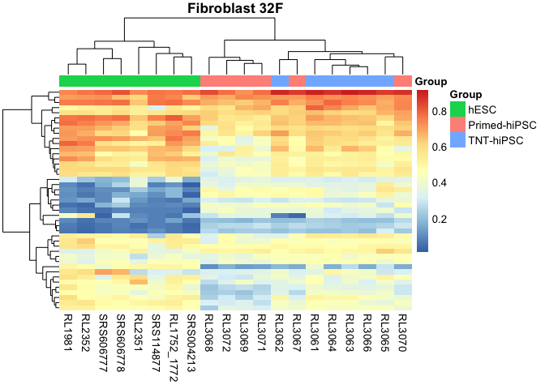
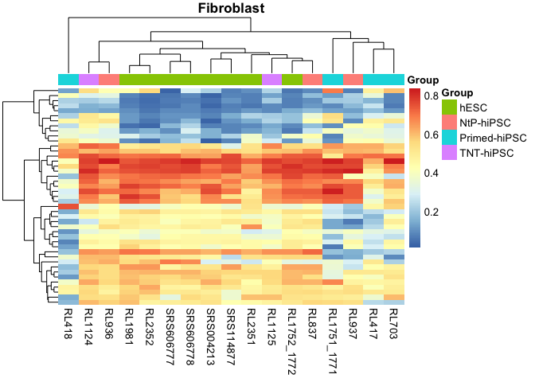
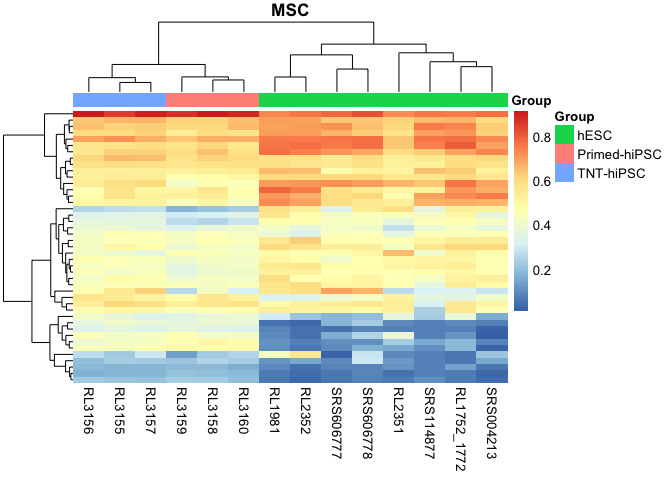
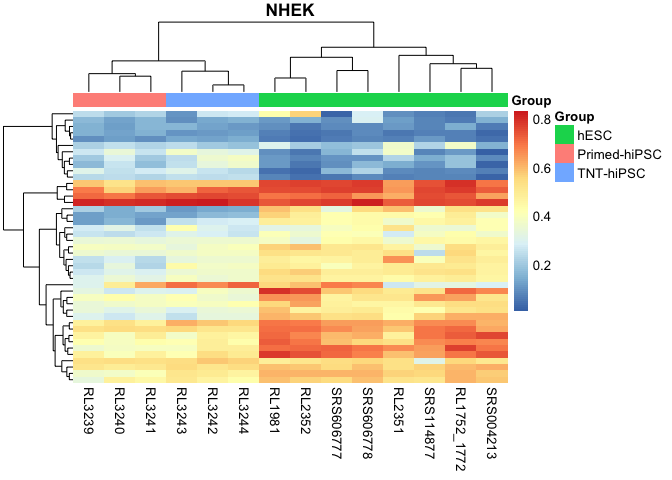
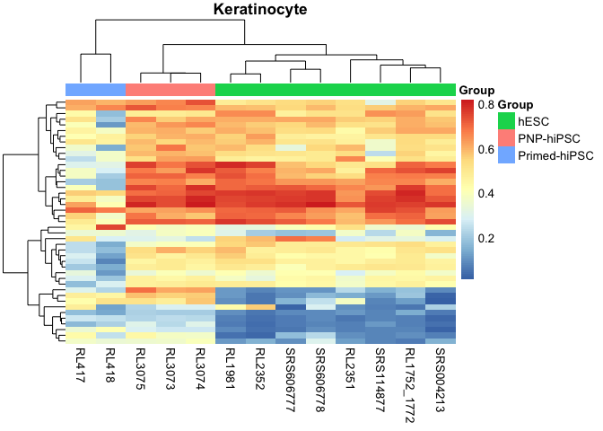
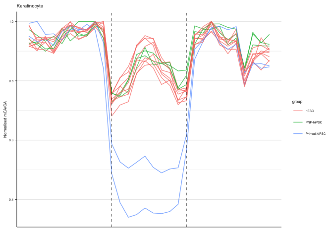

CH-DMR analyses
================
Sam Buckberry
2022-08-03

Preliminaries

``` r
source("R/project_functions.R")
#source("R/server_libraries_and_functions.R")
```

Metadata

``` r
mdat <- read.csv("wgbs/metadata/wgbs_metadata_local.csv")
```

Select samples to calculate CH methylation

``` r
mdat_sub <- mdat[mdat$State %in% c("Primed", "TNT", "NtP", "ESC", "SCNT", "PNP"), ]
dim(mdat_sub)
```

Load DMRs

``` r
CH_dmr <- bed_to_gr("resources/nature13551-s3.bed")

make_window_matrix_nc_corrected <- function(x, gr, bins=30, nc_correct=TRUE,
                                            nc_contig="chrL"){

    rds_path <- mCA_files[x]
    message(basename(rds_path))
    
    #id <- mdat_wgbs$Library_id[x]
    gr_expand <- gr + width(gr)
    gr_expand$loci <- gr_to_loci(gr_expand)
    gr_tiles <- tile(gr_expand, n = bins)

    add_loci_to_grl <- function(x){
        grt <- gr_tiles[[x]]
        grt$loci <- gr_to_loci(gr_expand[x])
        return(grt)
    }

    read_bs_obj <- function(rds_path){
        stopifnot(file.exists(rds_path))
        message(str_c("Reading ", rds_path))
        message(Sys.time())
        bs_obj <- readRDS(file = rds_path)

        return(bs_obj)
    }

    # Calculate C coverage and methylation for ranges. Returns GRanges object
    calc_mC_window <- function(bs_obj, gr){

        message("Calculating coverage...")
        gr$Cov <- getCoverage(BSseq = bs_obj, regions = gr, type = "Cov",
                              what = "perRegionTotal")

        message("Calculating M...")
        gr$M <- getCoverage(BSseq = bs_obj, regions = gr, type = "M",
                            what = "perRegionTotal")

        message("Calculating methylation percentage...")
        gr$pc <- gr$M / gr$Cov

        return(gr)
    }

    gr_tiles <- lapply(1:length(gr_tiles), add_loci_to_grl) %>%
        GRangesList() %>% unlist()

    bs_obj <- read_bs_obj(rds_path)

    mC_dat <- calc_mC_window(bs_obj = bs_obj, gr = gr_tiles)

    dat <- matrix(data = mC_dat$pc, nrow = length(gr), byrow = TRUE)

    # Correct for non-conversion
    correct_nc <- function(bs_obj, nc_contig = "chrL"){

        nc_obj <- chrSelectBSseq(BSseq = bs_obj, seqnames = nc_contig)
        nc_cov <- getCoverage(BSseq = nc_obj, type = "Cov",
                              what = "perBase")
        nc_m <- getCoverage(BSseq = nc_obj, type = "M",
                            what = "perBase")

        nc_rate <- sum(nc_m) / sum(nc_cov)

        return(nc_rate)
    }

    if (nc_correct == TRUE){
        message("Correcting for non-conversion...")
        nc_rate <- correct_nc(bs_obj = bs_obj, nc_contig = nc_contig)
        dat <- dat - nc_rate
        dat[dat < 0] <- 0
    }

    dat <- data.frame(dat)

    rownames(dat) <- gr_to_loci(gr)
    colnames(dat) <- 1:ncol(dat)
    dat$id <- basename(rds_path)

    return(dat)
}

mCA_files <- mdat_sub$BSseq_CA

mdat_sub$Library_id[!file.exists(mCA_files)]

mCA_files <- mCA_files[file.exists(mCA_files)]

all(file.exists(mCA_files))

dfl <- lapply(1:length(mCA_files), make_window_matrix_nc_corrected,
              gr=CH_dmr)

dfl <- do.call(rbind, dfl)

saveRDS(dfl, "wgbs/processed_data/mCH_DMR_window_dat_all.Rds")
```

## Run locally

``` r
source("R/project_functions.R")
```

    ## Loading required package: BiocGenerics

    ## 
    ## Attaching package: 'BiocGenerics'

    ## The following objects are masked from 'package:stats':
    ## 
    ##     IQR, mad, sd, var, xtabs

    ## The following objects are masked from 'package:base':
    ## 
    ##     anyDuplicated, append, as.data.frame, basename, cbind, colnames,
    ##     dirname, do.call, duplicated, eval, evalq, Filter, Find, get, grep,
    ##     grepl, intersect, is.unsorted, lapply, Map, mapply, match, mget,
    ##     order, paste, pmax, pmax.int, pmin, pmin.int, Position, rank,
    ##     rbind, Reduce, rownames, sapply, setdiff, sort, table, tapply,
    ##     union, unique, unsplit, which.max, which.min

    ## Welcome to Bioconductor
    ## 
    ##     Vignettes contain introductory material; view with
    ##     'browseVignettes()'. To cite Bioconductor, see
    ##     'citation("Biobase")', and for packages 'citation("pkgname")'.

    ## Loading required package: ggplot2

    ## Loading required package: lattice

    ## Loading required package: GenomicRanges

    ## Loading required package: stats4

    ## Loading required package: S4Vectors

    ## 
    ## Attaching package: 'S4Vectors'

    ## The following objects are masked from 'package:base':
    ## 
    ##     expand.grid, I, unname

    ## Loading required package: IRanges

    ## Loading required package: GenomeInfoDb

    ## Loading required package: SummarizedExperiment

    ## Loading required package: MatrixGenerics

    ## Loading required package: matrixStats

    ## 
    ## Attaching package: 'matrixStats'

    ## The following objects are masked from 'package:Biobase':
    ## 
    ##     anyMissing, rowMedians

    ## 
    ## Attaching package: 'MatrixGenerics'

    ## The following objects are masked from 'package:matrixStats':
    ## 
    ##     colAlls, colAnyNAs, colAnys, colAvgsPerRowSet, colCollapse,
    ##     colCounts, colCummaxs, colCummins, colCumprods, colCumsums,
    ##     colDiffs, colIQRDiffs, colIQRs, colLogSumExps, colMadDiffs,
    ##     colMads, colMaxs, colMeans2, colMedians, colMins, colOrderStats,
    ##     colProds, colQuantiles, colRanges, colRanks, colSdDiffs, colSds,
    ##     colSums2, colTabulates, colVarDiffs, colVars, colWeightedMads,
    ##     colWeightedMeans, colWeightedMedians, colWeightedSds,
    ##     colWeightedVars, rowAlls, rowAnyNAs, rowAnys, rowAvgsPerColSet,
    ##     rowCollapse, rowCounts, rowCummaxs, rowCummins, rowCumprods,
    ##     rowCumsums, rowDiffs, rowIQRDiffs, rowIQRs, rowLogSumExps,
    ##     rowMadDiffs, rowMads, rowMaxs, rowMeans2, rowMedians, rowMins,
    ##     rowOrderStats, rowProds, rowQuantiles, rowRanges, rowRanks,
    ##     rowSdDiffs, rowSds, rowSums2, rowTabulates, rowVarDiffs, rowVars,
    ##     rowWeightedMads, rowWeightedMeans, rowWeightedMedians,
    ##     rowWeightedSds, rowWeightedVars

    ## The following object is masked from 'package:Biobase':
    ## 
    ##     rowMedians

    ## 
    ## Attaching package: 'magrittr'

    ## The following object is masked from 'package:GenomicRanges':
    ## 
    ##     subtract

    ## 
    ## Attaching package: 'data.table'

    ## The following object is masked from 'package:SummarizedExperiment':
    ## 
    ##     shift

    ## The following object is masked from 'package:GenomicRanges':
    ## 
    ##     shift

    ## The following object is masked from 'package:IRanges':
    ## 
    ##     shift

    ## The following objects are masked from 'package:S4Vectors':
    ## 
    ##     first, second

    ## Loading required package: BSgenome

    ## Loading required package: Biostrings

    ## Loading required package: XVector

    ## 
    ## Attaching package: 'Biostrings'

    ## The following object is masked from 'package:base':
    ## 
    ##     strsplit

    ## Loading required package: rtracklayer

    ## Loading required package: AnnotationDbi

    ## 
    ## Attaching package: 'ggthemes'

    ## The following object is masked from 'package:cowplot':
    ## 
    ##     theme_map

    ## Loading required package: Rsamtools

    ## 
    ## Attaching package: 'VariantAnnotation'

    ## The following object is masked from 'package:stringr':
    ## 
    ##     fixed

    ## The following object is masked from 'package:base':
    ## 
    ##     tabulate

    ## 
    ## Attaching package: 'ChIPpeakAnno'

    ## The following object is masked from 'package:VariantAnnotation':
    ## 
    ##     info

    ## 
    ## Attaching package: 'gtools'

    ## The following object is masked from 'package:e1071':
    ## 
    ##     permutations

    ## 
    ## Attaching package: 'UpSetR'

    ## The following object is masked from 'package:lattice':
    ## 
    ##     histogram

    ## Loading required package: limma

    ## 
    ## Attaching package: 'limma'

    ## The following object is masked from 'package:BiocGenerics':
    ## 
    ##     plotMA

    ## Loading required package: grid

    ## 
    ## Attaching package: 'grid'

    ## The following object is masked from 'package:Biostrings':
    ## 
    ##     pattern

``` r
mdat <- read.csv("wgbs/metadata/wgbs_metadata_local.csv")

dfl <- readRDS("wgbs/processed_data/mCH_DMR_window_dat_all.Rds")

id_ind <- match(dfl$id, basename(mdat$BSseq_CA))

dfl$id <- mdat$Library_id[id_ind]

CH_dat <- readxl::read_excel(path = "resources/nature13551-s3.xlsx")
CH_dmr <- GRanges(seqnames = CH_dat$chr,
                  ranges = IRanges(start = as.numeric(CH_dat$start),
                                   end = as.numeric(CH_dat$end)))
CH_dmr$presence <- CH_dat$presence
CH_dmr$loci <- gr_to_loci(CH_dmr)

dfl$loci <- rownames(dfl)

dfl$loci <- rep(gr_to_loci(CH_dmr), times=length(unique(dfl$id)))

keep <- dfl$loci %in% CH_dmr$loci[CH_dmr$presence == "all iPSCs"]

table(keep)
```

    ## keep
    ## FALSE  TRUE 
    ##  7811  3139

``` r
dfl <- dfl[keep, ]

### Normalise to max (flank normalisation)
max_norm <- function(x){
    vec <- dfl[x, 1:30] / max(dfl[x, 1:30], na.rm = TRUE)
    return(vec)
}

#flank_max_norm <- function(x){
#    vec <- dfl[x, 1:30] / max(dfl[x, c(1:10, 21:30)], na.rm = TRUE)
#    return(vec)
#}

dfl_norm <- mclapply(X = 1:nrow(dfl), max_norm, mc.cores = 3) %>%
    do.call(rbind, .)
dfl_norm$id <- dfl$id
dfl_norm$loci <- dfl$loci

ind <- match(dfl_norm$id, mdat$Library_id)

dfl_norm$group <- mdat$Group[ind]
dfl_norm$progenitor <- mdat$Progenitor[ind]
dfl_norm$batch <- mdat$Batch[ind]
dfl_norm$lab <- mdat$Lab[ind]
dfl_norm$background <- mdat$Background[ind]

dfl_norm <- dfl_norm[dfl_norm$lab != "Smith", ]
dfl_norm <- dfl_norm[!dfl_norm$group %in% c("Primed-intermediate", "Naive-intermediate"), ]
```

``` r
library(tidyr)
```

    ## 
    ## Attaching package: 'tidyr'

    ## The following object is masked from 'package:VariantAnnotation':
    ## 
    ##     expand

    ## The following object is masked from 'package:magrittr':
    ## 
    ##     extract

    ## The following object is masked from 'package:S4Vectors':
    ## 
    ##     expand

``` r
library(dplyr)
```

    ## 
    ## Attaching package: 'dplyr'

    ## The following object is masked from 'package:VariantAnnotation':
    ## 
    ##     select

    ## The following object is masked from 'package:AnnotationDbi':
    ## 
    ##     select

    ## The following objects are masked from 'package:Biostrings':
    ## 
    ##     collapse, intersect, setdiff, setequal, union

    ## The following object is masked from 'package:XVector':
    ## 
    ##     slice

    ## The following objects are masked from 'package:data.table':
    ## 
    ##     between, first, last

    ## The following object is masked from 'package:bsseq':
    ## 
    ##     combine

    ## The following object is masked from 'package:matrixStats':
    ## 
    ##     count

    ## The following objects are masked from 'package:GenomicRanges':
    ## 
    ##     intersect, setdiff, union

    ## The following object is masked from 'package:GenomeInfoDb':
    ## 
    ##     intersect

    ## The following objects are masked from 'package:IRanges':
    ## 
    ##     collapse, desc, intersect, setdiff, slice, union

    ## The following objects are masked from 'package:S4Vectors':
    ## 
    ##     first, intersect, rename, setdiff, setequal, union

    ## The following object is masked from 'package:Biobase':
    ## 
    ##     combine

    ## The following objects are masked from 'package:BiocGenerics':
    ## 
    ##     combine, intersect, setdiff, union

    ## The following objects are masked from 'package:stats':
    ## 
    ##     filter, lag

    ## The following objects are masked from 'package:base':
    ## 
    ##     intersect, setdiff, setequal, union

``` r
norm_dat <- reshape2::melt(dfl_norm)
```

    ## Using id, loci, group, progenitor, batch, lab, background as id variables

``` r
progenitor <- unique(norm_dat$progenitor)
batch <- unique(norm_dat$batch)
lab <- unique(norm_dat$lab)
background <- unique(norm_dat$background)

progenitor <- "Keratinocyte"
title <- progenitor

batch <- c("NHEK")
background <- "NHEK"
lab <- "Lister"

ch_dmr_gr <- readRDS("wgbs/processed_data/CH-dmr-up-esc-granges.Rds")

plot_ch <- function(progenitor, batch = batch, lab = lab,
                    background = background, title){
    
    df <- norm_dat[norm_dat$progenitor %in% progenitor, ]
    df <- df[df$batch %in% batch, ]
    df <- df[df$lab %in% lab, ]
    df <- df[df$background %in% background, ]
    
    df <- rbind(df, norm_dat[norm_dat$group == "hESC", ])
    
    colnames(df)[colnames(df) == "variable"] <- "bin"
    
    plot_dat <- reshape2::melt(df)
    
    hm_dat <- plot_dat[plot_dat$bin %in% 11:20, ]

    hm_dat <- hm_dat %>% group_by(loci, id) %>%
    summarise(mean=mean(value, na.rm=TRUE))

    hm_dat <- hm_dat %>% tidyr::spread(id, mean) %>% data.frame()
    rownames(hm_dat) <- hm_dat$loci
    hm_dat$loci <- NULL

    indx <- match(colnames(hm_dat), mdat$Library_id)
    coldat <- mdat[indx, c("Library_id", "Group")]
    rownames(coldat) <- coldat$Library_id
    coldat$Library_id <- NULL
    
    hm <- pheatmap(hm_dat[complete.cases(hm_dat), ],
             annotation_col = coldat, main = title,
             border_color = NA, show_rownames = FALSE)

    ## Calculate stats on flank norm mean for CH-DMRs for each group

    stats_groups <- factor(coldat$Group)

    design <- model.matrix(~ 0+stats_groups)
    colnames(design) <- str_remove(string = colnames(design),
                                      pattern = "stats_groups") %>% make.names()

    cont <- makeContrasts(hESC - Primed.hiPSC,
                            hESC - TNT.hiPSC,
                            levels = design)

    ch_fit <- lmFit(hm_dat, design)
    ch_fit2 <- contrasts.fit(ch_fit, cont)

    ch_fit2 <- eBayes(ch_fit2)

    get_tt <- function(x){
            tt <- topTable(ch_fit2, coef=x, adjust="BH",
                      number = nrow(hm_dat), sort="none")
            tt$loci <- rownames(tt)
            tt$contrast <- dimnames(cont)$Contrasts[x]
            tt$progenitor <- progenitor
            tt$batch <- toString(batch)
            tt$lab <- lab
            tt$background <- toString(background)
            return(tt)
        }

    tt <- lapply(1:ncol(cont), get_tt) %>% do.call(rbind, .)

    tt$diff <- "NS"
    tt$diff[(tt$logFC > 0) & (tt$adj.P.Val < 0.05)] <- "hiPSC-hypo"
    tt$diff[(tt$logFC < 0) & (tt$adj.P.Val < 0.05)] <- "hiPSC-hyper"
    
    ## Get the loci that are differential for up and down
    ips_hypo <- tt$loci[tt$diff == "hiPSC-hypo" & tt$contrast == "hESC - Primed.hiPSC"]
    ips_hyper <- tt$loci[tt$diff == "hiPSC-hyper" & tt$contrast == "hESC - Primed.hiPSC"]
    
    ## Flag loci direction for plotting
    df$direction <- "NS"
    df$direction[df$loci %in% ips_hyper] <- "hiPSC-hyper"
    df$direction[df$loci %in% ips_hypo] <- "hiPSC-hypo"

    ## Aggregate the data for plotting
    df$bin <- as.numeric(df$bin)
    
    df_grp <- df %>% group_by(id, group, bin, direction) %>%
        summarise(mean=mean(value, na.rm = TRUE))
    
    
    scale_max <- function(x){ x / max(x, na.rm = TRUE)}
    
    scale_group_max <- function(id){

        df0 <- df_grp[df_grp$id == id, ]
        df0$norm <- NA
        df0$norm[df0$direction == "hiPSC-hyper"] <- 
            scale_max(df0$mean[df0$direction == "hiPSC-hyper"])
        df0$norm[df0$direction == "hiPSC-hypo"] <- 
            scale_max(df0$mean[df0$direction == "hiPSC-hypo"])
        df0$norm[df0$direction == "NS"] <- 
            scale_max(df0$mean[df0$direction == "NS"])

        return(df0)
    }              
    
    df_norm <- lapply(unique(df_grp$id), scale_group_max) %>%
        do.call(rbind, .)

    # Set line width for plots
    line_mm <- 0.25
    
    pp0 <- ggplot(df_norm, aes(x=bin, y = norm, group=group,
                               fill=group, colour=group)) +
        stat_summary(geom = "line", na.rm = TRUE, size=0.5, alpha = 0.7) +
        stat_summary(geom = 'ribbon', fun.data = mean_sdl, alpha=0.5,
                 col=NA, na.rm=TRUE) +
        facet_grid(direction~., scales = "free_y") +
        ylab("Normalised mCA/CA") +
        xlab("") +
        geom_vline(xintercept = c(11,20), linetype="dashed", size=line_mm) +
        theme_bw() + ggtitle(title) +
        theme(plot.background = element_blank(),
          panel.grid.minor.y = element_line(),
          panel.grid.major.y = element_line(),
          panel.grid.major.x = element_blank(),
          panel.grid.minor.x = element_blank(),
          panel.border = element_blank(),
          strip.text.y = element_text(size = 6),
          text = element_text(size=6),
          strip.background = element_blank(),
          legend.position = "right",
          axis.line.x = element_line(color = 'black', size = line_mm),
          axis.text.y = element_text(color = 'black'),
          axis.line.y = element_line(color = 'black', size = line_mm),
          axis.ticks.y = element_line(color = 'black', size = line_mm),
          axis.ticks.x = element_blank(),
          axis.text.x = element_blank())
    
    pp01 <- ggplot(df_norm, aes(x=bin, y = norm, group=id,
                               fill=group, colour=group)) +
        geom_line(size=0.5, alpha = 0.7) +
        ylab("Normalised mCA/CA") +
        facet_grid(direction~., scales = "free_y") +
    xlab("") +
    geom_vline(xintercept = c(11,20), linetype="dashed", size=line_mm) +
    theme_bw() + ggtitle(title) +
    theme(plot.background = element_blank(),
          panel.grid.minor.y = element_line(),
          panel.grid.major.y = element_line(),
          panel.grid.major.x = element_blank(),
          panel.grid.minor.x = element_blank(),
          panel.border = element_blank(),
          strip.text.y = element_text(size = 6),
          text = element_text(size=6),
          strip.background = element_blank(),
          legend.position = "right",
          axis.line.x = element_line(color = 'black', size = line_mm),
          axis.text.y = element_text(color = 'black'),
          axis.line.y = element_line(color = 'black', size = line_mm),
          axis.ticks.y = element_line(color = 'black', size = line_mm),
          axis.ticks.x = element_blank(),
          axis.text.x = element_blank())
    
    pp02 <- ggplot(df_norm, aes(x=bin, y = norm, group=group,
                               fill=group, colour=group)) +
        stat_summary(geom = "line", na.rm = TRUE, size=0.5, alpha = 0.7) +
        facet_grid(direction~., scales = "free_y") +
        ylab("Normalised mCA/CA") +
        xlab("") +
        geom_vline(xintercept = c(11,20), linetype="dashed", size=line_mm) +
        theme_bw() + ggtitle(title) +
        theme(plot.background = element_blank(),
          panel.grid.minor.y = element_line(),
          panel.grid.major.y = element_line(),
          panel.grid.major.x = element_blank(),
          panel.grid.minor.x = element_blank(),
          panel.border = element_blank(),
          strip.text.y = element_text(size = 6),
          text = element_text(size=6),
          strip.background = element_blank(),
          legend.position = "right",
          axis.line.x = element_line(color = 'black', size = line_mm),
          axis.text.y = element_text(color = 'black'),
          axis.line.y = element_line(color = 'black', size = line_mm),
          axis.ticks.y = element_line(color = 'black', size = line_mm),
          axis.ticks.x = element_blank(),
          axis.text.x = element_blank())

    out <- list(hm=hm, pp0=pp0, pp01=pp01, pp02=pp02, tt=tt)
}
```

Study comparison

``` r
progenitor <- unique(norm_dat$progenitor)
batch <- unique(norm_dat$batch)
lab <- unique(norm_dat$lab)
background <- unique(norm_dat$background)

progenitor <- "Keratinocyte"
title <- progenitor

batch <- c("NHEK")
background <- "NHEK"
lab <- "Lister"

progenitor <- "Fibroblast"
batch <- c("A", "Ecker", "Mitalipov")
lab <- c("Lister", "Mitalipov", "Ecker")
background <- c("32F", "38F", "iPSC_S1", "iPSC_S2",
                "iPSC_R2", "iPSC_R1", "IMR90", "FF")

    df <- norm_dat[norm_dat$progenitor %in% progenitor, ]
    df <- df[df$batch %in% batch, ]
    df <- df[df$lab %in% lab, ]
    df <- df[df$background %in% background, ]
    df <- df[df$group %in% c("Primed-hiPSC", "hESC"), ]
    
    df <- rbind(df, norm_dat[norm_dat$group == "hESC", ])
    
    colnames(df)[colnames(df) == "variable"] <- "bin"
    
    plot_dat <- reshape2::melt(df)
```

    ## Using id, loci, group, progenitor, batch, lab, background, bin as id variables

``` r
    hm_dat <- plot_dat[plot_dat$bin %in% 11:20, ]

    hm_dat <- hm_dat %>% group_by(loci, id) %>%
    summarise(mean=mean(value, na.rm=TRUE))
```

    ## `summarise()` has grouped output by 'loci'. You can override using the
    ## `.groups` argument.

``` r
    hm_dat <- hm_dat %>% tidyr::spread(id, mean) %>% data.frame()
    rownames(hm_dat) <- hm_dat$loci
    hm_dat$loci <- NULL

    indx <- match(colnames(hm_dat), mdat$Library_id)
    coldat <- mdat[indx, c("Library_id", "Group")]
    rownames(coldat) <- coldat$Library_id
    coldat$Library_id <- NULL
    
    col_ind <- match(colnames(hm_dat), mdat$Library_id)
    coldat$Study <- mdat$Lab[indx]

    pdf(file = "wgbs/plots/ch-dmr-study-comparison-plots.pdf",
    height = 4, width = 4)
    hm <- pheatmap(hm_dat[complete.cases(hm_dat), ],
                   fontsize_col = 6,
                   annotation_col = coldat, main = "Study comparison",
                   labels_col = mdat$Manuscript.Name[indx],
                   border_color = NA, show_rownames = FALSE)
    dev.off()
```

    ## pdf 
    ##   3

``` r
wb_ed_fig5e <- openxlsx::createWorkbook()
openxlsx::addWorksheet(wb_ed_fig5e, sheetName = "ED_Fig_5e")
openxlsx::writeData(wb = wb_ed_fig5e, sheet = "ED_Fig_5e",
                    x = hm_dat[complete.cases(hm_dat), ])
openxlsx::saveWorkbook(wb = wb_ed_fig5e,
                       file = "ED_Figure_5e_source_data.xlsx", overwrite = TRUE)
```

``` r
fib_c_pl <- plot_ch(progenitor = c("Fibroblast"), batch = "C",
                    background = "32F", lab = "Lister",
                    title = "Fibroblast 32F")
```

    ## Using id, loci, group, progenitor, batch, lab, background, bin as id variables

    ## `summarise()` has grouped output by 'loci'. You can override using the
    ## `.groups` argument.
    ## `summarise()` has grouped output by 'id', 'group', 'bin'. You can override
    ## using the `.groups` argument.

    ## Warning: Using `size` aesthetic for lines was deprecated in ggplot2 3.4.0.
    ## ℹ Please use `linewidth` instead.

    ## Warning: The `size` argument of `element_line()` is deprecated as of ggplot2 3.4.0.
    ## ℹ Please use the `linewidth` argument instead.

<!-- -->

``` r
pdf(file = "wgbs/plots/ch-dmr-32F-repeat-profile-plots.pdf",
    height = 3.5, width = 2.75)
fib_c_pl$pp0
```

    ## No summary function supplied, defaulting to `mean_se()`
    ## No summary function supplied, defaulting to `mean_se()`
    ## No summary function supplied, defaulting to `mean_se()`

``` r
fib_c_pl$pp01
fib_c_pl$pp02
```

    ## No summary function supplied, defaulting to `mean_se()`
    ## No summary function supplied, defaulting to `mean_se()`
    ## No summary function supplied, defaulting to `mean_se()`

``` r
dev.off()
```

    ## quartz_off_screen 
    ##                 2

``` r
fib_ab_pl <- plot_ch(progenitor = c("Fibroblast"), batch = c("A"),
                    background = c("32F", "38F"), lab = "Lister",
                    title = "Fibroblast")
```

    ## Using id, loci, group, progenitor, batch, lab, background, bin as id variables

    ## `summarise()` has grouped output by 'loci'. You can override using the
    ## `.groups` argument.
    ## `summarise()` has grouped output by 'id', 'group', 'bin'. You can override
    ## using the `.groups` argument.

<!-- -->

``` r
pdf(file = "wgbs/plots/ch-dmr-32F-batchA-profile-plots.pdf",
    height = 3.5, width = 2.75)
fib_ab_pl$pp0
```

    ## No summary function supplied, defaulting to `mean_se()`
    ## No summary function supplied, defaulting to `mean_se()`
    ## No summary function supplied, defaulting to `mean_se()`

``` r
fib_ab_pl$pp01
fib_ab_pl$pp02
```

    ## No summary function supplied, defaulting to `mean_se()`
    ## No summary function supplied, defaulting to `mean_se()`
    ## No summary function supplied, defaulting to `mean_se()`

``` r
dev.off()
```

    ## quartz_off_screen 
    ##                 2

``` r
msc_c_pl <- plot_ch(progenitor = c("MSC"), batch = "MSC",
                    background = "MSC", lab = "Lister",
                    title = "MSC")
```

    ## Using id, loci, group, progenitor, batch, lab, background, bin as id variables

    ## `summarise()` has grouped output by 'loci'. You can override using the
    ## `.groups` argument.
    ## `summarise()` has grouped output by 'id', 'group', 'bin'. You can override
    ## using the `.groups` argument.

<!-- -->

``` r
pdf(file = "wgbs/plots/ch-dmr-msc-profile-plots.pdf",
    height = 3.5, width = 2.75)
msc_c_pl$pp0
```

    ## No summary function supplied, defaulting to `mean_se()`
    ## No summary function supplied, defaulting to `mean_se()`
    ## No summary function supplied, defaulting to `mean_se()`

``` r
msc_c_pl$pp01
msc_c_pl$pp02
```

    ## No summary function supplied, defaulting to `mean_se()`
    ## No summary function supplied, defaulting to `mean_se()`
    ## No summary function supplied, defaulting to `mean_se()`

``` r
dev.off()
```

    ## quartz_off_screen 
    ##                 2

``` r
nhek_c_pl <- plot_ch(progenitor = c("Keratinocyte"), batch = "NHEK",
                    background = "NHEK", lab = "Lister",
                    title = "NHEK")
```

    ## Using id, loci, group, progenitor, batch, lab, background, bin as id variables
    ## `summarise()` has grouped output by 'loci'. You can override using the `.groups` argument.`summarise()` has grouped output by 'id', 'group', 'bin'. You can override using the `.groups` argument.

<!-- -->

``` r
pdf(file = "wgbs/plots/ch-dmr-nhek-profile-plots.pdf",
    height = 3.5, width = 2.75)
nhek_c_pl$pp0
```

    ## No summary function supplied, defaulting to `mean_se()`
    ## No summary function supplied, defaulting to `mean_se()`
    ## No summary function supplied, defaulting to `mean_se()`

``` r
nhek_c_pl$pp01
nhek_c_pl$pp02
```

    ## No summary function supplied, defaulting to `mean_se()`
    ## No summary function supplied, defaulting to `mean_se()`
    ## No summary function supplied, defaulting to `mean_se()`

``` r
dev.off()
```

    ## quartz_off_screen 
    ##                 2

``` r
#mel1_c_pl <- plot_hm(progenitor = c("Fibroblast"), batch = "-",
#                    background = "MEL1", lab = "Lister",
#                    title = "MEL1")
```

``` r
nhek_c_pl$pp01$data
fib_c_pl$pp01$data
msc_c_pl$pp01$data

wb_ed_fig9g <- openxlsx::createWorkbook()

openxlsx::addWorksheet(wb_ed_fig9g, sheetName = "ED_Fig_9g_hdf")
openxlsx::writeData(wb = wb_ed_fig9g, sheet = "ED_Fig_9g_hdf",
                    x = fib_c_pl$pp01$data)

openxlsx::addWorksheet(wb_ed_fig9g, sheetName = "ED_Fig_9g_nhek")
openxlsx::writeData(wb = wb_ed_fig9g, sheet = "ED_Fig_9g_nhek",
                    x = nhek_c_pl$pp01$data)

openxlsx::addWorksheet(wb_ed_fig9g, sheetName = "ED_Fig_9g_msc")
openxlsx::writeData(wb = wb_ed_fig9g, sheet = "ED_Fig_9g_msc",
                    x = msc_c_pl$pp01$data)

openxlsx::saveWorkbook(wb = wb_ed_fig9g,
                       file = "ED_Figure_9g_source_data.xlsx", overwrite = TRUE)


openxlsx::saveWorkbook(wb = wb_ed_fig1,
                       file = "ED_Figure_1_source_data.xlsx", overwrite = TRUE)
```

Primed-Naive-Primed analysis

``` r
## Primed lines
pr <- c("RL417", "RL418")

## Primed-Naive lines
pn <- c("RL699", "RL700")

## Primed-Naive-Primed lines
pnp <- c("RL3073", "RL3074", "RL3075")


#RL3076
#RL3077
#RL3078

    df <- norm_dat[norm_dat$id %in% c(pr, pn, pnp), ]
    df <- rbind(df, norm_dat[norm_dat$group == "hESC", ])
    
    colnames(df)[colnames(df) == "variable"] <- "bin"
    
    plot_dat <- reshape2::melt(df)
```

    ## Using id, loci, group, progenitor, batch, lab, background, bin as id variables

``` r
    hm_dat <- plot_dat[plot_dat$bin %in% 11:20, ]

    hm_dat <- hm_dat %>% group_by(loci, id) %>%
    summarise(mean=mean(value, na.rm=TRUE))
```

    ## `summarise()` has grouped output by 'loci'. You can override using the
    ## `.groups` argument.

``` r
    hm_dat <- hm_dat %>% tidyr::spread(id, mean) %>% data.frame()
    rownames(hm_dat) <- hm_dat$loci
    hm_dat$loci <- NULL

    indx <- match(colnames(hm_dat), mdat$Library_id)
    coldat <- mdat[indx, c("Library_id", "Group")]
    rownames(coldat) <- coldat$Library_id
    coldat$Library_id <- NULL
    
    hm <- pheatmap(hm_dat[complete.cases(hm_dat), ],
             annotation_col = coldat, main = title,
             border_color = NA, show_rownames = FALSE)
```

<!-- -->

``` r
    ## Calculate stats on flank norm mean for CH-DMRs for each group

    stats_groups <- factor(coldat$Group)

    design <- model.matrix(~ 0+stats_groups)
    colnames(design) <- str_remove(string = colnames(design),
                                      pattern = "stats_groups") %>% make.names()

    cont <- makeContrasts(hESC - Primed.hiPSC,
                            levels = design)

    ch_fit <- lmFit(hm_dat, design)
    ch_fit2 <- contrasts.fit(ch_fit, cont)

    ch_fit2 <- eBayes(ch_fit2)

            tt <- topTable(ch_fit2, adjust="BH",
                      number = nrow(hm_dat), sort="none")
            tt$loci <- rownames(tt)
            tt$contrast <- dimnames(cont)$Contrasts
            tt$progenitor <- progenitor
            tt$batch <- toString(batch)
            tt$lab <- "Lister"
            tt$background <- toString(background)
            #return(tt)

    #tt <- lapply(1:ncol(cont), get_tt) %>% do.call(rbind, .)

    tt$diff <- "NS"
    tt$diff[(tt$logFC > 0) & (tt$adj.P.Val < 0.05)] <- "hiPSC-hypo"
    tt$diff[(tt$logFC < 0) & (tt$adj.P.Val < 0.05)] <- "hiPSC-hyper"
    
    ## Get the loci that are differential for up and down
    ips_hypo <- tt$loci[tt$diff == "hiPSC-hypo" & tt$contrast == "hESC - Primed.hiPSC"]
    ips_hyper <- tt$loci[tt$diff == "hiPSC-hyper" & tt$contrast == "hESC - Primed.hiPSC"]
    
    ## Flag loci direction for plotting
    df$direction <- "NS"
    df$direction[df$loci %in% ips_hyper] <- "hiPSC-hyper"
    df$direction[df$loci %in% ips_hypo] <- "hiPSC-hypo"

    ## Aggregate the data for plotting
    df$bin <- as.numeric(df$bin)
    
    df_grp <- df %>% group_by(id, group, bin, direction) %>%
        summarise(mean=mean(value, na.rm = TRUE))
```

    ## `summarise()` has grouped output by 'id', 'group', 'bin'. You can override
    ## using the `.groups` argument.

``` r
    scale_max <- function(x){ x / max(x, na.rm = TRUE)}
        
    scale_group_max <- function(id){

        df0 <- df_grp[df_grp$id == id, ]
        df0$norm <- NA
        df0$norm[df0$direction == "hiPSC-hyper"] <- 
            scale_max(df0$mean[df0$direction == "hiPSC-hyper"])
        df0$norm[df0$direction == "hiPSC-hypo"] <- 
            scale_max(df0$mean[df0$direction == "hiPSC-hypo"])
        df0$norm[df0$direction == "NS"] <- 
            scale_max(df0$mean[df0$direction == "NS"])

        return(df0)
    }              
    
    df_norm <- lapply(unique(df_grp$id), scale_group_max) %>%
        do.call(rbind, .)

    # Set line width for plots
    line_mm <- 0.25
    
    pp0 <- ggplot(df_norm, aes(x=bin, y = norm, group=group,
                               fill=group, colour=group)) +
        stat_summary(geom = "line", na.rm = TRUE, size=0.5, alpha = 0.7) +
        stat_summary(geom = 'ribbon', fun.data = mean_sdl, alpha=0.5,
                 col=NA, na.rm=TRUE) +
        facet_grid(direction~., scales = "free_y") +
        ylab("Normalised mCA/CA") +
        xlab("") +
        geom_vline(xintercept = c(11,20), linetype="dashed", size=line_mm) +
        theme_bw() + ggtitle(title) +
        theme(plot.background = element_blank(),
          panel.grid.minor.y = element_line(),
          panel.grid.major.y = element_line(),
          panel.grid.major.x = element_blank(),
          panel.grid.minor.x = element_blank(),
          panel.border = element_blank(),
          strip.text.y = element_text(size = 6),
          text = element_text(size=6),
          strip.background = element_blank(),
          legend.position = "right",
          axis.line.x = element_line(color = 'black', size = line_mm),
          axis.text.y = element_text(color = 'black'),
          axis.line.y = element_line(color = 'black', size = line_mm),
          axis.ticks.y = element_line(color = 'black', size = line_mm),
          axis.ticks.x = element_blank(),
          axis.text.x = element_blank())
```

    ## Warning: Using `size` aesthetic for lines was deprecated in ggplot2 3.4.0.
    ## ℹ Please use `linewidth` instead.

    ## Warning: The `size` argument of `element_line()` is deprecated as of ggplot2 3.4.0.
    ## ℹ Please use the `linewidth` argument instead.

``` r
    pp01 <- ggplot(df_norm, aes(x=bin, y = norm, group=id,
                               fill=group, colour=group)) +
        geom_line(size=0.5, alpha = 0.7) +
        ylab("Normalised mCA/CA") +
        facet_grid(direction~., scales = "free_y") +
    xlab("") +
    geom_vline(xintercept = c(11,20), linetype="dashed", size=line_mm) +
    theme_bw() + ggtitle(title) +
    theme(plot.background = element_blank(),
          panel.grid.minor.y = element_line(),
          panel.grid.major.y = element_line(),
          panel.grid.major.x = element_blank(),
          panel.grid.minor.x = element_blank(),
          panel.border = element_blank(),
          strip.text.y = element_text(size = 6),
          text = element_text(size=6),
          strip.background = element_blank(),
          legend.position = "right",
          axis.line.x = element_line(color = 'black', size = line_mm),
          axis.text.y = element_text(color = 'black'),
          axis.line.y = element_line(color = 'black', size = line_mm),
          axis.ticks.y = element_line(color = 'black', size = line_mm),
          axis.ticks.x = element_blank(),
          axis.text.x = element_blank())
    
    pp02 <- ggplot(df_norm, aes(x=bin, y = norm, group=group,
                               fill=group, colour=group)) +
        stat_summary(geom = "line", na.rm = TRUE, size=0.5, alpha = 0.7) +
        facet_grid(direction~., scales = "free_y") +
        ylab("Normalised mCA/CA") +
        xlab("") +
        geom_vline(xintercept = c(11,20), linetype="dashed", size=line_mm) +
        theme_bw() + ggtitle(title) +
        theme(plot.background = element_blank(),
          panel.grid.minor.y = element_line(),
          panel.grid.major.y = element_line(),
          panel.grid.major.x = element_blank(),
          panel.grid.minor.x = element_blank(),
          panel.border = element_blank(),
          strip.text.y = element_text(size = 6),
          text = element_text(size=6),
          strip.background = element_blank(),
          legend.position = "right",
          axis.line.x = element_line(color = 'black', size = line_mm),
          axis.text.y = element_text(color = 'black'),
          axis.line.y = element_line(color = 'black', size = line_mm),
          axis.ticks.y = element_line(color = 'black', size = line_mm),
          axis.ticks.x = element_blank(),
          axis.text.x = element_blank())

    
    pp01_keep <- ggplot(df_norm[df_norm$direction == "hiPSC-hypo", ],
                        aes(x=bin, y = norm, group=id,
                               fill=group, colour=group)) +
        geom_line(size=0.5, alpha = 0.7) +
        ylab("Normalised mCA/CA") +
    xlab("") +
    geom_vline(xintercept = c(11,20), linetype="dashed", size=line_mm) +
    theme_bw() + ggtitle(title) +
    theme(plot.background = element_blank(),
          panel.grid.minor.y = element_line(),
          panel.grid.major.y = element_line(),
          panel.grid.major.x = element_blank(),
          panel.grid.minor.x = element_blank(),
          panel.border = element_blank(),
          strip.text.y = element_text(size = 6),
          text = element_text(size=6),
          strip.background = element_blank(),
          legend.position = "right",
          axis.line.x = element_line(color = 'black', size = line_mm),
          axis.text.y = element_text(color = 'black'),
          axis.line.y = element_line(color = 'black', size = line_mm),
          axis.ticks.y = element_line(color = 'black', size = line_mm),
          axis.ticks.x = element_blank(),
          axis.text.x = element_blank())    
    
pdf("wgbs/plots/pnp-ch-dmr-profile-plots.pdf", width = 3, height = 3)
pp01
dev.off()
```

    ## quartz_off_screen 
    ##                 2

``` r
pp01_keep
```

<!-- -->

``` r
sessionInfo()
```

    ## R version 4.2.1 (2022-06-23)
    ## Platform: x86_64-apple-darwin17.0 (64-bit)
    ## Running under: macOS Big Sur ... 10.16
    ## 
    ## Matrix products: default
    ## BLAS:   /Library/Frameworks/R.framework/Versions/4.2/Resources/lib/libRblas.0.dylib
    ## LAPACK: /Library/Frameworks/R.framework/Versions/4.2/Resources/lib/libRlapack.dylib
    ## 
    ## locale:
    ## [1] en_AU.UTF-8/en_AU.UTF-8/en_AU.UTF-8/C/en_AU.UTF-8/en_AU.UTF-8
    ## 
    ## attached base packages:
    ## [1] grid      stats4    stats     graphics  grDevices utils     datasets 
    ## [8] methods   base     
    ## 
    ## other attached packages:
    ##  [1] dplyr_1.0.10                           
    ##  [2] tidyr_1.2.1                            
    ##  [3] RColorBrewer_1.1-3                     
    ##  [4] XML_3.99-0.12                          
    ##  [5] ggExtra_0.10.0                         
    ##  [6] gprofiler2_0.2.1                       
    ##  [7] gt_0.8.0                               
    ##  [8] Gviz_1.40.1                            
    ##  [9] edgeR_3.38.4                           
    ## [10] limma_3.52.4                           
    ## [11] UpSetR_1.4.0                           
    ## [12] gtools_3.9.4                           
    ## [13] ggdendro_0.1.23                        
    ## [14] TxDb.Hsapiens.UCSC.hg19.knownGene_3.2.2
    ## [15] ChIPpeakAnno_3.30.1                    
    ## [16] ggridges_0.5.4                         
    ## [17] ggalluvial_0.12.3                      
    ## [18] alluvial_0.1-2                         
    ## [19] VariantAnnotation_1.42.1               
    ## [20] Rsamtools_2.12.0                       
    ## [21] ggthemes_4.2.4                         
    ## [22] cowplot_1.1.1                          
    ## [23] ggrepel_0.9.2                          
    ## [24] ggfortify_0.4.15                       
    ## [25] pheatmap_1.0.12                        
    ## [26] GenomicFeatures_1.48.4                 
    ## [27] AnnotationDbi_1.58.0                   
    ## [28] BSgenome.Hsapiens.UCSC.hg19_1.4.3      
    ## [29] BSgenome_1.64.0                        
    ## [30] rtracklayer_1.56.1                     
    ## [31] Biostrings_2.64.1                      
    ## [32] XVector_0.36.0                         
    ## [33] data.table_1.14.6                      
    ## [34] readxl_1.4.1                           
    ## [35] openxlsx_4.2.5.1                       
    ## [36] stringr_1.5.0                          
    ## [37] magrittr_2.0.3                         
    ## [38] bsseq_1.32.0                           
    ## [39] SummarizedExperiment_1.26.1            
    ## [40] MatrixGenerics_1.8.1                   
    ## [41] matrixStats_0.63.0                     
    ## [42] GenomicRanges_1.48.0                   
    ## [43] GenomeInfoDb_1.32.4                    
    ## [44] IRanges_2.30.1                         
    ## [45] S4Vectors_0.34.0                       
    ## [46] e1071_1.7-12                           
    ## [47] caret_6.0-93                           
    ## [48] lattice_0.20-45                        
    ## [49] ggplot2_3.4.1                          
    ## [50] Biobase_2.56.0                         
    ## [51] BiocGenerics_0.42.0                    
    ## [52] preprocessCore_1.58.0                  
    ## 
    ## loaded via a namespace (and not attached):
    ##   [1] rappdirs_0.3.3            ModelMetrics_1.2.2.2     
    ##   [3] R.methodsS3_1.8.2         bit64_4.0.5              
    ##   [5] knitr_1.41                DelayedArray_0.22.0      
    ##   [7] R.utils_2.12.2            rpart_4.1.19             
    ##   [9] KEGGREST_1.36.3           hardhat_1.2.0            
    ##  [11] RCurl_1.98-1.9            AnnotationFilter_1.20.0  
    ##  [13] generics_0.1.3            lambda.r_1.2.4           
    ##  [15] RSQLite_2.2.19            proxy_0.4-27             
    ##  [17] future_1.29.0             bit_4.0.5                
    ##  [19] xml2_1.3.3                lubridate_1.9.0          
    ##  [21] httpuv_1.6.6              assertthat_0.2.1         
    ##  [23] gower_1.0.0               xfun_0.35                
    ##  [25] hms_1.1.2                 evaluate_0.18            
    ##  [27] promises_1.2.0.1          fansi_1.0.4              
    ##  [29] restfulr_0.0.15           progress_1.2.2           
    ##  [31] dbplyr_2.2.1              DBI_1.1.3                
    ##  [33] htmlwidgets_1.5.4         futile.logger_1.4.3      
    ##  [35] purrr_0.3.5               ellipsis_0.3.2           
    ##  [37] backports_1.4.1           permute_0.9-7            
    ##  [39] biomaRt_2.52.0            deldir_1.0-6             
    ##  [41] sparseMatrixStats_1.8.0   vctrs_0.5.2              
    ##  [43] ensembldb_2.20.2          cachem_1.0.6             
    ##  [45] withr_2.5.0               checkmate_2.1.0          
    ##  [47] GenomicAlignments_1.32.1  prettyunits_1.1.1        
    ##  [49] cluster_2.1.4             lazyeval_0.2.2           
    ##  [51] crayon_1.5.2              labeling_0.4.2           
    ##  [53] recipes_1.0.3             pkgconfig_2.0.3          
    ##  [55] nlme_3.1-160              ProtGenerics_1.28.0      
    ##  [57] nnet_7.3-18               rlang_1.0.6              
    ##  [59] globals_0.16.2            lifecycle_1.0.3          
    ##  [61] miniUI_0.1.1.1            filelock_1.0.2           
    ##  [63] BiocFileCache_2.4.0       dichromat_2.0-0.1        
    ##  [65] VennDiagram_1.7.3         cellranger_1.1.0         
    ##  [67] graph_1.74.0              Matrix_1.5-3             
    ##  [69] Rhdf5lib_1.18.2           base64enc_0.1-3          
    ##  [71] png_0.1-8                 viridisLite_0.4.1        
    ##  [73] rjson_0.2.21              bitops_1.0-7             
    ##  [75] R.oo_1.25.0               rhdf5filters_1.8.0       
    ##  [77] pROC_1.18.0               blob_1.2.3               
    ##  [79] DelayedMatrixStats_1.18.2 regioneR_1.28.0          
    ##  [81] parallelly_1.32.1         jpeg_0.1-10              
    ##  [83] scales_1.2.1              memoise_2.0.1            
    ##  [85] plyr_1.8.8                zlibbioc_1.42.0          
    ##  [87] compiler_4.2.1            BiocIO_1.6.0             
    ##  [89] cli_3.6.0                 listenv_0.8.0            
    ##  [91] htmlTable_2.4.1           formatR_1.12             
    ##  [93] Formula_1.2-4             MASS_7.3-58.1            
    ##  [95] tidyselect_1.2.0          stringi_1.7.12           
    ##  [97] highr_0.9                 yaml_2.3.6               
    ##  [99] locfit_1.5-9.6            latticeExtra_0.6-30      
    ## [101] tools_4.2.1               timechange_0.1.1         
    ## [103] future.apply_1.10.0       parallel_4.2.1           
    ## [105] rstudioapi_0.14           foreach_1.5.2            
    ## [107] foreign_0.8-83            gridExtra_2.3            
    ## [109] prodlim_2019.11.13        farver_2.1.1             
    ## [111] digest_0.6.30             shiny_1.7.3              
    ## [113] lava_1.7.0                Rcpp_1.0.9               
    ## [115] later_1.3.0               httr_1.4.4               
    ## [117] biovizBase_1.44.0         colorspace_2.1-0         
    ## [119] splines_4.2.1             RBGL_1.72.0              
    ## [121] multtest_2.52.0           plotly_4.10.1            
    ## [123] xtable_1.8-4              jsonlite_1.8.3           
    ## [125] futile.options_1.0.1      timeDate_4021.106        
    ## [127] ipred_0.9-13              R6_2.5.1                 
    ## [129] Hmisc_4.7-2               pillar_1.8.1             
    ## [131] htmltools_0.5.3           mime_0.12                
    ## [133] glue_1.6.2                fastmap_1.1.0            
    ## [135] BiocParallel_1.30.4       class_7.3-20             
    ## [137] codetools_0.2-18          utf8_1.2.3               
    ## [139] tibble_3.1.8              curl_4.3.3               
    ## [141] zip_2.2.2                 interp_1.1-3             
    ## [143] survival_3.4-0            rmarkdown_2.18           
    ## [145] InteractionSet_1.24.0     munsell_0.5.0            
    ## [147] rhdf5_2.40.0              GenomeInfoDbData_1.2.8   
    ## [149] iterators_1.0.14          HDF5Array_1.24.2         
    ## [151] reshape2_1.4.4            gtable_0.3.1
