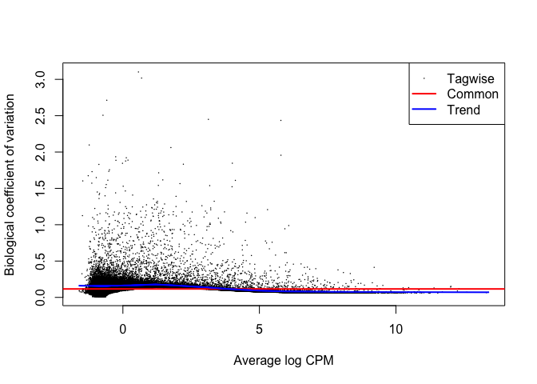
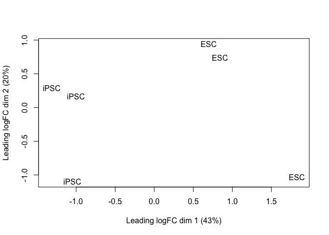
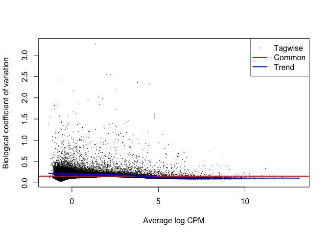
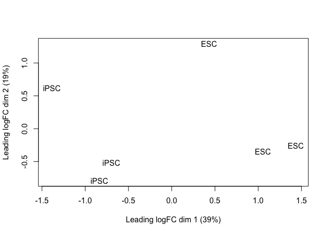
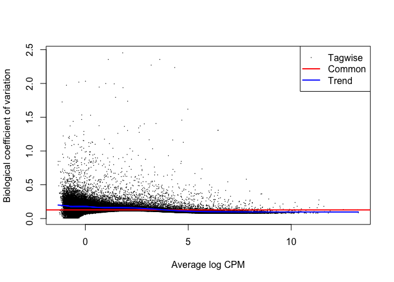
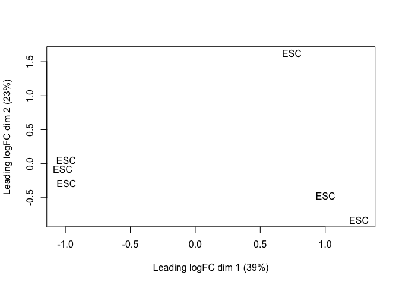
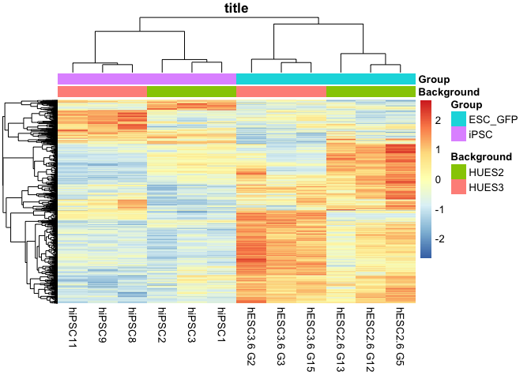

Choi et al. (2015) Nat. Biotech reanalysis: transposable elements
================
Sam Buckberry
29/06/2020

``` r
source("R/project_functions.R")
```

    ## Loading required package: BiocGenerics

    ## 
    ## Attaching package: 'BiocGenerics'

    ## The following objects are masked from 'package:stats':
    ## 
    ##     IQR, mad, sd, var, xtabs

    ## The following objects are masked from 'package:base':
    ## 
    ##     anyDuplicated, append, as.data.frame, basename, cbind, colnames,
    ##     dirname, do.call, duplicated, eval, evalq, Filter, Find, get, grep,
    ##     grepl, intersect, is.unsorted, lapply, Map, mapply, match, mget,
    ##     order, paste, pmax, pmax.int, pmin, pmin.int, Position, rank,
    ##     rbind, Reduce, rownames, sapply, setdiff, sort, table, tapply,
    ##     union, unique, unsplit, which.max, which.min

    ## Welcome to Bioconductor
    ## 
    ##     Vignettes contain introductory material; view with
    ##     'browseVignettes()'. To cite Bioconductor, see
    ##     'citation("Biobase")', and for packages 'citation("pkgname")'.

    ## Loading required package: ggplot2

    ## Loading required package: lattice

    ## Loading required package: GenomicRanges

    ## Loading required package: stats4

    ## Loading required package: S4Vectors

    ## 
    ## Attaching package: 'S4Vectors'

    ## The following objects are masked from 'package:base':
    ## 
    ##     expand.grid, I, unname

    ## Loading required package: IRanges

    ## Loading required package: GenomeInfoDb

    ## Loading required package: SummarizedExperiment

    ## Loading required package: MatrixGenerics

    ## Loading required package: matrixStats

    ## 
    ## Attaching package: 'matrixStats'

    ## The following objects are masked from 'package:Biobase':
    ## 
    ##     anyMissing, rowMedians

    ## 
    ## Attaching package: 'MatrixGenerics'

    ## The following objects are masked from 'package:matrixStats':
    ## 
    ##     colAlls, colAnyNAs, colAnys, colAvgsPerRowSet, colCollapse,
    ##     colCounts, colCummaxs, colCummins, colCumprods, colCumsums,
    ##     colDiffs, colIQRDiffs, colIQRs, colLogSumExps, colMadDiffs,
    ##     colMads, colMaxs, colMeans2, colMedians, colMins, colOrderStats,
    ##     colProds, colQuantiles, colRanges, colRanks, colSdDiffs, colSds,
    ##     colSums2, colTabulates, colVarDiffs, colVars, colWeightedMads,
    ##     colWeightedMeans, colWeightedMedians, colWeightedSds,
    ##     colWeightedVars, rowAlls, rowAnyNAs, rowAnys, rowAvgsPerColSet,
    ##     rowCollapse, rowCounts, rowCummaxs, rowCummins, rowCumprods,
    ##     rowCumsums, rowDiffs, rowIQRDiffs, rowIQRs, rowLogSumExps,
    ##     rowMadDiffs, rowMads, rowMaxs, rowMeans2, rowMedians, rowMins,
    ##     rowOrderStats, rowProds, rowQuantiles, rowRanges, rowRanks,
    ##     rowSdDiffs, rowSds, rowSums2, rowTabulates, rowVarDiffs, rowVars,
    ##     rowWeightedMads, rowWeightedMeans, rowWeightedMedians,
    ##     rowWeightedSds, rowWeightedVars

    ## The following object is masked from 'package:Biobase':
    ## 
    ##     rowMedians

    ## 
    ## Attaching package: 'magrittr'

    ## The following object is masked from 'package:GenomicRanges':
    ## 
    ##     subtract

    ## 
    ## Attaching package: 'data.table'

    ## The following object is masked from 'package:SummarizedExperiment':
    ## 
    ##     shift

    ## The following object is masked from 'package:GenomicRanges':
    ## 
    ##     shift

    ## The following object is masked from 'package:IRanges':
    ## 
    ##     shift

    ## The following objects are masked from 'package:S4Vectors':
    ## 
    ##     first, second

    ## Loading required package: BSgenome

    ## Loading required package: Biostrings

    ## Loading required package: XVector

    ## 
    ## Attaching package: 'Biostrings'

    ## The following object is masked from 'package:base':
    ## 
    ##     strsplit

    ## Loading required package: rtracklayer

    ## Loading required package: AnnotationDbi

    ## 
    ## Attaching package: 'ggthemes'

    ## The following object is masked from 'package:cowplot':
    ## 
    ##     theme_map

    ## Loading required package: Rsamtools

    ## 
    ## Attaching package: 'VariantAnnotation'

    ## The following object is masked from 'package:stringr':
    ## 
    ##     fixed

    ## The following object is masked from 'package:base':
    ## 
    ##     tabulate

    ## 
    ## Attaching package: 'ChIPpeakAnno'

    ## The following object is masked from 'package:VariantAnnotation':
    ## 
    ##     info

    ## 
    ## Attaching package: 'gtools'

    ## The following object is masked from 'package:e1071':
    ## 
    ##     permutations

    ## 
    ## Attaching package: 'UpSetR'

    ## The following object is masked from 'package:lattice':
    ## 
    ##     histogram

    ## Loading required package: limma

    ## 
    ## Attaching package: 'limma'

    ## The following object is masked from 'package:BiocGenerics':
    ## 
    ##     plotMA

    ## Loading required package: grid

    ## 
    ## Attaching package: 'grid'

    ## The following object is masked from 'package:Biostrings':
    ## 
    ##     pattern

TE quantification (not run)

``` bash
parallel -j 35 ~/working_data_01/bin/TElocal/TElocal -b {} \
--GTF /home/sbuckberry/working_data_02/polo_project/human_ips/resources/hg19_ensGene_with_ercc.gtf \
--TE /home/sbuckberry/working_data_02/polo_project/human_ips/resources/hg19_rmsk_TElocus.ind \
--project {.} \
--format BAM \
--sortByPos \
--stranded reverse \
--mode uniq ::: SRS*uniq.bam
```

Read the sample count tables and combine into matrix

``` r
# # List the counts tables for all samples
# cnt_files <- list.files(path = "RNAseq/hochedlinger_data/te_analysis/", full.names = TRUE, pattern = "cntTable.gz")
# 
# dat2 <- lapply(cnt_files, read.table, header = TRUE, row.names = 1) %>% do.call(cbind, .)
# libs <- colnames(dat2) %>% str_sub(start = 1, end = 10)
# colnames(dat2) <- libs
# 
# #remove rows with all zero's 
# keep_row <- rowSums(dat2) > 0
# table(keep_row)
# dat2 <- dat2[keep_row, ]
# saveRDS(dat2, file = "RNAseq/hochedlinger_data/all_te_and_gene_counts.Rds")

dat2 <- readRDS("RNAseq/hochedlinger_data/all_te_and_gene_counts.Rds")
dim(dat2)
```

    ## [1] 2048776      63

Read the meta-data table and match to expression data

``` r
sample_dat <- fread("RNAseq/hochedlinger_data/sample_sheet.csv")
sample_dat <- sample_dat[match(colnames(dat2), sample_dat$secondary_sample_accession), ]
all(colnames(dat2) == sample_dat$Run)
```

    ## [1] TRUE

Read in the count data

``` r
y2 <- DGEList(counts = dat2)
y2$samples <- cbind(y2$samples, sample_dat)
```

Load the transposable element data

``` r
## Get the TE genome co-ordinates
 repeat_gtf <- read.table("resources/hg19_rmsk_TE.gtf.gz")
 repeat_gr <- GRanges(seqnames = repeat_gtf$V1,
                      ranges = IRanges(start = repeat_gtf$V4,
                                       end = repeat_gtf$V5))
 strand(repeat_gr) <- repeat_gtf$V7
 repeat_gr$class <- repeat_gtf$V19
 repeat_gr$family <- repeat_gtf$V16
 repeat_gr$gene <- repeat_gtf$V10
 repeat_gr$transcript <- repeat_gtf$V13
 repeat_gr$id <- str_c(repeat_gr$transcript, repeat_gr$family, repeat_gr$class, sep = ":")
 rm(repeat_gtf)
 saveRDS(repeat_gr, "resources/hg19_rmsk_TE_granges.Rds")

repeat_gr <- readRDS("resources/hg19_rmsk_TE_granges.Rds")
```

``` r
repeat_gr <- readRDS("resources/hg19_rmsk_TE_granges.Rds")
```

Function to test DE for each genetic background

``` r
test_te_de <- function(background="HUES3", groups=c("iPSC", "ESC_GFP"), dataset="data set: isogenic"){
    
    y_sub <- y2[ ,(y2$samples$Background %in% background) &
                     (y2$samples$Group %in% groups) &
                     (y2$samples$characteristics_ch1 == dataset)]
    dim(y_sub)
    design <- model.matrix(~Group, data=y_sub$samples)
    colnames(design) <- str_remove(string = colnames(design), pattern = "Group")
    
    keep <- filterByExpr(y_sub, design)
    table(keep)
    y_sub <- y_sub[keep, ,keep.lib.sizes=FALSE]
    y_sub <- calcNormFactors(y_sub)

    y_sub <- estimateDisp(y_sub, design = design, robust = TRUE)
    
    plotBCV(y_sub)
    
    plotMDS(y_sub[grepl(pattern = "_dup", rownames(y_sub)), ], labels = y_sub$samples$source_name_ch1)
    
    fit <- glmFit(y_sub, design)
    
    lrt <- glmLRT(fit, contrast=c(0,-1))
    tt <- topTags(lrt, n = nrow(y_sub))
    tt_table <- tt$table
    tt_table$gene_id <- rownames(tt_table)
    tt_table$contrast <- background
        
    # Subset for TE's and recalculate FDR
    tt_table <- tt_table[tt_table$gene_id %in% repeat_gr$id, ]
    tt_table$FDR <- p.adjust(p = tt_table$PValue, method = "fdr")
    
    
    tt_table$significant <- (abs(tt_table$logFC) > 1) & (tt_table$FDR < 0.05) & (tt_table$logCPM > 0)
    tt_table$significant <- ifelse(test = tt_table$significant, yes = "Significant", no = "NS")
    tt_table$significant <- factor(tt_table$significant, levels = c("NS", "Significant"))
    
    # Add the TE locus information
    ind <- match(tt_table$gene_id, repeat_gr$id)

    tt_table <- cbind(tt_table, as.data.frame(repeat_gr)[ind, ])
}

hues3_tt <- test_te_de(background = "HUES3")
```

<!-- --><!-- -->

``` r
hues2_tt <- test_te_de(background = "HUES2")
```

<!-- --><!-- -->

``` r
hues2_GFP_tt <- test_te_de(background = "HUES2", groups = c("ESC", "ESC_GFP"))
```

<!-- --><!-- -->

``` r
all_tt <- rbind(hues2_tt, hues3_tt)
```

``` r
te_de_df <- all_tt
sig_ids <- te_de_df$gene_id[te_de_df$significant == "Significant"] %>% unique()

background <- c("HUES2", "HUES3")
groups <- c("iPSC", "ESC_GFP") 
dataset <- "data set: isogenic"

y_sub <- y2[ ,(y2$samples$Background %in% background) &
                     (y2$samples$Group %in% groups) &
                     (y2$samples$characteristics_ch1 == dataset)]

all_cpm <- log2(cpm(y_sub) + 1)

hm_annot_dat <- y_sub$samples[ ,c("Background", "Group")] 

col_ids <- str_c(y_sub$samples$title)
        
plot_dat <- all_cpm[rownames(all_cpm) %in% sig_ids, ]
#plot_dat <- all_cpm[grepl("HERVH-int", rownames(all_cpm)),
#                    y_sub$samples$source_name_ch1 != "Fibroblast"]
plot_dat <- plot_dat[complete.cases(plot_dat), ] %>% data.frame()

pdf("RNAseq/plots/Choi_TE_heatmap_combined.pdf", width = 4, height = 5)
pheatmap(plot_dat, scale = 'row',
         annotation_col = hm_annot_dat, 
                 labels_col = col_ids, main = "title",
                 annotation_names_col = TRUE,
                 show_rownames = FALSE, border_color = NA,
                 clustering_distance_rows = 'correlation',
                 clustering_distance_cols = 'correlation')
dev.off()
```

    ## pdf 
    ##   3

``` r
pheatmap(plot_dat, scale = 'row',
         annotation_col = hm_annot_dat, 
                 labels_col = col_ids, main = "title",
                 annotation_names_col = TRUE,
                 show_rownames = FALSE, border_color = NA,
                 clustering_distance_rows = 'correlation',
                 clustering_distance_cols = 'correlation')
```

<!-- -->

``` r
wb_ed_fig8k <- openxlsx::createWorkbook()
openxlsx::addWorksheet(wb_ed_fig8k, sheetName = "ED_Fig_8k")
openxlsx::writeData(wb = wb_ed_fig8k, sheet = "ED_Fig_8k",
                    x = plot_dat)
openxlsx::saveWorkbook(wb = wb_ed_fig8k,
                       file = "ED_Figure_8k_source_data.xlsx", overwrite = TRUE)
```
