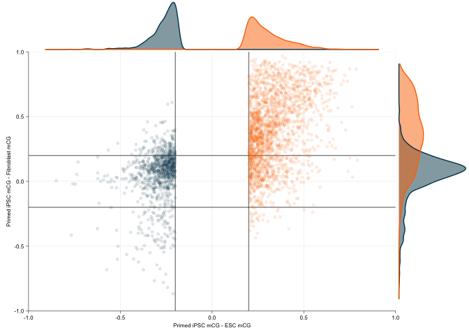
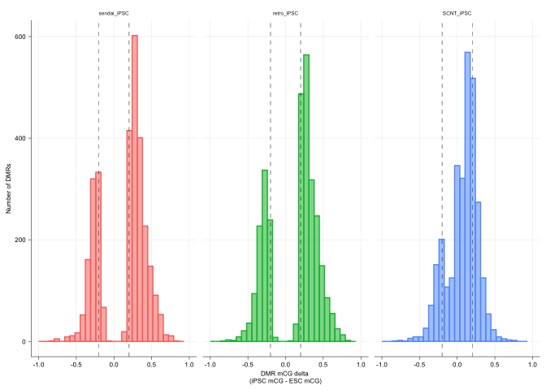
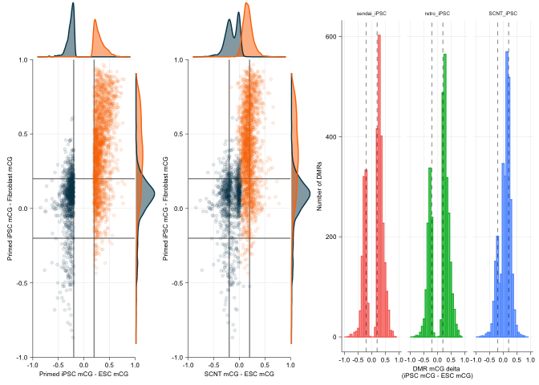
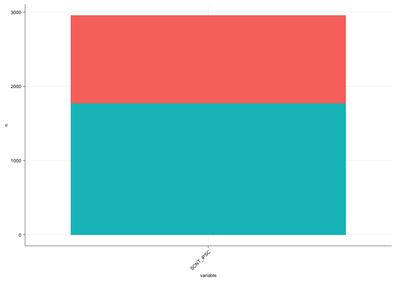

Extended Data Figures 3g,h,i: Ma et al CG DMR reanalysis
================
Sam Buckberry
2023-07-13

``` r
source("R/project_functions.R")
```

This section was run on remote server and code is not executed here

``` r
### Call iPSC vs ESC DMRs
library(bsseq)
library(dmrseq)
library(magrittr)
library(stringr)
library(BiocParallel)
library(data.table)

obj_files <- c("SRS606777_CG_bsseq_obj.Rds",
               "SRS606778_CG_bsseq_obj.Rds",
               "SRS606782_CG_bsseq_obj.Rds",
               "SRS606783_CG_bsseq_obj.Rds",
               "SRS606784_CG_bsseq_obj.Rds",
               "SRS606785_CG_bsseq_obj.Rds")

obj_files <- str_c("/home/sbuckberry/working_data_02/polo_project/human_ips/methylCseq/processed_data/bsseq_objects/bsobj_CG/", obj_files)
#obj_files <- str_c("~/Datasets/human_data/bsobj_CG/", obj_files)


# Read a Bs_seq boject from .Rds file

read_bs_obj <- function(rds_path){
        bs_obj <- readRDS(file = rds_path)
        bs_obj <- strandCollapse(bs_obj)
        return(bs_obj)
}
#--------Call DMRs

# Load the data
obj_list <- lapply(X = obj_files, read_bs_obj)
obj_list <- bsseq::combineList(x = obj_list)

pData(obj_list)$CellType <- factor(c(rep("ESC", times=2), rep("iPSC", times=4)))
pData(obj_list)$Replicate <- c(1:2,1:4)

# Remove CpG with no coverage
loci.idx <- which(DelayedMatrixStats::rowSums2(getCoverage(obj_list, type="Cov")==0) == 0)
obj_list <- obj_list[loci.idx, ]

# Save object for easy retreval
saveRDS(object = obj_list,
        file = "/home/sbuckberry/working_data_02/polo_project/human_ips/methylCseq/processed_data/dmrseq_dmrs/Mitalipov_BSseq_obj.rds")

BiocParallel::register(BiocParallel::SerialParam())
mitalipov_dmrs <- dmrseq(obj_list, testCovariate = "CellType",
                       bpSpan = 500,
                       maxGap = 500,
                       maxPerms = 10,
                       chrsPerChunk = 1)

saveRDS(object = mitalipov_dmrs,
        file = "/home/sbuckberry/working_data_02/polo_project/human_ips/methylCseq/processed_data/dmrseq_dmrs/Mitalipov_dmrs.Rds")
```

# Calculate mCG/CG delta and SCNT correction

``` r
gr_dmr <- readRDS("wgbs/dmrs/dmr_out/Mitalipov_dmrs.Rds")

obj_files <- list.files("wgbs/CG_bsobj/", pattern = "SRS6067", full.names = TRUE)

test_fls <- obj_files[basename(obj_files) %in% c("SRS606777_CG_bsseq_obj.Rds",
               "SRS606778_CG_bsseq_obj.Rds",
               "SRS606782_CG_bsseq_obj.Rds",
               "SRS606783_CG_bsseq_obj.Rds",
               "SRS606784_CG_bsseq_obj.Rds",
               "SRS606785_CG_bsseq_obj.Rds")]

groups <- c(rep("ESC", times=2), rep("iPSC", times=4))

filter_dmrs <- function(gr_dmr, obj_fls, groups, cores=1){
        
        ### Check number of groups = 2
        stopifnot(length(unique(groups)) == 2)
        
        group1 <- unique(groups)[1]
        group2 <- unique(groups)[2]
        
        # Get the DMR sequence and the number of CG positions in DMRs
        seqs <- getSeq(BSgenome.Hsapiens.UCSC.hg19, gr_dmr)
        CpG_count <- dinucleotideFrequency(seqs)[ ,"CG"]
        rm(seqs)
        
        # Calculate mCG and CG totals for DMRs
        
        mCG_levels <- make_mC_matrix(obj_fls = obj_fls, gr = gr_dmr, cores = cores)
        mCG_levels <- data.frame(mCG_levels)
        
        # Calculate mean delta and variance between groups
        group1_mean <- apply(mCG_levels[ ,group1 == groups], MARGIN = 1, mean, na.rm=TRUE)
        group1_sd <- apply(mCG_levels[ ,group1 == groups], MARGIN = 1, sd, na.rm=TRUE)
        
        group2_mean <- apply(mCG_levels[ ,group2 == groups], MARGIN = 1, mean, na.rm=TRUE)
        group2_sd <- apply(mCG_levels[ ,group2 == groups], MARGIN = 1, sd, na.rm=TRUE)
        
        mCG_delta <- group1_mean - group2_mean
        
        # Check dimensions
        stopifnot(length(gr_dmr) == nrow(mCG_levels))
        
        # Add all data to GRanges
        dat <- cbind(mCG_delta, CpG_count, data.frame(mCG_levels))
        
        # Round the metrics
        dat <- round(dat, digits = 3)
        
        # Add the metadata columns to the gr object
        mcols(gr_dmr) <- cbind(mcols(gr_dmr), dat)
        
        return(gr_dmr)
}

gr_dmr_annotated <- filter_dmrs(gr_dmr = gr_dmr, obj_fls = test_fls,
                         groups = groups, cores = 1)
```

    ## Reading wgbs/CG_bsobj//SRS606777_CG_bsseq_obj.Rds 2023-07-13 16:55:15

    ## Reading wgbs/CG_bsobj//SRS606777_CG_bsseq_obj.Rds

    ## 2023-07-13 16:55:15

    ## Calculating coverage...

    ## Calculating M...

    ## Calculating methylation percentage...

    ## Reading wgbs/CG_bsobj//SRS606778_CG_bsseq_obj.Rds 2023-07-13 16:55:26

    ## Reading wgbs/CG_bsobj//SRS606778_CG_bsseq_obj.Rds

    ## 2023-07-13 16:55:26

    ## Calculating coverage...

    ## Calculating M...

    ## Calculating methylation percentage...

    ## Reading wgbs/CG_bsobj//SRS606782_CG_bsseq_obj.Rds 2023-07-13 16:55:35

    ## Reading wgbs/CG_bsobj//SRS606782_CG_bsseq_obj.Rds

    ## 2023-07-13 16:55:35

    ## Calculating coverage...

    ## Calculating M...

    ## Calculating methylation percentage...

    ## Reading wgbs/CG_bsobj//SRS606783_CG_bsseq_obj.Rds 2023-07-13 16:55:42

    ## Reading wgbs/CG_bsobj//SRS606783_CG_bsseq_obj.Rds

    ## 2023-07-13 16:55:42

    ## Calculating coverage...

    ## Calculating M...

    ## Calculating methylation percentage...

    ## Reading wgbs/CG_bsobj//SRS606784_CG_bsseq_obj.Rds 2023-07-13 16:55:49

    ## Reading wgbs/CG_bsobj//SRS606784_CG_bsseq_obj.Rds

    ## 2023-07-13 16:55:49

    ## Calculating coverage...

    ## Calculating M...

    ## Calculating methylation percentage...

    ## Reading wgbs/CG_bsobj//SRS606785_CG_bsseq_obj.Rds 2023-07-13 16:55:56

    ## Reading wgbs/CG_bsobj//SRS606785_CG_bsseq_obj.Rds

    ## 2023-07-13 16:55:56

    ## Calculating coverage...

    ## Calculating M...

    ## Calculating methylation percentage...

    ## Making matrix of mC levels for regions...

``` r
ips_esc_dmrs_heso <- gr_dmr_annotated[(abs(gr_dmr_annotated$mCG_delta) > 0.20) & (gr_dmr_annotated$pval < 0.05)]

# Count overlaps with donor DMRs
#all_dmrs <- readRDS("methylCseq/processed_data/dmrseq_dmrs/classified_dmrs_granges.Rds")

#table(overlapsAny(ips_esc_dmrs_heso, all_dmrs))
```

Profile DMR correction using the same method as primary donor samples

``` r
### Calc mCG/CG in DMRs for all samples
ips_esc_dmrs_mCG <- make_mC_matrix(obj_fls = obj_files, gr = ips_esc_dmrs_heso, cores = 1)
```

    ## Reading wgbs/CG_bsobj//SRS606775_CG_bsseq_obj.Rds 2023-07-13 16:56:07

    ## Reading wgbs/CG_bsobj//SRS606775_CG_bsseq_obj.Rds

    ## 2023-07-13 16:56:07

    ## Calculating coverage...

    ## Calculating M...

    ## Calculating methylation percentage...

    ## Reading wgbs/CG_bsobj//SRS606776_CG_bsseq_obj.Rds 2023-07-13 16:56:13

    ## Reading wgbs/CG_bsobj//SRS606776_CG_bsseq_obj.Rds

    ## 2023-07-13 16:56:13

    ## Calculating coverage...

    ## Calculating M...

    ## Calculating methylation percentage...

    ## Reading wgbs/CG_bsobj//SRS606777_CG_bsseq_obj.Rds 2023-07-13 16:56:18

    ## Reading wgbs/CG_bsobj//SRS606777_CG_bsseq_obj.Rds

    ## 2023-07-13 16:56:18

    ## Calculating coverage...

    ## Calculating M...

    ## Calculating methylation percentage...

    ## Reading wgbs/CG_bsobj//SRS606778_CG_bsseq_obj.Rds 2023-07-13 16:56:24

    ## Reading wgbs/CG_bsobj//SRS606778_CG_bsseq_obj.Rds

    ## 2023-07-13 16:56:24

    ## Calculating coverage...

    ## Calculating M...

    ## Calculating methylation percentage...

    ## Reading wgbs/CG_bsobj//SRS606779_CG_bsseq_obj.Rds 2023-07-13 16:56:30

    ## Reading wgbs/CG_bsobj//SRS606779_CG_bsseq_obj.Rds

    ## 2023-07-13 16:56:30

    ## Calculating coverage...

    ## Calculating M...

    ## Calculating methylation percentage...

    ## Reading wgbs/CG_bsobj//SRS606780_CG_bsseq_obj.Rds 2023-07-13 16:56:36

    ## Reading wgbs/CG_bsobj//SRS606780_CG_bsseq_obj.Rds

    ## 2023-07-13 16:56:36

    ## Calculating coverage...

    ## Calculating M...

    ## Calculating methylation percentage...

    ## Reading wgbs/CG_bsobj//SRS606781_CG_bsseq_obj.Rds 2023-07-13 16:56:42

    ## Reading wgbs/CG_bsobj//SRS606781_CG_bsseq_obj.Rds

    ## 2023-07-13 16:56:42

    ## Calculating coverage...

    ## Calculating M...

    ## Calculating methylation percentage...

    ## Reading wgbs/CG_bsobj//SRS606782_CG_bsseq_obj.Rds 2023-07-13 16:56:47

    ## Reading wgbs/CG_bsobj//SRS606782_CG_bsseq_obj.Rds

    ## 2023-07-13 16:56:47

    ## Calculating coverage...

    ## Calculating M...

    ## Calculating methylation percentage...

    ## Reading wgbs/CG_bsobj//SRS606783_CG_bsseq_obj.Rds 2023-07-13 16:56:53

    ## Reading wgbs/CG_bsobj//SRS606783_CG_bsseq_obj.Rds

    ## 2023-07-13 16:56:53

    ## Calculating coverage...

    ## Calculating M...

    ## Calculating methylation percentage...

    ## Reading wgbs/CG_bsobj//SRS606784_CG_bsseq_obj.Rds 2023-07-13 16:56:59

    ## Reading wgbs/CG_bsobj//SRS606784_CG_bsseq_obj.Rds

    ## 2023-07-13 16:56:59

    ## Calculating coverage...

    ## Calculating M...

    ## Calculating methylation percentage...

    ## Reading wgbs/CG_bsobj//SRS606785_CG_bsseq_obj.Rds 2023-07-13 16:57:05

    ## Reading wgbs/CG_bsobj//SRS606785_CG_bsseq_obj.Rds

    ## 2023-07-13 16:57:05

    ## Calculating coverage...

    ## Calculating M...

    ## Calculating methylation percentage...

    ## Making matrix of mC levels for regions...

``` r
mcols(ips_esc_dmrs_heso) <- cbind(mcols(ips_esc_dmrs_heso), ips_esc_dmrs_mCG)

colnames(ips_esc_dmrs_mCG)
```

    ##  [1] "SRS606775_CG_bsseq_obj.Rds" "SRS606776_CG_bsseq_obj.Rds"
    ##  [3] "SRS606777_CG_bsseq_obj.Rds" "SRS606778_CG_bsseq_obj.Rds"
    ##  [5] "SRS606779_CG_bsseq_obj.Rds" "SRS606780_CG_bsseq_obj.Rds"
    ##  [7] "SRS606781_CG_bsseq_obj.Rds" "SRS606782_CG_bsseq_obj.Rds"
    ##  [9] "SRS606783_CG_bsseq_obj.Rds" "SRS606784_CG_bsseq_obj.Rds"
    ## [11] "SRS606785_CG_bsseq_obj.Rds"

``` r
esc_id <- c("SRS606777", "SRS606778")
ips_id <- c("SRS606782", "SRS606783", "SRS606784", "SRS606785")
fib_id <- c("SRS606776")
scnt_id <- c("SRS606775", "SRS606779", "SRS606780", "SRS606781") 

colnames(ips_esc_dmrs_mCG) <- str_remove(string = colnames(ips_esc_dmrs_mCG), 
                                         pattern = "_CG_bsseq_obj.Rds")

esc_ips_delta <- rowMeans(ips_esc_dmrs_mCG[ ,ips_id], na.rm = TRUE) - rowMeans(ips_esc_dmrs_mCG[ ,esc_id], na.rm = TRUE)
fib_ips_delta <- rowMeans(ips_esc_dmrs_mCG[ ,ips_id], na.rm = TRUE) - ips_esc_dmrs_mCG[ ,fib_id]
esc_scnt_delta <- rowMeans(ips_esc_dmrs_mCG[ ,scnt_id], na.rm = TRUE) - rowMeans(ips_esc_dmrs_mCG[ ,esc_id], na.rm = TRUE)

dmr_delta_df <- data.frame(ESC_delta = esc_ips_delta, Fibroblast_delta = fib_ips_delta)
dmr_delta_df$dmr <- NA

dmr_delta_df$dmr[dmr_delta_df$ESC_delta > 0.2 & dmr_delta_df$Fibroblast_delta >= 0.2] <- "Aberrant_hypermethylation"
dmr_delta_df$dmr[dmr_delta_df$ESC_delta < -0.2 & dmr_delta_df$Fibroblast_delta <= -0.2] <- "Aberrant_hypomethylation"
dmr_delta_df$dmr[dmr_delta_df$ESC_delta < -0.2 & abs(dmr_delta_df$Fibroblast_delta) <= 0.2 ] <- "Memory_hypomethylation"
dmr_delta_df$dmr[dmr_delta_df$ESC_delta > 0.2 & abs(dmr_delta_df$Fibroblast_delta) <= 0.2 ] <- "Memory_hypermethylation"
dmr_delta_df$dmr[dmr_delta_df$ESC_delta < -0.2 & dmr_delta_df$Fibroblast_delta >= 0.2] <- "Partial_hypomethylation_memory"
dmr_delta_df$dmr[dmr_delta_df$ESC_delta > 0.2 & dmr_delta_df$Fibroblast_delta <= -0.2] <- "Partial_hypermethyation_memory"
dmr_delta_df$dmr <- factor(dmr_delta_df$dmr)
table(dmr_delta_df$dmr)
```

    ## 
    ##      Aberrant_hypermethylation       Aberrant_hypomethylation 
    ##                           1446                            105 
    ##        Memory_hypermethylation         Memory_hypomethylation 
    ##                            505                            719 
    ## Partial_hypermethyation_memory Partial_hypomethylation_memory 
    ##                             30                            153

``` r
table(dmr_delta_df$Class)
```

    ## < table of extent 0 >

``` r
table(dmr_delta_df$dmr) %>% sum()
```

    ## [1] 2958

``` r
dmr_delta_df$Class <- ifelse(test = dmr_delta_df$ESC_delta < 0, yes = "Hypo", no = "Hyper")
dmr_delta_df$Class <- factor(dmr_delta_df$Class, levels=c("Hyper", "Hypo"))

all(rownames(dmr_delta_df) == gr_to_loci(ips_esc_dmrs_heso))
```

    ## [1] TRUE

``` r
ips_esc_dmrs_heso$class <- dmr_delta_df$dmr
ips_esc_dmrs_heso$direction <- dmr_delta_df$Class

dmr_scatter_gg <- ggplot(data = dmr_delta_df, mapping = aes(x = ESC_delta, y = Fibroblast_delta, colour = Class, fill = Class)) +
        geom_vline(xintercept = c(-.2, .2), alpha=0.5) + geom_hline(yintercept = c(-.2, .2), alpha=0.5) +
        geom_point(alpha=0.1, inherit.aes = TRUE, size=1) +
        scale_x_continuous(limits = c(-1, 1), expand = c(0,0)) + scale_y_continuous(limits = c(-1, 1), expand = c(0,0)) +
        ylab("Primed iPSC mCG - Fibroblast mCG") +
        xlab("Primed iPSC mCG - ESC mCG") +
        scale_colour_manual(values = vitC[c(6,1)]) +
        #scale_colour_manual(values = brewer.pal(n = 2, name = "Dark2")) +
        sams_pub_theme(x.text.angle = 0, hjust = 0.5)
```

    ## Warning: The `size` argument of `element_line()` is deprecated as of ggplot2 3.4.0.
    ## ℹ Please use the `linewidth` argument instead.

``` r
dmr_scatter_gg <- ggExtra::ggMarginal(dmr_scatter_gg, groupColour = TRUE, groupFill=TRUE)
dmr_scatter_gg
```

<!-- -->

Plot the correction of the SCNT cells as histograms

``` r
esc_id <- c("SRS606777", "SRS606778")
sendai_id <- c("SRS606782", "SRS606783")
retro_id <- c("SRS606784", "SRS606785")
fib_id <- c("SRS606776")
scnt_id <- c("SRS606775", "SRS606779", "SRS606780", "SRS606781") 

sendai_delta <- rowMeans(ips_esc_dmrs_mCG[ ,sendai_id], na.rm = TRUE) - rowMeans(ips_esc_dmrs_mCG[ ,esc_id], na.rm = TRUE)
retro_delta <- rowMeans(ips_esc_dmrs_mCG[ ,retro_id], na.rm = TRUE) - rowMeans(ips_esc_dmrs_mCG[ ,esc_id], na.rm = TRUE)
scnt_delta <- rowMeans(ips_esc_dmrs_mCG[ ,scnt_id], na.rm = TRUE) - rowMeans(ips_esc_dmrs_mCG[ ,esc_id], na.rm = TRUE)

fib_ips_delta <- rowMeans(ips_esc_dmrs_mCG[ ,c(sendai_id, retro_id)], na.rm = TRUE) - ips_esc_dmrs_mCG[ ,fib_id]
esc_ips_delta <- rowMeans(ips_esc_dmrs_mCG[ ,c(sendai_id, retro_id)], na.rm = TRUE) - rowMeans(ips_esc_dmrs_mCG[ ,esc_id], na.rm = TRUE)

dmr_delta_df <- data.frame(ESC_delta = esc_ips_delta, Fibroblast_delta = fib_ips_delta, SCNT_delta = scnt_delta)
dmr_delta_df$Class <- ifelse(test = dmr_delta_df$ESC_delta < 0, yes = "Hypo", no = "Hyper")

ipsc_scatter <- ggplot(data = dmr_delta_df, mapping = aes(x = ESC_delta, y = Fibroblast_delta, colour = Class, fill = Class)) +
        geom_vline(xintercept = c(-.2, .2), alpha=0.5) + geom_hline(yintercept = c(-.2, .2), alpha=0.5) +
        geom_point(alpha=0.1, inherit.aes = TRUE, size=1) +
        scale_x_continuous(limits = c(-1, 1), expand = c(0,0)) + scale_y_continuous(limits = c(-1, 1), expand = c(0,0)) +
        ylab("Primed iPSC mCG - Fibroblast mCG") +
        xlab("Primed iPSC mCG - ESC mCG") +
        scale_colour_manual(values = vitC[c(6,1)]) +
        #scale_colour_manual(values = brewer.pal(n = 2, name = "Dark2")) +
        sams_pub_theme(x.text.angle = 0, hjust = 0.5)
ipsc_scatter_gg <- ggExtra::ggMarginal(ipsc_scatter, groupColour = TRUE, groupFill=TRUE)

scnt_scatter <- ggplot(data = dmr_delta_df, mapping = aes(x = SCNT_delta, y = Fibroblast_delta, colour = Class, fill = Class)) +
        geom_vline(xintercept = c(-.2, .2), alpha=0.5) + geom_hline(yintercept = c(-.2, .2), alpha=0.5) +
        geom_point(alpha=0.1, inherit.aes = TRUE, size=1) +
        scale_x_continuous(limits = c(-1, 1), expand = c(0,0)) + scale_y_continuous(limits = c(-1, 1), expand = c(0,0)) +
        ylab("Primed iPSC mCG - Fibroblast mCG") +
        xlab("SCNT mCG - ESC mCG") +
        scale_colour_manual(values = vitC[c(6,1)]) +
        #scale_colour_manual(values = brewer.pal(n = 2, name = "Dark2")) +
        sams_pub_theme(x.text.angle = 0, hjust = 0.5)
scnt_scatter_gg <- ggExtra::ggMarginal(scnt_scatter, groupColour = TRUE, groupFill=TRUE)


delta_df <- data.frame(sendai_iPSC=sendai_delta,
                      retro_iPSC=retro_delta,
                      SCNT_iPSC=scnt_delta)

delta_df_melt <- reshape2::melt(delta_df)
```

    ## No id variables; using all as measure variables

``` r
line_mm <- 0.5 / 2.835

gg_delta_correct <- ggplot(delta_df_melt,
                           aes(x = value, group=variable,
                               color=variable,
                               fill=variable, alpha=0.9)) +
        geom_histogram(bins = 30, position="identity") +
        geom_vline(xintercept = c(-.2, .2), linetype='dashed', size = line_mm) +
        #geom_density() +
        #scale_color_manual(values=c(reprog_pal[1:2], vitC[c(2,2)])) +
        #scale_fill_manual(values=c(reprog_pal[1:2], vitC[c(2,2)])) +
        facet_grid(.~variable, scales = "free_y") +
        scale_x_continuous(limits = c(-1, 1)) +
        xlab("DMR mCG delta \n(iPSC mCG - ESC mCG)") +
        ylab("Number of DMRs") +
        sams_pub_theme(x.text.angle = 0, hjust = 0.5)
```

    ## Warning: Using `size` aesthetic for lines was deprecated in ggplot2 3.4.0.
    ## ℹ Please use `linewidth` instead.

``` r
gg_delta_correct
```

    ## Warning: Removed 6 rows containing missing values (`geom_bar()`).

<!-- -->

``` r
pdf("wgbs/plots/ma_cell_line_dmr_correction_plots.pdf", width = 7, height = 2)
plot_grid(ipsc_scatter_gg, scnt_scatter_gg, gg_delta_correct, ncol = 3, nrow = 1,
          rel_widths = c(0.75, 0.75, 1.1))
```

    ## Warning: Removed 6 rows containing missing values (`geom_bar()`).

``` r
dev.off()
```

    ## quartz_off_screen 
    ##                 2

``` r
png("wgbs/plots/ma_cell_line_dmr_correction_plots.png", width = 7, height = 2, units = "in", res = 300)
plot_grid(ipsc_scatter_gg, scnt_scatter_gg, gg_delta_correct, ncol = 3, nrow = 1,
          rel_widths = c(0.75, 0.75, 1.1))
```

    ## Warning: Removed 6 rows containing missing values (`geom_bar()`).

``` r
dev.off()
```

    ## quartz_off_screen 
    ##                 2

``` r
plot_grid(ipsc_scatter_gg, scnt_scatter_gg, gg_delta_correct, ncol = 3, nrow = 1,
          rel_widths = c(0.75, 0.75, 1.1))
```

    ## Warning: Removed 6 rows containing missing values (`geom_bar()`).

<!-- -->

Barplot of correction with respect to CH-DMRs

``` r
delta_df_melt$delta_pass <- abs(delta_df_melt$value) < 0.2

dmr_rate <- delta_df_melt %>% dplyr::group_by(variable, delta_pass) %>% dplyr::count()

gg_bar <- ggplot(dmr_rate[dmr_rate$variable == "SCNT_iPSC", ],
                 aes(x = variable, y = n, fill=delta_pass)) + 
    geom_bar(stat = 'identity') +
        sams_pub_theme()

pdf("wgbs/plots/ma_scnt_dmr_correction_fraction_barplot.pdf", width = 1, height = 2)
gg_bar
dev.off()
```

    ## quartz_off_screen 
    ##                 2

``` r
gg_bar
```

<!-- -->

Export source data for manuscript

``` r
wb_ed_fig_3ghi <- openxlsx::createWorkbook()
openxlsx::addWorksheet(wb_ed_fig_3ghi, sheetName = "ED_Fig_3g")
openxlsx::writeData(wb = wb_ed_fig_3ghi, sheet = "ED_Fig_3g",
                    x = gg_bar$data)

openxlsx::addWorksheet(wb_ed_fig_3ghi, sheetName = "ED_Fig_3h")
openxlsx::writeData(wb = wb_ed_fig_3ghi, sheet = "ED_Fig_3h",
                    x = rbind(ipsc_scatter$data, scnt_scatter$data))

openxlsx::addWorksheet(wb_ed_fig_3ghi, sheetName = "ED_Fig_3i")
openxlsx::writeData(wb = wb_ed_fig_3ghi, sheet = "ED_Fig_3i",
                    x = gg_delta_correct$data)

openxlsx::saveWorkbook(wb = wb_ed_fig_3ghi,
                       file = "ED_Figure_3ghi_source_data.xlsx",
                       overwrite = TRUE)
```

``` r
sessionInfo()
```

    ## R version 4.2.1 (2022-06-23)
    ## Platform: x86_64-apple-darwin17.0 (64-bit)
    ## Running under: macOS Big Sur ... 10.16
    ## 
    ## Matrix products: default
    ## BLAS:   /Library/Frameworks/R.framework/Versions/4.2/Resources/lib/libRblas.0.dylib
    ## LAPACK: /Library/Frameworks/R.framework/Versions/4.2/Resources/lib/libRlapack.dylib
    ## 
    ## locale:
    ## [1] en_AU.UTF-8/en_AU.UTF-8/en_AU.UTF-8/C/en_AU.UTF-8/en_AU.UTF-8
    ## 
    ## attached base packages:
    ##  [1] grid      parallel  stats4    stats     graphics  grDevices utils    
    ##  [8] datasets  methods   base     
    ## 
    ## other attached packages:
    ##  [1] RColorBrewer_1.1-3                     
    ##  [2] XML_3.99-0.12                          
    ##  [3] ggExtra_0.10.0                         
    ##  [4] gprofiler2_0.2.1                       
    ##  [5] gt_0.8.0                               
    ##  [6] Gviz_1.40.1                            
    ##  [7] edgeR_3.38.4                           
    ##  [8] limma_3.52.4                           
    ##  [9] UpSetR_1.4.0                           
    ## [10] gtools_3.9.4                           
    ## [11] ggdendro_0.1.23                        
    ## [12] TxDb.Hsapiens.UCSC.hg19.knownGene_3.2.2
    ## [13] ChIPpeakAnno_3.30.1                    
    ## [14] ggridges_0.5.4                         
    ## [15] ggalluvial_0.12.3                      
    ## [16] alluvial_0.1-2                         
    ## [17] VariantAnnotation_1.42.1               
    ## [18] Rsamtools_2.12.0                       
    ## [19] ggthemes_4.2.4                         
    ## [20] cowplot_1.1.1                          
    ## [21] ggrepel_0.9.2                          
    ## [22] ggfortify_0.4.15                       
    ## [23] pheatmap_1.0.12                        
    ## [24] GenomicFeatures_1.48.4                 
    ## [25] AnnotationDbi_1.58.0                   
    ## [26] BSgenome.Hsapiens.UCSC.hg19_1.4.3      
    ## [27] BSgenome_1.64.0                        
    ## [28] rtracklayer_1.56.1                     
    ## [29] Biostrings_2.64.1                      
    ## [30] XVector_0.36.0                         
    ## [31] data.table_1.14.6                      
    ## [32] readxl_1.4.1                           
    ## [33] openxlsx_4.2.5.1                       
    ## [34] stringr_1.5.0                          
    ## [35] magrittr_2.0.3                         
    ## [36] bsseq_1.32.0                           
    ## [37] SummarizedExperiment_1.26.1            
    ## [38] MatrixGenerics_1.8.1                   
    ## [39] matrixStats_0.63.0                     
    ## [40] GenomicRanges_1.48.0                   
    ## [41] GenomeInfoDb_1.32.4                    
    ## [42] IRanges_2.30.1                         
    ## [43] S4Vectors_0.34.0                       
    ## [44] e1071_1.7-12                           
    ## [45] caret_6.0-93                           
    ## [46] lattice_0.20-45                        
    ## [47] ggplot2_3.4.1                          
    ## [48] Biobase_2.56.0                         
    ## [49] BiocGenerics_0.42.0                    
    ## [50] preprocessCore_1.58.0                  
    ## 
    ## loaded via a namespace (and not attached):
    ##   [1] rappdirs_0.3.3            ModelMetrics_1.2.2.2     
    ##   [3] R.methodsS3_1.8.2         tidyr_1.2.1              
    ##   [5] bit64_4.0.5               knitr_1.41               
    ##   [7] DelayedArray_0.22.0       R.utils_2.12.2           
    ##   [9] rpart_4.1.19              KEGGREST_1.36.3          
    ##  [11] hardhat_1.2.0             RCurl_1.98-1.9           
    ##  [13] AnnotationFilter_1.20.0   generics_0.1.3           
    ##  [15] lambda.r_1.2.4            RSQLite_2.2.19           
    ##  [17] proxy_0.4-27              future_1.29.0            
    ##  [19] bit_4.0.5                 xml2_1.3.3               
    ##  [21] lubridate_1.9.0           httpuv_1.6.6             
    ##  [23] assertthat_0.2.1          gower_1.0.0              
    ##  [25] xfun_0.35                 hms_1.1.2                
    ##  [27] evaluate_0.18             promises_1.2.0.1         
    ##  [29] fansi_1.0.4               restfulr_0.0.15          
    ##  [31] progress_1.2.2            dbplyr_2.2.1             
    ##  [33] DBI_1.1.3                 htmlwidgets_1.5.4        
    ##  [35] futile.logger_1.4.3       purrr_0.3.5              
    ##  [37] ellipsis_0.3.2            dplyr_1.0.10             
    ##  [39] backports_1.4.1           permute_0.9-7            
    ##  [41] biomaRt_2.52.0            deldir_1.0-6             
    ##  [43] sparseMatrixStats_1.8.0   vctrs_0.5.2              
    ##  [45] ensembldb_2.20.2          cachem_1.0.6             
    ##  [47] withr_2.5.0               checkmate_2.1.0          
    ##  [49] GenomicAlignments_1.32.1  prettyunits_1.1.1        
    ##  [51] cluster_2.1.4             lazyeval_0.2.2           
    ##  [53] crayon_1.5.2              labeling_0.4.2           
    ##  [55] recipes_1.0.3             pkgconfig_2.0.3          
    ##  [57] nlme_3.1-160              ProtGenerics_1.28.0      
    ##  [59] nnet_7.3-18               rlang_1.0.6              
    ##  [61] globals_0.16.2            lifecycle_1.0.3          
    ##  [63] miniUI_0.1.1.1            filelock_1.0.2           
    ##  [65] BiocFileCache_2.4.0       dichromat_2.0-0.1        
    ##  [67] VennDiagram_1.7.3         cellranger_1.1.0         
    ##  [69] graph_1.74.0              Matrix_1.5-3             
    ##  [71] Rhdf5lib_1.18.2           base64enc_0.1-3          
    ##  [73] png_0.1-8                 viridisLite_0.4.1        
    ##  [75] rjson_0.2.21              bitops_1.0-7             
    ##  [77] R.oo_1.25.0               rhdf5filters_1.8.0       
    ##  [79] pROC_1.18.0               blob_1.2.3               
    ##  [81] DelayedMatrixStats_1.18.2 regioneR_1.28.0          
    ##  [83] parallelly_1.32.1         jpeg_0.1-10              
    ##  [85] scales_1.2.1              memoise_2.0.1            
    ##  [87] plyr_1.8.8                zlibbioc_1.42.0          
    ##  [89] compiler_4.2.1            BiocIO_1.6.0             
    ##  [91] cli_3.6.0                 listenv_0.8.0            
    ##  [93] htmlTable_2.4.1           formatR_1.12             
    ##  [95] Formula_1.2-4             MASS_7.3-58.1            
    ##  [97] tidyselect_1.2.0          stringi_1.7.12           
    ##  [99] highr_0.9                 yaml_2.3.6               
    ## [101] locfit_1.5-9.6            latticeExtra_0.6-30      
    ## [103] tools_4.2.1               timechange_0.1.1         
    ## [105] future.apply_1.10.0       rstudioapi_0.14          
    ## [107] foreach_1.5.2             foreign_0.8-83           
    ## [109] gridExtra_2.3             prodlim_2019.11.13       
    ## [111] farver_2.1.1              digest_0.6.30            
    ## [113] shiny_1.7.3               lava_1.7.0               
    ## [115] Rcpp_1.0.9                later_1.3.0              
    ## [117] httr_1.4.4                biovizBase_1.44.0        
    ## [119] colorspace_2.1-0          splines_4.2.1            
    ## [121] RBGL_1.72.0               multtest_2.52.0          
    ## [123] plotly_4.10.1             xtable_1.8-4             
    ## [125] jsonlite_1.8.3            futile.options_1.0.1     
    ## [127] timeDate_4021.106         ipred_0.9-13             
    ## [129] R6_2.5.1                  Hmisc_4.7-2              
    ## [131] pillar_1.8.1              htmltools_0.5.3          
    ## [133] mime_0.12                 glue_1.6.2               
    ## [135] fastmap_1.1.0             BiocParallel_1.30.4      
    ## [137] class_7.3-20              codetools_0.2-18         
    ## [139] utf8_1.2.3                tibble_3.1.8             
    ## [141] curl_4.3.3                zip_2.2.2                
    ## [143] interp_1.1-3              survival_3.4-0           
    ## [145] rmarkdown_2.18            InteractionSet_1.24.0    
    ## [147] munsell_0.5.0             rhdf5_2.40.0             
    ## [149] GenomeInfoDbData_1.2.8    iterators_1.0.14         
    ## [151] HDF5Array_1.24.2          reshape2_1.4.4           
    ## [153] gtable_0.3.1
