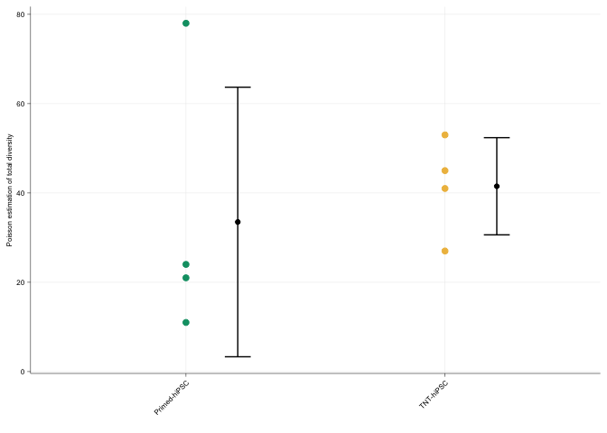

Extended Data Figures 4f,g,h: PNP-hiPSC WGBS analysis
================
Sam Buckberry
2022-07-13

``` r
source("R/project_functions.R")
```

    ## Loading required package: BiocGenerics

    ## 
    ## Attaching package: 'BiocGenerics'

    ## The following objects are masked from 'package:stats':
    ## 
    ##     IQR, mad, sd, var, xtabs

    ## The following objects are masked from 'package:base':
    ## 
    ##     anyDuplicated, append, as.data.frame, basename, cbind, colnames,
    ##     dirname, do.call, duplicated, eval, evalq, Filter, Find, get, grep,
    ##     grepl, intersect, is.unsorted, lapply, Map, mapply, match, mget,
    ##     order, paste, pmax, pmax.int, pmin, pmin.int, Position, rank,
    ##     rbind, Reduce, rownames, sapply, setdiff, sort, table, tapply,
    ##     union, unique, unsplit, which.max, which.min

    ## Welcome to Bioconductor
    ## 
    ##     Vignettes contain introductory material; view with
    ##     'browseVignettes()'. To cite Bioconductor, see
    ##     'citation("Biobase")', and for packages 'citation("pkgname")'.

    ## Loading required package: ggplot2

    ## Loading required package: lattice

    ## Loading required package: GenomicRanges

    ## Loading required package: stats4

    ## Loading required package: S4Vectors

    ## 
    ## Attaching package: 'S4Vectors'

    ## The following objects are masked from 'package:base':
    ## 
    ##     expand.grid, I, unname

    ## Loading required package: IRanges

    ## Loading required package: GenomeInfoDb

    ## Loading required package: SummarizedExperiment

    ## Loading required package: MatrixGenerics

    ## Loading required package: matrixStats

    ## 
    ## Attaching package: 'matrixStats'

    ## The following objects are masked from 'package:Biobase':
    ## 
    ##     anyMissing, rowMedians

    ## 
    ## Attaching package: 'MatrixGenerics'

    ## The following objects are masked from 'package:matrixStats':
    ## 
    ##     colAlls, colAnyNAs, colAnys, colAvgsPerRowSet, colCollapse,
    ##     colCounts, colCummaxs, colCummins, colCumprods, colCumsums,
    ##     colDiffs, colIQRDiffs, colIQRs, colLogSumExps, colMadDiffs,
    ##     colMads, colMaxs, colMeans2, colMedians, colMins, colOrderStats,
    ##     colProds, colQuantiles, colRanges, colRanks, colSdDiffs, colSds,
    ##     colSums2, colTabulates, colVarDiffs, colVars, colWeightedMads,
    ##     colWeightedMeans, colWeightedMedians, colWeightedSds,
    ##     colWeightedVars, rowAlls, rowAnyNAs, rowAnys, rowAvgsPerColSet,
    ##     rowCollapse, rowCounts, rowCummaxs, rowCummins, rowCumprods,
    ##     rowCumsums, rowDiffs, rowIQRDiffs, rowIQRs, rowLogSumExps,
    ##     rowMadDiffs, rowMads, rowMaxs, rowMeans2, rowMedians, rowMins,
    ##     rowOrderStats, rowProds, rowQuantiles, rowRanges, rowRanks,
    ##     rowSdDiffs, rowSds, rowSums2, rowTabulates, rowVarDiffs, rowVars,
    ##     rowWeightedMads, rowWeightedMeans, rowWeightedMedians,
    ##     rowWeightedSds, rowWeightedVars

    ## The following object is masked from 'package:Biobase':
    ## 
    ##     rowMedians

    ## 
    ## Attaching package: 'magrittr'

    ## The following object is masked from 'package:GenomicRanges':
    ## 
    ##     subtract

    ## 
    ## Attaching package: 'data.table'

    ## The following object is masked from 'package:SummarizedExperiment':
    ## 
    ##     shift

    ## The following object is masked from 'package:GenomicRanges':
    ## 
    ##     shift

    ## The following object is masked from 'package:IRanges':
    ## 
    ##     shift

    ## The following objects are masked from 'package:S4Vectors':
    ## 
    ##     first, second

    ## Loading required package: BSgenome

    ## Loading required package: Biostrings

    ## Loading required package: XVector

    ## 
    ## Attaching package: 'Biostrings'

    ## The following object is masked from 'package:base':
    ## 
    ##     strsplit

    ## Loading required package: rtracklayer

    ## Loading required package: AnnotationDbi

    ## 
    ## Attaching package: 'ggthemes'

    ## The following object is masked from 'package:cowplot':
    ## 
    ##     theme_map

    ## Loading required package: Rsamtools

    ## 
    ## Attaching package: 'VariantAnnotation'

    ## The following object is masked from 'package:stringr':
    ## 
    ##     fixed

    ## The following object is masked from 'package:base':
    ## 
    ##     tabulate

    ## 
    ## Attaching package: 'ChIPpeakAnno'

    ## The following object is masked from 'package:VariantAnnotation':
    ## 
    ##     info

    ## 
    ## Attaching package: 'gtools'

    ## The following object is masked from 'package:e1071':
    ## 
    ##     permutations

    ## 
    ## Attaching package: 'UpSetR'

    ## The following object is masked from 'package:lattice':
    ## 
    ##     histogram

    ## Loading required package: limma

    ## 
    ## Attaching package: 'limma'

    ## The following object is masked from 'package:BiocGenerics':
    ## 
    ##     plotMA

    ## Loading required package: grid

    ## 
    ## Attaching package: 'grid'

    ## The following object is masked from 'package:Biostrings':
    ## 
    ##     pattern

``` r
## Read the lenti data from faulkner lab
dat <- read_xlsx("lenti/Supp_table.xlsx", skip = 398)
```

    ## New names:
    ## • `` -> `...1`

``` r
dat <- reshape2::melt(dat[6, ])
```

    ## Using ...1 as id variables

``` r
dat <- dat[dat$variable != "hmi32Cas", ]
dat$group <- ifelse(test = grepl(pattern = "TNT", x = dat$variable),
                    yes = "TNT-hiPSC", no = "Primed-hiPSC")


data_summary <- function(data, varname, groupnames){
    require(plyr)
    summary_func <- function(x, col){
        c(mean = mean(x[[col]], na.rm=TRUE),
          sd = sd(x[[col]], na.rm=TRUE))
    }

    data_sum <- ddply(data, groupnames, .fun=summary_func,
                    varname)
    data_sum <- rename(data_sum, c("mean" = varname))
    return(data_sum)
}

gg <- ggplot(data = dat, aes(x = group, y = value, group=group,
                             fill=group, colour=group)) +
    geom_point(size=2) +
    scale_colour_manual(values = c("#009E73", "#eebc4c")) +
    stat_summary(fun.data=mean_sdl, fun.args = list(mult=1),
                 geom="errorbar", color="black", width=0.1,
                 position = position_nudge(x = 0.2)) +
    stat_summary(fun=mean, geom="point", color="black",
                 position = position_nudge(x = 0.2)) +
    ylab("Poisson estimation of total diversity") + xlab("") +
    sams_pub_theme()
```

    ## Warning: The `size` argument of `element_line()` is deprecated as of ggplot2 3.4.0.
    ## ℹ Please use the `linewidth` argument instead.

``` r
pdf("lenti/lenti_insertion_diversity_plot.pdf", width = 1.5, height = 2.1)
gg
dev.off()
```

    ## quartz_off_screen 
    ##                 2

``` r
gg
```

<!-- -->

``` r
wb_ed_fig4i <- openxlsx::createWorkbook()

openxlsx::addWorksheet(wb_ed_fig4i, sheetName = "ED_Fig_4i")
openxlsx::writeData(wb = wb_ed_fig4i, sheet = "ED_Fig_4i",
                    x = gg$data)

openxlsx::saveWorkbook(wb = wb_ed_fig4i,
                       file = "ED_Figure_4i_source_data.xlsx", overwrite = TRUE)
```

``` r
sessionInfo()
```

    ## R version 4.2.1 (2022-06-23)
    ## Platform: x86_64-apple-darwin17.0 (64-bit)
    ## Running under: macOS Big Sur ... 10.16
    ## 
    ## Matrix products: default
    ## BLAS:   /Library/Frameworks/R.framework/Versions/4.2/Resources/lib/libRblas.0.dylib
    ## LAPACK: /Library/Frameworks/R.framework/Versions/4.2/Resources/lib/libRlapack.dylib
    ## 
    ## locale:
    ## [1] en_AU.UTF-8/en_AU.UTF-8/en_AU.UTF-8/C/en_AU.UTF-8/en_AU.UTF-8
    ## 
    ## attached base packages:
    ##  [1] grid      parallel  stats4    stats     graphics  grDevices utils    
    ##  [8] datasets  methods   base     
    ## 
    ## other attached packages:
    ##  [1] RColorBrewer_1.1-3                     
    ##  [2] XML_3.99-0.12                          
    ##  [3] ggExtra_0.10.0                         
    ##  [4] gprofiler2_0.2.1                       
    ##  [5] gt_0.8.0                               
    ##  [6] Gviz_1.40.1                            
    ##  [7] edgeR_3.38.4                           
    ##  [8] limma_3.52.4                           
    ##  [9] UpSetR_1.4.0                           
    ## [10] gtools_3.9.4                           
    ## [11] ggdendro_0.1.23                        
    ## [12] TxDb.Hsapiens.UCSC.hg19.knownGene_3.2.2
    ## [13] ChIPpeakAnno_3.30.1                    
    ## [14] ggridges_0.5.4                         
    ## [15] ggalluvial_0.12.3                      
    ## [16] alluvial_0.1-2                         
    ## [17] VariantAnnotation_1.42.1               
    ## [18] Rsamtools_2.12.0                       
    ## [19] ggthemes_4.2.4                         
    ## [20] cowplot_1.1.1                          
    ## [21] ggrepel_0.9.2                          
    ## [22] ggfortify_0.4.15                       
    ## [23] pheatmap_1.0.12                        
    ## [24] GenomicFeatures_1.48.4                 
    ## [25] AnnotationDbi_1.58.0                   
    ## [26] BSgenome.Hsapiens.UCSC.hg19_1.4.3      
    ## [27] BSgenome_1.64.0                        
    ## [28] rtracklayer_1.56.1                     
    ## [29] Biostrings_2.64.1                      
    ## [30] XVector_0.36.0                         
    ## [31] data.table_1.14.6                      
    ## [32] readxl_1.4.1                           
    ## [33] openxlsx_4.2.5.1                       
    ## [34] stringr_1.5.0                          
    ## [35] magrittr_2.0.3                         
    ## [36] bsseq_1.32.0                           
    ## [37] SummarizedExperiment_1.26.1            
    ## [38] MatrixGenerics_1.8.1                   
    ## [39] matrixStats_0.63.0                     
    ## [40] GenomicRanges_1.48.0                   
    ## [41] GenomeInfoDb_1.32.4                    
    ## [42] IRanges_2.30.1                         
    ## [43] S4Vectors_0.34.0                       
    ## [44] e1071_1.7-12                           
    ## [45] caret_6.0-93                           
    ## [46] lattice_0.20-45                        
    ## [47] ggplot2_3.4.1                          
    ## [48] Biobase_2.56.0                         
    ## [49] BiocGenerics_0.42.0                    
    ## [50] preprocessCore_1.58.0                  
    ## 
    ## loaded via a namespace (and not attached):
    ##   [1] rappdirs_0.3.3            ModelMetrics_1.2.2.2     
    ##   [3] R.methodsS3_1.8.2         tidyr_1.2.1              
    ##   [5] bit64_4.0.5               knitr_1.41               
    ##   [7] DelayedArray_0.22.0       R.utils_2.12.2           
    ##   [9] rpart_4.1.19              KEGGREST_1.36.3          
    ##  [11] hardhat_1.2.0             RCurl_1.98-1.9           
    ##  [13] AnnotationFilter_1.20.0   generics_0.1.3           
    ##  [15] lambda.r_1.2.4            RSQLite_2.2.19           
    ##  [17] proxy_0.4-27              future_1.29.0            
    ##  [19] bit_4.0.5                 xml2_1.3.3               
    ##  [21] lubridate_1.9.0           httpuv_1.6.6             
    ##  [23] assertthat_0.2.1          gower_1.0.0              
    ##  [25] xfun_0.35                 hms_1.1.2                
    ##  [27] evaluate_0.18             promises_1.2.0.1         
    ##  [29] fansi_1.0.4               restfulr_0.0.15          
    ##  [31] progress_1.2.2            dbplyr_2.2.1             
    ##  [33] DBI_1.1.3                 htmlwidgets_1.5.4        
    ##  [35] futile.logger_1.4.3       purrr_0.3.5              
    ##  [37] ellipsis_0.3.2            dplyr_1.0.10             
    ##  [39] backports_1.4.1           permute_0.9-7            
    ##  [41] biomaRt_2.52.0            deldir_1.0-6             
    ##  [43] sparseMatrixStats_1.8.0   vctrs_0.5.2              
    ##  [45] ensembldb_2.20.2          cachem_1.0.6             
    ##  [47] withr_2.5.0               checkmate_2.1.0          
    ##  [49] GenomicAlignments_1.32.1  prettyunits_1.1.1        
    ##  [51] cluster_2.1.4             lazyeval_0.2.2           
    ##  [53] crayon_1.5.2              labeling_0.4.2           
    ##  [55] recipes_1.0.3             pkgconfig_2.0.3          
    ##  [57] nlme_3.1-160              ProtGenerics_1.28.0      
    ##  [59] nnet_7.3-18               rlang_1.0.6              
    ##  [61] globals_0.16.2            lifecycle_1.0.3          
    ##  [63] miniUI_0.1.1.1            filelock_1.0.2           
    ##  [65] BiocFileCache_2.4.0       dichromat_2.0-0.1        
    ##  [67] VennDiagram_1.7.3         cellranger_1.1.0         
    ##  [69] graph_1.74.0              Matrix_1.5-3             
    ##  [71] Rhdf5lib_1.18.2           base64enc_0.1-3          
    ##  [73] png_0.1-8                 viridisLite_0.4.1        
    ##  [75] rjson_0.2.21              bitops_1.0-7             
    ##  [77] R.oo_1.25.0               rhdf5filters_1.8.0       
    ##  [79] pROC_1.18.0               blob_1.2.3               
    ##  [81] DelayedMatrixStats_1.18.2 regioneR_1.28.0          
    ##  [83] parallelly_1.32.1         jpeg_0.1-10              
    ##  [85] scales_1.2.1              memoise_2.0.1            
    ##  [87] plyr_1.8.8                zlibbioc_1.42.0          
    ##  [89] compiler_4.2.1            BiocIO_1.6.0             
    ##  [91] cli_3.6.0                 listenv_0.8.0            
    ##  [93] htmlTable_2.4.1           formatR_1.12             
    ##  [95] Formula_1.2-4             MASS_7.3-58.1            
    ##  [97] tidyselect_1.2.0          stringi_1.7.12           
    ##  [99] highr_0.9                 yaml_2.3.6               
    ## [101] locfit_1.5-9.6            latticeExtra_0.6-30      
    ## [103] tools_4.2.1               timechange_0.1.1         
    ## [105] future.apply_1.10.0       rstudioapi_0.14          
    ## [107] foreach_1.5.2             foreign_0.8-83           
    ## [109] gridExtra_2.3             prodlim_2019.11.13       
    ## [111] farver_2.1.1              digest_0.6.30            
    ## [113] shiny_1.7.3               lava_1.7.0               
    ## [115] Rcpp_1.0.9                later_1.3.0              
    ## [117] httr_1.4.4                biovizBase_1.44.0        
    ## [119] colorspace_2.1-0          splines_4.2.1            
    ## [121] RBGL_1.72.0               multtest_2.52.0          
    ## [123] plotly_4.10.1             xtable_1.8-4             
    ## [125] jsonlite_1.8.3            futile.options_1.0.1     
    ## [127] timeDate_4021.106         ipred_0.9-13             
    ## [129] R6_2.5.1                  Hmisc_4.7-2              
    ## [131] pillar_1.8.1              htmltools_0.5.3          
    ## [133] mime_0.12                 glue_1.6.2               
    ## [135] fastmap_1.1.0             BiocParallel_1.30.4      
    ## [137] class_7.3-20              codetools_0.2-18         
    ## [139] utf8_1.2.3                tibble_3.1.8             
    ## [141] curl_4.3.3                zip_2.2.2                
    ## [143] interp_1.1-3              survival_3.4-0           
    ## [145] rmarkdown_2.18            InteractionSet_1.24.0    
    ## [147] munsell_0.5.0             rhdf5_2.40.0             
    ## [149] GenomeInfoDbData_1.2.8    iterators_1.0.14         
    ## [151] HDF5Array_1.24.2          reshape2_1.4.4           
    ## [153] gtable_0.3.1
