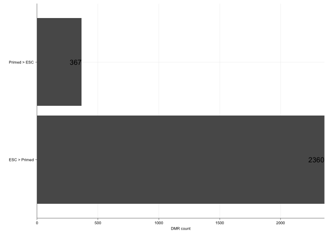
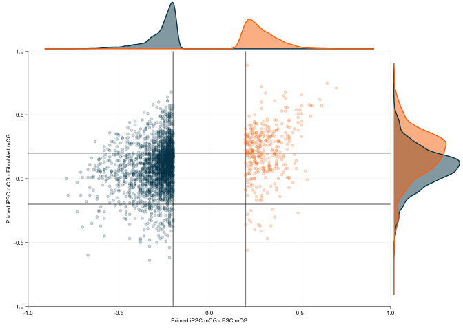
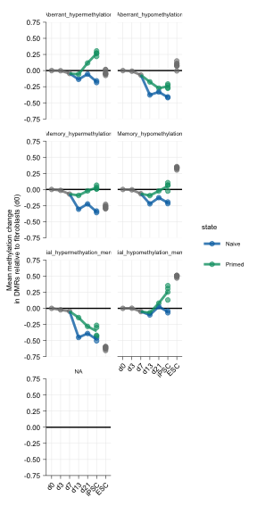
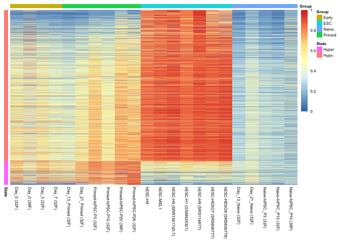
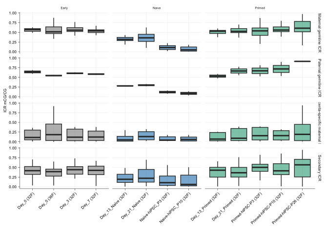

Figure 2 and associated extended data figures
================
Sam Buckberry
2023-06-23

``` r
source("R/project_functions.R")
```

Read in the sample metadata

``` r
mdat <- read.csv("wgbs/metadata/wgbs_metadata_local.csv")
all(file.exists(mdat$BSseq_CG))
```

    ## [1] TRUE

### CG-DMR analysis

CG-DMRs were called using the script `wgbs/dmrs/run_dmrseq_dug.R` Output
`.Rds` objects are a list containing the DMRs as a GRanges object and a
sample table with group, library and input file information. DMR files
are in the folders prefixed with `wgbs/dmrs/dmrseq_*`

Function to process the DMR files and apply filters

``` r
process_dmr <- function(dmr_obj, p = 0.05, delta = 0.2, n_cores=3){
    
    # make mCG matrix
    bsseq_fls <- basename(dmr_obj$manifest_data$rds_path)
    bsseq_fls <- str_c("wgbs/CG_bsobj/", bsseq_fls)    
    
    mC_dat <- make_mC_matrix(obj_fls = bsseq_fls,
                             gr = dmr_obj$dmr_granges,
                             cores = n_cores)
    
    ind <- match(colnames(mC_dat),
                 basename(dmr_obj$manifest_data$rds_path))
    colnames(mC_dat) <- dmr_obj$manifest_data$id[ind]
    
    ## Calculate delta for groups
    groups <- unique(dmr_obj$manifest_data$group)
    g1_mean <- rowMeans(mC_dat[ ,dmr_obj$manifest_data$group == groups[1]])
    g2_mean <- rowMeans(mC_dat[ ,dmr_obj$manifest_data$group == groups[2]])
    group_delta <- g1_mean - g2_mean
    
    ## Setup mcols for output
    df <- data.frame(g1_mean = g1_mean, g2_mean = g2_mean,
                     delta = group_delta)
    ## Round numbers to three digits which is something meaningful for these data
    df <- round(df, digits = 3)
    
    mcols(dmr_obj$dmr_granges) <- cbind(mcols(dmr_obj$dmr_granges), df, mC_dat)
    
    ## Tag DMRs if they intersect a blacklist region
    blacklist_gr <- bed_to_gr("resources/hg19_blacklist_regions_ENCFF001TDO.bed")
    dmr_obj$dmr_granges$blacklist <- overlapsAny(dmr_obj$dmr_granges,
                                                 blacklist_gr)
    
    ## Set if DMR passes significance threshold
    dmr_obj$dmr_granges$significant <- (dmr_obj$dmr_granges$pval < p) & 
        (abs(dmr_obj$dmr_granges$delta) >= delta) &
        (dmr_obj$dmr_granges$blacklist == FALSE)
        
    return(dmr_obj)
}
```

### Primed hiPSC vs Primed ESC DMRs

#### Merge ESC replicates for DMR calling

Merge and collapse H9 ESC KSR replicates from Smith lab

``` r
smith_primed_files <- mdat$BSseq_CG[mdat$Background == "H9" &
                                   mdat$Media == "KSR" &
                                   mdat$Lab == "Smith"]

stopifnot(all(file.exists(smith_primed_files)))

smith_primed_list <- lapply(X = smith_primed_files, FUN = readRDS)

smith_primed_obj <- bsseq::combineList(smith_primed_list)

merge_vec <- c("H9_KSR", "H9_KSR", "H9_KSR")
names(merge_vec) <- sampleNames(smith_primed_obj)

smith_collapsed_obj <- bsseq::collapseBSseq(BSseq = smith_primed_obj,
                                            group = merge_vec)

saveRDS(object = smith_collapsed_obj, file = "wgbs/CG_bsobj/Smith_H9_Primed_KSR_combined_CG_bsseq.Rds")
```

Merge MEL1 ESC E8 replicates

``` r
mel1_esc_files <- mdat$BSseq_CG[mdat$Background == "MEL1" &
                                   mdat$Media == "E8" &
                                   mdat$State == "ESC"]

stopifnot(all(file.exists(mel1_esc_files)))

mel1_esc_list <- lapply(X = mel1_esc_files, FUN = readRDS)

mel1_esc_obj <- bsseq::combineList(mel1_esc_list)

merge_vec <- c("MEL1_ESC_E8", "MEL1_ESC_E8")
names(merge_vec) <- sampleNames(mel1_esc_obj)

mel1_collapsed_obj <- bsseq::collapseBSseq(BSseq = mel1_esc_obj,
                                            group = merge_vec)

saveRDS(object = mel1_collapsed_obj,
        file = "wgbs/CG_bsobj/MEL1_ESC_E8_combined_CG_bsseq.Rds")
```

Merge H9 ESC E8 replicates

``` r
h9_esc_files <- mdat$BSseq_CG[mdat$Background == "H9" &
                                   mdat$Media == "E8" &
                                   mdat$State == "ESC"]

stopifnot(all(file.exists(h9_esc_files)))

h9_esc_list <- lapply(X = h9_esc_files, FUN = readRDS)

h9_esc_obj <- bsseq::combineList(h9_esc_list)

merge_vec <- c("H9_ESC_E8", "H9_ESC_E8")
names(merge_vec) <- sampleNames(h9_esc_obj)

mel1_collapsed_obj <- bsseq::collapseBSseq(BSseq = h9_esc_obj,
                                            group = merge_vec)

saveRDS(object = mel1_collapsed_obj,
        file = "wgbs/CG_bsobj/H9_ESC_E8_combined_CG_bsseq.Rds")
```

### DMR calling

DMRs called using the script `"wgbs/dmrs/run_dmrseq_dug.R"`

Load the DMR object

``` r
dmr_a <- readRDS("wgbs/dmrs/dmrseq_primed_vs_esc_original/dmrseq_primed_vs_esc_original_ESC_vs_Primed_dmrseq_dmrs.Rds")
```

Process the DMR data

``` r
dmr_a <- process_dmr(dmr_a)
```

**Figure 2a** Barplot DMR count

``` r
## Barplot DMR count

barplot_dmr_counts <- function(dmr_obj){
    
    dmr_obj_filt <- dmr_obj$dmr_granges[dmr_obj$dmr_granges$significant] 
    
    groups <- unique(dmr_obj$manifest_data$group)

    dmr_counts <- data.frame(direction=ifelse(test = dmr_obj_filt$delta > 0,
                                              yes = str_c(groups[1], " > ", groups[2]),
                                              no = str_c(groups[2], " > ", groups[1])))
    
    
    dmr_counts <- data.frame(table(dmr_counts))
    
    gg_dmr_bar <- ggplot(data = dmr_counts, aes(x = direction, y = Freq)) +
        geom_bar(stat = "identity") +
        ylab("DMR count") + xlab("") +
        scale_y_continuous(expand = c(0,0)) +
        geom_text(aes(label = Freq), hjust = 1) +
        sams_pub_theme(legend_pos = 'left', x.text.angle = 0, hjust = 0.5) +
        coord_flip()
    
    return(gg_dmr_bar)
}
```

``` r
dmr_a_counts_gg <- barplot_dmr_counts(dmr_a)
```

    ## Warning: The `size` argument of `element_line()` is deprecated as of ggplot2 3.4.0.
    ## ℹ Please use the `linewidth` argument instead.

``` r
pdf(file = "wgbs/plots/primed_vs_esc_dmr_class_count_barplot.pdf",
    height = 0.8, width = 2)
    dmr_a_counts_gg
dev.off()
```

    ## quartz_off_screen 
    ##                 2

``` r
dmr_a_counts_gg
```

<!-- -->

``` r
## Save source data
wb_fig2 <- openxlsx::createWorkbook()
openxlsx::addWorksheet(wb_fig2, sheetName = "Fig_2a")
openxlsx::writeData(wb = wb_fig2, sheet = "Fig_2a",
                    x = dmr_a_counts_gg$data)
```

**Figure 2b** DMR scatterplot with progenitor cell data

``` r
## List the file paths
fl_paths <- c(dmr_a$manifest_data$rds_path,
              mdat$BSseq_CG[mdat$Library_id %in% c("RL415", "RL702")])

## Remove the paths specific to server
fl_paths <- str_remove(string = fl_paths, pattern = "/d/home/hg19ips/hg19ips_samb/mcc_hg19ips/sam/hs-reprogram/")

## Matching IDs
esc_id <- mdat$Library_id[match(basename(dmr_a$manifest_data$rds_path)
                                [dmr_a$manifest_data$group == "ESC"],
                                basename(mdat$BSseq_CG))]

ips_id <- mdat$Library_id[match(basename(dmr_a$manifest_data$rds_path)
                                [dmr_a$manifest_data$group == "Primed"],
                                basename(mdat$BSseq_CG))]

fib_id <- c("RL415", "RL702")

## Subset for significant DMRs
ips_esc_dmrs <- dmr_a$dmr_granges[dmr_a$dmr_granges$significant] 


## Calc mCG/CG for all DMRs
ips_esc_dmrs_mCG <- make_mC_matrix(obj_fls = fl_paths,
                                   gr = ips_esc_dmrs, cores = 3)
```

    ## Making matrix of mC levels for regions...

``` r
## Change colnames to library ID
colnames(ips_esc_dmrs_mCG) <- mdat$Library_id[match(colnames(ips_esc_dmrs_mCG),
                                                    basename(mdat$BSseq_CG))]

## Calculate group means
esc_ips_delta <- rowMeans(ips_esc_dmrs_mCG[ ,ips_id], na.rm = TRUE) -
    rowMeans(ips_esc_dmrs_mCG[ ,esc_id], na.rm = TRUE)

fib_ips_delta <- rowMeans(ips_esc_dmrs_mCG[ ,ips_id], na.rm = TRUE) -
    rowMeans(ips_esc_dmrs_mCG[ ,fib_id], na.rm = TRUE)

## Round the values when making the table, so less ambuity for the cutoffs below
dmr_delta_df <- data.frame(ESC_delta = round(esc_ips_delta, digits = 2),
                           Fibroblast_delta = round(fib_ips_delta, digits = 2))

dmr_delta_df$dmr <- NA

## Set DMR classes
dmr_delta_df$dmr[dmr_delta_df$ESC_delta >= 0.2 &
                     dmr_delta_df$Fibroblast_delta >= 0.2] <- "Aberrant_hypermethylation"

dmr_delta_df$dmr[dmr_delta_df$ESC_delta <= -0.2 &
                     dmr_delta_df$Fibroblast_delta <= -0.2] <- "Aberrant_hypomethylation"

dmr_delta_df$dmr[dmr_delta_df$ESC_delta <= -0.2 & 
                     abs(dmr_delta_df$Fibroblast_delta) <= 0.2 ] <- "Memory_hypomethylation"

dmr_delta_df$dmr[dmr_delta_df$ESC_delta >= 0.2 &
                     abs(dmr_delta_df$Fibroblast_delta) <= 0.2 ] <- "Memory_hypermethylation"

dmr_delta_df$dmr[dmr_delta_df$ESC_delta <= -0.2 &
                     dmr_delta_df$Fibroblast_delta >= 0.2] <- "Partial_hypomethylation_memory"

dmr_delta_df$dmr[dmr_delta_df$ESC_delta >= 0.2 &
                     dmr_delta_df$Fibroblast_delta <= -0.2] <- "Partial_hypermethyation_memory"

dmr_delta_df$dmr <- factor(dmr_delta_df$dmr)

table(dmr_delta_df$dmr) %>% sum()
```

    ## [1] 2727

``` r
dmr_delta_df$Class <- ifelse(test = dmr_delta_df$ESC_delta < 0, yes = "Hypo", no = "Hyper")
dmr_delta_df$Class <- factor(dmr_delta_df$Class, levels=c("Hyper", "Hypo"))

all(rownames(dmr_delta_df) == gr_to_loci(ips_esc_dmrs))
```

    ## [1] TRUE

``` r
ips_esc_dmrs$class <- dmr_delta_df$dmr
ips_esc_dmrs$direction <- dmr_delta_df$Class

saveRDS(object = ips_esc_dmrs,
        file = "wgbs/processed_data/classified_dmrs_granges.Rds")

dmr_scatter_gg <- ggplot(data = dmr_delta_df,
                         mapping = aes(x = ESC_delta,
                                       y = Fibroblast_delta,
                                       colour = Class, fill = Class)) +
    geom_vline(xintercept = c(-.2, .2), alpha=0.5) + 
    geom_hline(yintercept = c(-.2, .2), alpha=0.5) +
    geom_point(alpha=0.2, inherit.aes = TRUE, size=1) +
    scale_x_continuous(limits = c(-1, 1), expand = c(0,0)) +
    scale_y_continuous(limits = c(-1, 1), expand = c(0,0)) +
    ylab("Primed iPSC mCG - Fibroblast mCG") +
    xlab("Primed iPSC mCG - ESC mCG") +
    scale_colour_manual(values = vitC[c(6,1)]) +
    sams_pub_theme(x.text.angle = 0, hjust = 0.5)

dmr_scatter_gg_extra <- ggExtra::ggMarginal(dmr_scatter_gg,
                                      groupColour = TRUE, groupFill=TRUE)

pdf("wgbs/plots/dmr_delta_scatter.pdf", width = 2.5, height = 2.3)
dmr_scatter_gg_extra
dev.off()
```

    ## quartz_off_screen 
    ##                 2

``` r
dmr_scatter_gg_extra
```

<!-- -->

``` r
## Save source data
openxlsx::addWorksheet(wb_fig2, sheetName = "Fig_2b")
openxlsx::writeData(wb = wb_fig2, sheet = "Fig_2b",
                    x = dmr_scatter_gg$data)
```

``` r
table(dmr_delta_df$dmr)
```

    ## 
    ##      Aberrant_hypermethylation       Aberrant_hypomethylation 
    ##                            199                            140 
    ##        Memory_hypermethylation         Memory_hypomethylation 
    ##                            153                           1649 
    ## Partial_hypermethyation_memory Partial_hypomethylation_memory 
    ##                             15                            571

**Figure 2c,d; Extended Data Figure 1l** Time course plots of DMR change

``` r
timecourse_samples <- c("RL415", "RL413", "RL399",
                        "RL414", "RL698", "RL411", "RL412",
                        "RL416", "RL697", "RL417", "RL418", "RL703", "RL1751_1771",
                        "RL2351_merge", "RL2352_merge",
                        "SRR1561745_merge", "SRS004213", "SRS114877",
                        "SRS606777", "SRS606778")

ds_sub <- mdat[mdat$Library_id %in% timecourse_samples, ,drop=TRUE] %>% as.data.frame()

ips_esc_dmrs_mCG_timecourse <- make_mC_matrix(obj_fls = ds_sub$BSseq_CG,
                                              gr = ips_esc_dmrs, cores = 3)

dim(ips_esc_dmrs_mCG_timecourse)
```

    ## [1] 2727   20

``` r
colnames(ips_esc_dmrs_mCG_timecourse) <- ds_sub$Library_id
#colnames(ips_esc_dmrs_mCG_timecourse) <- ds_sub$Manuscript.Name

#pheatmap(ips_esc_dmrs_mCG_timecourse, show_rownames = FALSE)

## Plot DMR timecourse
primed_line_32F <- ds_sub$Manuscript.Name[ds_sub$State %in% c("Early", "Primed") & 
                                         (ds_sub$Timepoint %in% c("d0", "d3", "d7",
                                                              "d13", "d21", "P3", 
                                                              "P10+"))]

naive_line_32F <- ds_sub$Manuscript.Name[ds_sub$State %in% c("Early", "Naive") & 
                                        (ds_sub$Timepoint %in% c("d0", "d3", "d7",
                                                             "d13", "d21", "P3", 
                                                             "P10+"))]

esc_line <- ds_sub$Manuscript.Name[ds_sub$State %in% c("ESC")]


ips_esc_dmrs_mCG_timecourse_sub <- as.matrix(ips_esc_dmrs_mCG_timecourse)

### Take the mean of each timepoint where there is replicates
colnames(ips_esc_dmrs_mCG_timecourse_sub)
```

    ##  [1] "RL1751_1771"      "RL2351_merge"     "RL2352_merge"     "RL399"           
    ##  [5] "RL411"            "RL412"            "RL413"            "RL414"           
    ##  [9] "RL415"            "RL416"            "RL417"            "RL418"           
    ## [13] "RL697"            "RL698"            "RL703"            "SRR1561745_merge"
    ## [17] "SRS004213"        "SRS114877"        "SRS606777"        "SRS606778"

``` r
#d0_mean <- rowMeans(ips_esc_dmrs_mCG_timecourse_sub[ ,c("d0", "d0_38F")], na.rm = TRUE)

primed_iPSC_mean <- rowMeans(ips_esc_dmrs_mCG_timecourse_sub[ ,c("RL1751_1771",
                                                                 "RL417",
                                                                 "RL418",
                                                                 "RL703")],
                             na.rm = TRUE)

naive_iPSC_mean <- rowMeans(ips_esc_dmrs_mCG_timecourse_sub[ ,c("RL411",
                                                                "RL412")],
                            na.rm = TRUE)

ESC_mean <- rowMeans(ips_esc_dmrs_mCG_timecourse_sub[ ,c("RL2351_merge",
                                                         "RL2352_merge",
                        "SRR1561745_merge", "SRS004213", "SRS114877",
                        "SRS606777", "SRS606778")], na.rm = TRUE)

# remove_id <- c("d0", "d0_38F", "P3_Primed", "P10_Primed",
#                "P20_Primed_38F_E8", "P26_Primed_E8", "P3_Naive", "P10_Naive",
#                "P10_Naive_38F", c("H9_mTeSR1", "H9_E8",
#                                   "H1_mTeSR1", "HESO7_KSR", "HESO8_KSR"))
# 
# remove_id <- c("d0", "d0_38F")

dmr_means <- data.frame(d0=ips_esc_dmrs_mCG_timecourse_sub[ ,"RL415"],
                        Primed_iPSC=primed_iPSC_mean, 
                        Naive_iPSC=naive_iPSC_mean, ESC=ESC_mean)

#dmr_means <- data.frame(d0=d0_mean)

#ips_esc_dmrs_mCG_timecourse_sub <- cbind(dmr_means,
#                             ips_esc_dmrs_mCG_timecourse_sub[ #,!colnames(ips_esc_dmrs_mCG_timecourse_sub) %in% remove_id])

ips_esc_dmrs_mCG_timecourse_sub <- cbind(dmr_means,
                             ips_esc_dmrs_mCG_timecourse_sub)

colnames(ips_esc_dmrs_mCG_timecourse_sub)
```

    ##  [1] "d0"               "Primed_iPSC"      "Naive_iPSC"       "ESC"             
    ##  [5] "RL1751_1771"      "RL2351_merge"     "RL2352_merge"     "RL399"           
    ##  [9] "RL411"            "RL412"            "RL413"            "RL414"           
    ## [13] "RL415"            "RL416"            "RL417"            "RL418"           
    ## [17] "RL697"            "RL698"            "RL703"            "SRR1561745_merge"
    ## [21] "SRS004213"        "SRS114877"        "SRS606777"        "SRS606778"

``` r
### Set values relative to d0
rel_zero <- function(dat){
        
        rel_zero_dat <- apply(X = dat, MARGIN = 1, FUN = function(x)(x - x[1])) %>% t()
        return(rel_zero_dat)
}

ips_esc_dmrs_mCG_timecourse_sub <- rel_zero(ips_esc_dmrs_mCG_timecourse_sub) %>% data.frame()

#ips_esc_dmrs_mCG_timecourse_sub$class <- ifelse(test = ips_esc_dmrs$mCG_delta < 0,
#                                                yes = "Hypo", no = "Hyper")

all(rownames(ips_esc_dmrs_mCG_timecourse_sub) == rownames(dmr_delta_df))
```

    ## [1] TRUE

``` r
ips_esc_dmrs_mCG_timecourse_sub$dmr <- dmr_delta_df$dmr
ips_esc_dmrs_mCG_timecourse_sub$Class <- dmr_delta_df$Class

z_melt <- reshape2::melt(ips_esc_dmrs_mCG_timecourse_sub)

table(z_melt$variable)
```

    ## 
    ##               d0      Primed_iPSC       Naive_iPSC              ESC 
    ##             2727             2727             2727             2727 
    ##      RL1751_1771     RL2351_merge     RL2352_merge            RL399 
    ##             2727             2727             2727             2727 
    ##            RL411            RL412            RL413            RL414 
    ##             2727             2727             2727             2727 
    ##            RL415            RL416            RL417            RL418 
    ##             2727             2727             2727             2727 
    ##            RL697            RL698            RL703 SRR1561745_merge 
    ##             2727             2727             2727             2727 
    ##        SRS004213        SRS114877        SRS606777        SRS606778 
    ##             2727             2727             2727             2727

``` r
z_melt$variable <- as.character(z_melt$variable)

# Set States
z_melt$state <- NA
z_melt$state[z_melt$variable %in% c("RL415", "RL413", "RL399")] <- "Early"

z_melt$state[z_melt$variable %in% c("RL414", "RL698", "RL411", "RL412")] <- "Naive"

z_melt$state[z_melt$variable %in% c("RL416", "RL697", "RL417", "RL418",
                                    "RL703", "RL1751_1771")] <- "Primed"

z_melt$state[z_melt$variable %in% c( "RL2351_merge", "RL2352_merge",
                        "SRR1561745_merge", "SRS004213", "SRS114877",
                        "SRS606777", "SRS606778")] <- "ESC"

# Set timepoints
z_melt$timepoint <- NA

z_melt$timepoint[z_melt$variable == "RL415"] <- "d0"

z_melt$timepoint[z_melt$variable == "RL413"] <- "d3"

z_melt$timepoint[z_melt$variable == "RL399"] <- "d7"

z_melt$timepoint[z_melt$variable %in% c("RL414", "RL416")] <- "d13"

z_melt$timepoint[z_melt$variable %in% c("RL697", "RL698")] <- "d21"

z_melt$timepoint[z_melt$variable %in% c("RL1751_1771", "RL417", "RL418",
                                        "RL703", "RL411", "RL412")] <- "iPSC"

z_melt$timepoint[z_melt$variable %in% c("RL2351_merge", "RL2352_merge",
                        "SRR1561745_merge", "SRS004213", "SRS114877",
                        "SRS606777", "SRS606778")] <- "ESC"

d7 <- z_melt[z_melt$timepoint == "d7", ]
d7_naive <- d7
d7_naive$state <- "Naive"
d7_primed <- d7
d7_primed$state <- "Primed"

z_melt <- rbind(z_melt, d7_naive, d7_primed)

gg_z <- ggplot2::ggplot(z_melt, aes(x=timepoint, y=value, group=state, color=state)) +
        facet_wrap(facets = .~dmr, ncol = 2) +
        geom_hline(yintercept = 0) +
        scale_x_discrete(limits=c("d0", "d3", "d7", "d13", "d21", "iPSC", "ESC")) +
        scale_y_continuous(expand = c(0, 0), limits = c(-0.75, 0.75), breaks = seq(from=-1, to=1, by=0.25)) +
        stat_summary(mapping = aes(group=variable, colour=state), geom="point",
                     fun.data = mean_se, size=1.5, alpha=0.6) +
        stat_summary(mapping = aes(group=state, colour=state), geom="line",
                     fun.data = mean_se, size=1, alpha=0.8) +
        scale_color_manual(values = reprog_pal[c(3,4,2,1)]) +
        scale_fill_manual(values = reprog_pal[c(3,4,2,1)]) +
        xlab("") + ylab("Mean methylation change \nin DMRs relative to fibroblasts (d0)") +
        sams_pub_theme(legend_pos = "right")

pdf("wgbs/plots/dmr_abs_difference_d0_line_plots.pdf", width = 3, height = 5)
gg_z
dev.off()
```

    ## quartz_off_screen 
    ##                 2

``` r
## Just with the two largest groups for main figure

z_melt_sub <- z_melt[z_melt$dmr %in% c("Memory_hypomethylation", "Aberrant_hypermethylation"), ]
z_melt_sub$dmr <- factor(z_melt_sub$dmr,
                         levels= c("Aberrant_hypermethylation",
                                   "Memory_hypomethylation"))

gg_z2 <- ggplot2::ggplot(z_melt_sub, aes(x=timepoint, y=value, group=state, color=state)) +
        facet_grid(facets = dmr~.) +
        geom_hline(yintercept = 0) +
        scale_x_discrete(limits=c("d0", "d3", "d7", "d13", "d21", "iPSC", "ESC")) +
        #scale_y_continuous(expand = c(0, 0), limits = c(-0.35, 0.35), breaks = seq(from=-1, to=1, by=0.2)) +
        stat_summary(mapping = aes(group=variable, colour=state), geom="point",
                     fun.data = mean_se, size=1.5, alpha=0.6) +
        stat_summary(mapping = aes(group=state, colour=state), geom="line",
                     fun.data = mean_se, size=1, alpha=0.8) +
        scale_color_manual(values = reprog_pal[c(3,4,2,1)]) +
        scale_fill_manual(values = reprog_pal[c(3,4,2,1)]) +
        xlab("") + ylab("Mean methylation change \nin DMRs relative to fibroblasts (d0)") +
        sams_pub_theme(legend_pos = "right")

pdf("wgbs/plots/dmr_abs_difference_d0_line_plots_top2.pdf", width = 2.35,
    height = 2)
gg_z2
dev.off()
```

    ## quartz_off_screen 
    ##                 2

``` r
## Save source data
openxlsx::addWorksheet(wb_fig2, sheetName = "Fig_2cd")
openxlsx::writeData(wb = wb_fig2, sheet = "Fig_2cd",
                    x = gg_z2$data)

wb_ed_fig1_jkl <- openxlsx::createWorkbook()
openxlsx::addWorksheet(wb_ed_fig1_jkl, sheetName = "ED_Fig_1k")
openxlsx::writeData(wb = wb_ed_fig1_jkl, sheet = "ED_Fig_1k",
                    x = gg_z$data)
```

``` r
gg_z
```

    ## Warning: Removed 33822 rows containing non-finite values (`stat_summary()`).
    ## Removed 33822 rows containing non-finite values (`stat_summary()`).

<!-- --> **Extended
Data Figure 1k** Heatmap DMRs for timecourse

``` r
heatmap_samples <- c("RL415", "RL702", "RL413", "RL399",
                     "RL416", "RL697", "RL417", "RL418", "RL703", "RL1751_1771",
                     "RL2351_merge", "RL2352_merge",
                     "SRR1561745_merge", "SRS004213", "SRS114877",
                     "SRS606777", "SRS606778",
                     "RL414", "RL698", "RL411", "RL412", "RL838")

hm_ind <- match(heatmap_samples, mdat$Library_id)

hm_df <- make_mC_matrix(obj_fls = mdat$BSseq_CG[hm_ind],
                        gr = ips_esc_dmrs, cores = 4)
```

    ## Making matrix of mC levels for regions...

``` r
colnames(hm_df) <- mdat$Library_id[hm_ind]

## Sort based on delta
row_order <- order(ips_esc_dmrs$delta, decreasing = TRUE)

hm_coldat <- data.frame(row.names = mdat$Library_id[hm_ind],
                        Group = as.character(mdat$State[hm_ind]))

hm_rowdat <- data.frame(row.names = rownames(hm_df),
                        State=as.character(ips_esc_dmrs$direction))


dmr_hm <- pheatmap(hm_df[row_order, ],
                   fontsize = 6, 
         annotation_col = hm_coldat,
         annotation_row = hm_rowdat,
         labels_col = mdat$Manuscript.Name[hm_ind],
         cluster_cols = FALSE,
         cluster_rows = FALSE,
         show_rownames = FALSE)
```

<!-- -->

``` r
pdf("wgbs/plots/cg-dmr-timecourse-heatmap.pdf", height = 3, width = 3)
dmr_hm
dev.off()
```

    ## quartz_off_screen 
    ##                 2

``` r
png("wgbs/plots/cg-dmr-timecourse-heatmap.png", units = "in", res = 300, 
    height = 3, width = 3)
dmr_hm
dev.off()
```

    ## quartz_off_screen 
    ##                 2

``` r
openxlsx::addWorksheet(wb_ed_fig1_jkl, sheetName = "ED_Fig_2b")
openxlsx::writeData(wb = wb_ed_fig1_jkl, sheet = "ED_Fig_2b",
                    x = hm_df)
```

Load the ICR data

``` r
icrs <- read_xlsx("resources/journal.pgen.1004868.s006.XLSX")

icr_gr <- GRanges(seqnames = icrs$Chromosome,
                  IRanges(start = icrs$Start, end = icrs$End))

mcols(icr_gr) <- icrs

icr_gr$Categoly[grepl("Secondary", icr_gr$Categoly)] <- "Secondary ICR"
icr_gr$Categoly[grepl("Maternal", icr_gr$Categoly)] <- "Maternal germline ICR"
icr_gr$Categoly[grepl("Paternal", icr_gr$Categoly)] <- "Paternal germline ICR"
icr_gr$Categoly[grepl("Placenta", icr_gr$Categoly)] <- "Placenta-specific maternal ICR"

saveRDS(icr_gr, "resources/imprint_control_regions_granges_hg19.Rds")
```

Calculate mCG/CG for all ICRs for all samples.

``` r
stopifnot(all(file.exists(mdat$BSseq_CG)))
icr_mCG <- make_mC_matrix(obj_fls = mdat$BSseq_CG, gr = icr_gr, cores = 4)
colnames(icr_mCG) <- mdat$Library_id
saveRDS(icr_mCG, "wgbs/processed_data/icr_mcg_all.Rds")
```

``` r
icr_mCG <- readRDS("wgbs/processed_data/icr_mcg_all.Rds")
```

**Figure 2e; Extended Data Figure 1n** ICR timecourse boxplots

``` r
icr_timecourse <- c("RL415", "RL702", "RL413", "RL399",
                     "RL414", "RL698", "RL411", "RL412",
                     "RL416", "RL697", "RL417", "RL418", "RL1751_1771")

colnames(icr_mCG) <- mdat$Library_id

icr_time_df <- icr_mCG[ ,icr_timecourse] %>% data.frame()
icr_time_df$class <- as.character(icr_gr$Categoly)

icr_time_df <- reshape2::melt(icr_time_df)
```

    ## Using class as id variables

``` r
icr_time_ind <- match(icr_time_df$variable, mdat$Library_id)
icr_time_ind2 <- match(icr_timecourse, mdat$Library_id)
 
icr_time_df$id <- factor(mdat$Manuscript.Name[icr_time_ind],
                         levels=mdat$Manuscript.Name[icr_time_ind2])

icr_time_df$group <- mdat$State[icr_time_ind]

gg_icr_time_box <- ggplot(icr_time_df, aes(x = id, y = value,
                                           fill=group, alpha=0.8)) +
    geom_boxplot(outlier.shape = NA) +
    facet_grid(class~group, drop = TRUE, space = "free_x", scales = "free_x") +
    scale_fill_manual(values = reprog_pal[c(3,2,1)]) +
    ylab("ICR mCG/CG") + xlab("") +
    sams_pub_theme()


pdf("wgbs/plots/icr_timecourse_boxplots_maternal_germline.pdf",
    height = 2, width = 2.25)

    ggplot(icr_time_df[icr_time_df$class == "Maternal germline ICR", ],
           aes(x = id, y = value, fill=group)) +
    geom_boxplot(outlier.shape = NA, lwd=0.18) +
    facet_grid(.~group, drop = TRUE, space = "free_x", scales = "free_x") +
    scale_fill_manual(values = reprog_pal[c(3,2,1)]) +
    ylab("ICR mCG/CG") + xlab("") +
    sams_pub_theme()
    
dev.off()
```

    ## quartz_off_screen 
    ##                 2

``` r
pdf("wgbs/plots/icr_timecourse_boxplots_NOT_maternal_germline.pdf",
    height = 3.5, width = 2.25)

    ggplot(icr_time_df[icr_time_df$class != "Maternal germline ICR", ],
           aes(x = id, y = value, fill=group)) +
    geom_boxplot(outlier.shape = NA, lwd=0.18) +
    facet_grid(class~group, drop = TRUE, space = "free_x", scales = "free_x") +
    scale_fill_manual(values = reprog_pal[c(3,2,1)]) +
    ylab("ICR mCG/CG") + xlab("") +
    sams_pub_theme()
    
dev.off()
```

    ## quartz_off_screen 
    ##                 2

``` r
gg_icr_time_box
```

<!-- --> Write source
data sheets

``` r
openxlsx::addWorksheet(wb_ed_fig1_jkl, sheetName = "ED_Fig_2d")
openxlsx::writeData(wb = wb_ed_fig1_jkl, sheet = "ED_Fig_2d",
                    x = gg_icr_time_box$data)

openxlsx::addWorksheet(wb_fig2, sheetName = "Fig_2f")
openxlsx::writeData(wb = wb_fig2, sheet = "Fig_2f",
                    x = gg_icr_time_box$data)
```

``` r
openxlsx::saveWorkbook(wb = wb_fig2,
                       file = "Figure_2_source_data.xlsx",
                       overwrite = TRUE)

openxlsx::saveWorkbook(wb = wb_ed_fig1_jkl,
                       file = "ED_Figure_1_jkl_source_data.xlsx",
                       overwrite = TRUE)
```

``` r
sessionInfo()
```

    ## R version 4.2.1 (2022-06-23)
    ## Platform: x86_64-apple-darwin17.0 (64-bit)
    ## Running under: macOS Big Sur ... 10.16
    ## 
    ## Matrix products: default
    ## BLAS:   /Library/Frameworks/R.framework/Versions/4.2/Resources/lib/libRblas.0.dylib
    ## LAPACK: /Library/Frameworks/R.framework/Versions/4.2/Resources/lib/libRlapack.dylib
    ## 
    ## locale:
    ## [1] en_AU.UTF-8/en_AU.UTF-8/en_AU.UTF-8/C/en_AU.UTF-8/en_AU.UTF-8
    ## 
    ## attached base packages:
    ##  [1] grid      parallel  stats4    stats     graphics  grDevices utils    
    ##  [8] datasets  methods   base     
    ## 
    ## other attached packages:
    ##  [1] RColorBrewer_1.1-3                     
    ##  [2] XML_3.99-0.12                          
    ##  [3] ggExtra_0.10.0                         
    ##  [4] gprofiler2_0.2.1                       
    ##  [5] gt_0.8.0                               
    ##  [6] Gviz_1.40.1                            
    ##  [7] edgeR_3.38.4                           
    ##  [8] limma_3.52.4                           
    ##  [9] UpSetR_1.4.0                           
    ## [10] gtools_3.9.4                           
    ## [11] ggdendro_0.1.23                        
    ## [12] TxDb.Hsapiens.UCSC.hg19.knownGene_3.2.2
    ## [13] ChIPpeakAnno_3.30.1                    
    ## [14] ggridges_0.5.4                         
    ## [15] ggalluvial_0.12.3                      
    ## [16] alluvial_0.1-2                         
    ## [17] VariantAnnotation_1.42.1               
    ## [18] Rsamtools_2.12.0                       
    ## [19] ggthemes_4.2.4                         
    ## [20] cowplot_1.1.1                          
    ## [21] ggrepel_0.9.2                          
    ## [22] ggfortify_0.4.15                       
    ## [23] pheatmap_1.0.12                        
    ## [24] GenomicFeatures_1.48.4                 
    ## [25] AnnotationDbi_1.58.0                   
    ## [26] BSgenome.Hsapiens.UCSC.hg19_1.4.3      
    ## [27] BSgenome_1.64.0                        
    ## [28] rtracklayer_1.56.1                     
    ## [29] Biostrings_2.64.1                      
    ## [30] XVector_0.36.0                         
    ## [31] data.table_1.14.6                      
    ## [32] readxl_1.4.1                           
    ## [33] openxlsx_4.2.5.1                       
    ## [34] stringr_1.5.0                          
    ## [35] magrittr_2.0.3                         
    ## [36] bsseq_1.32.0                           
    ## [37] SummarizedExperiment_1.26.1            
    ## [38] MatrixGenerics_1.8.1                   
    ## [39] matrixStats_0.63.0                     
    ## [40] GenomicRanges_1.48.0                   
    ## [41] GenomeInfoDb_1.32.4                    
    ## [42] IRanges_2.30.1                         
    ## [43] S4Vectors_0.34.0                       
    ## [44] e1071_1.7-12                           
    ## [45] caret_6.0-93                           
    ## [46] lattice_0.20-45                        
    ## [47] ggplot2_3.4.1                          
    ## [48] Biobase_2.56.0                         
    ## [49] BiocGenerics_0.42.0                    
    ## [50] preprocessCore_1.58.0                  
    ## 
    ## loaded via a namespace (and not attached):
    ##   [1] rappdirs_0.3.3            ModelMetrics_1.2.2.2     
    ##   [3] R.methodsS3_1.8.2         tidyr_1.2.1              
    ##   [5] bit64_4.0.5               knitr_1.41               
    ##   [7] DelayedArray_0.22.0       R.utils_2.12.2           
    ##   [9] rpart_4.1.19              KEGGREST_1.36.3          
    ##  [11] hardhat_1.2.0             RCurl_1.98-1.9           
    ##  [13] AnnotationFilter_1.20.0   generics_0.1.3           
    ##  [15] lambda.r_1.2.4            RSQLite_2.2.19           
    ##  [17] proxy_0.4-27              future_1.29.0            
    ##  [19] bit_4.0.5                 xml2_1.3.3               
    ##  [21] lubridate_1.9.0           httpuv_1.6.6             
    ##  [23] assertthat_0.2.1          gower_1.0.0              
    ##  [25] xfun_0.35                 hms_1.1.2                
    ##  [27] evaluate_0.18             promises_1.2.0.1         
    ##  [29] fansi_1.0.4               restfulr_0.0.15          
    ##  [31] progress_1.2.2            dbplyr_2.2.1             
    ##  [33] DBI_1.1.3                 htmlwidgets_1.5.4        
    ##  [35] futile.logger_1.4.3       purrr_0.3.5              
    ##  [37] ellipsis_0.3.2            dplyr_1.0.10             
    ##  [39] backports_1.4.1           permute_0.9-7            
    ##  [41] biomaRt_2.52.0            deldir_1.0-6             
    ##  [43] sparseMatrixStats_1.8.0   vctrs_0.5.2              
    ##  [45] ensembldb_2.20.2          cachem_1.0.6             
    ##  [47] withr_2.5.0               checkmate_2.1.0          
    ##  [49] GenomicAlignments_1.32.1  prettyunits_1.1.1        
    ##  [51] cluster_2.1.4             lazyeval_0.2.2           
    ##  [53] crayon_1.5.2              labeling_0.4.2           
    ##  [55] recipes_1.0.3             pkgconfig_2.0.3          
    ##  [57] nlme_3.1-160              ProtGenerics_1.28.0      
    ##  [59] nnet_7.3-18               rlang_1.0.6              
    ##  [61] globals_0.16.2            lifecycle_1.0.3          
    ##  [63] miniUI_0.1.1.1            filelock_1.0.2           
    ##  [65] BiocFileCache_2.4.0       dichromat_2.0-0.1        
    ##  [67] VennDiagram_1.7.3         cellranger_1.1.0         
    ##  [69] graph_1.74.0              Matrix_1.5-3             
    ##  [71] Rhdf5lib_1.18.2           base64enc_0.1-3          
    ##  [73] png_0.1-8                 viridisLite_0.4.1        
    ##  [75] rjson_0.2.21              bitops_1.0-7             
    ##  [77] R.oo_1.25.0               rhdf5filters_1.8.0       
    ##  [79] pROC_1.18.0               blob_1.2.3               
    ##  [81] DelayedMatrixStats_1.18.2 regioneR_1.28.0          
    ##  [83] parallelly_1.32.1         jpeg_0.1-10              
    ##  [85] scales_1.2.1              memoise_2.0.1            
    ##  [87] plyr_1.8.8                zlibbioc_1.42.0          
    ##  [89] compiler_4.2.1            BiocIO_1.6.0             
    ##  [91] cli_3.6.0                 listenv_0.8.0            
    ##  [93] htmlTable_2.4.1           formatR_1.12             
    ##  [95] Formula_1.2-4             MASS_7.3-58.1            
    ##  [97] tidyselect_1.2.0          stringi_1.7.12           
    ##  [99] highr_0.9                 yaml_2.3.6               
    ## [101] locfit_1.5-9.6            latticeExtra_0.6-30      
    ## [103] tools_4.2.1               timechange_0.1.1         
    ## [105] future.apply_1.10.0       rstudioapi_0.14          
    ## [107] foreach_1.5.2             foreign_0.8-83           
    ## [109] gridExtra_2.3             prodlim_2019.11.13       
    ## [111] farver_2.1.1              digest_0.6.30            
    ## [113] shiny_1.7.3               lava_1.7.0               
    ## [115] Rcpp_1.0.9                later_1.3.0              
    ## [117] httr_1.4.4                biovizBase_1.44.0        
    ## [119] colorspace_2.1-0          splines_4.2.1            
    ## [121] RBGL_1.72.0               multtest_2.52.0          
    ## [123] plotly_4.10.1             xtable_1.8-4             
    ## [125] jsonlite_1.8.3            futile.options_1.0.1     
    ## [127] timeDate_4021.106         ipred_0.9-13             
    ## [129] R6_2.5.1                  Hmisc_4.7-2              
    ## [131] pillar_1.8.1              htmltools_0.5.3          
    ## [133] mime_0.12                 glue_1.6.2               
    ## [135] fastmap_1.1.0             BiocParallel_1.30.4      
    ## [137] class_7.3-20              codetools_0.2-18         
    ## [139] utf8_1.2.3                tibble_3.1.8             
    ## [141] curl_4.3.3                zip_2.2.2                
    ## [143] interp_1.1-3              survival_3.4-0           
    ## [145] rmarkdown_2.18            InteractionSet_1.24.0    
    ## [147] munsell_0.5.0             rhdf5_2.40.0             
    ## [149] GenomeInfoDbData_1.2.8    iterators_1.0.14         
    ## [151] HDF5Array_1.24.2          reshape2_1.4.4           
    ## [153] gtable_0.3.1
