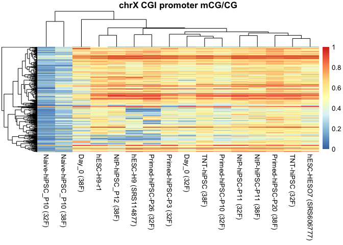

Figure 3 and associated extended data figures
================
Sam Buckberry
2023-06-23

``` r
source("R/project_functions.R")
```

Load DNA methylation metadata

``` r
mdat <- read.csv("wgbs/metadata/wgbs_metadata_local.csv")
```

Load the DMR object with annotations

``` r
all_dmrs <- readRDS("wgbs/processed_data/classified_dmrs_granges.Rds")
```

Write DMR results to file

``` r
all_dmrs_df <- as.data.frame(all_dmrs)
all_dmrs_df$loci <- gr_to_loci(all_dmrs)

write.table(all_dmrs_df, "wgbs/processed_data/all_dmrs_reults.csv", quote = FALSE, sep = ",", row.names = FALSE)
```

Make CG-DMR mCG/CG matrix for relevant samples

``` r
fib_libs <- c("RL415", "RL702")
primed_libs <- c("RL417", "RL418", "RL703", "RL1751_1771")
naive_libs <- c("RL411", "RL412", "RL838")
tnt_libs <- c("RL1124", "RL1125")
ntp_libs <- c("RL936", "RL937", "RL837")
esc_libs <- c("RL2352_merge", "RL2351_merge", "SRS114877",
          "SRR1561745_merge", "SRS004213", "SRS606777", "SRS606778")
    
libs <- c(fib_libs, primed_libs, naive_libs, tnt_libs, ntp_libs, esc_libs)

ind <- match(libs, mdat$Library_id)

dmr_mCG_matrix <- make_mC_matrix(obj_fls = mdat$BSseq_CG[ind],
                                 gr = all_dmrs, cores = 4)
```

    ## Making matrix of mC levels for regions...

``` r
colnames(dmr_mCG_matrix) <- mdat$Library_id[ind]
```

Caclculate mean delta for hiPSCs compared to hESCs

``` r
## Calculate mean delta
esc_n2p_d13_delta <- rowMeans(dmr_mCG_matrix[ ,tnt_libs], na.rm = TRUE) - rowMeans(dmr_mCG_matrix[ ,esc_libs], na.rm = TRUE)
esc_n2p_p10_delta <- rowMeans(dmr_mCG_matrix[ ,ntp_libs], na.rm = TRUE) - rowMeans(dmr_mCG_matrix[ ,esc_libs], na.rm = TRUE)
esc_naive_delta <- rowMeans(dmr_mCG_matrix[ ,naive_libs], na.rm = TRUE) - rowMeans(dmr_mCG_matrix[ ,esc_libs], na.rm = TRUE)
esc_ips_delta <- rowMeans(dmr_mCG_matrix[ ,primed_libs], na.rm = TRUE) - rowMeans(dmr_mCG_matrix[ ,esc_libs], na.rm = TRUE)
esc_fib_delta <- rowMeans(dmr_mCG_matrix[ ,fib_libs], na.rm = TRUE) - rowMeans(dmr_mCG_matrix[ ,esc_libs], na.rm = TRUE)

all_dmrs$esc_n2p_d13_delta <- esc_n2p_d13_delta
all_dmrs$esc_n2p_p10_delta <- esc_n2p_p10_delta
all_dmrs$esc_ips_delta <- esc_ips_delta
all_dmrs$esc_naive_delta <- esc_naive_delta
#all_dmrs$esc_fib_delta <- esc_fib_delta

all_dmrs$loci <- gr_to_loci(all_dmrs)
```

Plot DMR delta values

``` r
delta_df <- data.frame(TNT=all_dmrs$esc_n2p_d13_delta,
                      NtP=all_dmrs$esc_n2p_p10_delta,
                      Primed=all_dmrs$esc_ips_delta,
                      Naive=all_dmrs$esc_naive_delta,
                      #Fibroblast=esc_fib_delta,
                      class=all_dmrs$class)

delta_df_melt <- reshape2::melt(delta_df)
```

    ## Using class as id variables

``` r
delta_df_melt$variable <- factor(delta_df_melt$variable,
                                 levels=c("Primed", "Naive", "NtP", "TNT"))

delta_df_melt$class <- factor(delta_df_melt$class)

line_mm <- 0.5 / 2.835

gg_delta_correct <- ggplot(delta_df_melt,
                           aes(x = value, group=variable,
                               color=variable,
                               fill=variable)) +
        geom_histogram(bins = 30, position="identity") +
        geom_vline(xintercept = c(-.2, .2), linetype='dashed', size = line_mm) +
        #geom_density() +
        scale_color_manual(values=reprog_pal[c("Primed", "Naive", "TNT", "NtP")]) +
        scale_fill_manual(values=reprog_pal[c("Primed", "Naive", "TNT", "NtP")]) +
        facet_grid(class~variable, scales = "free_y") +
        scale_x_continuous(limits = c(-1, 1)) +
        xlab("DMR mCG delta \n(iPSC mCG - ESC mCG)") +
        ylab("Number of DMRs") +
        sams_pub_theme(legend_pos = 'right', x.text.angle = 0, hjust = 0.5)

pdf("wgbs/plots/mcg_dmr_esc_delta_histograms.pdf", width = 5, height = 2)
gg_delta_correct
dev.off()
```

    ## quartz_off_screen 
    ##                 2

``` r
gg_delta_correct_combined <- ggplot(delta_df_melt,
                           aes(x = value, group=variable,
                               color=variable,
                               fill=variable)) +
        geom_histogram(bins = 30, position="identity") +
        geom_vline(xintercept = c(-.2, .2), linetype='dashed', size = line_mm) +
        #geom_density() +
        scale_color_manual(values=reprog_pal[c("Primed", "Naive", "TNT", "NtP")]) +
        scale_fill_manual(values=reprog_pal[c("Primed", "Naive", "TNT", "NtP")]) +
        facet_grid(variable~.) +
        scale_x_continuous(limits = c(-1, 1)) +
        xlab("DMR mCG delta \n(iPSC mCG - ESC mCG)") +
        ylab("Number of DMRs") +
        sams_pub_theme(legend_pos = 'right', x.text.angle = 0, hjust = 0.5)
pdf("wgbs/plots/mcg_dmr_esc_delta_histograms_combined_vertical.pdf", width = 2.5, height = 3.25)
gg_delta_correct_combined
dev.off()
```

    ## quartz_off_screen 
    ##                 2

``` r
wb_fig3 <- openxlsx::createWorkbook()

openxlsx::addWorksheet(wb_fig3, sheetName = "Fig_3c")
openxlsx::writeData(wb = wb_fig3, sheet = "Fig_3c",
                    x = gg_delta_correct_combined$data)
```

Assign DMRs as corrected or uncorrected and write bed files

``` r
## Seperate if corrected or uncorrected
all_dmrs$tnt_corrected <- abs(all_dmrs$esc_n2p_d13_delta) < 0.2
all_dmrs$ntp_corrected <- abs(all_dmrs$esc_n2p_p10_delta) < 0.2
all_dmrs$both_corrected <- (all_dmrs$tnt_corrected == TRUE) &
    (all_dmrs$ntp_corrected == TRUE)

all_dmrs$any_corrected <- (all_dmrs$tnt_corrected == TRUE) | (all_dmrs$ntp_corrected == TRUE)
all_dmrs$correction_class <- str_c(all_dmrs$class, "_", all_dmrs$both_corrected)
table(all_dmrs$correction_class)
```

    ## 
    ##      Aberrant_hypermethylation_FALSE       Aberrant_hypermethylation_TRUE 
    ##                                   94                                  105 
    ##       Aberrant_hypomethylation_FALSE        Aberrant_hypomethylation_TRUE 
    ##                                   64                                   76 
    ##        Memory_hypermethylation_FALSE         Memory_hypermethylation_TRUE 
    ##                                   86                                   67 
    ##         Memory_hypomethylation_FALSE          Memory_hypomethylation_TRUE 
    ##                                  447                                 1202 
    ## Partial_hypermethyation_memory_FALSE  Partial_hypermethyation_memory_TRUE 
    ##                                    4                                   11 
    ## Partial_hypomethylation_memory_FALSE  Partial_hypomethylation_memory_TRUE 
    ##                                  171                                  400

``` r
all_dmrs
```

    ## GRanges object with 2727 ranges and 35 metadata columns:
    ##          seqnames              ranges strand |         L      area      beta
    ##             <Rle>           <IRanges>  <Rle> | <integer> <numeric> <numeric>
    ##      [1]    chr12 130642603-130650204      * |       338  168.5753  1.248068
    ##      [2]    chr10 133108848-133111109      * |       119   80.4240  1.776016
    ##      [3]     chr4     8856630-8879787      * |       928  323.4014  0.926906
    ##      [4]    chr16   53406798-53407808      * |        57   46.7636 -2.083580
    ##      [5]    chr12 130386982-130389235      * |       152   93.3987  1.732472
    ##      ...      ...                 ...    ... .       ...       ...       ...
    ##   [2723]    chr20   60237468-60237766      * |        15   2.34649 -0.566588
    ##   [2724]    chr18   50343719-50345032      * |         9   2.22555 -0.806841
    ##   [2725]     chr4   34350170-34350596      * |         5   1.56146 -1.035597
    ##   [2726]    chr16     6709279-6710023      * |        12   3.17818 -0.727783
    ##   [2727]     chr8 140148147-140149073      * |        11   1.58127 -0.492863
    ##               stat        pval      qval             index   g1_mean   g2_mean
    ##          <numeric>   <numeric> <numeric>         <IRanges> <numeric> <numeric>
    ##      [1]   55.6732 3.51537e-06 0.0205001 16910132-16910469     0.057     0.535
    ##      [2]   35.1931 3.51537e-06 0.0205001 14538777-14538895     0.032     0.729
    ##      [3]   33.8936 3.51537e-06 0.0205001   5734171-5735098     0.133     0.504
    ##      [4]  -33.7511 3.51537e-06 0.0205001 19792147-19792203     0.882     0.088
    ##      [5]   31.0682 3.51537e-06 0.0205001 16906067-16906218     0.012     0.631
    ##      ...       ...         ...       ...               ...       ...       ...
    ##   [2723]  -6.11683   0.0498198  0.481918 23468510-23468524     0.883     0.664
    ##   [2724]  -6.11666   0.0498374  0.481974 21669383-21669391     0.860     0.583
    ##   [2725]  -6.11634   0.0498585  0.482064   5910155-5910159     0.877     0.444
    ##   [2726]  -6.11504   0.0499358  0.482546 19420156-19420167     0.909     0.655
    ##   [2727]  -6.11414   0.0499991  0.482737 12193960-12193970     0.828     0.623
    ##              delta Smith_H9_KSR Lister_H9_E8 Lister_MEL1_E8      HESO7
    ##          <numeric>    <numeric>    <numeric>      <numeric>  <numeric>
    ##      [1]    -0.478   0.03588355    0.0713293      0.0490713 0.04832948
    ##      [2]    -0.696   0.02356021    0.0210970      0.0153551 0.03076923
    ##      [3]    -0.371   0.09316851    0.1891220      0.0883625 0.12799310
    ##      [4]     0.794   0.95044248    0.8170530      0.9393939 0.69470405
    ##      [5]    -0.618   0.00928793    0.0148342      0.0118577 0.00788436
    ##      ...       ...          ...          ...            ...        ...
    ##   [2723]     0.219     0.870968     0.902174       0.945055   0.798611
    ##   [2724]     0.277     0.949153     0.879257       0.935115   0.746914
    ##   [2725]     0.433     0.973333     0.870445       0.889503   0.902439
    ##   [2726]     0.254     0.857143     0.873684       0.912162   0.952941
    ##   [2727]     0.206     0.858896     0.775735       0.596970   0.903382
    ##              HESO8   Ecker_H9  Ecker_H1 RL1751_1771     RL417     RL418
    ##          <numeric>  <numeric> <numeric>   <numeric> <numeric> <numeric>
    ##      [1] 0.0451249 0.04066667 0.1072961    0.491974  0.592696 0.5650394
    ##      [2] 0.0249855 0.03183024 0.0794913    0.932629  0.657875 0.4189308
    ##      [3] 0.1256141 0.14296771 0.1668120    0.893547  0.292004 0.4642339
    ##      [4] 0.9276074 0.94273128 0.9012195    0.188377  0.052439 0.0600775
    ##      [5] 0.0087500 0.00522648 0.0265487    0.965190  0.562500 0.4903943
    ##      ...       ...        ...       ...         ...       ...       ...
    ##   [2723]  0.810056   0.940678  0.911765    0.695238  0.658683  0.680672
    ##   [2724]  0.715152   0.865854  0.928571    0.644578  0.562189  0.561905
    ##   [2725]  0.893805   0.900000  0.707792    0.450980  0.389706  0.433962
    ##   [2726]  0.940945   0.909639  0.915730    0.759615  0.670588  0.502591
    ##   [2727]  0.901554   0.891026  0.870690    0.698925  0.696970  0.398907
    ##              RL703 blacklist significant                          class
    ##          <numeric> <logical>   <logical>                       <factor>
    ##      [1] 0.4905745     FALSE        TRUE      Memory_hypermethylation  
    ##      [2] 0.9053763     FALSE        TRUE      Aberrant_hypermethylation
    ##      [3] 0.3672399     FALSE        TRUE      Aberrant_hypermethylation
    ##      [4] 0.0512048     FALSE        TRUE      Memory_hypomethylation   
    ##      [5] 0.5040650     FALSE        TRUE      Aberrant_hypermethylation
    ##      ...       ...       ...         ...                            ...
    ##   [2723]  0.622222     FALSE        TRUE Memory_hypomethylation        
    ##   [2724]  0.564655     FALSE        TRUE Memory_hypomethylation        
    ##   [2725]  0.500000     FALSE        TRUE Memory_hypomethylation        
    ##   [2726]  0.688525     FALSE        TRUE Memory_hypomethylation        
    ##   [2727]  0.695652     FALSE        TRUE Partial_hypomethylation_memory
    ##          direction esc_n2p_d13_delta esc_n2p_p10_delta esc_ips_delta
    ##           <factor>         <numeric>         <numeric>     <numeric>
    ##      [1]     Hyper        0.01873569          0.179476      0.478256
    ##      [2]     Hyper        0.05501255          0.261937      0.696261
    ##      [3]     Hyper        0.00894135          0.219105      0.370822
    ##      [4]     Hypo        -0.84033627         -0.587228     -0.793854
    ##      [5]     Hyper        0.02438335          0.179902      0.618482
    ##      ...       ...               ...               ...           ...
    ##   [2723]      Hypo        -0.0503771        -0.0330782     -0.218554
    ##   [2724]      Hypo        -0.1762265        -0.1455069     -0.276670
    ##   [2725]      Hypo        -0.1135322        -0.0634828     -0.433098
    ##   [2726]      Hypo        -0.0947447        -0.0612849     -0.253562
    ##   [2727]      Hypo        -0.0131534        -0.0290512     -0.205708
    ##          esc_naive_delta                   loci tnt_corrected ntp_corrected
    ##                <numeric>            <character>     <logical>     <logical>
    ##      [1]       0.0886185 chr12:130642603-1306..          TRUE          TRUE
    ##      [2]       0.0217845 chr10:133108848-1331..          TRUE         FALSE
    ##      [3]       0.1996891   chr4:8856630-8879787          TRUE         FALSE
    ##      [4]      -0.7967694 chr16:53406798-53407..         FALSE         FALSE
    ##      [5]       0.1176200 chr12:130386982-1303..          TRUE          TRUE
    ##      ...             ...                    ...           ...           ...
    ##   [2723]       -0.285546 chr20:60237468-60237..          TRUE          TRUE
    ##   [2724]       -0.615811 chr18:50343719-50345..          TRUE          TRUE
    ##   [2725]       -0.735022 chr4:34350170-34350596          TRUE          TRUE
    ##   [2726]       -0.463575  chr16:6709279-6710023          TRUE          TRUE
    ##   [2727]       -0.561072 chr8:140148147-14014..          TRUE          TRUE
    ##          both_corrected any_corrected       correction_class
    ##               <logical>     <logical>            <character>
    ##      [1]           TRUE          TRUE Memory_hypermethylat..
    ##      [2]          FALSE          TRUE Aberrant_hypermethyl..
    ##      [3]          FALSE          TRUE Aberrant_hypermethyl..
    ##      [4]          FALSE         FALSE Memory_hypomethylati..
    ##      [5]           TRUE          TRUE Aberrant_hypermethyl..
    ##      ...            ...           ...                    ...
    ##   [2723]           TRUE          TRUE Memory_hypomethylati..
    ##   [2724]           TRUE          TRUE Memory_hypomethylati..
    ##   [2725]           TRUE          TRUE Memory_hypomethylati..
    ##   [2726]           TRUE          TRUE Memory_hypomethylati..
    ##   [2727]           TRUE          TRUE Partial_hypomethylat..
    ##   -------
    ##   seqinfo: 22 sequences from an unspecified genome; no seqlengths

``` r
corrected_dmr_gr <- all_dmrs[all_dmrs$any_corrected == TRUE]
corrected_dmr_df <- data.frame(chr=seqnames(corrected_dmr_gr),
                               start=start(corrected_dmr_gr),
                               end=end(corrected_dmr_gr),
                               name=1:length(corrected_dmr_gr),
                               score=corrected_dmr_gr$esc_ips_delta, strand="+")

write.table(x = corrected_dmr_df, file = "wgbs/processed_data/corrected_dmrs.bed",
            quote = FALSE, sep = "\t", row.names = FALSE, col.names = FALSE)

uncorrected_dmr_gr <- all_dmrs[all_dmrs$any_corrected == FALSE]
uncorrected_dmr_df <- data.frame(chr=seqnames(uncorrected_dmr_gr),
                                 start=start(uncorrected_dmr_gr),
                                 end=end(uncorrected_dmr_gr),
                               name=1:length(uncorrected_dmr_gr),
                               score=uncorrected_dmr_gr$esc_ips_delta, strand="+")

write.table(x = uncorrected_dmr_df, file = "wgbs/processed_data/uncorrected_dmrs.bed",
            quote = FALSE, sep = "\t", row.names = FALSE, col.names = FALSE)

saveRDS(object = all_dmrs, file = "wgbs/processed_data/all_dmrs_annotated_granges.Rds")
```

Plot corrected fraction of DMRs

``` r
# barplot correction fraction

correction_tab <- mcols(all_dmrs)[ ,c("tnt_corrected", "ntp_corrected", "class")] %>%
        data.frame() %>% reshape2::melt(id.vars=c('class')) %>%
    dplyr::group_by(class, variable, value) %>% dplyr::tally()

correction_tab$variable <- ifelse(test = correction_tab$variable == "tnt_corrected",
                                  yes = "TNT-hiPSCs", no = "NtP-hiPSCs")

correction_tab$group <- ifelse(test = grepl(pattern = "emory",
                                            x = correction_tab$class),
                               yes = "Memory", no = "Abberant")

bar_cols <- as.character(c(reprog_pal[7], vitC[2]))

dmr_element_corrected_gg <- ggplot(correction_tab,
                                   aes(x = variable, y=n, fill=value)) +
        geom_bar(position = "fill", stat="identity", alpha=0.9) +
        facet_grid(.~group+class, scales = "free") +
        scale_fill_manual(values = bar_cols) +
        theme(axis.text.x = element_text(angle = 45, hjust = 1, size = 10),
              axis.text.y = element_text(size=10)) +
        ylab("Proportion of DMRs") +
        scale_y_continuous(expand = c(0,0)) +
        sams_pub_theme(legend_pos = "right")

dmr_element_corrected_gg
```

<!-- -->

``` r
pdf("wgbs/plots/dmr_class_corrected_barplots.pdf",
    width = 4, height =2)
dmr_element_corrected_gg
dev.off()
```

    ## quartz_off_screen 
    ##                 2

``` r
wb_ed_fig3 <- openxlsx::createWorkbook()

openxlsx::addWorksheet(wb_ed_fig3, sheetName = "Fig_3f")
openxlsx::writeData(wb = wb_ed_fig3, sheet = "Fig_3f",
                    x = dmr_element_corrected_gg$data)
```

``` r
correction_tab2 <- mcols(all_dmrs)[ ,c("tnt_corrected", "ntp_corrected", "loci")] %>%
        data.frame() %>% reshape2::melt(id.vars='loci') %>% 
    dplyr::group_by(variable, value) %>% dplyr::tally()

correction_tab2$variable <- ifelse(test = correction_tab2$variable == "tnt_corrected",
                                   yes = "TNT-hiPSC", no = "NtP-hiPSC")

dmr_element_corrected2_gg <- ggplot(correction_tab2,
                                   aes(x = variable, y=n, fill=value)) +
        geom_bar(position = "fill", stat="identity", alpha=0.9) +
        scale_fill_manual(values = bar_cols) +
      #  theme(axis.text.x = element_text(angle = 0, hjust = 0.5, size = 10),
      #        axis.text.y = element_text(size=10)) +
        ylab("Proportion of DMRs") +
        coord_flip() +
        scale_y_continuous(expand = c(0,0)) +
        sams_pub_theme(legend_pos = "right", x.text.angle = 0, hjust = 0.5)

pdf("wgbs/plots/dmr_corrected_barplots.pdf", width = 2.9, height = 1)
dmr_element_corrected2_gg
dev.off()
```

    ## quartz_off_screen 
    ##                 2

``` r
sum(all_dmrs$tnt_corrected)
```

    ## [1] 1946

``` r
sum(all_dmrs$ntp_corrected)
```

    ## [1] 2122

``` r
dmr_element_corrected2_gg
```

<!-- -->

``` r
openxlsx::addWorksheet(wb_fig3, sheetName = "Fig_3b")
openxlsx::writeData(wb = wb_fig3, sheet = "Fig_3b",
                    x = dmr_element_corrected2_gg$data)
```

Venn diagram of corrected DMR overlaps

``` r
venn_df <- data.frame(tnt=sum(all_dmrs$tnt_corrected),
                      ntp=sum(all_dmrs$ntp_corrected),
                      olap=sum(all_dmrs$both_corrected))

pdf(file = "wgbs/plots/DMR_corrected_venn.pdf", width = 2, height = 2)
VennDiagram::draw.pairwise.venn(area1 = venn_df$tnt,
                   area2 = venn_df$ntp,
                   cross.area = venn_df$olap, euler.d = TRUE)
```

    ## (polygon[GRID.polygon.1428], polygon[GRID.polygon.1429], polygon[GRID.polygon.1430], polygon[GRID.polygon.1431], text[GRID.text.1432], text[GRID.text.1433], lines[GRID.lines.1434], text[GRID.text.1435], text[GRID.text.1436], text[GRID.text.1437])

``` r
dev.off()
```

    ## quartz_off_screen 
    ##                 2

``` r
VennDiagram::draw.pairwise.venn(area1 = venn_df$tnt,
                   area2 = venn_df$ntp,
                   cross.area = venn_df$olap, euler.d = TRUE)
```

<!-- -->

    ## (polygon[GRID.polygon.1438], polygon[GRID.polygon.1439], polygon[GRID.polygon.1440], polygon[GRID.polygon.1441], text[GRID.text.1442], text[GRID.text.1443], lines[GRID.lines.1444], text[GRID.text.1445], text[GRID.text.1446], text[GRID.text.1447])

``` r
openxlsx::addWorksheet(wb_ed_fig3, sheetName = "Fig_3e")
openxlsx::writeData(wb = wb_ed_fig3, sheet = "Fig_3e",
                    x = venn_df)
```

Plot DMR correction heatmap

``` r
## Rank matrix by variance
dmr_dat <- dmr_mCG_matrix
var_dat <- dmr_mCG_matrix[ ,c(esc_libs, primed_libs)] %>% as.matrix() %>% rowVars()
dmr_dat <- dmr_dat[order(var_dat, decreasing = FALSE), ]

# Split heatmap by corrected and uncorrected
corrected_ids <- all_dmrs$loci[all_dmrs$any_corrected == TRUE]
uncorrected_ids <- all_dmrs$loci[all_dmrs$any_corrected == FALSE]

dmr_dat_split <- rbind(dmr_dat[rownames(dmr_dat) %in% corrected_ids, ],
                       dmr_dat[rownames(dmr_dat) %in% uncorrected_ids, ])

heatmap_ind <- match(colnames(dmr_dat_split), mdat$Library_id)

colnames(dmr_dat_split) <- mdat$Manuscript.Name[heatmap_ind]

png(filename = "wgbs/plots/dmr_var_sorted_correction_split_heatmap.png",
    height = 2.5, width = 3, units = "in", res = 300)
pheatmap(dmr_dat_split, cluster_rows = FALSE, cluster_cols = FALSE, fontsize = 6,
         show_rownames = FALSE, gaps_col = c(2,6,9,11,14),
         gaps_row = length(corrected_ids), border_color = NA)
dev.off()
```

    ## quartz_off_screen 
    ##                 3

``` r
pdf(file = "wgbs/plots/dmr_var_sorted_correction_split_heatmap.pdf",
    height = 2.5, width = 3)
pheatmap(dmr_dat_split, cluster_rows = FALSE, cluster_cols = FALSE, fontsize = 6,
         show_rownames = FALSE, gaps_col = c(2,6,9,11,14),
         gaps_row = length(corrected_ids), border_color = NA)
dev.off()
```

    ## quartz_off_screen 
    ##                 3

``` r
gr_to_bed(gr = GRanges(seqnames = rownames(dmr_dat)),
          out_path = str_c("wgbs/processed_data/all_DMR_variance_sort.bed"))

pheatmap(dmr_dat_split, cluster_rows = FALSE, cluster_cols = FALSE, fontsize = 6,
         show_rownames = FALSE, gaps_col = c(2,6,9,11,14),
         gaps_row = length(corrected_ids), border_color = NA)
```

``` r
openxlsx::addWorksheet(wb_fig3, sheetName = "Fig_3d")
openxlsx::writeData(wb = wb_fig3, sheet = "Fig_3d",
                    x = dmr_dat_split)
```

Profile plot of all samples against hESC mean

``` r
stopifnot(all(rownames(dmr_mCG_matrix) == all_dmrs$loci))

dmr_sample_delta_mat <- dmr_mCG_matrix - (rowMeans(dmr_mCG_matrix[ ,esc_libs]))

dmr_sample_delta_mat <- dmr_sample_delta_mat[ ,!colnames(dmr_sample_delta_mat) %in% fib_libs]

dmr_sample_delta_mat <- data.frame(dmr_sample_delta_mat)

dmr_sample_delta_mat$class <- as.character(all_dmrs$class)

dmr_sample_delta_mat <- reshape2::melt(dmr_sample_delta_mat)
```

    ## Using class as id variables

``` r
dmr_sample_delta_mat <- dmr_sample_delta_mat[!is.na(dmr_sample_delta_mat$value), ]

head(dmr_sample_delta_mat)
```

    ##                       class variable      value
    ## 1   Memory_hypermethylation    RL417  0.5358814
    ## 2 Aberrant_hypermethylation    RL417  0.6254337
    ## 3 Aberrant_hypermethylation    RL417  0.1585693
    ## 4    Memory_hypomethylation    RL417 -0.8294398
    ## 5 Aberrant_hypermethylation    RL417  0.5504444
    ## 6 Aberrant_hypermethylation    RL417  0.2207794

``` r
table(dmr_sample_delta_mat$variable)
```

    ## 
    ##            RL417            RL418            RL703      RL1751_1771 
    ##             2727             2727             2727             2727 
    ##            RL411            RL412            RL838           RL1124 
    ##             2727             2727             2708             2727 
    ##           RL1125            RL936            RL937            RL837 
    ##             2726             2727             2726             2727 
    ##     RL2352_merge     RL2351_merge        SRS114877 SRR1561745_merge 
    ##             2727             2727             2727             2727 
    ##        SRS004213        SRS606777        SRS606778 
    ##             2727             2727             2727

``` r
dmr_sample_delta_mat$sample_group <- NA

sample_order <- c(esc_libs, primed_libs, naive_libs, tnt_libs, ntp_libs) %>% rev()

dmr_sample_delta_mat$variable <- factor(dmr_sample_delta_mat$variable,
                                        levels=sample_order)

dmr_sample_delta_mat$sample_group[dmr_sample_delta_mat$variable %in% primed_libs] <- "Primed-hiPSC"
dmr_sample_delta_mat$sample_group[dmr_sample_delta_mat$variable %in% tnt_libs] <- "TNT-hiPSC"
dmr_sample_delta_mat$sample_group[dmr_sample_delta_mat$variable %in% ntp_libs] <- "NtP-hiPSC"
dmr_sample_delta_mat$sample_group[dmr_sample_delta_mat$variable %in% esc_libs] <- "hESC"
dmr_sample_delta_mat$sample_group[dmr_sample_delta_mat$variable %in% naive_libs] <- "Naive-hiPSC"

dens_ind <- match(dmr_sample_delta_mat$variable, mdat$Library_id)
dmr_sample_delta_mat$id <- mdat$Manuscript.Name[dens_ind]

factor_ind <- match(sample_order, mdat$Library_id)
dmr_sample_delta_mat$id <- factor(dmr_sample_delta_mat$id, levels=mdat$Manuscript.Name[factor_ind])


gg_ridges <- ggplot(data = dmr_sample_delta_mat,
       mapping = aes(y = id, x = value, fill=stat(x))) +
        #facet_grid(sample_group~., drop = TRUE, scales = "free_y") +
        geom_density_ridges_gradient(height=3) +
        scale_fill_gradient2(low = "firebrick", mid = "white", high = "firebrick", midpoint = 0) +
        geom_vline(xintercept = c(-0.2, .2), alpha=0.4, linetype='dashed') +
        scale_x_continuous(limits = c(-1, 1)) + xlab("Cell line DMR mCG - hESC mean") +
        sams_pub_theme(x.text.angle = 0, legend_pos = "right", hjust = 0.5)

pdf("wgbs/plots/mcg_dmr_esc_delta_density_sample_plots_.pdf", width = 3.5, height = 4)
gg_ridges
```

    ## Warning: `stat(x)` was deprecated in ggplot2 3.4.0.
    ## ℹ Please use `after_stat(x)` instead.

    ## Picking joint bandwidth of 0.0215

``` r
dev.off()
```

    ## quartz_off_screen 
    ##                 2

``` r
gg_ridges
```

    ## Picking joint bandwidth of 0.0215

<!-- -->

``` r
openxlsx::addWorksheet(wb_ed_fig3, sheetName = "Fig_3c")
openxlsx::writeData(wb = wb_ed_fig3, sheet = "Fig_3c",
                    x = gg_ridges$data)
```

DMR correction scatter-plots for hiPSCs relative to hESCs and
fibroblasts

``` r
# Make scatterplot of DMR correction

primed_delta <- rowMeans(dmr_mCG_matrix[ ,primed_libs], na.rm = TRUE) - rowMeans(dmr_mCG_matrix[ ,esc_libs], na.rm = TRUE)
NtoP_delta <- rowMeans(dmr_mCG_matrix[ ,ntp_libs], na.rm = TRUE) - rowMeans(dmr_mCG_matrix[ ,esc_libs], na.rm = TRUE)
TNT_delta <- rowMeans(dmr_mCG_matrix[ ,tnt_libs], na.rm = TRUE) - rowMeans(dmr_mCG_matrix[ ,esc_libs], na.rm = TRUE)

fib_primed_delta <- rowMeans(dmr_mCG_matrix[ ,primed_libs], na.rm = TRUE) - rowMeans(dmr_mCG_matrix[ ,fib_libs], na.rm = TRUE)
fib_tnt_delta <- rowMeans(dmr_mCG_matrix[ ,tnt_libs], na.rm = TRUE) - rowMeans(dmr_mCG_matrix[ ,fib_libs], na.rm = TRUE)
fib_NtoP_delta <- rowMeans(dmr_mCG_matrix[ ,ntp_libs], na.rm = TRUE) - rowMeans(dmr_mCG_matrix[ ,fib_libs], na.rm = TRUE)

dmr_delta_df <- data.frame(Primed_delta = primed_delta, TNT_delta = TNT_delta, NtoP_delta = NtoP_delta,
                           fib_primed_delta = fib_primed_delta, fib_tnt_delta = fib_tnt_delta, fib_NtoP_delta = fib_NtoP_delta)

dmr_delta_df$Class <- ifelse(test = primed_delta < 0, yes = "Hypo", no = "Hyper")

primed_scatter <- ggplot(data = dmr_delta_df, mapping = aes(x = Primed_delta, y = fib_primed_delta, colour = Class, fill = Class)) +
    geom_vline(xintercept = c(-.2, .2), alpha=0.5) + geom_hline(yintercept = c(-.2, .2), alpha=0.5) +
    geom_point(alpha=0.1, inherit.aes = TRUE, size=1) +
    scale_x_continuous(limits = c(-1, 1), expand = c(0,0)) + scale_y_continuous(limits = c(-1, 1), expand = c(0,0)) +
    ylab("Primed hiPSC mCG - Fibroblast mCG") +
    xlab("Primed hiPSC mCG - hESC mCG") +
    scale_colour_manual(values = vitC[c(6,1)]) +
    #scale_colour_manual(values = brewer.pal(n = 2, name = "Dark2")) +
    sams_pub_theme(x.text.angle = 0, hjust = 0.5)
primed_scatter_gg <- ggExtra::ggMarginal(primed_scatter, groupColour = TRUE, groupFill=TRUE)

tnt_scatter <- ggplot(data = dmr_delta_df, mapping = aes(x = TNT_delta, y = fib_tnt_delta, colour = Class, fill = Class)) +
    geom_vline(xintercept = c(-.2, .2), alpha=0.5) + geom_hline(yintercept = c(-.2, .2), alpha=0.5) +
    geom_point(alpha=0.1, inherit.aes = TRUE, size=1) +
    scale_x_continuous(limits = c(-1, 1), expand = c(0,0)) + scale_y_continuous(limits = c(-1, 1), expand = c(0,0)) +
    ylab("TNT hiPSC mCG - Fibroblast mCG") +
    xlab("TNT hiPSC mCG - hESC mCG") +
    scale_colour_manual(values = vitC[c(6,1)]) +
    #scale_colour_manual(values = brewer.pal(n = 2, name = "Dark2")) +
    sams_pub_theme(x.text.angle = 0, hjust = 0.5)
tnt_scatter_gg <- ggExtra::ggMarginal(tnt_scatter, groupColour = TRUE, groupFill=TRUE)

ntp_scatter <- ggplot(data = dmr_delta_df, mapping = aes(x = NtoP_delta, y = fib_NtoP_delta, colour = Class, fill = Class)) +
    geom_vline(xintercept = c(-.2, .2), alpha=0.5) + geom_hline(yintercept = c(-.2, .2), alpha=0.5) +
    geom_point(alpha=0.1, inherit.aes = TRUE, size=1) +
    scale_x_continuous(limits = c(-1, 1), expand = c(0,0)) + scale_y_continuous(limits = c(-1, 1), expand = c(0,0)) +
    ylab("NtP hiPSC mCG - Fibroblast mCG") +
    xlab("NtP hiPSC mCG - hESC mCG") +
    scale_colour_manual(values = vitC[c(6,1)]) +
    #scale_colour_manual(values = brewer.pal(n = 2, name = "Dark2")) +
    sams_pub_theme(x.text.angle = 0, hjust = 0.5)
ntp_scatter_gg <- ggExtra::ggMarginal(ntp_scatter, groupColour = TRUE, groupFill=TRUE)

pdf("wgbs/plots/donor_DMR_correction_scatterplots_with_histograms.pdf", height = 2, width = 6)
plot_grid(primed_scatter_gg, tnt_scatter_gg, ntp_scatter_gg, ncol = 3)
dev.off()
```

    ## quartz_off_screen 
    ##                 2

Primed-hiPSC

``` r
primed_scatter_gg
```

<!-- -->

``` r
openxlsx::addWorksheet(wb_ed_fig3, sheetName = "Fig_3d1")
openxlsx::writeData(wb = wb_ed_fig3, sheet = "Fig_3d1",
                    x = primed_scatter$data)
```

TNT-hiPSC

``` r
tnt_scatter_gg
```

<!-- -->

``` r
openxlsx::addWorksheet(wb_ed_fig3, sheetName = "Fig_3d2")
openxlsx::writeData(wb = wb_ed_fig3, sheet = "Fig_3d2",
                    x = tnt_scatter$data)
```

NtP-hiPSC

``` r
ntp_scatter_gg
```

<!-- -->

``` r
openxlsx::addWorksheet(wb_ed_fig3, sheetName = "Fig_3d3")
openxlsx::writeData(wb = wb_ed_fig3, sheet = "Fig_3d3",
                    x = ntp_scatter$data)
```

Enrichment tests for DMRs (First chunk run on remote server)

``` r
source("R/server_libraries_and_functions.R")
library(regioneR)

## Load CG DMRs
all_dmrs <- readRDS("wgbs/processed_data/all_dmrs_annotated_granges.Rds")

## Load list of genomics elements
all_elements_gr <- readRDS("resources/all_genomic_elements_granges_final.Rds")

### Add CH-DMRs
library(readxl)
real_ch <- read_excel(path = "resources/nature13551-s3.xlsx")
mCH_gr <- GRanges(seqnames = real_ch$chr,
                   ranges = IRanges(start = as.numeric(real_ch$start),
                                    end = as.numeric(real_ch$end)))
mCH_gr$study <- real_ch$presence
mCH_gr$class <- "CH-DMR"

all_elements_gr <- c(all_elements_gr, mCH_gr)

target_elements <- unique(all_elements_gr$class) %>% as.character()

target_elements <- target_elements[!target_elements %in% c("Other", "Satellite", "snRNA", "tRNA", "srpRNA",
                                                           "rRNA", "RC", "scRNA", "RNA")]

unmappable_gr <- bed_to_gr("resources/d0_d3_d7_merged_zero_coverage_regions.bed")

test_element_enrichment <- function(target_element="Enhancer", dmr_class=TRUE,
                                    permutations=200, mask=unmappable_gr){
        gc()
        message(Sys.time())
        message(str_c("Running ", target_element, " ", dmr_class, "..."))
        gr_dmr <- all_dmrs[all_dmrs$any_corrected == dmr_class]
        target_gr <- all_elements_gr[all_elements_gr$class == target_element]

        set.seed(123)
        perm_test_results <- regioneR::permTest(A=gr_dmr, B=target_gr,
                                      alternative = "auto",
                       randomize.function=regioneR::randomizeRegions,
                       ntimes = permutations,
                       evaluate.function=regioneR::numOverlaps,
                       count.once = TRUE,
                       genome="hg19",
                       mask = unmappable_gr,
                       allow.overlaps=FALSE,
                       per.chromosome=TRUE,
                       mc.cores=20,
                       mc.set.seed=FALSE,
                       force.parallel=TRUE)

        lz <- localZScore(pt=perm_test_results, A=gr_dmr, B=target_gr,
                          step = mean(width(gr_dmr)/2),
                          window = 100000)

        results <- list(pt=perm_test_results, lz=lz, element=target_element,
                        class=dmr_class)
        
        message("Done!")
        return(results)
}

test <- test_element_enrichment(target_element="Promoter", dmr_class=FALSE,
                             permutations=100, mask=unmappable_gr)

all_dmr_corrected_test <- lapply(X = target_elements,
                                 FUN = test_element_enrichment,
                                 dmr_class=TRUE)

saveRDS(object = all_dmr_corrected_test,
        file = "wgbs/processed_data/corrected_dmr_enrichment_tests.Rds")

all_dmr_uncorrected_test <- lapply(X = target_elements,
                                   FUN = test_element_enrichment,
                                   dmr_class=FALSE)

saveRDS(object = all_dmr_uncorrected_test,
        file = "wgbs/processed_data/uncorrected_dmr_enrichment_tests.Rds")
```

Plot the enrichment results

``` r
all_dmr_uncorrected_test <- readRDS("wgbs/processed_data/uncorrected_dmr_enrichment_tests.Rds")

all_dmr_corrected_test <- readRDS("wgbs/processed_data/corrected_dmr_enrichment_tests.Rds")

aggregate_enrich_results <- function(x, enrich_list=all_dmr_corrected_test){
        dat <- enrich_list[[x]]

        df <- data.frame(DMR=dat$class, Element=dat$element, olaps=dat$pt$`regioneR::numOverlaps`$observed,
                         Pval=dat$pt$`regioneR::numOverlaps`$pval, Zscore=dat$pt$`regioneR::numOverlaps`$zscore)
        return(df)
}

corrected_dat <- lapply(1:length(all_dmr_corrected_test), aggregate_enrich_results, enrich_list=all_dmr_corrected_test) %>%
        do.call(rbind, .)

uncorrected_dat <- lapply(1:length(all_dmr_uncorrected_test), aggregate_enrich_results, enrich_list=all_dmr_uncorrected_test) %>% do.call(rbind, .)

all_enrich_dat <- rbind(corrected_dat, uncorrected_dat)

all_enrich_dat <- all_enrich_dat[order(all_enrich_dat$Zscore, decreasing = TRUE), ]
all_enrich_dat$Element <- factor(all_enrich_dat$Element,
                                 levels=unique(rev(all_enrich_dat$Element[all_enrich_dat$DMR == TRUE])))

#all_enrich_dat <- all_enrich_dat[all_enrich_dat$olaps > 10, ]
all_enrich_dat$pc <- lapply(X = 1:nrow(all_enrich_dat), FUN = function(x){
        ifelse(test = all_enrich_dat$DMR[x] == TRUE,
               yes = all_enrich_dat$olaps[x] / length(all_dmrs[all_dmrs$any_corrected == TRUE]),
               no = all_enrich_dat$olaps[x] / length(all_dmrs[all_dmrs$any_corrected == FALSE]))
}) %>% unlist()


all_enrich_dat$DMR <- ifelse(test = all_enrich_dat$DMR == TRUE, yes = "Corrected", no = "Uncorrected")

gg_enrich <- ggplot(data = all_enrich_dat, aes(y = Zscore, x = Element, fill=DMR)) +
        geom_col(position = 'dodge') +
        scale_fill_manual(values = rev(bar_cols)) +
        #facet_grid(.~DMR) +
        coord_flip() +
        sams_pub_theme(x.text.angle = 0, legend_pos = "right")

pdf("wgbs/plots/dmr_enrichment_zscore_barplots_all.pdf", width = 4, height = 2)
gg_enrich
dev.off()
```

    ## quartz_off_screen 
    ##                 2

``` r
gg_enrich
```

<!-- -->

``` r
wb_ed_fig4 <- openxlsx::createWorkbook()
openxlsx::addWorksheet(wb_ed_fig4, sheetName = "Fig_4a")
openxlsx::writeData(wb = wb_ed_fig4, sheet = "Fig_4a",
                    x = gg_enrich$data)
```

``` r
element_order <- c("Fibroblast_H3K9me3", "Fibroblast_PMD", "Fibroblast_LAD",
                   "Constitutive_H3K9me3", "Constitutive_LAD",
                   "ESC_H3K9me3", "ESC_LAD")

all_enrich_dat$DMR <- factor(all_enrich_dat$DMR, levels=c("Corrected", "Uncorrected"))

gg_enrich_sub <- ggplot(data = all_enrich_dat, aes(y = Zscore, x = Element, fill=DMR)) +
        geom_col(position = 'dodge') +
        #facet_wrap(DMR~.) +
        scale_x_discrete(limits=element_order, drop=TRUE) +
        scale_y_continuous(limits = c(-25, 55), breaks = c(-25, 0, 25, 50)) +
        #coord_flip() +
        scale_fill_manual(values = rev(bar_cols)) +
        sams_pub_theme(x.text.angle = 45, legend_pos = "right")
gg_enrich_sub
```

    ## Warning: Removed 18 rows containing missing values (`geom_col()`).

<!-- -->

``` r
pdf("wgbs/plots/dmr_enrichment_zscore_sub_barplots.pdf", width = 2.5, height = 2)
gg_enrich_sub
```

    ## Warning: Removed 18 rows containing missing values (`geom_col()`).

``` r
dev.off()
```

    ## quartz_off_screen 
    ##                 2

``` r
# gg_olaps <- ggplot(data = all_enrich_dat, aes(y = pc, x = Element)) +
#         geom_col() +
#         facet_wrap(DMR~.) +
#         #geom_hline(yintercept = 959) +
#         coord_flip()
# gg_olaps

pdf("wgbs/plots/dmr_enrichment_zscore_barplots.pdf", width = 4, height = 1.75)
gg_enrich
gg_enrich_sub
```

    ## Warning: Removed 18 rows containing missing values (`geom_col()`).

``` r
dev.off()
```

    ## quartz_off_screen 
    ##                 2

``` r
gg_enrich_sub
```

    ## Warning: Removed 18 rows containing missing values (`geom_col()`).

<!-- -->

``` r
openxlsx::addWorksheet(wb_fig3, sheetName = "Fig_3e")
openxlsx::writeData(wb = wb_fig3, sheet = "Fig_3e",
                    x = gg_enrich_sub$data)
```

Plot the CG-DMRs in CH-DMRs

``` r
real_ch <- read_excel(path = "resources/nature13551-s3.xlsx")
mCH_gr <- GRanges(seqnames = real_ch$chr,
                   ranges = IRanges(start = as.numeric(real_ch$start),
                                    end = as.numeric(real_ch$end)))

### PLot CH dmrs overlapping CG dmrs
all_dmrs <- readRDS("wgbs/processed_data/all_dmrs_annotated_granges.Rds")
all_dmrs$CH_olap <- overlapsAny(all_dmrs, mCH_gr)
ch_olap_dat <- mcols(all_dmrs)[ ,colnames(mcols(all_dmrs)) %in% c("esc_ips_delta",
                                                              "esc_n2p_d13_delta",
                                                              "esc_n2p_p10_delta",
                                                              "CH_olap",
                                                              "class",
                                                              "loci")] %>% data.frame()

colnames(ch_olap_dat)[2:4] <- c("TNT-hiPSC", "NtP-hiPSC", "Primed-hiPSC")


ch_olap_dat <- reshape2::melt(ch_olap_dat)
```

    ## Using class, loci, CH_olap as id variables

``` r
ch_olap_dat$CH_olap <- ifelse(test = ch_olap_dat$CH_olap, yes = "CH-DMR_overlap", no = "No overlap")

ch_olap_dat$CH_olap <- factor(ch_olap_dat$CH_olap, levels = c("FALSE", "TRUE"))
ch_olap_dat$variable <- factor(ch_olap_dat$variable,
                               levels = c("Primed-hiPSC", "TNT-hiPSC", "NtP-hiPSC"))

gg_ch_olap_violin <- ggplot(ch_olap_dat, aes(x = variable, y = abs(value), fill=CH_olap)) +
        #geom_point(alpha=0.05, position = 'jitter') +
        geom_violin(scale = 'width', draw_quantiles = 0.5, alpha=0.7,
                    trim = TRUE, size=0.2) +
        scale_fill_pander()+ ylab("mCG delta in CG-DMRs") +
        #geom_boxplot(color='black', outlier.alpha=0.05, outlier.size = 0.5) +
        scale_y_continuous(breaks = seq(from=0, to=1, by=0.2)) +
        #facet_grid(.~CH_olap) +
        sams_pub_theme(legend_pos = "right")

pdf(file = "wgbs/plots/cg_dmr_delta_ch_olaps_violin.pdf", height = 2, width = 2.5)
gg_ch_olap_violin
dev.off()
```

    ## quartz_off_screen 
    ##                 2

``` r
gg_ch_olap_violin
```

<!-- -->

``` r
openxlsx::addWorksheet(wb_ed_fig4, sheetName = "Fig_4c")
openxlsx::writeData(wb = wb_ed_fig4, sheet = "Fig_4c",
                    x = gg_ch_olap_violin$data)
```

CG DMR in CH DMR sum

``` r
## CG DMR in CH DMR sum
cg_in_ch <- sum(all_dmrs[all_dmrs$CH_olap == TRUE]$any_corrected) / 
    length(all_dmrs[all_dmrs$CH_olap == TRUE]$any_corrected)

cg_no_ch <- sum(all_dmrs[all_dmrs$CH_olap == FALSE]$any_corrected) / 
    length(all_dmrs[all_dmrs$CH_olap == FALSE]$any_corrected)

ch_cor_df <- data.frame(group=c("CG-DMR overlap CH-DMR", "No CH-DMR overlap"),
                        pc=c(cg_in_ch, cg_no_ch))

ch_dmr_olap_count <- ggplot(ch_cor_df, aes(x = group, y = pc*100)) +
    geom_col() + scale_y_continuous(limits = c(0,100)) +
    ylab("Proportion of CG-DMRs corrected (%)") +
    geom_text(aes(label = sprintf("%.1f", pc*100), y= pc*100),  vjust = 3) +
    sams_pub_theme()

pdf("wgbs/plots/cg_dmr_ch_olaps_barplot.pdf", width = 1, height = 2.5)
ch_dmr_olap_count
dev.off()
```

    ## quartz_off_screen 
    ##                 2

``` r
ch_dmr_olap_count
```

<!-- -->

``` r
openxlsx::addWorksheet(wb_ed_fig4, sheetName = "Fig_4b")
openxlsx::writeData(wb = wb_ed_fig4, sheet = "Fig_4b",
                    x = ch_dmr_olap_count$data)
```

Plot H3K9me3 signal in corrected CG DMRs (first code block run on remote
server)

``` r
##### Get H3K9me3 in CG DMRs

# And fold-enrichment in CG-DMRs
##! Run this section on server
all_dmrs <- readRDS("wgbs/processed_data/all_dmrs_annotated_granges.Rds")

fibroblast <- c("ENCFF735TXC.bigWig")
ESC <- c("ENCFF108MOZ.bigWig")
Primed <- c("Primed_32F_H3K9me3_FE_sorted.bw", "Primed_38F_H3K9me3_FE_sorted.bw")
Naive <- c("RL2011_2020_02_06_P33_32F_Naive_SR_clone1_H3K9me3_ChIP_S7_merged_lanes_dedup_FE.bigwig")
TNT <- c("TNT_32F_H3K9me3_r1_FE_sorted.bw", "TNT_32F_H3K9me3_r2_FE_sorted.bw", "TNT_38F_H3K9me3_FE_sorted.bw")
N2P <- c("N2P_38F_H3K9me3_r1_FE_sorted.bw", "N2P_38F_H3K9me3_r2_FE_sorted.bw")

bw_files <- c(fibroblast, ESC, Primed, Naive, TNT, N2P)
bw_files <- str_c("/d/home/hg19ips/hg19ips_samb/mcc_hg19ips/sam/hs-reprogram/ChIPseq/bigwigs/", bw_files)
file.exists(bw_files)


bw_path <- bw_files[1]
gr <- all_dmrs

get_dmr_means <- function(bw_path, gr){

        id <- basename(bw_path)

        bw_dat <- import.bw(con = bw_path, which = gr)

        hits <- findOverlaps(gr, bw_dat, ignore.strand = TRUE)

        ans <- gr
        mcols(ans) <- aggregate(bw_dat, hits, score.mean = mean(score),
                                drop = FALSE)

        dat <- matrix(data = mcols(ans)$score.mean, nrow = length(gr),
                      byrow = TRUE) %>% data.frame()

        dat$class <- gr$class
        dat$loci <- gr_to_loci(gr)
        dat$id <- id
        colnames(dat)[1] <- "value"
        return(dat)
}

all_cg_window_dat <- mclapply(X = bw_files, FUN = get_dmr_means, mc.cores = 10,
                              gr = all_dmrs)

all_cg_window_dat <- do.call(rbind, all_cg_window_dat)

write.table(all_cg_window_dat, "ChIPseq/processed_data/all_CG_DMR_h3k9me3_FE_means.txt",
            quote = FALSE, sep = "\t", row.names = TRUE, col.names = TRUE)
```

``` r
fibroblast <- c("ENCFF735TXC.bigWig")
ESC <- c("ENCFF108MOZ.bigWig")
Primed <- c("Primed_32F_H3K9me3_FE_sorted.bw", "Primed_38F_H3K9me3_FE_sorted.bw")
Naive <- c("RL2011_2020_02_06_P33_32F_Naive_SR_clone1_H3K9me3_ChIP_S7_merged_lanes_dedup_FE.bigwig")
TNT <- c("TNT_32F_H3K9me3_r1_FE_sorted.bw", "TNT_32F_H3K9me3_r2_FE_sorted.bw", "TNT_38F_H3K9me3_FE_sorted.bw")
N2P <- c("N2P_38F_H3K9me3_r1_FE_sorted.bw", "N2P_38F_H3K9me3_r2_FE_sorted.bw")

all_cg_window_dat <- read.table("ChIPseq/processed_data/all_CG_DMR_h3k9me3_FE_means.txt")

h3k9_dmr_mat <- reshape2::dcast(data = all_cg_window_dat[ ,c(1,3,4)], formula = loci~id)
rownames(h3k9_dmr_mat) <- h3k9_dmr_mat$loci
h3k9_dmr_mat$loci <- NULL
colnames(h3k9_dmr_mat) <- str_remove(string = colnames(h3k9_dmr_mat), pattern = "merged_lanes_dedup_FE.bigwig")

TNT_corrected <- all_dmrs$loci[all_dmrs$tnt_corrected == TRUE]
N2P_corrected <- all_dmrs$loci[all_dmrs$ntp_corrected == TRUE]

all_cg_window_dat$TNT_corrected <- all_cg_window_dat$loci %in% TNT_corrected
all_cg_window_dat$N2P_corrected <- all_cg_window_dat$loci %in% N2P_corrected

all_cg_window_dat$id %>% unique()
```

    ##  [1] "ENCFF735TXC.bigWig"                                                                    
    ##  [2] "ENCFF108MOZ.bigWig"                                                                    
    ##  [3] "Primed_32F_H3K9me3_FE_sorted.bw"                                                       
    ##  [4] "Primed_38F_H3K9me3_FE_sorted.bw"                                                       
    ##  [5] "RL2011_2020_02_06_P33_32F_Naive_SR_clone1_H3K9me3_ChIP_S7_merged_lanes_dedup_FE.bigwig"
    ##  [6] "TNT_32F_H3K9me3_r1_FE_sorted.bw"                                                       
    ##  [7] "TNT_32F_H3K9me3_r2_FE_sorted.bw"                                                       
    ##  [8] "TNT_38F_H3K9me3_FE_sorted.bw"                                                          
    ##  [9] "N2P_38F_H3K9me3_r1_FE_sorted.bw"                                                       
    ## [10] "N2P_38F_H3K9me3_r2_FE_sorted.bw"

``` r
chip_keep <- list(Fibroblast=fibroblast, ESC=ESC, Primed=Primed, Naive=Naive, TNT=TNT, N2P=N2P) %>%
        do.call(rbind, .) %>% reshape2::melt() %>% .[ ,c(1,3)] %>% unique()
```

    ## Warning in rbind(...): number of columns of result is not a multiple of vector
    ## length (arg 3)

``` r
all_cg_window_dat <- all_cg_window_dat[all_cg_window_dat$id %in% chip_keep$value, ]

chip_keep$group <- NA
chip_keep$group[1] <- "Fibroblast"
chip_keep$group[2] <- "ESC (H9)"
chip_keep$group[3:nrow(chip_keep)] <- grepl(pattern = "32F",
                                           x = chip_keep$value[3:nrow(chip_keep)]) %>%
        ifelse(yes = "32F", no = "38F")

ind <- match(all_cg_window_dat$id, chip_keep$value)
all_cg_window_dat$group <- chip_keep$Var1[ind]
all_cg_window_dat$donor <- chip_keep$group[ind]

all_cg_window_dat$both_corrected <- all_cg_window_dat$TNT_corrected == TRUE |
                all_cg_window_dat$N2P_corrected == TRUE

# Get the mean for each group where there are replicates
replicate_mean_dat <- all_cg_window_dat[ ,c(1,3,4,7:9)] %>%
        dplyr::group_by(loci, group, donor, both_corrected) %>%
        dplyr::summarize(Mean = mean(value, na.rm=TRUE)) %>% data.frame()
```

    ## `summarise()` has grouped output by 'loci', 'group', 'donor'. You can override
    ## using the `.groups` argument.

``` r
replicate_mean_dat$group <- factor(replicate_mean_dat$group,
                                   levels = c("Fibroblast", "ESC", "Primed",
                                              "N2P", "TNT", "Naive"))

replicate_mean_dat$donor <- factor(replicate_mean_dat$donor,
                                   levels = c("Fibroblast", "ESC (H9)",
                                              "32F", "38F"))

replicate_mean_dat <- replicate_mean_dat[is.finite(replicate_mean_dat$Mean), ]
replicate_mean_dat <- replicate_mean_dat[replicate_mean_dat$group != "Naive", ]

replicate_mean_dat$group <- factor(replicate_mean_dat$group,
                                   levels = c("Fibroblast", "Primed", "N2P",
                                              "TNT", "ESC"))

h3k9me3_boxplots <- ggplot(replicate_mean_dat, aes(x = group, y=Mean, fill=group)) +
        geom_boxplot(color='black', outlier.alpha=0.2, lwd = line_mm,
                     outlier.shape = NA, notch = TRUE) +
        #geom_boxplot(color='black', outlier.alpha=0.2, lwd = line_mm,notch = TRUE) +
        ylab("H3K9me3 ChIP-seq fold enrichment in CG-DMRs") +
        #facet_grid(.~donor, scales = "free_x", space = "free", drop = TRUE) +
        sams_pub_theme()


pdf(file = "ChIPseq/plots/h3k9me3_in_CG_DMRs_boxplot.pdf",
    width = 1.5, height = 2.5)
h3k9me3_boxplots
dev.off()
```

    ## quartz_off_screen 
    ##                 2

``` r
## Stats test of groups

replicate_spread <- reshape2::recast(replicate_mean_dat[ ,c(1,2,5)], formula = loci~group, fun.aggregate = mean)
```

    ## Using loci, group as id variables

``` r
replicate_spread <- round(replicate_spread[ ,-1], digits = 3)

run_wilcox <- function(x,y){
        wt <- wilcox.test(x = log2(replicate_spread[ ,x]), conf.int = TRUE,
                    y = log2(replicate_spread[ ,y]), alternative = 'greater',
                    paired = TRUE)
        #return(wt)
        return(wt$p.value)
}

wilcox_df <- data.frame(Primed_v_NtP = run_wilcox(x = "Primed", y = "N2P"),
           Primed_v_TNT = run_wilcox(x = "Primed", y = "TNT"),
           TNT_v_ESC = run_wilcox(x = "TNT", y = "ESC"),
           NtP_v_ESC = run_wilcox(x = "N2P", y = "ESC"),
           Primed_v_ESC = run_wilcox(x = "Primed", y = "ESC"))

h3k9me3_boxplots
```

<!-- -->

``` r
openxlsx::addWorksheet(wb_fig3, sheetName = "Fig_3f")
openxlsx::writeData(wb = wb_fig3, sheet = "Fig_3f",
                    x = h3k9me3_boxplots$data)
```

Calculate mCA methylayion in CH-DMRs. This code was not run locally and
needs a high memory machine.

``` r
CH_dmr <- bed_to_gr("resources/nature13551-s3.bed")

make_window_matrix_nc_corrected <- function(x, gr, bins=30, nc_correct=TRUE,
                                            nc_contig="chrL"){

    rds_path <- mCA_files[x]
    message(basename(rds_path))
    
    #id <- mdat_wgbs$Library_id[x]
    gr_expand <- gr + width(gr)
    gr_expand$loci <- gr_to_loci(gr_expand)
    gr_tiles <- tile(gr_expand, n = bins)

    add_loci_to_grl <- function(x){
        grt <- gr_tiles[[x]]
        grt$loci <- gr_to_loci(gr_expand[x])
        return(grt)
    }

    read_bs_obj <- function(rds_path){
        stopifnot(file.exists(rds_path))
        message(str_c("Reading ", rds_path))
        message(Sys.time())
        bs_obj <- readRDS(file = rds_path)

        return(bs_obj)
    }

    # Calculate C coverage and methylation for ranges. Returns GRanges object
    calc_mC_window <- function(bs_obj, gr){

        message("Calculating coverage...")
        gr$Cov <- getCoverage(BSseq = bs_obj, regions = gr, type = "Cov",
                              what = "perRegionTotal")

        message("Calculating M...")
        gr$M <- getCoverage(BSseq = bs_obj, regions = gr, type = "M",
                            what = "perRegionTotal")

        message("Calculating methylation percentage...")
        gr$pc <- gr$M / gr$Cov

        return(gr)
    }

    gr_tiles <- lapply(1:length(gr_tiles), add_loci_to_grl) %>%
        GRangesList() %>% unlist()

    bs_obj <- read_bs_obj(rds_path)

    mC_dat <- calc_mC_window(bs_obj = bs_obj, gr = gr_tiles)

    dat <- matrix(data = mC_dat$pc, nrow = length(gr), byrow = TRUE)

    # Correct for non-conversion
    correct_nc <- function(bs_obj, nc_contig = "chrL"){

        nc_obj <- chrSelectBSseq(BSseq = bs_obj, seqnames = nc_contig)
        nc_cov <- getCoverage(BSseq = nc_obj, type = "Cov",
                              what = "perBase")
        nc_m <- getCoverage(BSseq = nc_obj, type = "M",
                            what = "perBase")

        nc_rate <- sum(nc_m) / sum(nc_cov)

        return(nc_rate)
    }

    if (nc_correct == TRUE){
        message("Correcting for non-conversion...")
        nc_rate <- correct_nc(bs_obj = bs_obj, nc_contig = nc_contig)
        dat <- dat - nc_rate
        dat[dat < 0] <- 0
    }

    dat <- data.frame(dat)

    rownames(dat) <- gr_to_loci(gr)
    colnames(dat) <- 1:ncol(dat)
    dat$id <- basename(rds_path)

    return(dat)
}

mCA_files <- mdat_sub$BSseq_CA

mdat_sub$Library_id[!file.exists(mCA_files)]

mCA_files <- mCA_files[file.exists(mCA_files)]

all(file.exists(mCA_files))

dfl <- lapply(1:length(mCA_files), make_window_matrix_nc_corrected,
              gr=CH_dmr)

dfl <- do.call(rbind, dfl)

saveRDS(dfl, "wgbs/processed_data/mCH_DMR_window_dat_all.Rds")
```

CH-DMR plots

``` r
dfl <- readRDS("wgbs/processed_data/mCH_DMR_window_dat_all.Rds")

id_ind <- match(dfl$id, basename(mdat$BSseq_CA))

dfl$id <- mdat$Library_id[id_ind]

CH_dat <- readxl::read_excel(path = "resources/nature13551-s3.xlsx")
CH_dmr <- GRanges(seqnames = CH_dat$chr,
                  ranges = IRanges(start = as.numeric(CH_dat$start),
                                   end = as.numeric(CH_dat$end)))
CH_dmr$presence <- CH_dat$presence
CH_dmr$loci <- gr_to_loci(CH_dmr)

dfl$loci <- rownames(dfl)

dfl$loci <- rep(gr_to_loci(CH_dmr), times=length(unique(dfl$id)))

keep <- dfl$loci %in% CH_dmr$loci[CH_dmr$presence == "all iPSCs"]

table(keep)
```

    ## keep
    ## FALSE  TRUE 
    ##  7811  3139

``` r
dfl <- dfl[keep, ]

dfl <- dfl[dfl$id %in% c(esc_libs, primed_libs, tnt_libs, ntp_libs), ]

### Normalise to max (flank normalisation)
max_norm <- function(x){
    vec <- dfl[x, 1:30] / max(dfl[x, 1:30], na.rm = TRUE)
    return(vec)
}

dfl_norm <- lapply(X = 1:nrow(dfl), max_norm) %>% do.call(rbind, .)
dfl_norm$id <- dfl$id
dfl_norm$loci <- dfl$loci

ind <- match(dfl_norm$id, mdat$Library_id)

dfl_norm$grp <- mdat$Group[ind]

dfl_norm$progenitor <- mdat$Progenitor[ind]
dfl_norm$batch <- mdat$Batch[ind]
dfl_norm$lab <- mdat$Lab[ind]
dfl_norm$background <- mdat$Background[ind]

dfl_norm <- dfl_norm[dfl_norm$lab != "Smith", ] # No lambda spike to control non-conversion

norm_dat <- reshape2::melt(dfl_norm)
```

    ## Using id, loci, grp, progenitor, batch, lab, background as id variables

``` r
### heatmap each dmr
library(dplyr)
```

    ## 
    ## Attaching package: 'dplyr'

    ## The following object is masked from 'package:VariantAnnotation':
    ## 
    ##     select

    ## The following object is masked from 'package:AnnotationDbi':
    ## 
    ##     select

    ## The following objects are masked from 'package:Biostrings':
    ## 
    ##     collapse, intersect, setdiff, setequal, union

    ## The following object is masked from 'package:XVector':
    ## 
    ##     slice

    ## The following objects are masked from 'package:data.table':
    ## 
    ##     between, first, last

    ## The following object is masked from 'package:bsseq':
    ## 
    ##     combine

    ## The following object is masked from 'package:matrixStats':
    ## 
    ##     count

    ## The following objects are masked from 'package:GenomicRanges':
    ## 
    ##     intersect, setdiff, union

    ## The following object is masked from 'package:GenomeInfoDb':
    ## 
    ##     intersect

    ## The following objects are masked from 'package:IRanges':
    ## 
    ##     collapse, desc, intersect, setdiff, slice, union

    ## The following objects are masked from 'package:S4Vectors':
    ## 
    ##     first, intersect, rename, setdiff, setequal, union

    ## The following object is masked from 'package:Biobase':
    ## 
    ##     combine

    ## The following objects are masked from 'package:BiocGenerics':
    ## 
    ##     combine, intersect, setdiff, union

    ## The following objects are masked from 'package:stats':
    ## 
    ##     filter, lag

    ## The following objects are masked from 'package:base':
    ## 
    ##     intersect, setdiff, setequal, union

``` r
hm_dat <- norm_dat[norm_dat$variable %in% 11:20, ]
hm_dat$grp <- as.character(hm_dat$grp)

hm_dat <- hm_dat[ ,c(2,3,9)] %>% 
    dplyr::group_by(loci, grp) %>%
    dplyr::summarise(mean=mean(value, na.rm=TRUE))
```

    ## `summarise()` has grouped output by 'loci'. You can override using the
    ## `.groups` argument.

``` r
hm_dat <- hm_dat %>% tidyr::spread(grp, mean) %>% data.frame()
rownames(hm_dat) <- hm_dat$loci
hm_dat$loci <- NULL

pdf(file = "wgbs/plots/CH_DMR_mCA_flank_norm_heatmap.pdf", width = 2, height = 4)
pheatmap(hm_dat, border_color = NA, show_rownames = FALSE)
dev.off()
```

    ## quartz_off_screen 
    ##                 3

``` r
pheatmap(hm_dat, border_color = NA)
```

``` r
openxlsx::addWorksheet(wb_ed_fig4, sheetName = "Fig_4d")
openxlsx::writeData(wb = wb_ed_fig4, sheet = "Fig_4d",
                    x = hm_dat)
```

``` r
up <- rownames(hm_dat)[hm_dat$Primed.hiPSC < hm_dat$hESC]

up_gr <- GRanges(up)
gr_to_bed(up_gr, out_path = "wgbs/processed_data/mCH_DMR_primed_demethylated.bed")

head(norm_dat)
```

    ##       id                      loci       grp progenitor batch    lab background
    ## 1 RL1124    chr1:49365000-50570000 TNT-hiPSC Fibroblast     A Lister        32F
    ## 2 RL1124      chr1:2370000-3505000 TNT-hiPSC Fibroblast     A Lister        32F
    ## 3 RL1124      chr1:3980000-5925000 TNT-hiPSC Fibroblast     A Lister        32F
    ## 4 RL1124  chr1:152085000-152955000 TNT-hiPSC Fibroblast     A Lister        32F
    ## 5 RL1124   chr10:37065000-38300000 TNT-hiPSC Fibroblast     A Lister        32F
    ## 6 RL1124 chr10:131980000-133695000 TNT-hiPSC Fibroblast     A Lister        32F
    ##   variable     value
    ## 1        1 0.6777856
    ## 2        1 0.7069248
    ## 3        1 0.9935123
    ## 4        1 1.0000000
    ## 5        1 0.9092462
    ## 6        1 0.8270384

``` r
norm_dat$up <- norm_dat$loci %in% up

line_mm <- 0.5 / 2.835

norm_dat$grp <- factor(norm_dat$grp, levels=rev(c("Primed-hiPSC", "NtP-hiPSC",
                                                  "TNT-hiPSC", "hESC")))

barplot(c(1,1,1,1,1,1), col=vitC); barplot(c(1,1,1,1,1), col=reprog_pal)
```

<!-- --><!-- -->

``` r
pal <- rev(c(reprog_pal[c(1)], vitC[c(6,2)], reprog_pal[4]))

gg_mch <- ggplot(data = norm_dat, mapping = aes(x = variable, y = value,
                                                group=grp, col=grp, fill=grp)) +
        stat_summary(geom = "line", na.rm = TRUE, size=0.5, alpha = 0.7) +
        #geom_smooth(na.rm = TRUE, span = 0.25) +
        #stat_summary(geom = 'ribbon', fun.data = mean_se, alpha=0.2, col=NA, na.rm=TRUE) +
        #scale_fill_manual(values = pal) +
        #scale_color_manual(values = pal) +
        scale_color_colorblind() +
        facet_grid(up~., scales = "free_y") +
        ylab("Normalised mCA/CA") +
        xlab("") +
        geom_vline(xintercept = c(11,20), linetype="dashed", size=line_mm) +
        theme_bw() +
        theme(plot.background = element_blank(),
              panel.grid.minor = element_blank(),
              panel.grid.major = element_blank(),
              panel.border = element_blank(),
              strip.text.y = element_text(size = 6),
              text = element_text(size=6),
              strip.background = element_blank(),
              legend.position = "right",
              axis.line.x = element_line(color = 'black', size = line_mm),
              axis.text.y = element_text(color = 'black'),
              axis.line.y = element_line(color = 'black', size = line_mm),
              axis.ticks.y = element_line(color = 'black', size = line_mm),
              axis.ticks.x = element_blank(),
              axis.text.x = element_blank())


gg_mch
```

    ## No summary function supplied, defaulting to `mean_se()`
    ## No summary function supplied, defaulting to `mean_se()`

<!-- -->

``` r
ggsave(filename = "wgbs/plots/mch_dmr_summary_plot.pdf", width = 3, height = 2)
```

    ## No summary function supplied, defaulting to `mean_se()`
    ## No summary function supplied, defaulting to `mean_se()`

``` r
openxlsx::addWorksheet(wb_fig3, sheetName = "Fig_3g")
openxlsx::writeData(wb = wb_fig3, sheet = "Fig_3g",
                    x = gg_mch$data)

openxlsx::addWorksheet(wb_ed_fig4, sheetName = "Fig_4e")
openxlsx::writeData(wb = wb_ed_fig4, sheet = "Fig_4e",
                    x = gg_mch$data)
```

Plot H3K9me3 for CH-DMRs (first code block run on remote server)

``` r
source("R/server_libraries_and_functions.R")

gr <- bed_to_gr("resources/nature13551-s3.bed")

bw_files <- list.files(pattern = "", full.names = TRUE, path = "ChIPseq/bigwigs")
#H9_H3K9me3 <- "ENCFF108MOZ.bigWig"
#fibroblast_H3K9me3 <- "ENCFF735TXC.bigWig"

#bw_files <- c(bw_files, H9_H3K9me3, fibroblast_H3K9me3)

bw_path <- bw_files[1]

make_dmr_window_means <- function(bw_path, gr, bins=30){

    id <- basename(bw_path)
    gr_expand <- gr + width(gr)
    gr_expand$loci <- gr_to_loci(gr_expand)
    gr_tiles <- tile(gr_expand, n = bins)

    add_loci_to_grl <- function(x){
        grt <- gr_tiles[[x]]
        grt$loci <- gr_to_loci(gr_expand[x])
        return(grt)
    }

    gr_tiles <- lapply(1:length(gr_tiles), add_loci_to_grl) %>%
        GRangesList() %>% unlist()

    bw_dat <- import.bw(con = bw_path, which = gr_tiles)

    hits <- findOverlaps(gr_tiles, bw_dat, ignore.strand = TRUE)

    ans <- gr_tiles
    mcols(ans) <- aggregate(bw_dat, hits, score.mean = mean(score),
                            drop = FALSE)

    dat <- matrix(data = mcols(ans)$score.mean, nrow = length(gr),
                  byrow = TRUE) %>% data.frame()

    dat$loci <- gr_to_loci(gr)
    dat$id <- id

    return(dat)
}

all_window_dat <- mclapply(X = bw_files, FUN = make_dmr_window_means, mc.cores = 18, gr = gr)


all_window_df <- do.call(rbind, all_window_dat)

write.table(all_window_df, "ChIPseq/processed_data/all_CH_DMR_h3k9me3_logFE_means.txt",
            quote = FALSE, sep = "\t", row.names = TRUE, col.names = TRUE)
```

``` r
all_window_df <- read.table("ChIPseq/processed_data/all_CH_DMR_h3k9me3_logFE_means.txt")
colnames(all_window_df) <- colnames(all_window_df) %>% str_remove(pattern = "X")
#all_window_df$loci <- rownames(all_window_df)
table(all_window_df$id)
```

    ## 
    ##                                                                     ENCFF108MOZ.bigWig 
    ##                                                                                    150 
    ##                                                                     ENCFF735TXC.bigWig 
    ##                                                                                    150 
    ##                                                        N2P_32F_H3K9me3_r1_FE_sorted.bw 
    ##                                                                                    150 
    ##                                                        N2P_38F_H3K9me3_r1_FE_sorted.bw 
    ##                                                                                    150 
    ##                                                        N2P_38F_H3K9me3_r2_FE_sorted.bw 
    ##                                                                                    150 
    ##                                                               N2P_H3K9me3_FE_sorted.bw 
    ##                                                                                    150 
    ##                                                        Primed_32F_H3K9me3_FE_sorted.bw 
    ##                                                                                    150 
    ##                                                        Primed_38F_H3K9me3_FE_sorted.bw 
    ##                                                                                    150 
    ##                                                            Primed_H3K9me3_FE_sorted.bw 
    ##                                                                                    150 
    ##      RL2005_2020_02_06_P17_MEL1_HDF_to_SR_H3K9me3_ChIP_S1_merged_lanes_dedup_FE.bigwig 
    ##                                                                                    150 
    ##  RL2006_2020_02_06_P13_plus_20_MEL1_to_E8_H3K9me3_ChIP_S2_merged_lanes_dedup_FE.bigwig 
    ##                                                                                    150 
    ##      RL2007_2020_02_06_P18_MEL1_HDF_to_E8_H3K9me3_ChIP_S3_merged_lanes_dedup_FE.bigwig 
    ##                                                                                    150 
    ##        RL2008_2020_02_06_P17_MEL1_D13_TNT_H3K9me3_ChIP_S4_merged_lanes_dedup_FE.bigwig 
    ##                                                                                    150 
    ##     RL2009_2020_02_06_P4_plus_10_TNT_MEL1_H3K9me3_ChIP_S5_merged_lanes_dedup_FE.bigwig 
    ##                                                                                    150 
    ##      RL2010_2020_02_06_P9_plus_6_TNT_MEL1_H3K9me3_ChIP_S6_merged_lanes_dedup_FE.bigwig 
    ##                                                                                    150 
    ## RL2011_2020_02_06_P33_32F_Naive_SR_clone1_H3K9me3_ChIP_S7_merged_lanes_dedup_FE.bigwig 
    ##                                                                                    150 
    ##    RL2012_2020_02_06_P7_32F_HDFa_Aug_2019_H3K9me3_ChIP_S8_merged_lanes_dedup_FE.bigwig 
    ##                                                                                    150 
    ##     RL2013_2020_02_06_P20_MEL1_to_P6_HDFa_H3K9me3_ChIP_S9_merged_lanes_dedup_FE.bigwig 
    ##                                                                                    150 
    ##   RL2014_2020_02_06_P7_32F_HDFa_Oct_2019_H3K9me3_ChIP_S10_merged_lanes_dedup_FE.bigwig 
    ##                                                                                    150 
    ##            RL2015_2020_02_06_P9_38F_HDFa_H3K9me3_ChIP_S11_merged_lanes_dedup_FE.bigwig 
    ##                                                                                    150 
    ##                                                        TNT_32F_H3K9me3_r1_FE_sorted.bw 
    ##                                                                                    150 
    ##                                                        TNT_32F_H3K9me3_r2_FE_sorted.bw 
    ##                                                                                    150 
    ##                                                           TNT_38F_H3K9me3_FE_sorted.bw 
    ##                                                                                    150 
    ##                                                               TNT_H3K9me3_FE_sorted.bw 
    ##                                                                                    150

``` r
table(all_window_df$loci %in% CH_dmr$loci)
```

    ## 
    ## TRUE 
    ## 3600

``` r
head(all_window_df)
```

    ##           1         2         3         4         5         6         7
    ## 1 0.8161353 0.9166089 0.8690738 0.9994672 1.1810257 1.0843122 0.8362058
    ## 2 0.8804295 0.7452304 0.8173114 0.7604953 0.9293903 2.3804093 2.7781496
    ## 3 0.7985588 0.6271983 0.6016571 0.6389467 0.6850343 0.8164633 0.8054794
    ## 4 0.7277600 0.8186797 1.2667908 3.3399080 3.1504939 0.7676743 0.8542513
    ## 5 2.8642192 2.8017036 3.0059634 2.6886044 2.7980874 2.6298348 3.0797360
    ## 6 0.7443335 0.7789159 0.6911676 0.6936853 0.8145397 0.8015978 0.7197695
    ##           8         9        10       11       12       13       14       15
    ## 1 0.8304317 0.8589303 0.9468344 2.783606 2.962831 3.208627 3.056240 2.995155
    ## 2 2.8726232 3.0953939 2.9407263 2.899702 3.058350 3.057658 3.051382 3.060446
    ## 3 0.7008003 0.7434213 0.8612542 0.701840 1.497120 2.951440 3.448113 3.407489
    ## 4 0.7731590 0.7978956 0.9286602 1.125752 1.423666 1.325595 1.095944 1.280401
    ## 5 2.7723321 2.5035173 2.6806967 2.559016 2.497548 2.976839 2.890653 2.825433
    ## 6 0.9706597 0.8211206 2.3364557 3.262949 3.047996 2.967371 3.153054 3.293995
    ##         16       17       18        19        20        21        22        23
    ## 1 2.985045 3.000356 2.877596 2.8852633 3.1541258 3.0708987 3.0117867 0.9951730
    ## 2 3.147131 3.100159 3.115457 3.3392855 3.0691969 2.7415128 3.0455581 2.9434633
    ## 3 2.057002 0.729445 0.944228 0.7587574 0.8498437 0.6998497 0.8638159 0.8358737
    ## 4 1.242841 1.281522 1.228403 1.1491141 1.1676808 0.7621017 0.7312021 0.6969597
    ## 5 2.491691 2.530878 2.811663 3.0376571 3.1451127 3.2443145 2.4871034 1.4985741
    ## 6 2.901171 3.171254 3.230500 3.2314908 3.2159000 2.6625520 2.6875548 3.1618481
    ##          24        25        26        27        28        29        30
    ## 1 0.8187580 0.7263985 0.7798237 0.8939533 0.8664973 0.8414255 0.6987161
    ## 2 2.7986421 2.4614677 0.8100529 0.9663161 0.9080945 0.8294612 0.7575552
    ## 3 0.0000000 1.1972503 1.0482895 1.2795265 1.5948747 1.2771958 1.2652769
    ## 4 0.6187949 0.7160526 0.8309455 0.8736097 1.0142609 0.8310721 0.7983465
    ## 5 1.7672349 1.2670175 2.5656156 2.6060339 0.7214993 2.2581043 2.9156145
    ## 6 3.3533527 2.8090388 1.9513595 0.7890664 0.6996271 0.6575542 0.7068788
    ##                       loci                 id
    ## 1   chr1:49365000-50570000 ENCFF108MOZ.bigWig
    ## 2 chr1:159335000-159610000 ENCFF108MOZ.bigWig
    ## 3     chr1:2370000-3505000 ENCFF108MOZ.bigWig
    ## 4     chr1:3980000-5925000 ENCFF108MOZ.bigWig
    ## 5 chr1:248335000-248555000 ENCFF108MOZ.bigWig
    ## 6 chr1:152085000-152955000 ENCFF108MOZ.bigWig

``` r
### Check for infinate rows
#keep <- is.finite(rowSums(all_window_df[ , 1:30]))
#all_window_df <- all_window_df[keep, ]

### Normalise to max (flank normalisation)
min_norm <- function(x){
        vec <- all_window_df[x, 1:30] +1 # stop dividing by zero
        vec <- vec / min(vec, na.rm = TRUE)
        #vec <- vec - 1
        return(vec)
}

norm_window_df <- lapply(X = 1:nrow(all_window_df), min_norm) %>% do.call(rbind, .)
```

    ## Warning in min(structure(c(NA_real_, NA_real_, NA_real_, NA_real_, NA_real_, :
    ## no non-missing arguments to min; returning Inf

    ## Warning in min(structure(c(NA_real_, NA_real_, NA_real_, NA_real_, NA_real_, :
    ## no non-missing arguments to min; returning Inf

    ## Warning in min(structure(c(NA_real_, NA_real_, NA_real_, NA_real_, NA_real_, :
    ## no non-missing arguments to min; returning Inf

    ## Warning in min(structure(c(NA_real_, NA_real_, NA_real_, NA_real_, NA_real_, :
    ## no non-missing arguments to min; returning Inf

    ## Warning in min(structure(c(NA_real_, NA_real_, NA_real_, NA_real_, NA_real_, :
    ## no non-missing arguments to min; returning Inf

    ## Warning in min(structure(c(NA_real_, NA_real_, NA_real_, NA_real_, NA_real_, :
    ## no non-missing arguments to min; returning Inf

    ## Warning in min(structure(c(NA_real_, NA_real_, NA_real_, NA_real_, NA_real_, :
    ## no non-missing arguments to min; returning Inf

    ## Warning in min(structure(c(NA_real_, NA_real_, NA_real_, NA_real_, NA_real_, :
    ## no non-missing arguments to min; returning Inf

    ## Warning in min(structure(c(NA_real_, NA_real_, NA_real_, NA_real_, NA_real_, :
    ## no non-missing arguments to min; returning Inf

    ## Warning in min(structure(c(NA_real_, NA_real_, NA_real_, NA_real_, NA_real_, :
    ## no non-missing arguments to min; returning Inf

    ## Warning in min(structure(c(NA_real_, NA_real_, NA_real_, NA_real_, NA_real_, :
    ## no non-missing arguments to min; returning Inf

    ## Warning in min(structure(c(NA_real_, NA_real_, NA_real_, NA_real_, NA_real_, :
    ## no non-missing arguments to min; returning Inf

    ## Warning in min(structure(c(NA_real_, NA_real_, NA_real_, NA_real_, NA_real_, :
    ## no non-missing arguments to min; returning Inf

    ## Warning in min(structure(c(NA_real_, NA_real_, NA_real_, NA_real_, NA_real_, :
    ## no non-missing arguments to min; returning Inf

    ## Warning in min(structure(c(NA_real_, NA_real_, NA_real_, NA_real_, NA_real_, :
    ## no non-missing arguments to min; returning Inf

    ## Warning in min(structure(c(NA_real_, NA_real_, NA_real_, NA_real_, NA_real_, :
    ## no non-missing arguments to min; returning Inf

    ## Warning in min(structure(c(NA_real_, NA_real_, NA_real_, NA_real_, NA_real_, :
    ## no non-missing arguments to min; returning Inf

    ## Warning in min(structure(c(NA_real_, NA_real_, NA_real_, NA_real_, NA_real_, :
    ## no non-missing arguments to min; returning Inf

    ## Warning in min(structure(c(NA_real_, NA_real_, NA_real_, NA_real_, NA_real_, :
    ## no non-missing arguments to min; returning Inf

    ## Warning in min(structure(c(NA_real_, NA_real_, NA_real_, NA_real_, NA_real_, :
    ## no non-missing arguments to min; returning Inf

    ## Warning in min(structure(c(NA_real_, NA_real_, NA_real_, NA_real_, NA_real_, :
    ## no non-missing arguments to min; returning Inf

    ## Warning in min(structure(c(NA_real_, NA_real_, NA_real_, NA_real_, NA_real_, :
    ## no non-missing arguments to min; returning Inf

    ## Warning in min(structure(c(NA_real_, NA_real_, NA_real_, NA_real_, NA_real_, :
    ## no non-missing arguments to min; returning Inf

    ## Warning in min(structure(c(NA_real_, NA_real_, NA_real_, NA_real_, NA_real_, :
    ## no non-missing arguments to min; returning Inf

    ## Warning in min(structure(c(NA_real_, NA_real_, NA_real_, NA_real_, NA_real_, :
    ## no non-missing arguments to min; returning Inf

    ## Warning in min(structure(c(NA_real_, NA_real_, NA_real_, NA_real_, NA_real_, :
    ## no non-missing arguments to min; returning Inf

    ## Warning in min(structure(c(NA_real_, NA_real_, NA_real_, NA_real_, NA_real_, :
    ## no non-missing arguments to min; returning Inf

    ## Warning in min(structure(c(NA_real_, NA_real_, NA_real_, NA_real_, NA_real_, :
    ## no non-missing arguments to min; returning Inf

    ## Warning in min(structure(c(NA_real_, NA_real_, NA_real_, NA_real_, NA_real_, :
    ## no non-missing arguments to min; returning Inf

    ## Warning in min(structure(c(NA_real_, NA_real_, NA_real_, NA_real_, NA_real_, :
    ## no non-missing arguments to min; returning Inf

    ## Warning in min(structure(c(NA_real_, NA_real_, NA_real_, NA_real_, NA_real_, :
    ## no non-missing arguments to min; returning Inf

    ## Warning in min(structure(c(NA_real_, NA_real_, NA_real_, NA_real_, NA_real_, :
    ## no non-missing arguments to min; returning Inf

    ## Warning in min(structure(c(NA_real_, NA_real_, NA_real_, NA_real_, NA_real_, :
    ## no non-missing arguments to min; returning Inf

    ## Warning in min(structure(c(NA_real_, NA_real_, NA_real_, NA_real_, NA_real_, :
    ## no non-missing arguments to min; returning Inf

    ## Warning in min(structure(c(NA_real_, NA_real_, NA_real_, NA_real_, NA_real_, :
    ## no non-missing arguments to min; returning Inf

    ## Warning in min(structure(c(NA_real_, NA_real_, NA_real_, NA_real_, NA_real_, :
    ## no non-missing arguments to min; returning Inf

    ## Warning in min(structure(c(NA_real_, NA_real_, NA_real_, NA_real_, NA_real_, :
    ## no non-missing arguments to min; returning Inf

    ## Warning in min(structure(c(NA_real_, NA_real_, NA_real_, NA_real_, NA_real_, :
    ## no non-missing arguments to min; returning Inf

    ## Warning in min(structure(c(NA_real_, NA_real_, NA_real_, NA_real_, NA_real_, :
    ## no non-missing arguments to min; returning Inf

    ## Warning in min(structure(c(NA_real_, NA_real_, NA_real_, NA_real_, NA_real_, :
    ## no non-missing arguments to min; returning Inf

    ## Warning in min(structure(c(NA_real_, NA_real_, NA_real_, NA_real_, NA_real_, :
    ## no non-missing arguments to min; returning Inf

    ## Warning in min(structure(c(NA_real_, NA_real_, NA_real_, NA_real_, NA_real_, :
    ## no non-missing arguments to min; returning Inf

    ## Warning in min(structure(c(NA_real_, NA_real_, NA_real_, NA_real_, NA_real_, :
    ## no non-missing arguments to min; returning Inf

    ## Warning in min(structure(c(NA_real_, NA_real_, NA_real_, NA_real_, NA_real_, :
    ## no non-missing arguments to min; returning Inf

    ## Warning in min(structure(c(NA_real_, NA_real_, NA_real_, NA_real_, NA_real_, :
    ## no non-missing arguments to min; returning Inf

    ## Warning in min(structure(c(NA_real_, NA_real_, NA_real_, NA_real_, NA_real_, :
    ## no non-missing arguments to min; returning Inf

    ## Warning in min(structure(c(NA_real_, NA_real_, NA_real_, NA_real_, NA_real_, :
    ## no non-missing arguments to min; returning Inf

    ## Warning in min(structure(c(NA_real_, NA_real_, NA_real_, NA_real_, NA_real_, :
    ## no non-missing arguments to min; returning Inf

    ## Warning in min(structure(c(NA_real_, NA_real_, NA_real_, NA_real_, NA_real_, :
    ## no non-missing arguments to min; returning Inf

    ## Warning in min(structure(c(NA_real_, NA_real_, NA_real_, NA_real_, NA_real_, :
    ## no non-missing arguments to min; returning Inf

    ## Warning in min(structure(c(NA_real_, NA_real_, NA_real_, NA_real_, NA_real_, :
    ## no non-missing arguments to min; returning Inf

    ## Warning in min(structure(c(NA_real_, NA_real_, NA_real_, NA_real_, NA_real_, :
    ## no non-missing arguments to min; returning Inf

    ## Warning in min(structure(c(NA_real_, NA_real_, NA_real_, NA_real_, NA_real_, :
    ## no non-missing arguments to min; returning Inf

    ## Warning in min(structure(c(NA_real_, NA_real_, NA_real_, NA_real_, NA_real_, :
    ## no non-missing arguments to min; returning Inf

    ## Warning in min(structure(c(NA_real_, NA_real_, NA_real_, NA_real_, NA_real_, :
    ## no non-missing arguments to min; returning Inf

    ## Warning in min(structure(c(NA_real_, NA_real_, NA_real_, NA_real_, NA_real_, :
    ## no non-missing arguments to min; returning Inf

    ## Warning in min(structure(c(NA_real_, NA_real_, NA_real_, NA_real_, NA_real_, :
    ## no non-missing arguments to min; returning Inf

    ## Warning in min(structure(c(NA_real_, NA_real_, NA_real_, NA_real_, NA_real_, :
    ## no non-missing arguments to min; returning Inf

    ## Warning in min(structure(c(NA_real_, NA_real_, NA_real_, NA_real_, NA_real_, :
    ## no non-missing arguments to min; returning Inf

    ## Warning in min(structure(c(NA_real_, NA_real_, NA_real_, NA_real_, NA_real_, :
    ## no non-missing arguments to min; returning Inf

    ## Warning in min(structure(c(NA_real_, NA_real_, NA_real_, NA_real_, NA_real_, :
    ## no non-missing arguments to min; returning Inf

    ## Warning in min(structure(c(NA_real_, NA_real_, NA_real_, NA_real_, NA_real_, :
    ## no non-missing arguments to min; returning Inf

    ## Warning in min(structure(c(NA_real_, NA_real_, NA_real_, NA_real_, NA_real_, :
    ## no non-missing arguments to min; returning Inf

    ## Warning in min(structure(c(NA_real_, NA_real_, NA_real_, NA_real_, NA_real_, :
    ## no non-missing arguments to min; returning Inf

    ## Warning in min(structure(c(NA_real_, NA_real_, NA_real_, NA_real_, NA_real_, :
    ## no non-missing arguments to min; returning Inf

    ## Warning in min(structure(c(NA_real_, NA_real_, NA_real_, NA_real_, NA_real_, :
    ## no non-missing arguments to min; returning Inf

    ## Warning in min(structure(c(NA_real_, NA_real_, NA_real_, NA_real_, NA_real_, :
    ## no non-missing arguments to min; returning Inf

    ## Warning in min(structure(c(NA_real_, NA_real_, NA_real_, NA_real_, NA_real_, :
    ## no non-missing arguments to min; returning Inf

    ## Warning in min(structure(c(NA_real_, NA_real_, NA_real_, NA_real_, NA_real_, :
    ## no non-missing arguments to min; returning Inf

    ## Warning in min(structure(c(NA_real_, NA_real_, NA_real_, NA_real_, NA_real_, :
    ## no non-missing arguments to min; returning Inf

    ## Warning in min(structure(c(NA_real_, NA_real_, NA_real_, NA_real_, NA_real_, :
    ## no non-missing arguments to min; returning Inf

    ## Warning in min(structure(c(NA_real_, NA_real_, NA_real_, NA_real_, NA_real_, :
    ## no non-missing arguments to min; returning Inf

    ## Warning in min(structure(c(NA_real_, NA_real_, NA_real_, NA_real_, NA_real_, :
    ## no non-missing arguments to min; returning Inf

    ## Warning in min(structure(c(NA_real_, NA_real_, NA_real_, NA_real_, NA_real_, :
    ## no non-missing arguments to min; returning Inf

    ## Warning in min(structure(c(NA_real_, NA_real_, NA_real_, NA_real_, NA_real_, :
    ## no non-missing arguments to min; returning Inf

    ## Warning in min(structure(c(NA_real_, NA_real_, NA_real_, NA_real_, NA_real_, :
    ## no non-missing arguments to min; returning Inf

    ## Warning in min(structure(c(NA_real_, NA_real_, NA_real_, NA_real_, NA_real_, :
    ## no non-missing arguments to min; returning Inf

    ## Warning in min(structure(c(NA_real_, NA_real_, NA_real_, NA_real_, NA_real_, :
    ## no non-missing arguments to min; returning Inf

    ## Warning in min(structure(c(NA_real_, NA_real_, NA_real_, NA_real_, NA_real_, :
    ## no non-missing arguments to min; returning Inf

    ## Warning in min(structure(c(NA_real_, NA_real_, NA_real_, NA_real_, NA_real_, :
    ## no non-missing arguments to min; returning Inf

    ## Warning in min(structure(c(NA_real_, NA_real_, NA_real_, NA_real_, NA_real_, :
    ## no non-missing arguments to min; returning Inf

    ## Warning in min(structure(c(NA_real_, NA_real_, NA_real_, NA_real_, NA_real_, :
    ## no non-missing arguments to min; returning Inf

    ## Warning in min(structure(c(NA_real_, NA_real_, NA_real_, NA_real_, NA_real_, :
    ## no non-missing arguments to min; returning Inf

    ## Warning in min(structure(c(NA_real_, NA_real_, NA_real_, NA_real_, NA_real_, :
    ## no non-missing arguments to min; returning Inf

    ## Warning in min(structure(c(NA_real_, NA_real_, NA_real_, NA_real_, NA_real_, :
    ## no non-missing arguments to min; returning Inf

    ## Warning in min(structure(c(NA_real_, NA_real_, NA_real_, NA_real_, NA_real_, :
    ## no non-missing arguments to min; returning Inf

    ## Warning in min(structure(c(NA_real_, NA_real_, NA_real_, NA_real_, NA_real_, :
    ## no non-missing arguments to min; returning Inf

    ## Warning in min(structure(c(NA_real_, NA_real_, NA_real_, NA_real_, NA_real_, :
    ## no non-missing arguments to min; returning Inf

    ## Warning in min(structure(c(NA_real_, NA_real_, NA_real_, NA_real_, NA_real_, :
    ## no non-missing arguments to min; returning Inf

    ## Warning in min(structure(c(NA_real_, NA_real_, NA_real_, NA_real_, NA_real_, :
    ## no non-missing arguments to min; returning Inf

    ## Warning in min(structure(c(NA_real_, NA_real_, NA_real_, NA_real_, NA_real_, :
    ## no non-missing arguments to min; returning Inf

    ## Warning in min(structure(c(NA_real_, NA_real_, NA_real_, NA_real_, NA_real_, :
    ## no non-missing arguments to min; returning Inf

    ## Warning in min(structure(c(NA_real_, NA_real_, NA_real_, NA_real_, NA_real_, :
    ## no non-missing arguments to min; returning Inf

    ## Warning in min(structure(c(NA_real_, NA_real_, NA_real_, NA_real_, NA_real_, :
    ## no non-missing arguments to min; returning Inf

    ## Warning in min(structure(c(NA_real_, NA_real_, NA_real_, NA_real_, NA_real_, :
    ## no non-missing arguments to min; returning Inf

    ## Warning in min(structure(c(NA_real_, NA_real_, NA_real_, NA_real_, NA_real_, :
    ## no non-missing arguments to min; returning Inf

    ## Warning in min(structure(c(NA_real_, NA_real_, NA_real_, NA_real_, NA_real_, :
    ## no non-missing arguments to min; returning Inf

    ## Warning in min(structure(c(NA_real_, NA_real_, NA_real_, NA_real_, NA_real_, :
    ## no non-missing arguments to min; returning Inf

    ## Warning in min(structure(c(NA_real_, NA_real_, NA_real_, NA_real_, NA_real_, :
    ## no non-missing arguments to min; returning Inf

    ## Warning in min(structure(c(NA_real_, NA_real_, NA_real_, NA_real_, NA_real_, :
    ## no non-missing arguments to min; returning Inf

    ## Warning in min(structure(c(NA_real_, NA_real_, NA_real_, NA_real_, NA_real_, :
    ## no non-missing arguments to min; returning Inf

    ## Warning in min(structure(c(NA_real_, NA_real_, NA_real_, NA_real_, NA_real_, :
    ## no non-missing arguments to min; returning Inf

    ## Warning in min(structure(c(NA_real_, NA_real_, NA_real_, NA_real_, NA_real_, :
    ## no non-missing arguments to min; returning Inf

    ## Warning in min(structure(c(NA_real_, NA_real_, NA_real_, NA_real_, NA_real_, :
    ## no non-missing arguments to min; returning Inf

    ## Warning in min(structure(c(NA_real_, NA_real_, NA_real_, NA_real_, NA_real_, :
    ## no non-missing arguments to min; returning Inf

    ## Warning in min(structure(c(NA_real_, NA_real_, NA_real_, NA_real_, NA_real_, :
    ## no non-missing arguments to min; returning Inf

    ## Warning in min(structure(c(NA_real_, NA_real_, NA_real_, NA_real_, NA_real_, :
    ## no non-missing arguments to min; returning Inf

    ## Warning in min(structure(c(NA_real_, NA_real_, NA_real_, NA_real_, NA_real_, :
    ## no non-missing arguments to min; returning Inf

    ## Warning in min(structure(c(NA_real_, NA_real_, NA_real_, NA_real_, NA_real_, :
    ## no non-missing arguments to min; returning Inf

    ## Warning in min(structure(c(NA_real_, NA_real_, NA_real_, NA_real_, NA_real_, :
    ## no non-missing arguments to min; returning Inf

    ## Warning in min(structure(c(NA_real_, NA_real_, NA_real_, NA_real_, NA_real_, :
    ## no non-missing arguments to min; returning Inf

    ## Warning in min(structure(c(NA_real_, NA_real_, NA_real_, NA_real_, NA_real_, :
    ## no non-missing arguments to min; returning Inf

    ## Warning in min(structure(c(NA_real_, NA_real_, NA_real_, NA_real_, NA_real_, :
    ## no non-missing arguments to min; returning Inf

    ## Warning in min(structure(c(NA_real_, NA_real_, NA_real_, NA_real_, NA_real_, :
    ## no non-missing arguments to min; returning Inf

    ## Warning in min(structure(c(NA_real_, NA_real_, NA_real_, NA_real_, NA_real_, :
    ## no non-missing arguments to min; returning Inf

    ## Warning in min(structure(c(NA_real_, NA_real_, NA_real_, NA_real_, NA_real_, :
    ## no non-missing arguments to min; returning Inf

    ## Warning in min(structure(c(NA_real_, NA_real_, NA_real_, NA_real_, NA_real_, :
    ## no non-missing arguments to min; returning Inf

    ## Warning in min(structure(c(NA_real_, NA_real_, NA_real_, NA_real_, NA_real_, :
    ## no non-missing arguments to min; returning Inf

    ## Warning in min(structure(c(NA_real_, NA_real_, NA_real_, NA_real_, NA_real_, :
    ## no non-missing arguments to min; returning Inf

    ## Warning in min(structure(c(NA_real_, NA_real_, NA_real_, NA_real_, NA_real_, :
    ## no non-missing arguments to min; returning Inf

``` r
norm_window_df$id <- all_window_df$id
norm_window_df$loci <- all_window_df$loci

### Get relative mean for each sample
sample_ids <- unique(norm_window_df$id)

## Filter for plotted CH DMRs
loci_class <- norm_dat[ ,c("loci", "up")] %>% unique()
norm_window_df <- norm_window_df[norm_window_df$loci %in% loci_class$loci, ]

ind <- match(norm_window_df$loci, loci_class$loci)
norm_window_df$up <- loci_class$up[ind]
head(norm_window_df)
```

    ##           1        2        3        4        5        6        7        8
    ## 1  1.069122 1.128269 1.100286 1.177046 1.283926 1.226993 1.080937 1.077538
    ## 3  1.798559 1.627198 1.601657 1.638947 1.685034 1.816463 1.805479 1.700800
    ## 4  1.067312 1.123478 1.400295 2.680950 2.563941 1.091969 1.145452 1.095357
    ## 6  1.052354 1.073217 1.020279 1.021798 1.094709 1.086901 1.037534 1.188896
    ## 9  1.903994 2.009877 1.972632 1.896889 1.881570 1.962512 1.894117 2.033977
    ## 11 1.167172 1.116643 1.125415 1.129168 1.129697 1.197032 1.127807 1.248535
    ##           9       10       11       12       13       14       15       16
    ## 1  1.094315 1.146062 2.227333 2.332839 2.477534 2.387827 2.351867 2.345916
    ## 3  1.743421 1.861254 1.701840 2.497120 3.951440 4.448113 4.407489 3.057002
    ## 4  1.110638 1.191417 1.313169 1.497204 1.436621 1.294756 1.408703 1.385500
    ## 6  1.098679 2.012879 2.571831 2.442150 2.393509 2.505532 2.590561 2.353571
    ## 9  1.916459 1.879691 3.659867 3.550741 3.475193 3.778470 3.960645 3.619152
    ## 11 1.070628 1.075318 1.646557 1.258055 1.156703 1.232273 1.183187 1.185769
    ##          17       18       19       20       21       22       23       24
    ## 1  2.354929 2.282663 2.287176 2.445450 2.396456 2.361658 1.174518 1.070666
    ## 3  1.729445 1.944228 1.758757 1.849844 1.699850 1.863816 1.835874 1.000000
    ## 4  1.409395 1.376582 1.327601 1.339071 1.088527 1.069439 1.048286 1.000000
    ## 6  2.516512 2.552254 2.552852 2.543446 2.209612 2.224696 2.510837 2.626371
    ## 9  3.813443 3.816992 4.074554 3.752327 3.145022 3.404574 2.341535 3.966292
    ## 11 1.184087 1.201166 1.139579 1.231112 1.085433 1.074097 1.050367 1.000000
    ##          25       26       27       28       29       30                 id
    ## 1  1.016296 1.047746 1.114932 1.098769 1.084010 1.000000 ENCFF108MOZ.bigWig
    ## 3  2.197250 2.048290 2.279527 2.594875 2.277196 2.265277 ENCFF108MOZ.bigWig
    ## 4  1.060080 1.131055 1.157410 1.244297 1.131133 1.110917 ENCFF108MOZ.bigWig
    ## 6  2.297987 1.780551 1.079341 1.025383 1.000000 1.029757 ENCFF108MOZ.bigWig
    ## 9  3.977840 1.815847 4.286488 1.000000 1.000000 1.000000 ENCFF108MOZ.bigWig
    ## 11 1.182682 1.159927 1.026690 1.174469 1.097615 2.444871 ENCFF108MOZ.bigWig
    ##                         loci    up
    ## 1     chr1:49365000-50570000 FALSE
    ## 3       chr1:2370000-3505000 FALSE
    ## 4       chr1:3980000-5925000  TRUE
    ## 6   chr1:152085000-152955000 FALSE
    ## 9    chr10:37065000-38300000 FALSE
    ## 11 chr10:131980000-133695000  TRUE

``` r
calc_dmr_means_scaled <- function(id){
        df <- norm_window_df[norm_window_df$id == id, ]
        #keep <- is.finite(rowSums(df[ ,1:30]))
        #df <- df[keep, ]
        sample_means_up <- colMeans(df[df$up == TRUE, 1:30], na.rm = TRUE)
        sample_means_up <- sample_means_up - (min(sample_means_up) -1)

        sample_means_down <- colMeans(df[df$up == FALSE, 1:30], na.rm = TRUE)
        sample_means_down <- sample_means_down - (min(sample_means_down) -1)

        out_df <- rbind(sample_means_up, sample_means_down) %>% data.frame()
        out_df$direction <- c("Up", "Down")
        out_df$id <- id
        return(out_df)
}

norm_window_scaled_df <- lapply(sample_ids, calc_dmr_means_scaled) %>%
        do.call(rbind, .) %>% data.frame()

window_melt <- reshape2::melt(norm_window_scaled_df)
```

    ## Using direction, id as id variables

``` r
#window_melt <- melt(all_window_df)
head(window_melt)
```

    ##   direction                              id variable    value
    ## 1        Up              ENCFF108MOZ.bigWig       X1 1.086362
    ## 2      Down              ENCFF108MOZ.bigWig       X1 1.344499
    ## 3        Up              ENCFF735TXC.bigWig       X1 1.000000
    ## 4      Down              ENCFF735TXC.bigWig       X1 1.066396
    ## 5        Up N2P_32F_H3K9me3_r1_FE_sorted.bw       X1 1.074708
    ## 6      Down N2P_32F_H3K9me3_r1_FE_sorted.bw       X1 1.000000

``` r
window_melt$variable <- str_remove(string = window_melt$variable, pattern = "X")
window_melt$variable <- as.numeric(window_melt$variable)

window_melt$pooled <- !grepl(pattern = "F_", x = window_melt$id)
#window_melt <- window_melt[window_melt$loci %in% norm_dat$loci, ]

#window_melt[window_melt$id == "ENCFF067LWX.bigWig", ]$value <-
#    log(window_melt[window_melt$id == "ENCFF067LWX.bigWig", ]$value +1)

ids <- unique(window_melt$id)
id <- ids[1]

#window_melt <- window_melt[window_melt$pooled == TRUE, ]

fibroblast <- c("ENCFF735TXC.bigWig")
ESC <- c("ENCFF108MOZ.bigWig")
Primed <- c("Primed_32F_H3K9me3_FE_sorted.bw", "Primed_38F_H3K9me3_FE_sorted.bw")
Naive <- c("RL2011_2020_02_06_P33_32F_Naive_SR_clone1_H3K9me3_ChIP_S7_merged_lanes_dedup_FE.bigwig")
TNT <- c("TNT_32F_H3K9me3_r1_FE_sorted.bw", "TNT_32F_H3K9me3_r2_FE_sorted.bw", "TNT_38F_H3K9me3_FE_sorted.bw")
N2P <- c("N2P_38F_H3K9me3_r1_FE_sorted.bw", "N2P_38F_H3K9me3_r2_FE_sorted.bw")

bw_files <- c(fibroblast, ESC, Primed, Naive, TNT, N2P)

chip_keep <- list(Fibroblast=fibroblast, ESC=ESC, Primed=Primed, Naive=Naive, TNT=TNT, N2P=N2P) %>%
        do.call(rbind, .) %>% reshape2::melt() %>% .[ ,c(1,3)] %>% unique()
```

    ## Warning in rbind(...): number of columns of result is not a multiple of vector
    ## length (arg 3)

``` r
window_melt <- window_melt[window_melt$id %in% chip_keep$value, ]

ind <- match(window_melt$id, chip_keep$value)
window_melt$group <- chip_keep$Var1[ind]

gg_mch_chip <- ggplot(data = window_melt, mapping = aes(x = variable, y = value,
                                                group=group, col=group, fill=group)) +
        facet_grid(direction~., scales = "free_y") +
    stat_summary(geom = "line", na.rm = TRUE, size=0.5, alpha = 0.7) +
    #geom_smooth(na.rm = TRUE, span = 0.25) +
    #stat_summary(geom = 'ribbon', fun.data = mean_se, alpha=0.2, na.rm=TRUE) +
    #scale_fill_manual(values = pal) +
    #scale_color_manual(values = pal) +
    #scale_color_colorblind() +
    ylab("Normalised H3K9me3 ChIP-seq enrichment") +
    xlab("") +
    geom_vline(xintercept = c(11,20), linetype="dashed", size=line_mm) +
    theme_bw() +
    theme(plot.background = element_blank(),
          panel.grid.minor = element_blank(),
          panel.grid.major = element_blank(),
          panel.border = element_blank(),
          strip.text.y = element_text(size = 6),
          text = element_text(size=6),
          strip.background = element_blank(),
          legend.position = "right",
          axis.line.x = element_line(color = 'black', size = line_mm),
          axis.text.y = element_text(color = 'black'),
          axis.line.y = element_line(color = 'black', size = line_mm),
          axis.ticks.y = element_line(color = 'black', size = line_mm),
          axis.ticks.x = element_blank(),
          axis.text.x = element_blank())

gg_mch_chip
```

    ## No summary function supplied, defaulting to `mean_se()`

    ## No summary function supplied, defaulting to `mean_se()`

<!-- -->

``` r
ggsave(filename = "ChIPseq/plots/mch_dmr_h3k9me3_summary_plot.pdf", width = 3.5, height = 2)
```

    ## No summary function supplied, defaulting to `mean_se()`
    ## No summary function supplied, defaulting to `mean_se()`

``` r
pdf("wgbs/plots/mch_dmr_summary_plot.pdf", width = 2.75, height = 4)
plot_grid(gg_mch, gg_mch_chip, align = "hv", ncol = 1)
```

    ## No summary function supplied, defaulting to `mean_se()`
    ## No summary function supplied, defaulting to `mean_se()`
    ## No summary function supplied, defaulting to `mean_se()`
    ## No summary function supplied, defaulting to `mean_se()`

``` r
dev.off()
```

    ## quartz_off_screen 
    ##                 2

``` r
openxlsx::addWorksheet(wb_fig3, sheetName = "Fig_3h")
openxlsx::writeData(wb = wb_fig3, sheet = "Fig_3h",
                    x = gg_mch_chip$data)

openxlsx::addWorksheet(wb_ed_fig4, sheetName = "Fig_4e2")
openxlsx::writeData(wb = wb_ed_fig4, sheet = "Fig_4e2",
                    x = gg_mch_chip$data)
```

ICR plots for Fig. 3j and Fig. S4

``` r
icr_gr <- readRDS("resources/imprint_control_regions_granges_hg19.Rds")
icr_mCG <- readRDS("wgbs/processed_data/icr_mcg_all.Rds")

icr_endpoint <- c("RL417", "RL418", "RL1751_1771", "RL703",  ## Primed
                    "RL1124", "RL1125", # TNT
                    "RL936", "RL937", "RL837", #NtP
                    "RL2351_merge", "RL2352_merge",
                    "SRR1561745_merge", "SRS004213", "SRS114877",
                    "SRS606777", "SRS606778") ## ESC

icr_endpoint_df <- icr_mCG[ ,icr_endpoint] %>% data.frame()
icr_endpoint_df$class <- as.character(icr_gr$Categoly)

icr_endpoint_df <- reshape2::melt(icr_endpoint_df)
```

    ## Using class as id variables

``` r
icr_endpoint_ind <- match(icr_endpoint_df$variable, mdat$Library_id)
icr_endpoint_ind2 <- match(icr_endpoint, mdat$Library_id)
 
icr_endpoint_df$id <- factor(mdat$Manuscript.Name[icr_endpoint_ind],
                         levels=mdat$Manuscript.Name[icr_endpoint_ind2])

icr_endpoint_df$group <- factor(mdat$State[icr_endpoint_ind],
                                levels = c("Primed", "TNT", "NtP",
                                           "Naive", "ESC"))


gg_icr_endpoint_box <- ggplot(icr_endpoint_df, aes(x = id, y = value,
                                           fill=group, alpha=0.8)) +
    geom_boxplot(outlier.shape = NA) +
    facet_grid(class~group, drop = TRUE, space = "free_x", scales = "free_x") +
    scale_fill_manual(values = reprog_pal2[c(2,1,3,4)]) +
    ylab("ICR mCG/CG") + xlab("") +
    sams_pub_theme()


gg_icr_endpoint_box_maternal <- ggplot(icr_endpoint_df[icr_endpoint_df$class == "Maternal germline ICR", ],
           aes(x = id, y = value, fill=group)) +
    geom_boxplot(outlier.shape = NA, lwd=0.18) +
    facet_grid(.~group, drop = TRUE, space = "free_x", scales = "free_x") +
    geom_hline(yintercept = c(0.25, 0.75), linetype="dashed", size=line_mm) +
    scale_fill_manual(values = reprog_pal2[c(2,1,3,4)]) +
    ylab("ICR mCG/CG") + xlab("") +
    sams_pub_theme()

gg_icr_endpoint_box_NOT_maternal <- ggplot(icr_endpoint_df[icr_endpoint_df$class == "Maternal germline ICR", ],
           aes(x = id, y = value, fill=group)) +
    geom_boxplot(outlier.shape = NA, lwd=0.18) +
    facet_grid(.~group, drop = TRUE, space = "free_x", scales = "free_x") +
    geom_hline(yintercept = c(0.25, 0.75), linetype="dashed", size=line_mm) +
    scale_fill_manual(values = reprog_pal2[c(2,1,3,4)]) +
    ylab("ICR mCG/CG") + xlab("") +
    sams_pub_theme()

pdf("wgbs/plots/icr_endpoint_boxplots_maternal_germline.pdf",
    height = 2, width = 3)
gg_icr_endpoint_box_maternal
dev.off()
```

    ## quartz_off_screen 
    ##                 2

``` r
pdf("wgbs/plots/icr_endpoint_boxplots_NOT_maternal_germline.pdf",
    height = 3.5, width = 3)
gg_icr_endpoint_box_NOT_maternal
dev.off()
```

    ## quartz_off_screen 
    ##                 2

``` r
gg_icr_endpoint_box_maternal
```

<!-- -->

``` r
openxlsx::addWorksheet(wb_fig3, sheetName = "Fig_3j")
openxlsx::writeData(wb = wb_fig3, sheet = "Fig_3j",
                    x = gg_icr_endpoint_box_maternal$data)
```

Do some ‘wider’ statistics for ICRs, as asked by reviewer 4

``` r
icr_df <- icr_mCG[ ,c("RL415", "RL702", icr_endpoint)] %>% data.frame()

## Setup anova for each ICR

groups <- factor(mdat$State[match(colnames(icr_df), mdat$Library_id)])

design <- model.matrix(~ 0+groups)
colnames(design) <- c("Fibroblast", "ESC", "NtP", "Primed", "TNT")

contrast.matrix <- makeContrasts(Fibroblast - Primed,
                                 Fibroblast - TNT,
                                 Fibroblast - NtP,
                                 Primed - TNT,
                                 Primed - NtP,
                                 levels = design)

fit <- lmFit(icr_df, design)

fit2 <- contrasts.fit(fit, contrast.matrix)

fit2 <- eBayes(fit2)

tt_primed <- topTable(fit2, coef=1, adjust="BH",
                      number = nrow(icr_df), sort="none")
#tt_primed <- tt_primed[match(rownames(icr_df), rownames(tt_primed)), ]

tt_tnt <- topTable(fit2, coef=2, adjust="BH",
                   number = nrow(icr_df), sort="none")
tt_ntp <- topTable(fit2, coef=3, adjust="BH",
                   number = nrow(icr_df), sort="none")

row_dat <- data.frame(row.names = rownames(icr_df),
                      class = icr_gr$Categoly,
                      Primed = as.numeric(tt_primed$adj.P.Val < 0.05),
                      TNT = as.numeric(tt_tnt$adj.P.Val < 0.05),
                      NtP = as.numeric(tt_ntp$adj.P.Val < 0.05)
                      )

col_dat <- data.frame(row.names = colnames(icr_df), 
                      group = groups)

icr_hm <- pheatmap(icr_df[ ,1:11],
         annotation_row = row_dat,
         fontsize = 6,
         annotation_col = col_dat,
         labels_col = mdat$Manuscript.Name[match(colnames(icr_df),
                                                 mdat$Library_id)][1:11],
         labels_row = icr_gr$Name,
         cluster_cols = FALSE, cluster_rows = FALSE,
         gaps_col = c(2, 6, 8),
         gaps_row = c(29, 31, 46))

pdf("wgbs/plots/icr_endpoint_annotated_heatmap.pdf", width = 5)
icr_hm
dev.off()
```

    ## quartz_off_screen 
    ##                 2

``` r
icr_hm
```

<!-- -->

``` r
wb_ed_fig6 <- openxlsx::createWorkbook()
openxlsx::addWorksheet(wb_ed_fig6, sheetName = "Fig_6a")
openxlsx::writeData(wb = wb_ed_fig6, sheet = "Fig_6a",
                    x = icr_df[ ,1:11])
```

Plot FACS sorted cell data for NSC differentiations

``` r
nsc_dat <- read.csv(file = "differentiation_expts/NSC_facs_daniel_20221102.csv", header = FALSE)


nsc_dat <- reshape2::melt(nsc_dat)
```

    ## Using V1 as id variables

``` r
grp <- str_split(string = nsc_dat$V1, pattern = "_", n = 2, simplify = TRUE) %>% data.frame()
colnames(grp) <- c("Background", "Group")
grp$Group[grp$Group == "d8"] <- "Primed-hiPSC"
grp$Group[grp$Group == "TNT"] <- "TNT-hiPSC"
grp$Group[grp$Group == "ESC"] <- "hESC"
grp$Group[grp$Group == "hESC" & grp$Background == "Mel1"] <- "hESC (MEL1)" 
grp$Group[grp$Group == "hESC" & grp$Background == "H9"] <- "hESC (H9)" 
grp$Background[grp$Group %in% c("hESC (MEL1)", "hESC (H9)")] <- "hESC"

nsc_dat <- cbind(nsc_dat, grp)

nsc_dat$Background <- factor(nsc_dat$Background, levels=c("hESC", "32F", "Mel1", "MSC", "NHEK"))
nsc_dat <- nsc_dat[!is.na(nsc_dat$value), ]

nsc_dat <- nsc_dat[nsc_dat$V1 %in% c("32F_d8", "32F_TNT", "H9_ESC"), ]

gg_msc <- ggplot(data = nsc_dat, aes(x = Group, y = value, fill=Group, colour="black")) +
    geom_point(size=2, alpha=0.7, shape=21) +
    scale_color_manual(values = c("#000000")) +
    scale_fill_manual(values = c("#5B7876", "#5B7876", "#009e73", "#eebc4c")) +
    stat_summary(fun.data=mean_sdl, fun.args = list(mult=1),
                 geom="errorbar", color="black", width=0.1,
                 position = position_nudge(x = 0.25)) +
    stat_summary(fun=mean, geom="point", color="black",
                 position = position_nudge(x = 0.25)) +
    ylab("NCAM+ / FAP- cells (%)") + xlab("") +
    facet_grid(.~Background, scales = "free_x", space = "free", drop = TRUE) +
    scale_y_continuous(breaks = c(10,20,30,40,50,60)) +
    theme_bw(base_size = 7, base_line_size = line_mm) +
    theme(axis.text.x = element_text(angle = 45, hjust = 1,
                                                 colour = 'black'),
          plot.background = element_blank(),
                      panel.grid.minor = element_blank(),
                      panel.grid.major.y = element_line(size = line_mm, colour = "grey30", linetype = "dotted"),
          legend.position = "none")

nsc_dat
```

    ##         V1 variable value Background        Group
    ## 1   32F_d8       V2   4.1        32F Primed-hiPSC
    ## 2  32F_TNT       V2  11.2        32F    TNT-hiPSC
    ## 10  H9_ESC       V2  20.8       hESC    hESC (H9)
    ## 11  32F_d8       V3   0.5        32F Primed-hiPSC
    ## 12 32F_TNT       V3  17.2        32F    TNT-hiPSC
    ## 20  H9_ESC       V3  38.3       hESC    hESC (H9)
    ## 21  32F_d8       V4   6.9        32F Primed-hiPSC
    ## 22 32F_TNT       V4  16.4        32F    TNT-hiPSC
    ## 30  H9_ESC       V4  17.7       hESC    hESC (H9)
    ## 31  32F_d8       V5   5.1        32F Primed-hiPSC
    ## 32 32F_TNT       V5  21.8        32F    TNT-hiPSC
    ## 40  H9_ESC       V5  16.7       hESC    hESC (H9)
    ## 41  32F_d8       V6   3.3        32F Primed-hiPSC
    ## 42 32F_TNT       V6   5.6        32F    TNT-hiPSC
    ## 50  H9_ESC       V6  13.1       hESC    hESC (H9)
    ## 51  32F_d8       V7   0.7        32F Primed-hiPSC
    ## 52 32F_TNT       V7   6.3        32F    TNT-hiPSC
    ## 60  H9_ESC       V7  10.9       hESC    hESC (H9)
    ## 61  32F_d8       V8   0.5        32F Primed-hiPSC
    ## 62 32F_TNT       V8  56.9        32F    TNT-hiPSC
    ## 71  32F_d8       V9   2.6        32F Primed-hiPSC
    ## 72 32F_TNT       V9   6.9        32F    TNT-hiPSC
    ## 81  32F_d8      V10   0.4        32F Primed-hiPSC
    ## 82 32F_TNT      V10   7.5        32F    TNT-hiPSC

``` r
pdf(file = "differentiation_expts/nsc_ncam_fap_plots.pdf", width = 4, height = 3.5)
gg_msc
dev.off()
```

    ## quartz_off_screen 
    ##                 2

``` r
gg_msc
```

<!-- -->

``` r
openxlsx::addWorksheet(wb_fig3, sheetName = "Fig_3m")
openxlsx::writeData(wb = wb_fig3, sheet = "Fig_3m",
                    x = gg_msc$data)
```

Plot NSC CG methylation in corrected CG DMRs

``` r
# Import the methylation data ---------------------------------------------

# Create a list of the BSseq objects that have the CG methylation data
bs_obj_list <- c("wgbs/CG_bsobj/RL702_all_lanes_merged_CG_bsseq_obj.Rds",
                 "wgbs/CG_bsobj/RL703_all_merge_CG_bsseq_obj.Rds",
                 "wgbs/CG_bsobj/RL1812_2019_09_19_38F_NSCs_primed_p8_S3_all_lanes_merge_CG_bsseq_obj.Rds",
                 "wgbs/CG_bsobj/RL837_2017_09_28_P12_plus_10_38F_SmithR_to_E8_merge_CG_bsseq_obj.Rds",
                 "wgbs/CG_bsobj/RL1811_2019_09_19_38F_NSCs_N2P_p8_S2_all_lanes_merge_CG_bsseq_obj.Rds")

all_dmrs <- readRDS("wgbs/processed_data/all_dmrs_annotated_granges.Rds")

# keep only corrected DMRs for this analysis
corrected_dmrs <- all_dmrs[all_dmrs$any_corrected == TRUE]

nsc_dmr_mCG <- make_mC_matrix(obj_fls = bs_obj_list,
                              gr = corrected_dmrs, cores = 4)
```

    ## Making matrix of mC levels for regions...

``` r
dim(nsc_dmr_mCG)
```

    ## [1] 2207    5

``` r
colnames(mcols(corrected_dmrs))
```

    ##  [1] "L"                 "area"              "beta"             
    ##  [4] "stat"              "pval"              "qval"             
    ##  [7] "index"             "g1_mean"           "g2_mean"          
    ## [10] "delta"             "Smith_H9_KSR"      "Lister_H9_E8"     
    ## [13] "Lister_MEL1_E8"    "HESO7"             "HESO8"            
    ## [16] "Ecker_H9"          "Ecker_H1"          "RL1751_1771"      
    ## [19] "RL417"             "RL418"             "RL703"            
    ## [22] "blacklist"         "significant"       "class"            
    ## [25] "direction"         "esc_n2p_d13_delta" "esc_n2p_p10_delta"
    ## [28] "esc_ips_delta"     "esc_naive_delta"   "loci"             
    ## [31] "tnt_corrected"     "ntp_corrected"     "both_corrected"   
    ## [34] "any_corrected"     "correction_class"

``` r
mC_esc <- mcols(corrected_dmrs)[ ,c("g1_mean")]

all_mCG <- cbind(mC_esc, nsc_dmr_mCG)

all_mCG <- all_mCG[complete.cases(all_mCG), ]

primed_means <- rowMeans(as.matrix(all_mCG[ ,c("RL1812_2019_09_19_38F_NSCs_primed_p8_S3_all_lanes_merge_CG_bsseq_obj.Rds",
                                             "RL703_all_merge_CG_bsseq_obj.Rds")]), na.rm = TRUE)

all_mCG <- as.data.frame(all_mCG)
all_mCG <- all_mCG[complete.cases(all_mCG), ]

ind <- order(abs(all_mCG$mC_esc - primed_means))

colnames(all_mCG) <- c("hESCs (mean)", "day 0 (38F)",
                       "Primed-hiPSC (38F)", "Primed-NSC (38F)",
                       "NtP-hiPSC (38F)", "NtP-NSC (38F)")

ind <- order(abs(all_mCG$`hESCs (mean)` - primed_means))

pdf(file = "wgbs/plots/memory_dmr_NSC_diff_38F_heatmap.pdf",
    width = 2.5, height = 5)
pheatmap(all_mCG[ind, ],
         cluster_cols = FALSE, gaps_col = c(1,2,4),
         border_color = NA, cluster_rows = FALSE, show_rownames = FALSE)
dev.off()
```

    ## quartz_off_screen 
    ##                 3

``` r
png(file = "wgbs/plots/memory_dmr_NSC_diff_38F_heatmap.png", width = 2,
    height = 2, units = 'in', res = 600, pointsize = 7)
pheatmap(all_mCG[ind, ],
         cluster_cols = FALSE, gaps_col = c(1,2,4),
         border_color = NA, cluster_rows = FALSE, show_rownames = FALSE)
dev.off()
```

    ## quartz_off_screen 
    ##                 3

``` r
openxlsx::addWorksheet(wb_fig3, sheetName = "Fig_3o")
openxlsx::writeData(wb = wb_fig3, sheet = "Fig_3o",
                    x = all_mCG[ind, ])
```

NSC CG methylation in CH-DMRs

``` r
#CH_dmr <- bed_to_gr("resources/nature13551-s3.bed")
CH_dmr <- bed_to_gr("wgbs/processed_data/mCH_DMR_primed_demethylated.bed")

rds_paths <- c("wgbs/CG_bsobj/RL1812_2019_09_19_38F_NSCs_primed_p8_S3_all_lanes_merge_CG_bsseq_obj.Rds",
               "wgbs/CG_bsobj/RL1811_2019_09_19_38F_NSCs_N2P_p8_S2_all_lanes_merge_CG_bsseq_obj.Rds",
               "wgbs/CG_bsobj/RL702_all_lanes_merged_CG_bsseq_obj.Rds")

make_window_matrix <- function(rds_path, gr, bins=30){

    message(basename(rds_path))
    
    gr_expand <- gr + width(gr)
    gr_expand$loci <- gr_to_loci(gr_expand)
    gr_tiles <- tile(gr_expand, n = bins)

    add_loci_to_grl <- function(x){
        grt <- gr_tiles[[x]]
        grt$loci <- gr_to_loci(gr_expand[x])
        return(grt)
    }

    read_bs_obj <- function(rds_path){
        stopifnot(file.exists(rds_path))
        message(str_c("Reading ", rds_path))
        message(Sys.time())
        bs_obj <- readRDS(file = rds_path)

        return(bs_obj)
    }

    # Calculate C coverage and methylation for ranges. Returns GRanges object
    calc_mC_window <- function(bs_obj, gr){

        message("Calculating coverage...")
        gr$Cov <- getCoverage(BSseq = bs_obj, regions = gr, type = "Cov",
                              what = "perRegionTotal")

        message("Calculating M...")
        gr$M <- getCoverage(BSseq = bs_obj, regions = gr, type = "M",
                            what = "perRegionTotal")

        message("Calculating methylation percentage...")
        gr$pc <- gr$M / gr$Cov

        return(gr)
    }

    gr_tiles <- lapply(1:length(gr_tiles), add_loci_to_grl)
    gr_tiles <- GRangesList(gr_tiles)
    gr_tiles <- unlist(gr_tiles)
    
    bs_obj <- read_bs_obj(rds_path)

    mC_dat <- calc_mC_window(bs_obj = bs_obj, gr = gr_tiles)

    dat <- matrix(data = mC_dat$pc, nrow = length(gr), byrow = TRUE)
    
    dat <- data.frame(dat)

    rownames(dat) <- gr_to_loci(gr)
    colnames(dat) <- 1:ncol(dat)
    dat$id <- basename(rds_path)

    return(dat)
}

dfl <- lapply(rds_paths, make_window_matrix, gr=CH_dmr)
```

    ## RL1812_2019_09_19_38F_NSCs_primed_p8_S3_all_lanes_merge_CG_bsseq_obj.Rds

    ## Reading wgbs/CG_bsobj/RL1812_2019_09_19_38F_NSCs_primed_p8_S3_all_lanes_merge_CG_bsseq_obj.Rds

    ## 2023-06-23 17:15:01

    ## Calculating coverage...

    ## Calculating M...

    ## Calculating methylation percentage...

    ## RL1811_2019_09_19_38F_NSCs_N2P_p8_S2_all_lanes_merge_CG_bsseq_obj.Rds

    ## Reading wgbs/CG_bsobj/RL1811_2019_09_19_38F_NSCs_N2P_p8_S2_all_lanes_merge_CG_bsseq_obj.Rds

    ## 2023-06-23 17:15:08

    ## Calculating coverage...

    ## Calculating M...

    ## Calculating methylation percentage...

    ## RL702_all_lanes_merged_CG_bsseq_obj.Rds

    ## Reading wgbs/CG_bsobj/RL702_all_lanes_merged_CG_bsseq_obj.Rds

    ## 2023-06-23 17:15:13

    ## Calculating coverage...

    ## Calculating M...

    ## Calculating methylation percentage...

``` r
dfl <- do.call(rbind, dfl)

saveRDS(dfl, "wgbs/processed_data/NSC_mCG_in_mCH_DMR_window_dat_all.Rds")

id_ind <- match(dfl$id, basename(mdat$BSseq_CG))

dfl$id <- mdat$Library_id[id_ind]

### Normalise to max (flank normalisation)
max_norm <- function(x){
    vec <- dfl[x, 1:30] / max(dfl[x, 1:30], na.rm = TRUE)
    return(vec)
}

dfl_norm <- lapply(X = 1:nrow(dfl), max_norm) %>% do.call(rbind, .)
dfl_norm$id <- dfl$id
dfl_norm$loci <- dfl$loci

norm_dat <- reshape2::melt(dfl_norm)
```

    ## Using id as id variables

``` r
norm_dat2 <- norm_dat %>% dplyr::group_by(id, variable) %>%
    dplyr::summarise(value=mean(.data$value, na.rm=TRUE))
```

    ## `summarise()` has grouped output by 'id'. You can override using the `.groups`
    ## argument.

``` r
norm_dat2 <- data.frame(norm_dat2)

## Scale to max=1 for flank normalisation to show relative mCG difference
max_norm2 <- function(id){
    dat_sub <- norm_dat2[norm_dat2$id == id, ]
    dat_sub$scaled <- dat_sub$value / max(dat_sub$value, na.rm = TRUE)
    return(dat_sub)
}

norm_dat2 <- lapply(unique(norm_dat2$id), max_norm2) %>% do.call(rbind, .)

gg_nsc_mch_dmr <- ggplot(data = norm_dat2, mapping = aes(x = variable, y = scaled,
                                                        group=id, fill=id,
                                                        colour=id)) +
        geom_line() +
        scale_color_colorblind() +
        ylab("Normalised mCA/CA") +
        xlab("") +
        geom_vline(xintercept = c(11,20), linetype="dashed", size=line_mm) +
        theme_bw() +
        theme(plot.background = element_blank(),
              panel.grid.minor = element_blank(),
              panel.grid.major = element_blank(),
              panel.border = element_blank(),
              strip.text.y = element_text(size = 6),
              text = element_text(size=6),
              strip.background = element_blank(),
              legend.position = "right",
              axis.line.x = element_line(color = 'black', size = line_mm),
              axis.text.y = element_text(color = 'black'),
              axis.line.y = element_line(color = 'black', size = line_mm),
              axis.ticks.y = element_line(color = 'black', size = line_mm),
              axis.ticks.x = element_blank(),
              axis.text.x = element_blank())

gg_nsc_mch_dmr
```

<!-- -->

``` r
openxlsx::addWorksheet(wb_fig3, sheetName = "Fig_3p")
openxlsx::writeData(wb = wb_fig3, sheet = "Fig_3p",
                    x = gg_nsc_mch_dmr$data)
```

Per-read methylation values for ICR in Extended data Fig 6b

``` r
mdat <- read.csv("wgbs/metadata/wgbs_metadata_local.csv")

icr_gr <- readRDS("resources/imprint_control_regions_granges_hg19.Rds")
mcols(icr_gr) <- icr_gr$Categoly


per_read_list <- list.files("wgbs/ICR_per_read_data/",
                             pattern = "_per_read_ICR_mC_calls.txt", full.names = TRUE)

process_per_read <- function(per_read_file){
        dat <- read.table(per_read_file, colClasses = c("character", "numeric", "character", "character"))
        dat$read_length <- nchar(dat$V4)
        
        count_character <- function(x, char){sum(unlist(strsplit(dat$V4[x], "")) == char)}
        
        dat$mCG_count <- lapply(1:nrow(dat), count_character, char = "X") %>% unlist()
        dat$CG_count <- lapply(1:nrow(dat), count_character, char = "x") %>% unlist()
        
        # remove rows with all 0
        dat <- dat[rowSums(dat[ ,c("mCG_count", "CG_count")]) > 0, ]
        
        
        dat$read_mCG <- dat$mCG_count / (dat$mCG_count + dat$CG_count)
        dat$file <- basename(per_read_file) %>% str_remove("_per_read_ICR_mC_calls.txt")
        return(dat)
}

per_read_mat <- lapply(per_read_list, process_per_read) %>% do.call(rbind, .)

per_read_mat$read_mCG <- as.numeric(per_read_mat$read_mCG)
per_read_mat$read_class <- "Discordant"
per_read_mat$read_class[per_read_mat$read_mCG == 1] <- "Methylated"
per_read_mat$read_class[per_read_mat$read_mCG == 0] <- "Unmethylated"

per_read_gr <- GRanges(seqnames = per_read_mat$V1, ranges = IRanges(per_read_mat$V2, per_read_mat$V2 + per_read_mat$read_length))

mcols(per_read_gr) <- per_read_mat

icr_olaps <- findOverlaps(per_read_gr, icr_gr, type = 'within')

per_read_gr <- per_read_gr[icr_olaps@from]

mcols(per_read_gr) <- cbind(mcols(per_read_gr), mcols(icr_gr)[icr_olaps@to, ])

per_read_mat <- as.data.frame(per_read_gr)
colnames(per_read_mat)[16] <- "Category"

per_read_mat$Category[grepl("Secondary", per_read_mat$Categoly)] <- "Secondary DMR"

per_read_mat$file <- str_c(per_read_mat$file, ".bam")

bam_ind <- match(per_read_mat$file, basename(mdat$BAM))

per_read_mat$Group <- mdat$Group[bam_ind]
per_read_mat$Short_name <- mdat$Manuscript.Name[bam_ind]
per_read_mat$Short_name <- factor(per_read_mat$Short_name)

per_read_mat$State <- mdat$State[bam_ind]
per_read_mat$State <- factor(per_read_mat$State, levels= c("Early", "Naive", "Primed", "TNT", "NtP", "ESC"))

per_read_mat_counts <- per_read_mat %>% dplyr::group_by(Short_name, read_class, Category, State) %>% dplyr::tally()

# Remove groups that didn't end up in paper
per_read_mat_counts <- per_read_mat_counts[!grepl(pattern = "Placenta", per_read_mat_counts$Category), ]
per_read_mat_counts <- per_read_mat_counts[per_read_mat_counts$State != "ESC", ]

gg_icr_per_read <- ggplot(data = per_read_mat_counts[!grepl(pattern = "Placenta", per_read_mat_counts$Category), ],
             aes(x = Short_name, y = n, fill = read_class)) + 
        geom_bar(position = "fill", stat = "identity") +
        facet_grid(Category~State, scales = 'free', space = 'free', drop = TRUE) +
        theme_linedraw() +
        scale_y_continuous(expand = c(0,0)) + 
        xlab(label = "") + 
        ylab(label = "Proportion of WGBS reads in ICRs") +
        theme_bw() +
        theme(
                plot.background = element_blank()
                ,panel.grid.major = element_blank()
                ,panel.grid.minor = element_blank()
                ,panel.border = element_blank(),
                axis.text = element_text(colour = "black"),
                axis.line = element_line(color = 'black'),
                axis.text.x = element_text(angle = 90, size=8,
                                           hjust = 1, vjust = 0.5)
        ) +
        # Edit legend
        scale_fill_manual(values = vitC[c(1,3,5)], name="Read class") + sams_pub_theme(legend_pos = "right")

pdf("wgbs/plots/ICR_per_read_mCG_proportion_bar_plots.pdf", width = 6, height = 4)
gg_icr_per_read
dev.off()
```

    ## quartz_off_screen 
    ##                 2

``` r
gg_icr_per_read
```

<!-- -->

``` r
openxlsx::addWorksheet(wb_ed_fig6, sheetName = "Fig_6b")
openxlsx::writeData(wb = wb_ed_fig6, sheet = "Fig_6b",
                    x = gg_icr_per_read$data)
```

X-chromosome analysis. Extended Data Figure 6c-d

``` r
### Bin chrX and profile mCG -------------------


### Make the bins
## Calculate window mCA/CA for DMR testing
gr_genome <- GRanges(seqinfo(BSgenome.Hsapiens.UCSC.hg19))
gr_chrX <- gr_genome[seqnames(gr_genome) == "chrX"]

#chrX_windows <- slidingWindows(x = gr_chrX, width = 5000, step = 1000)
chrX_windows <- tile(x = gr_chrX, width = 5000)
chrX_windows <- unlist(chrX_windows)

chrX_ids <- c("SRS114877", "RL1124", "RL1125", "RL1751_1771", "RL1752_1772", "RL412",
         "RL415", "RL417", "RL418", "RL702", "RL703", "RL837", "RL838", "RL936",
         "RL937", "SRS606777")

chrX_matrix <- make_mC_matrix(obj_fls = mdat[mdat$Library_id %in% chrX_ids],
                              gr = chrX_windows, cores = 3)

saveRDS(chrX_matrix, "wgbs/processed_data/chrX_5kb_bin_mCG.Rds")
```

``` r
chrX_matrix <- readRDS("wgbs/processed_data/chrX_5kb_bin_mCG.Rds")

ind <- match(colnames(chrX_matrix), mdat$Library_id)

colnames(chrX_matrix) <- mdat$Library_id[ind]

head(chrX_matrix)
```

    ##                  SRS114877 RL1124 RL1125 RL1751_1771 RL1752_1772 RL412 RL415
    ## chrX:1-4999             NA     NA     NA          NA          NA    NA    NA
    ## chrX:5000-9999          NA     NA     NA          NA          NA    NA    NA
    ## chrX:10000-14999        NA     NA     NA          NA          NA    NA    NA
    ## chrX:15000-19999        NA     NA     NA          NA          NA    NA    NA
    ## chrX:20000-24999        NA     NA     NA          NA          NA    NA    NA
    ## chrX:25000-29999        NA     NA     NA          NA          NA    NA    NA
    ##                  RL417 RL418 RL702 RL703 RL837 RL838 RL936 RL937 SRS606777
    ## chrX:1-4999         NA    NA    NA    NA    NA    NA    NA    NA        NA
    ## chrX:5000-9999      NA    NA    NA    NA    NA    NA    NA    NA        NA
    ## chrX:10000-14999    NA    NA    NA    NA    NA    NA    NA    NA        NA
    ## chrX:15000-19999    NA    NA    NA    NA    NA    NA    NA    NA        NA
    ## chrX:20000-24999    NA    NA    NA    NA    NA    NA    NA    NA        NA
    ## chrX:25000-29999    NA    NA    NA    NA    NA    NA    NA    NA        NA

``` r
chrX_matrix_cc <- chrX_matrix[complete.cases(chrX_matrix), ]

### plot the correlation heatmap
## Plot the correlation heatmap
cormat <- round(cor(chrX_matrix_cc, method='pearson'),5)
head(cormat)
```

    ##             SRS114877  RL1124  RL1125 RL1751_1771 RL1752_1772   RL412   RL415
    ## SRS114877     1.00000 0.69295 0.69346     0.77650     0.68884 0.35501 0.41969
    ## RL1124        0.69295 1.00000 0.82288     0.74694     0.73605 0.43594 0.60725
    ## RL1125        0.69346 0.82288 1.00000     0.70879     0.72934 0.49858 0.60337
    ## RL1751_1771   0.77650 0.74694 0.70879     1.00000     0.70493 0.29921 0.42185
    ## RL1752_1772   0.68884 0.73605 0.72934     0.70493     1.00000 0.41827 0.51285
    ## RL412         0.35501 0.43594 0.49858     0.29921     0.41827 1.00000 0.52825
    ##               RL417   RL418   RL702   RL703   RL837   RL838   RL936   RL937
    ## SRS114877   0.67773 0.62642 0.27563 0.66524 0.72680 0.36693 0.68277 0.66951
    ## RL1124      0.84268 0.72787 0.42743 0.82521 0.76235 0.43653 0.86584 0.82985
    ## RL1125      0.79830 0.72031 0.47982 0.76069 0.74902 0.51934 0.80616 0.82912
    ## RL1751_1771 0.71708 0.58500 0.26933 0.72837 0.75036 0.31489 0.74226 0.69658
    ## RL1752_1772 0.71228 0.66796 0.40329 0.73908 0.79031 0.47486 0.74270 0.72430
    ## RL412       0.46954 0.57105 0.49877 0.45134 0.37336 0.77342 0.47912 0.42308
    ##             SRS606777
    ## SRS114877     0.69475
    ## RL1124        0.83618
    ## RL1125        0.81137
    ## RL1751_1771   0.69961
    ## RL1752_1772   0.71748
    ## RL412         0.46683

``` r
library(reshape2)
```

    ## 
    ## Attaching package: 'reshape2'

    ## The following objects are masked from 'package:data.table':
    ## 
    ##     dcast, melt

``` r
melted_cormat <- melt(cormat)
head(melted_cormat)
```

    ##          Var1      Var2   value
    ## 1   SRS114877 SRS114877 1.00000
    ## 2      RL1124 SRS114877 0.69295
    ## 3      RL1125 SRS114877 0.69346
    ## 4 RL1751_1771 SRS114877 0.77650
    ## 5 RL1752_1772 SRS114877 0.68884
    ## 6       RL412 SRS114877 0.35501

``` r
annot_dat <- mdat[ind ,c("State", "Media")] %>% data.frame()
rownames(annot_dat) <- mdat$Manuscript.Name[ind]

colnames(cormat) <- mdat$Manuscript.Name[ind]
rownames(cormat) <- mdat$Manuscript.Name[ind]

pdf("wgbs/plots/chrX_5kb_bin_mCG_correlation_heatmap.pdf", width = 8, height = 6)
pheatmap(mat = cormat, annotation_col = annot_dat, border_color = NA)
dev.off()
```

    ## quartz_off_screen 
    ##                 3

``` r
openxlsx::addWorksheet(wb_ed_fig6, sheetName = "ED_Fig_6c")
openxlsx::writeData(wb = wb_ed_fig6, sheet = "ED_Fig_6c",
                    x = cormat)
```

``` r
## Promoter analysis

# Load object generated for figure 1 promoter analysis
pro_mCG <- readRDS("wgbs/processed_data/promoter_mCG.Rds")
pro_mCG <- pro_mCG[!duplicated(pro_mCG), ]

pro_mCG <- pro_mCG[ ,colnames(pro_mCG) %in% mdat$Library_id[ind]]

table(complete.cases(pro_mCG))
```

    ## 
    ## FALSE  TRUE 
    ##   751 31559

``` r
pro_mCG <- pro_mCG[complete.cases(pro_mCG), ]

pro_mCG_gr <- GRanges(seqnames = rownames(pro_mCG))
chrX_hit <- as.character(seqnames(pro_mCG_gr)) == "chrX" 
pro_mCG_gr <- pro_mCG_gr[chrX_hit]
pro_mCG <- pro_mCG[chrX_hit, ]

chrX_cgi_gr <- bed_to_gr("resources/chrX_CG_islands.bed")
pro_mCG_gr$CGI <- overlapsAny(pro_mCG_gr, chrX_cgi_gr)

ind_pro <- match(colnames(pro_mCG), mdat$Library_id)
colnames(pro_mCG) <- mdat$Manuscript.Name[ind_pro]

pdf("wgbs/plots/chrX_promoter_mCG_heatmaps.pdf", height = 5, width = 5)
pheatmap(pro_mCG[pro_mCG_gr$CGI, ], cluster_rows = TRUE, show_rownames = FALSE,
         main = "chrX CGI promoter mCG/CG",
         #labels_col = labs,
         clustering_distance_cols = 'correlation',
         clustering_distance_rows = 'correlation')

pheatmap(pro_mCG[pro_mCG_gr$CGI == FALSE, ], cluster_rows = TRUE, show_rownames = FALSE,
         main = "chrX Non-CGI promoter mCG/CG",
         #annotation_col = annot_dat,
         #labels_col = labs,
         clustering_distance_cols = 'correlation', clustering_distance_rows = 'correlation')
```

<!-- --><!-- -->

``` r
dev.off()
```

    ## quartz_off_screen 
    ##                 3

``` r
chrX_pro_source_dat <- cbind(pro_mCG, data.frame(CGI=pro_mCG_gr$CGI))
```

``` r
openxlsx::addWorksheet(wb_ed_fig6, sheetName = "ED_Fig_6d")
openxlsx::writeData(wb = wb_ed_fig6, sheet = "ED_Fig_6d",
                    x = chrX_pro_source_dat)
```

``` r
type_32F <- readRDS("scRNAseq/32F_celltype.rds")

pdf("scRNAseq/32F_celltype_umap.pdf", width = 5, height = 4)
type_32F
dev.off()
```

    ## quartz_off_screen 
    ##                 2

``` r
type_32F
```

<!-- -->

``` r
openxlsx::addWorksheet(wb_ed_fig6, sheetName = "ED_Fig_6f_type")
openxlsx::writeData(wb = wb_ed_fig6, sheet = "ED_Fig_6f_type",
                    x = type_32F$data)
```

``` r
treat_32F <- readRDS("scRNAseq/32F_treatment.rds")

pdf("scRNAseq/32F_treatment_umap.pdf", width = 4, height = 3)
treat_32F
dev.off()
```

    ## quartz_off_screen 
    ##                 2

``` r
treat_32F
```

<!-- -->

UMAP

``` r
gg_treat_32F <- ggplot(data = treat_32F$data, aes(x = UMAP_1, y = UMAP_2,
                                                  colour=group)) +
    geom_point(size=0.1) +
    sams_pub_theme(legend_pos = "right")

gg_type_32F <- ggplot(data = type_32F$data, aes(x = UMAP_1, y = UMAP_2,
                                                  colour=clusterprop)) +
    geom_point(size=0.1) +
    sams_pub_theme(legend_pos = "right")

cowplot::plot_grid(gg_treat_32F, gg_type_32F)
```

<!-- -->

``` r
openxlsx::addWorksheet(wb_ed_fig6, sheetName = "ED_Fig_6f_treatment")
openxlsx::writeData(wb = wb_ed_fig6, sheet = "ED_Fig_6f_treatment",
                    x = treat_32F$data)
```

Close out source data files

``` r
openxlsx::saveWorkbook(wb = wb_fig3,
                       file = "Figure_3_source_data.xlsx", overwrite = TRUE)

openxlsx::saveWorkbook(wb = wb_ed_fig3,
                       file = "ED_Figure_3cdef_source_data.xlsx",
                       overwrite = TRUE)

openxlsx::saveWorkbook(wb = wb_ed_fig4,
                       file = "ED_Figure_4abcde_source_data.xlsx",
                       overwrite = TRUE)

openxlsx::saveWorkbook(wb = wb_ed_fig6,
                       file = "ED_Figure_6abcd_source_data.xlsx",
                       overwrite = TRUE)
```

Session info

``` r
sessionInfo()
```

    ## R version 4.2.1 (2022-06-23)
    ## Platform: x86_64-apple-darwin17.0 (64-bit)
    ## Running under: macOS Big Sur ... 10.16
    ## 
    ## Matrix products: default
    ## BLAS:   /Library/Frameworks/R.framework/Versions/4.2/Resources/lib/libRblas.0.dylib
    ## LAPACK: /Library/Frameworks/R.framework/Versions/4.2/Resources/lib/libRlapack.dylib
    ## 
    ## locale:
    ## [1] en_AU.UTF-8/en_AU.UTF-8/en_AU.UTF-8/C/en_AU.UTF-8/en_AU.UTF-8
    ## 
    ## attached base packages:
    ##  [1] grid      parallel  stats4    stats     graphics  grDevices utils    
    ##  [8] datasets  methods   base     
    ## 
    ## other attached packages:
    ##  [1] reshape2_1.4.4                         
    ##  [2] dplyr_1.0.10                           
    ##  [3] RColorBrewer_1.1-3                     
    ##  [4] XML_3.99-0.12                          
    ##  [5] ggExtra_0.10.0                         
    ##  [6] gprofiler2_0.2.1                       
    ##  [7] gt_0.8.0                               
    ##  [8] Gviz_1.40.1                            
    ##  [9] edgeR_3.38.4                           
    ## [10] limma_3.52.4                           
    ## [11] UpSetR_1.4.0                           
    ## [12] gtools_3.9.4                           
    ## [13] ggdendro_0.1.23                        
    ## [14] TxDb.Hsapiens.UCSC.hg19.knownGene_3.2.2
    ## [15] ChIPpeakAnno_3.30.1                    
    ## [16] ggridges_0.5.4                         
    ## [17] ggalluvial_0.12.3                      
    ## [18] alluvial_0.1-2                         
    ## [19] VariantAnnotation_1.42.1               
    ## [20] Rsamtools_2.12.0                       
    ## [21] ggthemes_4.2.4                         
    ## [22] cowplot_1.1.1                          
    ## [23] ggrepel_0.9.2                          
    ## [24] ggfortify_0.4.15                       
    ## [25] pheatmap_1.0.12                        
    ## [26] GenomicFeatures_1.48.4                 
    ## [27] AnnotationDbi_1.58.0                   
    ## [28] BSgenome.Hsapiens.UCSC.hg19_1.4.3      
    ## [29] BSgenome_1.64.0                        
    ## [30] rtracklayer_1.56.1                     
    ## [31] Biostrings_2.64.1                      
    ## [32] XVector_0.36.0                         
    ## [33] data.table_1.14.6                      
    ## [34] readxl_1.4.1                           
    ## [35] openxlsx_4.2.5.1                       
    ## [36] stringr_1.5.0                          
    ## [37] magrittr_2.0.3                         
    ## [38] bsseq_1.32.0                           
    ## [39] SummarizedExperiment_1.26.1            
    ## [40] MatrixGenerics_1.8.1                   
    ## [41] matrixStats_0.63.0                     
    ## [42] GenomicRanges_1.48.0                   
    ## [43] GenomeInfoDb_1.32.4                    
    ## [44] IRanges_2.30.1                         
    ## [45] S4Vectors_0.34.0                       
    ## [46] e1071_1.7-12                           
    ## [47] caret_6.0-93                           
    ## [48] lattice_0.20-45                        
    ## [49] ggplot2_3.4.1                          
    ## [50] Biobase_2.56.0                         
    ## [51] BiocGenerics_0.42.0                    
    ## [52] preprocessCore_1.58.0                  
    ## 
    ## loaded via a namespace (and not attached):
    ##   [1] rappdirs_0.3.3            ModelMetrics_1.2.2.2     
    ##   [3] R.methodsS3_1.8.2         ragg_1.2.5               
    ##   [5] tidyr_1.2.1               bit64_4.0.5              
    ##   [7] knitr_1.41                DelayedArray_0.22.0      
    ##   [9] R.utils_2.12.2            rpart_4.1.19             
    ##  [11] KEGGREST_1.36.3           hardhat_1.2.0            
    ##  [13] RCurl_1.98-1.9            AnnotationFilter_1.20.0  
    ##  [15] generics_0.1.3            lambda.r_1.2.4           
    ##  [17] RSQLite_2.2.19            proxy_0.4-27             
    ##  [19] future_1.29.0             bit_4.0.5                
    ##  [21] xml2_1.3.3                lubridate_1.9.0          
    ##  [23] httpuv_1.6.6              assertthat_0.2.1         
    ##  [25] gower_1.0.0               xfun_0.35                
    ##  [27] hms_1.1.2                 evaluate_0.18            
    ##  [29] promises_1.2.0.1          fansi_1.0.4              
    ##  [31] restfulr_0.0.15           progress_1.2.2           
    ##  [33] dbplyr_2.2.1              DBI_1.1.3                
    ##  [35] htmlwidgets_1.5.4         futile.logger_1.4.3      
    ##  [37] purrr_0.3.5               ellipsis_0.3.2           
    ##  [39] backports_1.4.1           permute_0.9-7            
    ##  [41] biomaRt_2.52.0            deldir_1.0-6             
    ##  [43] sparseMatrixStats_1.8.0   vctrs_0.5.2              
    ##  [45] ensembldb_2.20.2          cachem_1.0.6             
    ##  [47] withr_2.5.0               checkmate_2.1.0          
    ##  [49] GenomicAlignments_1.32.1  prettyunits_1.1.1        
    ##  [51] cluster_2.1.4             lazyeval_0.2.2           
    ##  [53] crayon_1.5.2              labeling_0.4.2           
    ##  [55] recipes_1.0.3             pkgconfig_2.0.3          
    ##  [57] nlme_3.1-160              ProtGenerics_1.28.0      
    ##  [59] nnet_7.3-18               rlang_1.0.6              
    ##  [61] globals_0.16.2            lifecycle_1.0.3          
    ##  [63] miniUI_0.1.1.1            filelock_1.0.2           
    ##  [65] BiocFileCache_2.4.0       dichromat_2.0-0.1        
    ##  [67] VennDiagram_1.7.3         cellranger_1.1.0         
    ##  [69] graph_1.74.0              Matrix_1.5-3             
    ##  [71] Rhdf5lib_1.18.2           base64enc_0.1-3          
    ##  [73] png_0.1-8                 viridisLite_0.4.1        
    ##  [75] rjson_0.2.21              bitops_1.0-7             
    ##  [77] R.oo_1.25.0               rhdf5filters_1.8.0       
    ##  [79] pROC_1.18.0               blob_1.2.3               
    ##  [81] DelayedMatrixStats_1.18.2 regioneR_1.28.0          
    ##  [83] parallelly_1.32.1         jpeg_0.1-10              
    ##  [85] scales_1.2.1              memoise_2.0.1            
    ##  [87] plyr_1.8.8                zlibbioc_1.42.0          
    ##  [89] compiler_4.2.1            BiocIO_1.6.0             
    ##  [91] cli_3.6.0                 listenv_0.8.0            
    ##  [93] htmlTable_2.4.1           formatR_1.12             
    ##  [95] Formula_1.2-4             MASS_7.3-58.1            
    ##  [97] tidyselect_1.2.0          stringi_1.7.12           
    ##  [99] textshaping_0.3.6         highr_0.9                
    ## [101] yaml_2.3.6                locfit_1.5-9.6           
    ## [103] latticeExtra_0.6-30       tools_4.2.1              
    ## [105] timechange_0.1.1          future.apply_1.10.0      
    ## [107] rstudioapi_0.14           foreach_1.5.2            
    ## [109] foreign_0.8-83            gridExtra_2.3            
    ## [111] prodlim_2019.11.13        farver_2.1.1             
    ## [113] digest_0.6.30             shiny_1.7.3              
    ## [115] lava_1.7.0                Rcpp_1.0.9               
    ## [117] later_1.3.0               httr_1.4.4               
    ## [119] biovizBase_1.44.0         colorspace_2.1-0         
    ## [121] splines_4.2.1             RBGL_1.72.0              
    ## [123] multtest_2.52.0           systemfonts_1.0.4        
    ## [125] plotly_4.10.1             xtable_1.8-4             
    ## [127] jsonlite_1.8.3            futile.options_1.0.1     
    ## [129] timeDate_4021.106         ipred_0.9-13             
    ## [131] R6_2.5.1                  Hmisc_4.7-2              
    ## [133] pillar_1.8.1              htmltools_0.5.3          
    ## [135] mime_0.12                 glue_1.6.2               
    ## [137] fastmap_1.1.0             BiocParallel_1.30.4      
    ## [139] class_7.3-20              codetools_0.2-18         
    ## [141] utf8_1.2.3                tibble_3.1.8             
    ## [143] curl_4.3.3                zip_2.2.2                
    ## [145] interp_1.1-3              survival_3.4-0           
    ## [147] rmarkdown_2.18            InteractionSet_1.24.0    
    ## [149] munsell_0.5.0             rhdf5_2.40.0             
    ## [151] GenomeInfoDbData_1.2.8    iterators_1.0.14         
    ## [153] HDF5Array_1.24.2          gtable_0.3.1
