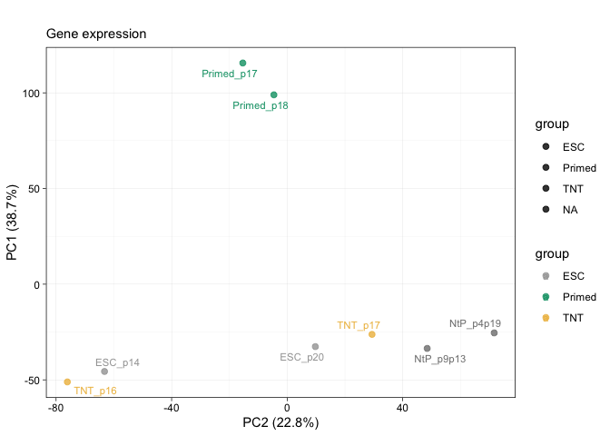

Figure 4 and associated extended data figures
================
Sam Buckberry
2023-07-13

``` r
source("R/project_functions.R")
```

    ## Loading required package: BiocGenerics

    ## 
    ## Attaching package: 'BiocGenerics'

    ## The following objects are masked from 'package:stats':
    ## 
    ##     IQR, mad, sd, var, xtabs

    ## The following objects are masked from 'package:base':
    ## 
    ##     anyDuplicated, append, as.data.frame, basename, cbind, colnames,
    ##     dirname, do.call, duplicated, eval, evalq, Filter, Find, get, grep,
    ##     grepl, intersect, is.unsorted, lapply, Map, mapply, match, mget,
    ##     order, paste, pmax, pmax.int, pmin, pmin.int, Position, rank,
    ##     rbind, Reduce, rownames, sapply, setdiff, sort, table, tapply,
    ##     union, unique, unsplit, which.max, which.min

    ## Welcome to Bioconductor
    ## 
    ##     Vignettes contain introductory material; view with
    ##     'browseVignettes()'. To cite Bioconductor, see
    ##     'citation("Biobase")', and for packages 'citation("pkgname")'.

    ## Loading required package: ggplot2

    ## Loading required package: lattice

    ## Loading required package: GenomicRanges

    ## Loading required package: stats4

    ## Loading required package: S4Vectors

    ## 
    ## Attaching package: 'S4Vectors'

    ## The following objects are masked from 'package:base':
    ## 
    ##     expand.grid, I, unname

    ## Loading required package: IRanges

    ## Loading required package: GenomeInfoDb

    ## Loading required package: SummarizedExperiment

    ## Loading required package: MatrixGenerics

    ## Loading required package: matrixStats

    ## 
    ## Attaching package: 'matrixStats'

    ## The following objects are masked from 'package:Biobase':
    ## 
    ##     anyMissing, rowMedians

    ## 
    ## Attaching package: 'MatrixGenerics'

    ## The following objects are masked from 'package:matrixStats':
    ## 
    ##     colAlls, colAnyNAs, colAnys, colAvgsPerRowSet, colCollapse,
    ##     colCounts, colCummaxs, colCummins, colCumprods, colCumsums,
    ##     colDiffs, colIQRDiffs, colIQRs, colLogSumExps, colMadDiffs,
    ##     colMads, colMaxs, colMeans2, colMedians, colMins, colOrderStats,
    ##     colProds, colQuantiles, colRanges, colRanks, colSdDiffs, colSds,
    ##     colSums2, colTabulates, colVarDiffs, colVars, colWeightedMads,
    ##     colWeightedMeans, colWeightedMedians, colWeightedSds,
    ##     colWeightedVars, rowAlls, rowAnyNAs, rowAnys, rowAvgsPerColSet,
    ##     rowCollapse, rowCounts, rowCummaxs, rowCummins, rowCumprods,
    ##     rowCumsums, rowDiffs, rowIQRDiffs, rowIQRs, rowLogSumExps,
    ##     rowMadDiffs, rowMads, rowMaxs, rowMeans2, rowMedians, rowMins,
    ##     rowOrderStats, rowProds, rowQuantiles, rowRanges, rowRanks,
    ##     rowSdDiffs, rowSds, rowSums2, rowTabulates, rowVarDiffs, rowVars,
    ##     rowWeightedMads, rowWeightedMeans, rowWeightedMedians,
    ##     rowWeightedSds, rowWeightedVars

    ## The following object is masked from 'package:Biobase':
    ## 
    ##     rowMedians

    ## 
    ## Attaching package: 'magrittr'

    ## The following object is masked from 'package:GenomicRanges':
    ## 
    ##     subtract

    ## 
    ## Attaching package: 'data.table'

    ## The following object is masked from 'package:SummarizedExperiment':
    ## 
    ##     shift

    ## The following object is masked from 'package:GenomicRanges':
    ## 
    ##     shift

    ## The following object is masked from 'package:IRanges':
    ## 
    ##     shift

    ## The following objects are masked from 'package:S4Vectors':
    ## 
    ##     first, second

    ## Loading required package: BSgenome

    ## Loading required package: Biostrings

    ## Loading required package: XVector

    ## 
    ## Attaching package: 'Biostrings'

    ## The following object is masked from 'package:base':
    ## 
    ##     strsplit

    ## Loading required package: rtracklayer

    ## Loading required package: AnnotationDbi

    ## 
    ## Attaching package: 'ggthemes'

    ## The following object is masked from 'package:cowplot':
    ## 
    ##     theme_map

    ## Loading required package: Rsamtools

    ## 
    ## Attaching package: 'VariantAnnotation'

    ## The following object is masked from 'package:stringr':
    ## 
    ##     fixed

    ## The following object is masked from 'package:base':
    ## 
    ##     tabulate

    ## 
    ## Attaching package: 'ChIPpeakAnno'

    ## The following object is masked from 'package:VariantAnnotation':
    ## 
    ##     info

    ## 
    ## Attaching package: 'gtools'

    ## The following object is masked from 'package:e1071':
    ## 
    ##     permutations

    ## 
    ## Attaching package: 'UpSetR'

    ## The following object is masked from 'package:lattice':
    ## 
    ##     histogram

    ## Loading required package: limma

    ## 
    ## Attaching package: 'limma'

    ## The following object is masked from 'package:BiocGenerics':
    ## 
    ##     plotMA

    ## Loading required package: grid

    ## 
    ## Attaching package: 'grid'

    ## The following object is masked from 'package:Biostrings':
    ## 
    ##     pattern

## PCA Plots of all omics assays

``` r
########################
# PCA plots ---------------------------------------------------------------
########################


plot_pca_2 <- function(mat, mdat, scale=FALSE){
    
    # Remove incomplete cases
    mat <- mat[complete.cases(mat), ]
    
    # Transpose
    mat <- t(mat)
    
    # Remove low variance features
    lowVar <- nearZeroVar(mat, saveMetrics = TRUE)
    message(str_c("Low variance features removed = ", sum(lowVar$nzv)))
    mat <- mat[ ,!lowVar$nzv]
    
    # Calculate PC's
    pr <- prcomp(x = mat, scale.=scale)
    pc1 <- (summary(pr)$importance[2, 1] * 100) %>% round(digits = 1)
    pc2 <- (summary(pr)$importance[2, 2] * 100) %>% round(digits = 1)
    #pc3 <- (summary(pr)$importance[2, 3] * 100) %>% round(digits = 2)
    
    pc1_dat <- pr$x[ ,1]
    pc2_dat <- pr$x[ ,2]
    #pc3_dat <- pr$x[ ,3]
    samples <- rownames(pr$x)
    
    pca_df <- data.frame(Sample=samples, PC1=pc1_dat, PC2=pc2_dat)
    
    ind <- match(pca_df$Sample, mdat$Manuscript.Name)
    pca_df$group <- factor(mdat$State[ind], levels=c("ESC", "Primed", "TNT", "NtP"))
    
    gg_pca <-  ggplot(data = pca_df,
                      mapping = aes(x = PC2, y = PC1, label=Sample,
                                    fill=group, colour=group)) +
        geom_point(alpha=0.8, size=2) +
        theme_linedraw() +
        theme(panel.grid = element_line(colour = 'grey')) +
        scale_color_manual(values = reprog_pal2) +
        geom_text_repel(data = subset(pca_df, samples %in% samples),
                        point.padding = unit(1, "lines"), size=3) +
        xlab(str_c("PC2 (", pc2, "%)")) +
        ylab(str_c("PC1 (", pc1, "%)"))
    gg_pca
}
```

CG methylation PCA

``` r
# DNA methylation ---------------------------------------------------------

### Load the meta-data
mdat_wgbs <- read.csv(file = "wgbs/metadata/wgbs_metadata_local.csv")
mdat_wgbs <- mdat_wgbs[mdat_wgbs$Background == "MEL1", ]
mdat_wgbs <- mdat_wgbs[mdat_wgbs$Library_id != "RL2352_merge", ]

mdat_wgbs$CG_bsobj_local <- str_c("wgbs/CG_bsobj/", basename(mdat_wgbs$BSseq_CG))
lapply(mdat_wgbs$CG_bsobj_local, file.exists)
```

    ## [[1]]
    ## [1] TRUE
    ## 
    ## [[2]]
    ## [1] TRUE
    ## 
    ## [[3]]
    ## [1] TRUE
    ## 
    ## [[4]]
    ## [1] TRUE
    ## 
    ## [[5]]
    ## [1] TRUE
    ## 
    ## [[6]]
    ## [1] TRUE
    ## 
    ## [[7]]
    ## [1] TRUE
    ## 
    ## [[8]]
    ## [1] TRUE
    ## 
    ## [[9]]
    ## [1] TRUE
    ## 
    ## [[10]]
    ## [1] TRUE

``` r
# Cluster by regulatory element mCG
enh_dat <- read.table(file = "resources/hg19_USCS_geneHancerClusteredInteractionsDoubleElite.txt")
enh_gr <- GRanges(seqnames = enh_dat$V9, ranges = IRanges(start = enh_dat$V10,
                                                          end = enh_dat$V11))

summary(width(enh_gr))
```

    ##    Min. 1st Qu.  Median    Mean 3rd Qu.    Max. 
    ##       2    1408    2574    3602    4446   86254

``` r
enh_gr <- enh_gr[width(enh_gr) >= 25]

enh_mcg <- make_mC_matrix(obj_fls = mdat_wgbs$BSseq_CG[mdat_wgbs$Media == "E8"],
                                                     gr = enh_gr, cores = 3)
```

    ## Making matrix of mC levels for regions...

``` r
colnames(enh_mcg) <- mdat_wgbs$Manuscript.Name[mdat_wgbs$Media == "E8"]

enh_cg_pca <- plot_pca_2(mat = enh_mcg, mdat = mdat_wgbs, scale = FALSE)
```

    ## Low variance features removed = 21

``` r
enh_cg_pca <- enh_cg_pca + ggtitle("", subtitle = "mCG: regulatory elements")
enh_cg_pca
```

<!-- -->

``` r
wb_fig4 <- openxlsx::createWorkbook()
openxlsx::addWorksheet(wb_fig4, sheetName = "Fig_4b_mCG")
openxlsx::writeData(wb = wb_fig4, sheet = "Fig_4b_mCG",
                    x = enh_cg_pca$data)
```

CH methylation PCA

``` r
################################################
### PCA plot of mCA (Run on server) 
# source activate mypython3
# R
# 
# library(bsseq)
# library(BSgenome.Hsapiens.UCSC.hg19)
# library(magrittr)
# library(stringr)
# 
# mdat_wgbs <- read.csv(file = "wgbs/metadata/wgbs_paths_peb_servers.csv")
# mdat_wgbs <- mdat_wgbs[mdat_wgbs$donor == "MEL1", ]
# mdat_wgbs <- mdat_wgbs[mdat_wgbs$media == "E8", ]
# lapply(mdat_wgbs$CA_bsobj, file.exists)
# 
# tile_50kb <- tileGenome(seqlengths = seqinfo(BSgenome.Hsapiens.UCSC.hg19),
#                        tilewidth=50000, cut.last.tile.in.chrom=TRUE)
# 
# tile_50kb <- tile_50kb[seqnames(tile_50kb) %in% str_c("chr", c(1:22))]
# 
# read_bs_obj <- function(rds_path){
#     stopifnot(file.exists(rds_path))
#     message(str_c("Reading ", rds_path))
#     message(Sys.time())
#     bs_obj <- readRDS(file = rds_path)
# 
#     return(bs_obj)
# }
# 
# 
# calc_mC_window <- function(rds_path, gr){
# 
#     message(str_c("Reading ", rds_path, " ", Sys.time()))
#     bs_obj <- read_bs_obj(rds_path)
# 
#     message("Calculating coverage...")
#     gr$Cov <- getCoverage(BSseq = bs_obj, regions = gr, type = "Cov",
#                           what = "perRegionTotal")
# 
#     message("Calculating M...")
#     gr$M <- getCoverage(BSseq = bs_obj, regions = gr, type = "M",
#                         what = "perRegionTotal")
# 
#     message("Calculating methylation percentage...")
#     gr$pc <- gr$M / gr$Cov
# 
#     return(gr)
# }
# 
# # Calculate mC levels (%) for ranges from a list of bs_seq objects. Returns matrix.
# make_mC_matrix <- function(obj_fls, gr, cores=1){
# 
#     grl <- mclapply(X = obj_fls, FUN = calc_mC_window, gr = gr, mc.cores = cores) %>%
#         GRangesList()
# 
#     loci <- str_c(seqnames(grl[[1]]), start(grl[[1]]), sep = ":") %>%
#         str_c(end(grl[[1]]), sep = "-")
# 
#     get_mC <- function(x){
#         mC <- grl[[x]]$pc %>% c()
#         return(mC)
#     }
# 
#     message("Making matrix of mC levels for regions...")
#     dat <- lapply(X = 1:length(grl), FUN = get_mC)
#     dat <- do.call(cbind, dat)
#     colnames(dat) <- basename(obj_fls)
# 
#     rownames(dat) <- loci
# 
#     return(dat)
# }
# 
# mCA_50kb <- make_mC_matrix(mdat_wgbs$CA_bsobj, tile_50kb, cores = 8)
# 
# # Calculate mCA non-conversion
# correct_nc <- function(obj_fl){
# 
#     bs_obj <- readRDS(obj_fl)
# 
#     nc_obj <- chrSelectBSseq(BSseq = bs_obj, seqnames = "chrL")
#     nc_cov <- getCoverage(BSseq = nc_obj, type = "Cov",
#                           what = "perBase")
#     nc_m <- getCoverage(BSseq = nc_obj, type = "M",
#                         what = "perBase")
# 
#     nc_rate <- sum(nc_m) / sum(nc_cov)
# 
#     return(nc_rate)
# }
# 
# nc_rates <- mclapply(mdat_wgbs$CA_bsobj, correct_nc, mc.cores = 8)
# nc_rates <- unlist(nc_rates)
# names(nc_rates) <- basename(mdat_wgbs$CA_bsobj)
# 
# # Subtract non-conversion from window mCA
# subtract_nc <- function(id){
# 
#     dat <- mCA_50kb[ ,id]
#     dat <- dat - nc_rates[id]
#     dat[dat < 0] <- 0
#     return(dat)
# }
# 
# mCA_50kb_nc_corrected <- lapply(basename(mdat_wgbs$CA_bsobj), subtract_nc)
# mCA_50kb_nc_corrected <- do.call(cbind, mCA_50kb_nc_corrected)
# 
# colnames(mCA_50kb_nc_corrected) <- basename(mdat_wgbs$CA_bsobj)
# 
# saveRDS(mCA_50kb_nc_corrected, file = "wgbs/processed_data/MEL1_50kb_tile_mCA.Rds")
# 

mCA_50kb <- readRDS("wgbs/processed_data/MEL1_50kb_tile_mCA.Rds")

mCA_ind <- match(colnames(mCA_50kb), basename(mdat_wgbs$BSseq_CA))

all(colnames(mCA_50kb) == basename(mdat_wgbs$BSseq_CA)[mCA_ind])
```

    ## [1] TRUE

``` r
colnames(mCA_50kb) <- mdat_wgbs$Manuscript.Name[mCA_ind]

mCA_50kb <- mCA_50kb[complete.cases(mCA_50kb), ]
dim(mCA_50kb)
```

    ## [1] 53905     8

``` r
mCA_50kb <- mCA_50kb[rowSums(mCA_50kb) != 0, ]
dim(mCA_50kb)
```

    ## [1] 53905     8

``` r
# Normalise to account for global mCA differences between samples
mCA_50kb_norm <- normalizeBetweenArrays(mCA_50kb, method = "quantile")

mCA_pca <- plot_pca_2(mCA_50kb_norm, mdat_wgbs, scale = FALSE)
```

    ## Low variance features removed = 0

``` r
mCA_pca <- mCA_pca + ggtitle(label = "", subtitle = "mCA: 50kb windows")

mCA_pca
```

<!-- -->

``` r
openxlsx::addWorksheet(wb_fig4, sheetName = "Fig_4b_mCA")
openxlsx::writeData(wb = wb_fig4, sheet = "Fig_4b_mCA",
                    x = mCA_pca$data)
```

ATAC-seq PCA

``` r
# ATAC-seq ----------------------------------------------------------------

# Read ATAC metadata
mdat_atac <- read.csv("atac/atac_metadata.csv")
colnames(mdat_atac)[colnames(mdat_atac)=="group"] <- "State"
mdat_atac$Manuscript.Name <- mdat_atac$id

# Read ATAC counts matrix
dat_atac <- read.table("atac/psc_peaks.narrowPeak.counts.txt.gz")
colnames(dat_atac) <- str_sub(colnames(dat_atac), start = 1, end = 6)
dat_atac <- dat_atac[ ,colnames(dat_atac) %in% mdat_atac$library]

# Remove chrY data
dat_atac <- dat_atac[!grepl("chrY", rownames(dat_atac)), ]

ind <- match(mdat_atac$library, colnames(dat_atac))
dat_atac <- dat_atac[ ,ind]

# Check metadata and data match order
stopifnot(all(colnames(dat_atac) == mdat_atac$library))
colnames(dat_atac) <- mdat_atac$Manuscript.Name


# Filter and normalise counts matrix

atac_design <- model.matrix(~mdat_atac$State)

# Filter low counts
atac_keep <- filterByExpr(dat_atac, design = atac_design)
table(atac_keep)
```

    ## atac_keep
    ##  FALSE   TRUE 
    ##  38969 231282

``` r
dat_atac <- dat_atac[atac_keep, ]

# normalise and split the data by genes and TE's for plotting
atac_norm <- voom(dat_atac, normalize.method = "quantile")
atac_norm <- atac_norm$E

### PCA plot of ATAC

atac_pca <- plot_pca_2(mat = atac_norm, mdat = mdat_atac, scale = FALSE)
```

    ## Low variance features removed = 0

``` r
atac_pca <- atac_pca + ggtitle("", "ATAC-seq")

atac_pca
```

<!-- -->

``` r
openxlsx::addWorksheet(wb_fig4, sheetName = "Fig_4b_atac")
openxlsx::writeData(wb = wb_fig4, sheet = "Fig_4b_atac",
                    x = atac_pca$data)
```

RNA-seq PCA

``` r
# Load the RNA metadata
mdat_rna <- fread("RNAseq/polyA_RNAseq_sample_table.csv")
mdat_rna$model_group <- str_c(mdat_rna$Group, mdat_rna$Donor, sep = "_")

# List the counts tables for all samples
cnt_files <- list.files(path = "RNAseq/polyA/MEL1_gene_te_counts/",
                        full.names = TRUE)

# Load the count data
dat2 <- lapply(cnt_files, read.table, header = TRUE, row.names = 1) %>% 
    do.call(cbind, .)
libs <- colnames(dat2) %>% str_sub(start = 1, end = 6)
colnames(dat2) <- libs

# Match the metadata with the count data
ind <- match(colnames(dat2), mdat_rna$Library)
mdat_rna <- mdat_rna[ind, ]
all(colnames(dat2) == mdat_rna$Library)
```

    ## [1] TRUE

``` r
# Just keep the cells in E8 for this part of the analysis
dat2 <- dat2[ ,mdat_rna$Media == "E8"]
mdat_rna <- mdat_rna[mdat_rna$Media == "E8", ]
all(colnames(dat2) == mdat_rna$Library)
```

    ## [1] TRUE

``` r
colnames(dat2) <- mdat_rna$Manuscript.Name

design <- model.matrix(~mdat_rna$group)

# Filter low counts
keep <- filterByExpr(dat2, design = design)
dat2 <- dat2[keep, ]

# normalise and split the data by genes and TE's for plotting
dat_norm <- voom(dat2, normalize.method = "quantile")
is_te <- grepl(pattern = ":", x = rownames(dat2))

mdat_rna$State <- mdat_rna$Group
```

``` r
### PCA plot of genes
gene_pca <- plot_pca_2(mat = dat_norm$E[!is_te, ], mdat = mdat_rna, scale = FALSE)
```

    ## Low variance features removed = 0

``` r
gene_pca <- gene_pca + ggtitle(label = "", subtitle = "Gene expression")
gene_pca
```

<!-- -->

``` r
openxlsx::addWorksheet(wb_fig4, sheetName = "Fig_4b_gene")
openxlsx::writeData(wb = wb_fig4, sheet = "Fig_4b_gene",
                    x = gene_pca$data)
```

``` r
### PCA plot of TE's
te_pca <- plot_pca_2(mat = dat_norm$E[is_te, ], mdat = mdat_rna, scale = FALSE)
```

    ## Low variance features removed = 0

``` r
te_pca <- te_pca + ggtitle("", "TE expression")
te_pca
```

<!-- -->

``` r
openxlsx::addWorksheet(wb_fig4, sheetName = "Fig_4b_te")
openxlsx::writeData(wb = wb_fig4, sheet = "Fig_4b_te",
                    x = te_pca$data)
```

H3K9me3 ChIP-seq

``` r
# ChIP-seq ----------------------------------------------------------------


### PCA plot of H3K9me3

mdat_k9 <- read.csv(file = "ChIPseq/H3K9me3_MEL1_chip_metadata.csv")

H3K9me3_10kb <- fread("ChIPseq/processed_data/MEL1_H3K9me3_10kb_bin_counts.txt")
H3K9me3_10kb <- H3K9me3_10kb[ ,-c(1:3)]
dim(H3K9me3_10kb)
```

    ## [1] 308172      7

``` r
colnames(H3K9me3_10kb) <- colnames(H3K9me3_10kb) %>% str_sub(start = 2, end = 7)

#ind <- match(colnames(H3K9me3_10kb), mdat_k9$library)
stopifnot(all(colnames(H3K9me3_10kb) == mdat_k9$library))
colnames(H3K9me3_10kb) <- mdat_k9$label

H3K9me3_10kb <- H3K9me3_10kb[complete.cases(H3K9me3_10kb), ]

k9_cpm <- edgeR::cpm(H3K9me3_10kb, log=TRUE)
#boxplot(k9_cpm)

k9_norm <- normalizeBetweenArrays(k9_cpm, method = "quantile")
dim(k9_norm)
```

    ## [1] 308172      7

``` r
mdat_k9$State <- mdat_k9$group
mdat_k9$Manuscript.Name <- mdat_k9$label

k9_pca <- plot_pca_2(k9_norm[ ,-c(1,7)], mdat = mdat_k9, scale = FALSE)
```

    ## Low variance features removed = 23129

``` r
k9_pca <- k9_pca + ggtitle("", "H3K9me3 ChIP-seq")
k9_pca
```

<!-- -->

``` r
openxlsx::addWorksheet(wb_fig4, sheetName = "Fig_4b_k9")
openxlsx::writeData(wb = wb_fig4, sheet = "Fig_4b_k9",
                    x = k9_pca$data)
```

Combine plots for manuscript

``` r
# Combine PCA plots of all genomics assays --------------------------------


cp <- cowplot::plot_grid(enh_cg_pca + theme(legend.position = "None") + sams_pub_theme(x.text.angle = 0),
                   mCA_pca + theme(legend.position = "None") + sams_pub_theme(x.text.angle = 0),
                   gene_pca + theme(legend.position = "None") + sams_pub_theme(x.text.angle = 0),
                   te_pca + theme(legend.position = "None") + sams_pub_theme(x.text.angle = 0),
                   atac_pca + theme(legend.position = "None") + sams_pub_theme(x.text.angle = 0),
                   k9_pca + theme(legend.position = "None") + sams_pub_theme(x.text.angle = 0),
                   nrow = 3, align = "hv")
```

    ## Warning: The `size` argument of `element_line()` is deprecated as of ggplot2 3.4.0.
    ## ℹ Please use the `linewidth` argument instead.

``` r
pdf("manuscript_figure_plots/all_MEL1_assay_pca.pdf", height = 5, width = 3)
cp
```

    ## Warning: ggrepel: 1 unlabeled data points (too many overlaps). Consider
    ## increasing max.overlaps

    ## Warning: ggrepel: 6 unlabeled data points (too many overlaps). Consider
    ## increasing max.overlaps

``` r
dev.off()
```

    ## quartz_off_screen 
    ##                 2

``` r
cp
```

    ## Warning: ggrepel: 3 unlabeled data points (too many overlaps). Consider
    ## increasing max.overlaps

<!-- -->

## CG DMRs

``` r
### CG-DMR plots

# Read the DMR files and filter
dmr_fls <- list.files(path = "wgbs/dmrs/MEL1_dmrs/dmr_out", full.names = TRUE)

### Load the meta-data
mdat_wgbs <- read.csv(file = "wgbs/metadata/wgbs_metadata_local.csv")
mdat_wgbs <- mdat_wgbs[mdat_wgbs$Background == "MEL1", ]
stopifnot(all(file.exists(mdat_wgbs$BSseq_CG)))

read_dmr <- function(dmr_rds){
    
    dmr <- readRDS(dmr_rds)
    dmr_gr <- dmr$dmr_granges
    dmr_gr$contrast <- unique(dmr$manifest_data$group) %>% paste(collapse = "_vs_") 
    
    # drop chrY dmrs
    dmr_gr <- dmr_gr[!seqnames(dmr_gr) %in% "chrY"]
    
    groups <- unique(dmr$manifest_data$group)
    g1_libs <- dmr$manifest_data$id[dmr$manifest_data$group %in% groups[1]]
    g2_libs <- dmr$manifest_data$id[dmr$manifest_data$group %in% groups[2]]
    
    g1_mCG <- make_mC_matrix(obj_fls = mdat_wgbs$BSseq_CG[mdat_wgbs$Library_id %in% g1_libs], 
                             gr=dmr_gr, cores = 2)
    g2_mCG <- make_mC_matrix(obj_fls = mdat_wgbs$BSseq_CG[mdat_wgbs$Library_id %in% g2_libs], 
                             gr=dmr_gr, cores = 2)
    delta_mCG <- rowMeans(g2_mCG)  - rowMeans(g1_mCG)
    
    dmr_gr$delta <- delta_mCG
    
    return(dmr_gr)
}

dmr_grl <- lapply(dmr_fls, read_dmr)
```

    ## Making matrix of mC levels for regions...
    ## Making matrix of mC levels for regions...
    ## Making matrix of mC levels for regions...
    ## Making matrix of mC levels for regions...
    ## Making matrix of mC levels for regions...
    ## Making matrix of mC levels for regions...

``` r
names(dmr_grl) <- basename(dmr_fls) %>% str_remove(pattern = "_dmrseq_dmrs.Rds")

filter_dmr <- function(x, fdr=0.05, delta=0.2){
    
    dmr_gr <- dmr_grl[[x]]
    dmr_gr <- dmr_gr[(dmr_gr$qval < delta) & 
                         (abs(dmr_gr$delta) >= delta)]
    return(dmr_gr)
}

dmr_filt <- lapply(1:3, filter_dmr)

# Get DMR counts for hyper and hypo methylation for each comparison to ESCs
get_dmr_counts <- function(x){
    dmr_gr <- dmr_filt[[x]]
    contrast <- unique(dmr_gr$contrast) %>% str_remove("esc_vs_")
    up_count <- length(dmr_gr[dmr_gr$delta > 0])
    down_count <- length(dmr_gr[dmr_gr$delta < 0])
    df <- data.frame(group=contrast, hyper_dmr=up_count, hypo_dmr=down_count)
    return(df)
}

dmr_df <- lapply(1:3, get_dmr_counts) %>% do.call(rbind, .)

dmr_df$group[dmr_df$group == "primed"] <- "Primed"
dmr_df$group[dmr_df$group == "tnt"] <- "TNT"
dmr_df$group[dmr_df$group == "ntp"] <- "NtP"

dmr_df$group <- factor(dmr_df$group, levels=c("Primed", "TNT", "NtP"))
dmr_df <- reshape2::melt(dmr_df)
```

    ## Using group as id variables

``` r
gg_dmr <- ggplot(dmr_df, aes(x = group, y = value, fill=group)) +
    geom_col() +
    facet_grid(.~variable) +
    scale_fill_manual(values = reprog_pal2) +
    ylab("DMR count") + 
    sams_pub_theme()

gg_dmr
```

<!-- -->

``` r
openxlsx::addWorksheet(wb_fig4, sheetName = "Fig_4d_dmr")
openxlsx::writeData(wb = wb_fig4, sheet = "Fig_4d_dmr",
                    x = gg_dmr$data)
```

Write filtered DMRs to xlsx for supplementary data tables.

``` r
dmr_df_list <- lapply(dmr_filt, as.data.frame)

write.xlsx(x = dmr_df_list, file = "supplementary_tables/MEL1_CG_DMR_results.xlsx",
           append=TRUE, rowNames=FALSE, sheetName=names(dmr_grl))
```

Get the DMRs for enrichment testing

``` r
dmr_primed <- dmr_filt[[2]]
dmr_tnt <- dmr_filt[[3]]

dmr_primed_up <- dmr_primed[dmr_primed$delta > 0]
dmr_primed_up_corrected <- dmr_primed_up[!overlapsAny(dmr_primed_up, dmr_tnt)]

dmr_primed_down <- dmr_primed[dmr_primed$delta < 0]
dmr_primed_down_corrected <- dmr_primed_down[!overlapsAny(dmr_primed_down, dmr_tnt)]
```

Write the bed files

``` r
gr_to_bed(gr = dmr_primed_up,
          out_path = "wgbs/processed_data/MEL1_primed_CG_dmrs_hyper_all.bed")

gr_to_bed(gr = dmr_primed_up_corrected,
          out_path = "wgbs/processed_data/MEL1_primed_CG_dmrs_hyper_corrected.bed")

gr_to_bed(gr = dmr_primed_down,
          out_path = "wgbs/processed_data/MEL1_primed_CG_dmrs_hypo_all.bed")

gr_to_bed(gr = dmr_primed_down_corrected,
          out_path = "wgbs/processed_data/MEL1_primed_CG_dmrs_hypo_corrected.bed")
```

### ATAC peaks

``` r
atac_tt <- read.table("atac/MEL1_differential_atac_peak_table.txt.gz")
atac_tt <- atac_tt[atac_tt$significant == TRUE, ]

atac_df <- data.frame(group=atac_tt$contrast, direction=atac_tt$direction)
atac_df <- atac_df %>%  dplyr::group_by(group, direction) %>% dplyr::tally()

atac_df$group <- str_remove(atac_df$group, "group")
atac_df$group <- factor(atac_df$group, levels=c("Primed", "TNT", "NtP"))
atac_df$direction <- factor(atac_df$direction, levels=c("Up", "Down"))

gg_atac <- ggplot(atac_df, aes(x = group, y = n, fill=group)) +
    geom_col() +
    facet_grid(.~direction) +
    ylab("Differential ATAC peaks") + 
    scale_fill_manual(values = reprog_pal2) +
    sams_pub_theme()

gg_atac
```

<!-- -->

``` r
openxlsx::addWorksheet(wb_fig4, sheetName = "Fig_4d_atac")
openxlsx::writeData(wb = wb_fig4, sheet = "Fig_4d_atac",
                    x = gg_atac$data)
```

Write the bed files

``` r
atac_up <- atac_tt$loci[atac_tt$significant == TRUE &
                     atac_tt$contrast == "groupPrimed" &
                     atac_tt$direction == "Up"]

atac_up_gr <- GenomicRanges::GRanges(atac_up)

atac_down <- atac_tt$loci[atac_tt$significant == TRUE &
                     atac_tt$contrast == "groupPrimed" &
                     atac_tt$direction == "Down"]

atac_down_gr <- GenomicRanges::GRanges(atac_down)

gr_to_bed(gr = atac_up_gr,
          out_path = "atac/all_differential_peaks_primed_up.bed")

gr_to_bed(gr = atac_down_gr,
          out_path = "atac/all_differential_peaks_primed_down.bed")
```

### Gene expression

``` r
txdb <- makeTxDbFromGFF(file = "resources/genes.gtf.gz", format = "gtf")
```

    ## Import genomic features from the file as a GRanges object ... OK
    ## Prepare the 'metadata' data frame ... OK
    ## Make the TxDb object ... OK

``` r
genes_gr <- genes(txdb) 
```

    ##   643 genes were dropped because they have exons located on both strands
    ##   of the same reference sequence or on more than one reference sequence,
    ##   so cannot be represented by a single genomic range.
    ##   Use 'single.strand.genes.only=FALSE' to get all the genes in a
    ##   GRangesList object, or use suppressMessages() to suppress this message.

``` r
genes_chrY <- genes_gr[seqnames(genes_gr) == "chrY"]
chrY_genes <- genes_chrY$gene_id


get_gene_de <- function(contrast){
    
    de <- readxl::read_xlsx("RNAseq/processed_data/MEL1_differential_expression_results.xlsx",
                        sheet = contrast) %>% 
        data.frame()
    
    de$contrast <- contrast %>% str_remove("ESC_vs_")
    
    # remove the aggregagte TE id's
    de <- de[!grepl(":",de$...1), ]
    
    de <- de[!de$gene_id %in% chrY_genes, ]
    
    de$direction <- ifelse(de$logFC > 0, yes = "Down", no = "Up")
    de$significant <- (abs(de$logFC) > 1) & (de$FDR < 0.05) & (de$logCPM > 0)
    
    return(de)
}

cont_list <- c("ESC_vs_Primed", "ESC_vs_TNT", "ESC_vs_N2P")
gene_df <- lapply(cont_list, get_gene_de) %>% do.call(rbind, .)
```

    ## New names:
    ## New names:
    ## New names:
    ## • `` -> `...1`

``` r
head(gene_df)
```

    ##      ...1    logFC   logCPM       LR       PValue          FDR gene_id contrast
    ## 1 FAM19A5 9.695966 3.887493 316.4111 8.762878e-71 1.668715e-66 FAM19A5   Primed
    ## 2   MYH14 8.564752 4.377139 293.2762 9.609687e-66 9.149864e-62   MYH14   Primed
    ## 3   EMC10 6.720270 7.229709 236.5415 2.232747e-53 1.417273e-49   EMC10   Primed
    ## 4    MEG3 9.041480 5.864623 221.3289 4.640062e-50 2.209018e-46    MEG3   Primed
    ## 5   LARGE 8.421012 5.385102 199.6811 2.451469e-45 9.336665e-42   LARGE   Primed
    ## 6  LRRC4B 8.015258 2.855584 185.0863 3.758023e-42 1.192734e-38  LRRC4B   Primed
    ##   direction significant
    ## 1      Down        TRUE
    ## 2      Down        TRUE
    ## 3      Down        TRUE
    ## 4      Down        TRUE
    ## 5      Down        TRUE
    ## 6      Down        TRUE

``` r
gene_df_sig <- gene_df[gene_df$significant == TRUE, c("contrast", "direction")] %>%
    dplyr::group_by(contrast, direction) %>% dplyr::tally()

gene_df_sig$contrast[gene_df_sig$contrast == "N2P"] <- "NtP"
gene_df_sig$contrast <- factor(gene_df_sig$contrast, levels=c("Primed", "TNT", "NtP"))
gene_df_sig$direction <- factor(gene_df_sig$direction, levels=c("Up", "Down"))

gg_gene <- ggplot(gene_df_sig, aes(x = contrast, y = n, fill=contrast)) +
    geom_col() +
    facet_grid(.~direction) +
    scale_fill_manual(values = reprog_pal2) +
    ylab("Differential genes") + 
    sams_pub_theme()

gg_gene
```

<!-- -->

``` r
openxlsx::addWorksheet(wb_fig4, sheetName = "Fig_4d_gene")
openxlsx::writeData(wb = wb_fig4, sheet = "Fig_4d_gene",
                    x = gg_gene$data)
```

Make bed files

``` r
gene_down <- gene_df$gene_id[gene_df$contrast == "Primed" &
                                 gene_df$significant == TRUE &
                                 gene_df$direction == "Down"]

gene_up <- gene_df$gene_id[gene_df$contrast == "Primed" &
                                 gene_df$significant == TRUE &
                                 gene_df$direction == "Up"]

gene_down_gr <- genes_gr[genes_gr$gene_id %in% gene_down] %>%
    resize(width = 2000, fix = "start")

gene_up_gr <- genes_gr[genes_gr$gene_id %in% gene_up] %>%
    resize(width = 2000, fix = "start")

gr_to_bed(gene_up_gr, "RNAseq/processed_data/MEL1_primed_up_genes.bed")
gr_to_bed(gene_down_gr, "RNAseq/processed_data/MEL1_primed_down_genes.bed")
```

### TE expression

``` r
# Get the TE data, select for corrected and uncorrected TE's and make bed files for enrichment tests
te_de_dat <- read.table(file = "RNAseq/processed_data/MEL1_TE_differential_expression_results.txt")
te_de_dat <- te_de_dat[te_de_dat$significant == "Significant", ]
te_de_dat$Direction <- ifelse(te_de_dat$logFC > 0, yes = "Down", no = "Up")

te_df <- te_de_dat[ ,c("contrast", "Direction")] %>% dplyr::group_by(contrast, Direction) %>% dplyr::tally()

te_df$contrast <- str_remove(te_df$contrast, "ESC_vs_")
te_df <- te_df[te_df$contrast %in% c("Primed", "TNT", "N2P"), ]
te_df$contrast[te_df$contrast == "N2P"] <- "NtP"
te_df$contrast <- factor(te_df$contrast, levels=c("Primed", "TNT", "NtP"))
te_df$Direction <- factor(te_df$Direction, levels=c("Up", "Down"))

#pca_df$group <- factor(mdat$group[ind], levels=c("ESC", "Primed", "TNT", "NtP"))

gg_te <- ggplot(te_df, aes(x = contrast, y = n, fill=contrast)) +
    geom_col() +
    scale_fill_manual(values = reprog_pal2) +
    scale_colour_manual("grey") +
    facet_grid(.~Direction) +
    ylab("Differential TE's") + 
    sams_pub_theme()
gg_te
```

<!-- -->

``` r
openxlsx::addWorksheet(wb_fig4, sheetName = "Fig_4d_te")
openxlsx::writeData(wb = wb_fig4, sheet = "Fig_4d_te",
                    x = gg_te$data)
```

``` r
# Get the TE data, select for corrected and uncorrected TE's and make bed files for enrichment tests

te_tnt_gr <- te_de_dat[te_de_dat$significant == "Significant" &
                           te_de_dat$contrast == "ESC_vs_TNT", 1:3] %>% GRanges()

te_primed_up_gr <- te_de_dat[te_de_dat$significant == "Significant" &
                                 te_de_dat$Direction == "Up" &
                              te_de_dat$contrast == "ESC_vs_Primed", 1:3] %>% GRanges()

gr_to_bed(te_primed_up_gr, out_path = "RNAseq/processed_data/MEL1_primed_up_te.bed")

te_primed_down_gr <- te_de_dat[te_de_dat$significant == "Significant" &
                                 te_de_dat$Direction == "Down" &
                                 te_de_dat$contrast == "ESC_vs_Primed", 1:3] %>% GRanges()

gr_to_bed(te_primed_down_gr, out_path = "RNAseq/processed_data/MEL1_primed_down_te.bed")
```

### Combine bar plots

``` r
cowplot::plot_grid(gg_dmr, gg_gene, gg_te, gg_atac, nrow = 1, align = "h")
```

<!-- -->

``` r
pdf("manuscript_figure_plots/MEL1_figure_4_differential_feature_barplots.pdf",
    height = 1.5, width = 5)
cowplot::plot_grid(gg_dmr, gg_gene, gg_te, gg_atac, nrow = 1, align = "h")
dev.off()
```

    ## quartz_off_screen 
    ##                 2

``` r
pdf("manuscript_figure_plots/MEL1_figure_4_differential_feature_barplots_vertical.pdf",
    height = 5, width = 1.3)
cowplot::plot_grid(gg_dmr, gg_gene, gg_te, gg_atac, nrow = 4, align = "h")
dev.off()
```

    ## quartz_off_screen 
    ##                 2

## Perform enrichment tests

List of bed files

``` r
bed_list <- c("wgbs/processed_data/MEL1_primed_CG_dmrs_hyper_all.bed",
"wgbs/processed_data/MEL1_primed_CG_dmrs_hyper_corrected.bed",
"wgbs/processed_data/MEL1_primed_CG_dmrs_hypo_all.bed",
"wgbs/processed_data/MEL1_primed_CG_dmrs_hypo_corrected.bed",
"atac/all_differential_peaks_primed_up.bed",
"atac/all_differential_peaks_primed_down.bed",
"RNAseq/processed_data/MEL1_primed_up_genes.bed",
"RNAseq/processed_data/MEL1_primed_down_genes.bed",
"RNAseq/processed_data/MEL1_primed_up_te.bed",
"RNAseq/processed_data/MEL1_primed_down_te.bed")
```

Run the enrichment tests (on server, not run locally)

``` r
library(regioneR)
library(parallel)
library(BiocParallel)
library(BSgenome.Hsapiens.UCSC.hg19.masked)
source("R/server_libraries_and_functions.R")

# GRanges of genomic elements
all_elements_gr <- readRDS("resources/all_genomic_elements_granges_final.Rds")

CH_dat <- read_excel(path = "resources/nature13551-s3.xlsx")
CH_dmr <- GRanges(seqnames = CH_dat$chr,
                  ranges = IRanges(start = as.numeric(CH_dat$start),
                                   end = as.numeric(CH_dat$end)))

CH_dmr$class <- "CH_DMR" 

all_elements_gr <- c(all_elements_gr, CH_dmr)

# Granges of unmappable WGBS regions
#unmappable_gr <- bed_to_gr("resources/d0_d3_d7_merged_zero_coverage_regions.bed")

target_list <- c("CH_DMR", "Promoter", "Enhancer",  "LINE", "LTR",
                 "Fibroblast_LAD", "ESC_LAD", "Constitutive_LAD",
                 "Constitutive_H3K9me3", "ESC_H3K9me3", "Fibroblast_H3K9me3")


lapply(bed_list, file.exists) %>% unlist() %>% all()

test_bed <- bed_list[2]


test_element_enrichment <- function(target_element="CH_DMR", test_bed,
                                    permutations=200, cores=30, alt="auto"){
    
    stopifnot(file.exists(test_bed))
    gc()
    message(Sys.time())
    message(str_c("Running ", target_element, "..."))
    target_gr <- all_elements_gr[all_elements_gr$class == target_element]
    message(str_c("n = "), length(target_gr))
    
    test_gr <- bed_to_gr(test_bed)
    
    set.seed(123)
    perm_test_results <- regioneR::permTest(A=test_gr, B=target_gr,
                                            alternative = alt,
                                            randomize.function=regioneR::randomizeRegions,
                                            ntimes = permutations,
                                            evaluate.function=regioneR::numOverlaps,
                                            count.once = TRUE,
                                            genome="hg19", 
                                            allow.overlaps=FALSE,
                                            per.chromosome=TRUE,
                                            mc.cores=cores,
                                            mc.set.seed=FALSE,
                                            force.parallel=TRUE)
    
    lz <- localZScore(pt=perm_test_results, A=test_gr, B=target_gr,
                      step = mean(width(test_gr)/2),
                      window = 100000)
    
    results <- list(pt=perm_test_results, lz=lz, element=target_element, 
                    test_bed=test_bed)
    
    message("Done!")
    return(results)
}

test_bed_list <- function(bed_file){
    
        out <- str_replace(string = basename(bed_file), pattern = ".bed",
                           replacement = "_element_enrichments.Rds")
        out <- str_c("element_enrichments/", out)
        
        enrich_list <- lapply(target_list, test_element_enrichment,
                              test_bed=bed_file, 
                              permutations=200, cores=20)

        saveRDS(object = enrich_list, file = out)
}

mclapply(X = bed_list, FUN = test_bed_list, mc.cores = 2)
```

### Upset plot of all DE elements

``` r
library(readxl)
CH_dat <- read_excel(path = "resources/nature13551-s3.xlsx")
CH_dmr <- GRanges(seqnames = CH_dat$chr,
                  ranges = IRanges(start = as.numeric(CH_dat$start),
                                   end = as.numeric(CH_dat$end)))

CH_dmr$class <- "CH_DMR" 

bed_list <- c("wgbs/processed_data/MEL1_primed_CG_dmrs_hyper_all.bed",
#"wgbs/processed_data/MEL1_primed_CG_dmrs_hyper_corrected.bed",
"wgbs/processed_data/MEL1_primed_CG_dmrs_hypo_all.bed",
#"wgbs/processed_data/MEL1_primed_CG_dmrs_hypo_corrected.bed",
"atac/all_differential_peaks_primed_up.bed",
"atac/all_differential_peaks_primed_down.bed",
"RNAseq/processed_data/MEL1_primed_up_genes.bed",
"RNAseq/processed_data/MEL1_primed_down_genes.bed",
"RNAseq/processed_data/MEL1_primed_up_te.bed",
"RNAseq/processed_data/MEL1_primed_down_te.bed")

read_bed_and_class <- function(bed_path){
    gr <- bed_to_gr(bed_path = bed_path)
    gr$class <- basename(bed_path) %>% str_remove(".bed")
    return(gr)
}

de_element_gr_list <- lapply(bed_list, read_bed_and_class) %>% GRangesList()
names(de_element_gr_list) <- basename(bed_list) %>% str_remove(".bed")


de_element_gr_union <- de_element_gr_list %>% GRangesList() %>% unlist() %>% reduce()

hits <- lapply(1:length(de_element_gr_list),
               function(x){overlapsAny(query = de_element_gr_union,
                                       subject = de_element_gr_list[[x]]+1000)})

hits <- do.call(cbind, hits)
hits <- data.frame(hits + 0)
colnames(hits) <- names(de_element_gr_list)
rownames(hits) <- gr_to_loci(de_element_gr_union)
head(hits)
```

    ##                         MEL1_primed_CG_dmrs_hyper_all
    ## chr22:17913990-17915796                             0
    ## chr22:18592506-18593060                             1
    ## chr22:18593927-18594406                             1
    ## chr22:18922067-18924066                             0
    ## chr22:18934398-18935361                             0
    ## chr22:19701987-19703986                             0
    ##                         MEL1_primed_CG_dmrs_hypo_all
    ## chr22:17913990-17915796                            1
    ## chr22:18592506-18593060                            0
    ## chr22:18593927-18594406                            0
    ## chr22:18922067-18924066                            1
    ## chr22:18934398-18935361                            0
    ## chr22:19701987-19703986                            0
    ##                         all_differential_peaks_primed_up
    ## chr22:17913990-17915796                                0
    ## chr22:18592506-18593060                                0
    ## chr22:18593927-18594406                                0
    ## chr22:18922067-18924066                                0
    ## chr22:18934398-18935361                                0
    ## chr22:19701987-19703986                                0
    ##                         all_differential_peaks_primed_down MEL1_primed_up_genes
    ## chr22:17913990-17915796                                  0                    0
    ## chr22:18592506-18593060                                  0                    0
    ## chr22:18593927-18594406                                  0                    0
    ## chr22:18922067-18924066                                  0                    1
    ## chr22:18934398-18935361                                  0                    0
    ## chr22:19701987-19703986                                  0                    1
    ##                         MEL1_primed_down_genes MEL1_primed_up_te
    ## chr22:17913990-17915796                      0                 0
    ## chr22:18592506-18593060                      0                 0
    ## chr22:18593927-18594406                      0                 0
    ## chr22:18922067-18924066                      0                 0
    ## chr22:18934398-18935361                      0                 1
    ## chr22:19701987-19703986                      0                 0
    ##                         MEL1_primed_down_te
    ## chr22:17913990-17915796                   0
    ## chr22:18592506-18593060                   0
    ## chr22:18593927-18594406                   0
    ## chr22:18922067-18924066                   0
    ## chr22:18934398-18935361                   0
    ## chr22:19701987-19703986                   0

``` r
upset(hits, order.by = "freq", nsets = length(de_element_gr_list))
```

<!-- -->

``` r
hits[hits$MEL1_primed_CG_dmrs_hypo_all == 1 &
         hits$MEL1_primed_up_te == 1, ]
```

    ##                           MEL1_primed_CG_dmrs_hyper_all
    ## chr19:54335118-54340780                               0
    ## chr5:23231905-23233590                                0
    ## chr5:23233643-23236892                                0
    ## chr5:106314192-106320077                              0
    ## chr5:126176729-126181603                              0
    ## chr5:147249911-147254229                              0
    ## chr1:81711231-81714673                                0
    ## chr1:114574407-114578572                              0
    ## chr1:213083817-213086586                              0
    ## chr1:213087542-213088023                              0
    ## chr1:223197223-223199436                              0
    ## chr1:223199439-223203247                              0
    ## chr6:18754141-18760176                                0
    ## chr6:98227733-98230931                                0
    ## chr6:114743472-114749008                              0
    ## chr6:126025196-126028858                              0
    ## chr6:131615159-131619148                              0
    ## chr6:132223146-132226370                              0
    ## chr6:132226863-132227525                              0
    ## chr2:64480032-64483998                                0
    ## chr2:64484331-64484780                                0
    ## chr2:188898551-188901345                              0
    ## chr2:207673900-207677570                              0
    ## chr12:14859214-14859414                               0
    ## chr12:14859827-14860709                               0
    ## chr12:59716969-59722412                               0
    ## chr20:38896480-38902467                               0
    ## chr20:38902572-38903401                               0
    ## chr7:100945667-100947719                              0
    ## chr9:90022543-90029877                                0
    ## chr9:90029883-90030544                                0
    ## chr9:93174849-93178258                                0
    ## chr9:96109812-96113435                                0
    ## chr9:96113440-96114584                                0
    ## chr9:99977250-99980517                                0
    ## chr9:118603797-118607581                              0
    ## chr8:133094797-133098218                              0
    ## chr4:93362066-93365352                                0
    ## chr4:120914830-120920716                              0
    ## chr4:167636521-167642546                              0
    ## chr3:112137551-112141707                              0
    ## chr3:112141761-112142212                              0
    ## chr13:54840980-54844397                               0
    ## chr11:118592691-118600392                             0
    ## chr16:9765418-9770676                                 0
    ## chr16:13448753-13451867                               0
    ## chr16:65263708-65264537                               0
    ## chr16:65264686-65269848                               0
    ## chrX:86936654-86944387                                0
    ## chrX:92079882-92082893                                0
    ## chrX:92083666-92085158                                0
    ## chrX:93955639-93959841                                0
    ## chrX:115946423-115952842                              0
    ##                           MEL1_primed_CG_dmrs_hypo_all
    ## chr19:54335118-54340780                              1
    ## chr5:23231905-23233590                               1
    ## chr5:23233643-23236892                               1
    ## chr5:106314192-106320077                             1
    ## chr5:126176729-126181603                             1
    ## chr5:147249911-147254229                             1
    ## chr1:81711231-81714673                               1
    ## chr1:114574407-114578572                             1
    ## chr1:213083817-213086586                             1
    ## chr1:213087542-213088023                             1
    ## chr1:223197223-223199436                             1
    ## chr1:223199439-223203247                             1
    ## chr6:18754141-18760176                               1
    ## chr6:98227733-98230931                               1
    ## chr6:114743472-114749008                             1
    ## chr6:126025196-126028858                             1
    ## chr6:131615159-131619148                             1
    ## chr6:132223146-132226370                             1
    ## chr6:132226863-132227525                             1
    ## chr2:64480032-64483998                               1
    ## chr2:64484331-64484780                               1
    ## chr2:188898551-188901345                             1
    ## chr2:207673900-207677570                             1
    ## chr12:14859214-14859414                              1
    ## chr12:14859827-14860709                              1
    ## chr12:59716969-59722412                              1
    ## chr20:38896480-38902467                              1
    ## chr20:38902572-38903401                              1
    ## chr7:100945667-100947719                             1
    ## chr9:90022543-90029877                               1
    ## chr9:90029883-90030544                               1
    ## chr9:93174849-93178258                               1
    ## chr9:96109812-96113435                               1
    ## chr9:96113440-96114584                               1
    ## chr9:99977250-99980517                               1
    ## chr9:118603797-118607581                             1
    ## chr8:133094797-133098218                             1
    ## chr4:93362066-93365352                               1
    ## chr4:120914830-120920716                             1
    ## chr4:167636521-167642546                             1
    ## chr3:112137551-112141707                             1
    ## chr3:112141761-112142212                             1
    ## chr13:54840980-54844397                              1
    ## chr11:118592691-118600392                            1
    ## chr16:9765418-9770676                                1
    ## chr16:13448753-13451867                              1
    ## chr16:65263708-65264537                              1
    ## chr16:65264686-65269848                              1
    ## chrX:86936654-86944387                               1
    ## chrX:92079882-92082893                               1
    ## chrX:92083666-92085158                               1
    ## chrX:93955639-93959841                               1
    ## chrX:115946423-115952842                             1
    ##                           all_differential_peaks_primed_up
    ## chr19:54335118-54340780                                  0
    ## chr5:23231905-23233590                                   0
    ## chr5:23233643-23236892                                   0
    ## chr5:106314192-106320077                                 0
    ## chr5:126176729-126181603                                 0
    ## chr5:147249911-147254229                                 0
    ## chr1:81711231-81714673                                   0
    ## chr1:114574407-114578572                                 0
    ## chr1:213083817-213086586                                 0
    ## chr1:213087542-213088023                                 0
    ## chr1:223197223-223199436                                 0
    ## chr1:223199439-223203247                                 0
    ## chr6:18754141-18760176                                   1
    ## chr6:98227733-98230931                                   0
    ## chr6:114743472-114749008                                 0
    ## chr6:126025196-126028858                                 0
    ## chr6:131615159-131619148                                 0
    ## chr6:132223146-132226370                                 0
    ## chr6:132226863-132227525                                 0
    ## chr2:64480032-64483998                                   0
    ## chr2:64484331-64484780                                   0
    ## chr2:188898551-188901345                                 0
    ## chr2:207673900-207677570                                 0
    ## chr12:14859214-14859414                                  0
    ## chr12:14859827-14860709                                  0
    ## chr12:59716969-59722412                                  0
    ## chr20:38896480-38902467                                  0
    ## chr20:38902572-38903401                                  0
    ## chr7:100945667-100947719                                 0
    ## chr9:90022543-90029877                                   0
    ## chr9:90029883-90030544                                   0
    ## chr9:93174849-93178258                                   0
    ## chr9:96109812-96113435                                   0
    ## chr9:96113440-96114584                                   0
    ## chr9:99977250-99980517                                   0
    ## chr9:118603797-118607581                                 0
    ## chr8:133094797-133098218                                 0
    ## chr4:93362066-93365352                                   0
    ## chr4:120914830-120920716                                 0
    ## chr4:167636521-167642546                                 0
    ## chr3:112137551-112141707                                 0
    ## chr3:112141761-112142212                                 0
    ## chr13:54840980-54844397                                  0
    ## chr11:118592691-118600392                                0
    ## chr16:9765418-9770676                                    0
    ## chr16:13448753-13451867                                  0
    ## chr16:65263708-65264537                                  0
    ## chr16:65264686-65269848                                  0
    ## chrX:86936654-86944387                                   0
    ## chrX:92079882-92082893                                   0
    ## chrX:92083666-92085158                                   1
    ## chrX:93955639-93959841                                   0
    ## chrX:115946423-115952842                                 0
    ##                           all_differential_peaks_primed_down
    ## chr19:54335118-54340780                                    0
    ## chr5:23231905-23233590                                     0
    ## chr5:23233643-23236892                                     0
    ## chr5:106314192-106320077                                   0
    ## chr5:126176729-126181603                                   0
    ## chr5:147249911-147254229                                   0
    ## chr1:81711231-81714673                                     0
    ## chr1:114574407-114578572                                   0
    ## chr1:213083817-213086586                                   0
    ## chr1:213087542-213088023                                   0
    ## chr1:223197223-223199436                                   0
    ## chr1:223199439-223203247                                   0
    ## chr6:18754141-18760176                                     0
    ## chr6:98227733-98230931                                     0
    ## chr6:114743472-114749008                                   0
    ## chr6:126025196-126028858                                   0
    ## chr6:131615159-131619148                                   0
    ## chr6:132223146-132226370                                   0
    ## chr6:132226863-132227525                                   0
    ## chr2:64480032-64483998                                     0
    ## chr2:64484331-64484780                                     0
    ## chr2:188898551-188901345                                   0
    ## chr2:207673900-207677570                                   0
    ## chr12:14859214-14859414                                    0
    ## chr12:14859827-14860709                                    0
    ## chr12:59716969-59722412                                    0
    ## chr20:38896480-38902467                                    0
    ## chr20:38902572-38903401                                    0
    ## chr7:100945667-100947719                                   0
    ## chr9:90022543-90029877                                     0
    ## chr9:90029883-90030544                                     0
    ## chr9:93174849-93178258                                     0
    ## chr9:96109812-96113435                                     0
    ## chr9:96113440-96114584                                     0
    ## chr9:99977250-99980517                                     0
    ## chr9:118603797-118607581                                   0
    ## chr8:133094797-133098218                                   0
    ## chr4:93362066-93365352                                     0
    ## chr4:120914830-120920716                                   0
    ## chr4:167636521-167642546                                   0
    ## chr3:112137551-112141707                                   0
    ## chr3:112141761-112142212                                   0
    ## chr13:54840980-54844397                                    0
    ## chr11:118592691-118600392                                  0
    ## chr16:9765418-9770676                                      0
    ## chr16:13448753-13451867                                    0
    ## chr16:65263708-65264537                                    0
    ## chr16:65264686-65269848                                    0
    ## chrX:86936654-86944387                                     0
    ## chrX:92079882-92082893                                     0
    ## chrX:92083666-92085158                                     0
    ## chrX:93955639-93959841                                     0
    ## chrX:115946423-115952842                                   0
    ##                           MEL1_primed_up_genes MEL1_primed_down_genes
    ## chr19:54335118-54340780                      0                      0
    ## chr5:23231905-23233590                       0                      0
    ## chr5:23233643-23236892                       0                      0
    ## chr5:106314192-106320077                     0                      0
    ## chr5:126176729-126181603                     0                      0
    ## chr5:147249911-147254229                     0                      0
    ## chr1:81711231-81714673                       0                      0
    ## chr1:114574407-114578572                     0                      0
    ## chr1:213083817-213086586                     0                      0
    ## chr1:213087542-213088023                     0                      0
    ## chr1:223197223-223199436                     0                      0
    ## chr1:223199439-223203247                     0                      0
    ## chr6:18754141-18760176                       0                      0
    ## chr6:98227733-98230931                       0                      0
    ## chr6:114743472-114749008                     0                      0
    ## chr6:126025196-126028858                     0                      0
    ## chr6:131615159-131619148                     0                      0
    ## chr6:132223146-132226370                     0                      0
    ## chr6:132226863-132227525                     0                      0
    ## chr2:64480032-64483998                       0                      0
    ## chr2:64484331-64484780                       0                      0
    ## chr2:188898551-188901345                     0                      0
    ## chr2:207673900-207677570                     0                      0
    ## chr12:14859214-14859414                      0                      0
    ## chr12:14859827-14860709                      0                      0
    ## chr12:59716969-59722412                      0                      0
    ## chr20:38896480-38902467                      0                      0
    ## chr20:38902572-38903401                      0                      0
    ## chr7:100945667-100947719                     0                      0
    ## chr9:90022543-90029877                       0                      0
    ## chr9:90029883-90030544                       0                      0
    ## chr9:93174849-93178258                       0                      0
    ## chr9:96109812-96113435                       0                      0
    ## chr9:96113440-96114584                       0                      0
    ## chr9:99977250-99980517                       0                      0
    ## chr9:118603797-118607581                     0                      0
    ## chr8:133094797-133098218                     0                      0
    ## chr4:93362066-93365352                       0                      0
    ## chr4:120914830-120920716                     0                      0
    ## chr4:167636521-167642546                     0                      0
    ## chr3:112137551-112141707                     0                      0
    ## chr3:112141761-112142212                     0                      0
    ## chr13:54840980-54844397                      0                      0
    ## chr11:118592691-118600392                    0                      0
    ## chr16:9765418-9770676                        0                      0
    ## chr16:13448753-13451867                      0                      0
    ## chr16:65263708-65264537                      0                      0
    ## chr16:65264686-65269848                      0                      0
    ## chrX:86936654-86944387                       0                      0
    ## chrX:92079882-92082893                       0                      0
    ## chrX:92083666-92085158                       0                      0
    ## chrX:93955639-93959841                       0                      0
    ## chrX:115946423-115952842                     0                      0
    ##                           MEL1_primed_up_te MEL1_primed_down_te
    ## chr19:54335118-54340780                   1                   0
    ## chr5:23231905-23233590                    1                   0
    ## chr5:23233643-23236892                    1                   0
    ## chr5:106314192-106320077                  1                   0
    ## chr5:126176729-126181603                  1                   0
    ## chr5:147249911-147254229                  1                   0
    ## chr1:81711231-81714673                    1                   0
    ## chr1:114574407-114578572                  1                   0
    ## chr1:213083817-213086586                  1                   0
    ## chr1:213087542-213088023                  1                   0
    ## chr1:223197223-223199436                  1                   0
    ## chr1:223199439-223203247                  1                   0
    ## chr6:18754141-18760176                    1                   0
    ## chr6:98227733-98230931                    1                   0
    ## chr6:114743472-114749008                  1                   0
    ## chr6:126025196-126028858                  1                   0
    ## chr6:131615159-131619148                  1                   0
    ## chr6:132223146-132226370                  1                   0
    ## chr6:132226863-132227525                  1                   0
    ## chr2:64480032-64483998                    1                   0
    ## chr2:64484331-64484780                    1                   0
    ## chr2:188898551-188901345                  1                   0
    ## chr2:207673900-207677570                  1                   0
    ## chr12:14859214-14859414                   1                   0
    ## chr12:14859827-14860709                   1                   0
    ## chr12:59716969-59722412                   1                   0
    ## chr20:38896480-38902467                   1                   0
    ## chr20:38902572-38903401                   1                   0
    ## chr7:100945667-100947719                  1                   0
    ## chr9:90022543-90029877                    1                   0
    ## chr9:90029883-90030544                    1                   0
    ## chr9:93174849-93178258                    1                   0
    ## chr9:96109812-96113435                    1                   0
    ## chr9:96113440-96114584                    1                   0
    ## chr9:99977250-99980517                    1                   0
    ## chr9:118603797-118607581                  1                   0
    ## chr8:133094797-133098218                  1                   0
    ## chr4:93362066-93365352                    1                   0
    ## chr4:120914830-120920716                  1                   0
    ## chr4:167636521-167642546                  1                   0
    ## chr3:112137551-112141707                  1                   0
    ## chr3:112141761-112142212                  1                   0
    ## chr13:54840980-54844397                   1                   0
    ## chr11:118592691-118600392                 1                   0
    ## chr16:9765418-9770676                     1                   0
    ## chr16:13448753-13451867                   1                   0
    ## chr16:65263708-65264537                   1                   0
    ## chr16:65264686-65269848                   1                   0
    ## chrX:86936654-86944387                    1                   0
    ## chrX:92079882-92082893                    1                   0
    ## chrX:92083666-92085158                    1                   0
    ## chrX:93955639-93959841                    1                   0
    ## chrX:115946423-115952842                  1                   0

``` r
hits[hits$all_differential_peaks_primed_down == 1 &
         hits$MEL1_primed_CG_dmrs_hyper_all == 1 &
         hits$MEL1_primed_down_genes == 1, ]
```

    ##                          MEL1_primed_CG_dmrs_hyper_all
    ## chr22:34313916-34314179                              1
    ## chr22:34314417-34319671                              1
    ## chr19:38307678-38310050                              1
    ## chr19:50706376-50709433                              1
    ## chr19:50831399-50837477                              1
    ## chr19:50978004-50981733                              1
    ## chr19:51012613-51015055                              1
    ## chr19:51067388-51071302                              1
    ## chr19:51141093-51143505                              1
    ## chr19:51225848-51228937                              1
    ## chr19:51502959-51506440                              1
    ## chr19:58949590-58952010                              1
    ## chr8:144328043-144330990                             1
    ##                          MEL1_primed_CG_dmrs_hypo_all
    ## chr22:34313916-34314179                             0
    ## chr22:34314417-34319671                             0
    ## chr19:38307678-38310050                             0
    ## chr19:50706376-50709433                             0
    ## chr19:50831399-50837477                             0
    ## chr19:50978004-50981733                             0
    ## chr19:51012613-51015055                             0
    ## chr19:51067388-51071302                             0
    ## chr19:51141093-51143505                             0
    ## chr19:51225848-51228937                             0
    ## chr19:51502959-51506440                             0
    ## chr19:58949590-58952010                             0
    ## chr8:144328043-144330990                            0
    ##                          all_differential_peaks_primed_up
    ## chr22:34313916-34314179                                 0
    ## chr22:34314417-34319671                                 0
    ## chr19:38307678-38310050                                 0
    ## chr19:50706376-50709433                                 0
    ## chr19:50831399-50837477                                 0
    ## chr19:50978004-50981733                                 0
    ## chr19:51012613-51015055                                 0
    ## chr19:51067388-51071302                                 0
    ## chr19:51141093-51143505                                 0
    ## chr19:51225848-51228937                                 0
    ## chr19:51502959-51506440                                 0
    ## chr19:58949590-58952010                                 0
    ## chr8:144328043-144330990                                0
    ##                          all_differential_peaks_primed_down
    ## chr22:34313916-34314179                                   1
    ## chr22:34314417-34319671                                   1
    ## chr19:38307678-38310050                                   1
    ## chr19:50706376-50709433                                   1
    ## chr19:50831399-50837477                                   1
    ## chr19:50978004-50981733                                   1
    ## chr19:51012613-51015055                                   1
    ## chr19:51067388-51071302                                   1
    ## chr19:51141093-51143505                                   1
    ## chr19:51225848-51228937                                   1
    ## chr19:51502959-51506440                                   1
    ## chr19:58949590-58952010                                   1
    ## chr8:144328043-144330990                                  1
    ##                          MEL1_primed_up_genes MEL1_primed_down_genes
    ## chr22:34313916-34314179                     0                      1
    ## chr22:34314417-34319671                     0                      1
    ## chr19:38307678-38310050                     0                      1
    ## chr19:50706376-50709433                     0                      1
    ## chr19:50831399-50837477                     0                      1
    ## chr19:50978004-50981733                     0                      1
    ## chr19:51012613-51015055                     0                      1
    ## chr19:51067388-51071302                     0                      1
    ## chr19:51141093-51143505                     0                      1
    ## chr19:51225848-51228937                     0                      1
    ## chr19:51502959-51506440                     0                      1
    ## chr19:58949590-58952010                     0                      1
    ## chr8:144328043-144330990                    0                      1
    ##                          MEL1_primed_up_te MEL1_primed_down_te
    ## chr22:34313916-34314179                  0                   0
    ## chr22:34314417-34319671                  0                   0
    ## chr19:38307678-38310050                  0                   0
    ## chr19:50706376-50709433                  0                   0
    ## chr19:50831399-50837477                  0                   0
    ## chr19:50978004-50981733                  0                   0
    ## chr19:51012613-51015055                  0                   0
    ## chr19:51067388-51071302                  0                   0
    ## chr19:51141093-51143505                  0                   0
    ## chr19:51225848-51228937                  0                   0
    ## chr19:51502959-51506440                  0                   0
    ## chr19:58949590-58952010                  0                   0
    ## chr8:144328043-144330990                 0                   0

``` r
hits[hits$all_differential_peaks_primed_up == 1 &
         hits$MEL1_primed_CG_dmrs_hypo_all == 1 &
         hits$MEL1_primed_up_genes == 1, ]
```

    ## [1] MEL1_primed_CG_dmrs_hyper_all      MEL1_primed_CG_dmrs_hypo_all      
    ## [3] all_differential_peaks_primed_up   all_differential_peaks_primed_down
    ## [5] MEL1_primed_up_genes               MEL1_primed_down_genes            
    ## [7] MEL1_primed_up_te                  MEL1_primed_down_te               
    ## <0 rows> (or 0-length row.names)

``` r
hits[hits$all_differential_peaks_primed_up == 1 &
         hits$MEL1_primed_CG_dmrs_hypo_all == 1 &
         hits$MEL1_primed_up_te == 1, ]
```

    ##                        MEL1_primed_CG_dmrs_hyper_all
    ## chr6:18754141-18760176                             0
    ## chrX:92083666-92085158                             0
    ##                        MEL1_primed_CG_dmrs_hypo_all
    ## chr6:18754141-18760176                            1
    ## chrX:92083666-92085158                            1
    ##                        all_differential_peaks_primed_up
    ## chr6:18754141-18760176                                1
    ## chrX:92083666-92085158                                1
    ##                        all_differential_peaks_primed_down MEL1_primed_up_genes
    ## chr6:18754141-18760176                                  0                    0
    ## chrX:92083666-92085158                                  0                    0
    ##                        MEL1_primed_down_genes MEL1_primed_up_te
    ## chr6:18754141-18760176                      0                 1
    ## chrX:92083666-92085158                      0                 1
    ##                        MEL1_primed_down_te
    ## chr6:18754141-18760176                   0
    ## chrX:92083666-92085158                   0

Load the enrichment data and plot

``` r
enrich_rds_list <- c(list.files(path = "element_enrichments/",
                                pattern = "_element_enrichments.Rds",
                                full.names = TRUE))

process_enrichments <- function(enrich_rds){
    
    enrich_list <- readRDS(enrich_rds)
    
    get_stats <- function(x){
        
        results <- enrich_list[[x]]
        
        df <- data.frame(file=results$test_bed,
                         element=results$element,
                         z_score=results[[1]]$`regioneR::numOverlaps`$zscore,
                         p_value=results[[1]]$`regioneR::numOverlaps`$pval,
                         permutations=results[[1]]$`regioneR::numOverlaps`$ntimes,
                         alternative=results[[1]]$`regioneR::numOverlaps`$alternative,
                         observed=results[[1]]$`regioneR::numOverlaps`$observed)
        return(df)
        
    }
    
    stats_df <- lapply(1:length(enrich_list), get_stats) %>% do.call(rbind, .)
    
    return(stats_df)
    
}

enrich_dat <- lapply(enrich_rds_list, process_enrichments) %>% do.call(rbind, .)

enrich_dat$feature <- enrich_dat$file %>% basename() %>%
    str_remove(pattern = "MEL1_") %>%
    str_replace(pattern = "all_differential_peaks_", replacement = "ATAC_") %>%
    str_remove("tnt_corrected_") %>%
    str_remove(".bed")


enrich_dat$class <- NA

enrich_dat$class[grepl(pattern = "dmrs_hypo", x = enrich_dat$feature)] <- "DMRs"
enrich_dat$class[grepl(pattern = "dmrs_hyper", x = enrich_dat$feature)] <- "DMRs"
enrich_dat$class[grepl(pattern = "ATAC", x = enrich_dat$feature)] <- "ATAC_peaks"
enrich_dat$class[grepl(pattern = "_te", x = enrich_dat$feature)] <- "TEs"
enrich_dat$class[grepl(pattern = "_genes", x = enrich_dat$feature)] <- "Genes"

enrich_dat$class <- factor(enrich_dat$class, levels=c("DMRs", "Genes", "TEs", "ATAC_peaks"))


enrich_dat$element_class <- NA
enrich_dat$element_class[grepl(pattern = "Promoter", x = enrich_dat$element)] <- "REs"
#enrich_dat$element_class[grepl(pattern = "Exon", x = enrich_dat$element)] <- "Gene"
#enrich_dat$element_class[grepl(pattern = "Intron", x = enrich_dat$element)] <- "Gene"

enrich_dat$element_class[grepl(pattern = "Enhancer", x = enrich_dat$element)] <- "REs"

enrich_dat$element_class[grepl(pattern = "LTR", x = enrich_dat$element)] <- "TEs"
enrich_dat$element_class[grepl(pattern = "LINE", x = enrich_dat$element)] <- "TEs"

enrich_dat$element_class[grepl(pattern = "LAD", x = enrich_dat$element)] <- "LADs"
enrich_dat$element_class[grepl(pattern = "H3K9me3", x = enrich_dat$element)] <- "H3K9me3"

enrich_dat$element_class[grepl(pattern = "CH_DMR", x = enrich_dat$element)] <- "CH-DMRs"


enrich_dat$element_class <- factor(enrich_dat$element_class,
                                   levels=c("REs", "CH-DMRs", "LADs", "H3K9me3", "TEs"))


enrich_dat$element <- factor(enrich_dat$element, levels=c("Promoter",
                                                          "Enhancer",
                                                          "CH_DMR",
                                                          "Fibroblast_LAD",
                                                          "Constitutive_LAD",
                                                          "ESC_LAD",
                                                          "Fibroblast_H3K9me3",
                                                          "Constitutive_H3K9me3",
                                                          "ESC_H3K9me3",
                                                          "LTR",
                                                          "LINE"))

gg_enrich_bar <- ggplot(enrich_dat, aes(y = feature, x=z_score)) +
    geom_col() +
    facet_wrap(facets = element~., ncol = 2, drop = TRUE, scales = "free") + 
    sams_pub_theme(legend_pos = "right")
gg_enrich_bar
```

<!-- -->

``` r
# Put limit z-scores (trim extreme values) for colours on heatmap so visualisation is clearer. 
enrich_dat$z_score %>% summary()
```

    ##     Min.  1st Qu.   Median     Mean  3rd Qu.     Max. 
    ## -51.0698  -4.8642  -0.2787   1.1492   4.1688 113.4880

``` r
enrich_dat$z_score[enrich_dat$z_score > 5] <- 5
enrich_dat$z_score[enrich_dat$z_score < -5] <- -5

#enrich_dat$z_score[enrich_dat$p_value > 0.05] <- 0 


gg_enrich <- ggplot(enrich_dat[!grepl("_corrected", enrich_dat$feature), ],
                    aes(x = element, y = feature, fill=z_score)) +
    geom_tile(colour="black") +
    scale_fill_gradient2(low = vitC[1], mid = "white", high = vitC[6]) +
    facet_grid(class~element_class, space = "free", drop = TRUE, scales = "free") + 
    sams_pub_theme(legend_pos = "right") +
    xlab("") + ylab("")

pdf("manuscript_figure_plots/MEL1_feature_enrichments_heatmap.pdf", width = 4, height = 3)
gg_enrich
dev.off()
```

    ## quartz_off_screen 
    ##                 2

``` r
gg_enrich
```

<!-- -->

``` r
openxlsx::addWorksheet(wb_fig4, sheetName = "Fig_4f")
openxlsx::writeData(wb = wb_fig4, sheet = "Fig_4f",
                    x = gg_enrich$data)
```

## Volcano and MA plots of differential ATAC peaks

``` r
atac_tt <- read.table("atac/MEL1_differential_atac_peak_table.txt.gz")
atac_tt <- atac_tt[order(atac_tt$FDR, decreasing = TRUE), ]
atac_tt$contrast <- str_remove(string = atac_tt$contrast, pattern = "group")
atac_tt$contrast <- factor(atac_tt$contrast, levels = c("Primed", "TNT", "NtP"))

gg_ma_atac <- ggplot(atac_tt, aes(x = logCPM, y=logFC, fill=significant, colour=significant)) +
    geom_point(size=0.5) + 
    facet_grid(.~contrast) +
    scale_colour_manual(values = c("grey", "firebrick")) +
              geom_point(alpha=0.5, size=0.8) +
              xlab("Log2 CPM") + ylab("Log2 fold change") +
              geom_hline(yintercept = c(-1, 1), alpha=0.5, linetype='dashed') +
              geom_vline(xintercept = 1, alpha=0.5, linetype='dashed') +
              sams_pub_theme(x.text.angle = 0, legend_pos = "right") +
            theme(panel.grid.major = element_blank(),
                  panel.grid.minor = element_blank()) 

png("manuscript_figure_plots/MEL1_atac_ma_plots.png", width = 4.5, height = 1.3, units = "in", res = 600)
gg_ma_atac
dev.off()
```

    ## quartz_off_screen 
    ##                 2

``` r
pdf("manuscript_figure_plots/MEL1_atac_ma_plots.pdf", width = 4.5, height = 1.3)
gg_ma_atac
dev.off()
```

    ## quartz_off_screen 
    ##                 2

``` r
gg_ma_atac
```

<!-- -->

``` r
openxlsx::addWorksheet(wb_fig4, sheetName = "Fig_4c_atac")
openxlsx::writeData(wb = wb_fig4, sheet = "Fig_4c_atac",
                    x = atac_tt)
```

## Volcano and MA plots of differential genes

``` r
gene_df <- gene_df[order(gene_df$PValue, decreasing = TRUE), ]

gene_df$contrast[gene_df$contrast == "N2P"] <- "NtP"
gene_df$contrast <- factor(gene_df$contrast, levels=c("Primed", "TNT", "NtP"))

gg_ma_gene <- ggplot(gene_df, aes(x = logCPM, y=-logFC, fill=significant, colour=significant)) +
    geom_point(size=0.5) + 
    facet_grid(.~contrast) +
    scale_colour_manual(values = c("grey", "firebrick")) +
              geom_point(alpha=0.5, size=0.8) +
              xlab("Log2 CPM") + ylab("Log2 fold change") +
              geom_hline(yintercept = c(-1, 1), alpha=0.5, linetype='dashed') +
              geom_vline(xintercept = 0, alpha=0.5, linetype='dashed') +
              sams_pub_theme(x.text.angle = 0, legend_pos = "right")

png("manuscript_figure_plots/MEL1_gene_ma_plots.png", width = 4.5, height = 1.3, units = "in", res = 600)
gg_ma_gene
dev.off()
```

    ## quartz_off_screen 
    ##                 2

``` r
gg_ma_gene
```

<!-- -->

``` r
openxlsx::addWorksheet(wb_fig4, sheetName = "Fig_4c_gene")
openxlsx::writeData(wb = wb_fig4, sheet = "Fig_4c_gene",
                    x = gg_enrich$data)
```

## Plots for imprinted genes

Plot mCG in ICRs

``` r
library(readxl)
icrs <- read_xlsx("resources/journal.pgen.1004868.s006.XLSX")

icr_gr <- GRanges(seqnames = icrs$Chromosome, IRanges(start = icrs$Start, end = icrs$End))
mcols(icr_gr) <- icrs

icr_gr <- GRanges(seqnames = icrs$Chromosome, IRanges(start = icrs$Start, end = icrs$End))
mcols(icr_gr) <- icrs

#CG_obj_list <- list.files("wgbs/CG_bsobj/",
#                          pattern = "MEL1", full.names = TRUE)

mdat_wgbs
```

    ##     X   Library_id GEO_accession Sample_accession Publication In_manuscript
    ## 5   5       RL1980     GSE159297       GSM4826292  This study           YES
    ## 6   6       RL1981     GSE159297       GSM4826293  This study           YES
    ## 7   7       RL1982     GSE159297       GSM4826294  This study           YES
    ## 8   8       RL1983     GSE159297       GSM4826295  This study           YES
    ## 9   9       RL1984     GSE159297       GSM4826296  This study           YES
    ## 10 10       RL1985     GSE159297       GSM4826297  This study           YES
    ## 11 11       RL1986     GSE159297       GSM4826298  This study           YES
    ## 14 14       RL2352     GSE159297       GSM5412716  This study           YES
    ## 15 15 RL2352_merge          <NA>             <NA>  This study           YES
    ## 16 16       RL2560     GSE159297       GSM5412714  This study           YES
    ## 17 17       RL2561     GSE159297       GSM5412715  This study           YES
    ##       Lab Background Progenitor Timepoint        Group                   ID
    ## 5  Lister       MEL1 Fibroblast      P10+  Naive-hiPSC  P17_MEL1_HDF_to_SR 
    ## 6  Lister       MEL1        ESC       ESC         hESC   P13_P19_MEL1_in_E8
    ## 7  Lister       MEL1 Fibroblast      P10+ Primed-hiPSC  P17_MEL1_HDF_to_E8 
    ## 8  Lister       MEL1 Fibroblast      P10+    TNT-hiPSC    P16_MEL1_D13_TNT 
    ## 9  Lister       MEL1 Fibroblast      P10+    NtP-hiPSC       P4_P9_N2P_MEL1
    ## 10 Lister       MEL1 Fibroblast      P10+    NtP-hiPSC       P9_P5_N2P_MEL1
    ## 11 Lister       MEL1 Fibroblast      P10+   Fibroblast         P8_MEL1_HDFa
    ## 14 Lister       MEL1        ESC       ESC         hESC    p13plus8_Mel1_ESC
    ## 15 Lister       MEL1        ESC       ESC         hESC    p13plus8_Mel1_ESC
    ## 16 Lister       MEL1 Fibroblast      P10+ Primed-hiPSC p33_Mel1_iPSC_primed
    ## 17 Lister       MEL1 Fibroblast      P10+    TNT-hiPSC    p32_Mel1_iPSC_TNT
    ##         Manuscript.Name      State      Media Batch
    ## 5           Naive-hiPSC      Naive    t2iLGoY  MEL1
    ## 6          hESC-MEL1-r1        ESC         E8  MEL1
    ## 7  Primed-hiPSC-MEL1-r1     Primed         E8  MEL1
    ## 8     TNT-hiPSC-MEL1-r1        TNT         E8  MEL1
    ## 9          NtP-hiPSC_r1        NtP         E8  MEL1
    ## 10         NtP-hiPSC_r2        NtP         E8  MEL1
    ## 11      Fibroblast-MEL1 Fibroblast Fibroblast  MEL1
    ## 14         hESC-MEL1-r2        ESC         E8  MEL1
    ## 15            hESC-MEL1        ESC         E8  MEL1
    ## 16 Primed-hiPSC-MEL1-r2     Primed         E8  MEL1
    ## 17    TNT-hiPSC-MEL1-r2        TNT         E8  MEL1
    ##                         FACS_markers
    ## 5  CD13-F11R+TRA-1-60+ SSEA3- EpCAM+
    ## 6                               <NA>
    ## 7  CD13-F11R+TRA-1-60+ SSEA3+ EpCAM+
    ## 8  CD13-F11R+TRA-1-60+ SSEA3+ EpCAM+
    ## 9  CD13-F11R+TRA-1-60+ SSEA3+ EpCAM+
    ## 10 CD13-F11R+TRA-1-60+ SSEA3+ EpCAM+
    ## 11                    CD13+TRA-1-60-
    ## 14                              <NA>
    ## 15                                 -
    ## 16 CD13-F11R+TRA-1-60+ SSEA3+ EpCAM+
    ## 17 CD13-F11R+TRA-1-60+ SSEA3+ EpCAM+
    ##                                                                                                            BAM
    ## 5      gs://hs-reprogram/WGBS/bam_dedup/RL1980_2019_12_31_P17_MEL1_HDF_to_SR_MethylC_S1_merged_lanes_dedup.bam
    ## 6  gs://hs-reprogram/WGBS/bam_dedup/RL1981_2019_12_31_P13_plus_19_MEL1_in_E8_MethylC_S2_merged_lanes_dedup.bam
    ## 7      gs://hs-reprogram/WGBS/bam_dedup/RL1982_2019_12_31_P17_MEL1_HDF_to_E8_MethylC_S3_merged_lanes_dedup.bam
    ## 8        gs://hs-reprogram/WGBS/bam_dedup/RL1983_2019_12_31_P16_MEL1_D13_TNT_MethylC_S4_merged_lanes_dedup.bam
    ## 9      gs://hs-reprogram/WGBS/bam_dedup/RL1984_2019_12_31_P4_plus_9_TNT_MEL1_MethylC_S5_merged_lanes_dedup.bam
    ## 10     gs://hs-reprogram/WGBS/bam_dedup/RL1985_2019_12_31_P9_plus_5_TNT_MEL1_MethylC_S6_merged_lanes_dedup.bam
    ## 11           gs://hs-reprogram/WGBS/bam_dedup/RL1986_2019_12_31_P8_MEL1_HDFa_MethylC_S7_merged_lanes_dedup.bam
    ## 14                                                gs://hs-reprogram/WGBS/bam_dedup/RL2352_all_merged_dedup.bam
    ## 15                                                                                                           -
    ## 16      gs://hs-reprogram/WGBS/bam_dedup/RL2560_2021_04_30_R9_p33_Mel1_iPSC_primed_methylC_S1_R1_001_dedup.bam
    ## 17        gs://hs-reprogram/WGBS/bam_dedup/RL2561_2021_04_30_R10_p32_Mel1_iPSC_TNT_methylC_S2_R1_001_dedup.bam
    ##                                                                                   CGmap
    ## 5      wgbs/CGmap/RL1980_2019_12_31_P17_MEL1_HDF_to_SR_MethylC_S1_merged_lanes.CGmap.gz
    ## 6  wgbs/CGmap/RL1981_2019_12_31_P13_plus_19_MEL1_in_E8_MethylC_S2_merged_lanes.CGmap.gz
    ## 7      wgbs/CGmap/RL1982_2019_12_31_P17_MEL1_HDF_to_E8_MethylC_S3_merged_lanes.CGmap.gz
    ## 8        wgbs/CGmap/RL1983_2019_12_31_P16_MEL1_D13_TNT_MethylC_S4_merged_lanes.CGmap.gz
    ## 9      wgbs/CGmap/RL1984_2019_12_31_P4_plus_9_TNT_MEL1_MethylC_S5_merged_lanes.CGmap.gz
    ## 10     wgbs/CGmap/RL1985_2019_12_31_P9_plus_5_TNT_MEL1_MethylC_S6_merged_lanes.CGmap.gz
    ## 11           wgbs/CGmap/RL1986_2019_12_31_P8_MEL1_HDFa_MethylC_S7_merged_lanes.CGmap.gz
    ## 14                                                wgbs/CGmap/RL2352_all_merged.CGmap.gz
    ## 15                                                                                    -
    ## 16      wgbs/CGmap/RL2560_2021_04_30_R9_p33_Mel1_iPSC_primed_methylC_S1_R1_001.CGmap.gz
    ## 17        wgbs/CGmap/RL2561_2021_04_30_R10_p32_Mel1_iPSC_TNT_methylC_S2_R1_001.CGmap.gz
    ##                                                                                                  ATCGmap
    ## 5                                                                                                      -
    ## 6                                                                                                      -
    ## 7                                                                                                      -
    ## 8                                                                                                      -
    ## 9                                                                                                      -
    ## 10                                                                                                     -
    ## 11                                                                                                     -
    ## 14                                                                                                     -
    ## 15                                                                                                     -
    ## 16 gs://hs-reprogram/WGBS/ATCGmap/RL2560_2021_04_30_R9_p33_Mel1_iPSC_primed_methylC_S1_R1_001.ATCGmap.gz
    ## 17   gs://hs-reprogram/WGBS/ATCGmap/RL2561_2021_04_30_R10_p32_Mel1_iPSC_TNT_methylC_S2_R1_001.ATCGmap.gz
    ##                                                                                           BSseq_CG
    ## 5      wgbs/CG_bsobj/RL1980_2019_12_31_P17_MEL1_HDF_to_SR_MethylC_S1_merged_lanes_CG_bsseq_obj.Rds
    ## 6  wgbs/CG_bsobj/RL1981_2019_12_31_P13_plus_19_MEL1_in_E8_MethylC_S2_merged_lanes_CG_bsseq_obj.Rds
    ## 7      wgbs/CG_bsobj/RL1982_2019_12_31_P17_MEL1_HDF_to_E8_MethylC_S3_merged_lanes_CG_bsseq_obj.Rds
    ## 8        wgbs/CG_bsobj/RL1983_2019_12_31_P16_MEL1_D13_TNT_MethylC_S4_merged_lanes_CG_bsseq_obj.Rds
    ## 9      wgbs/CG_bsobj/RL1984_2019_12_31_P4_plus_9_TNT_MEL1_MethylC_S5_merged_lanes_CG_bsseq_obj.Rds
    ## 10     wgbs/CG_bsobj/RL1985_2019_12_31_P9_plus_5_TNT_MEL1_MethylC_S6_merged_lanes_CG_bsseq_obj.Rds
    ## 11           wgbs/CG_bsobj/RL1986_2019_12_31_P8_MEL1_HDFa_MethylC_S7_merged_lanes_CG_bsseq_obj.Rds
    ## 14                                                wgbs/CG_bsobj/RL2352_all_merged_CG_bsseq_obj.Rds
    ## 15                                                 wgbs/CG_bsobj/MEL1_ESC_E8_combined_CG_bsseq.Rds
    ## 16      wgbs/CG_bsobj/RL2560_2021_04_30_R9_p33_Mel1_iPSC_primed_methylC_S1_R1_001_CG_bsseq_obj.Rds
    ## 17        wgbs/CG_bsobj/RL2561_2021_04_30_R10_p32_Mel1_iPSC_TNT_methylC_S2_R1_001_CG_bsseq_obj.Rds
    ##                                                                                           BSseq_CA
    ## 5      wgbs/CA_bsobj/RL1980_2019_12_31_P17_MEL1_HDF_to_SR_MethylC_S1_merged_lanes_CA_bsseq_obj.Rds
    ## 6  wgbs/CA_bsobj/RL1981_2019_12_31_P13_plus_19_MEL1_in_E8_MethylC_S2_merged_lanes_CA_bsseq_obj.Rds
    ## 7      wgbs/CA_bsobj/RL1982_2019_12_31_P17_MEL1_HDF_to_E8_MethylC_S3_merged_lanes_CA_bsseq_obj.Rds
    ## 8        wgbs/CA_bsobj/RL1983_2019_12_31_P16_MEL1_D13_TNT_MethylC_S4_merged_lanes_CA_bsseq_obj.Rds
    ## 9      wgbs/CA_bsobj/RL1984_2019_12_31_P4_plus_9_TNT_MEL1_MethylC_S5_merged_lanes_CA_bsseq_obj.Rds
    ## 10     wgbs/CA_bsobj/RL1985_2019_12_31_P9_plus_5_TNT_MEL1_MethylC_S6_merged_lanes_CA_bsseq_obj.Rds
    ## 11           wgbs/CA_bsobj/RL1986_2019_12_31_P8_MEL1_HDFa_MethylC_S7_merged_lanes_CA_bsseq_obj.Rds
    ## 14                                                wgbs/CA_bsobj/RL2352_all_merged_CA_bsseq_obj.Rds
    ## 15                                                                                               -
    ## 16      wgbs/CA_bsobj/RL2560_2021_04_30_R9_p33_Mel1_iPSC_primed_methylC_S1_R1_001_CA_bsseq_obj.Rds
    ## 17        wgbs/CA_bsobj/RL2561_2021_04_30_R10_p32_Mel1_iPSC_TNT_methylC_S2_R1_001_CA_bsseq_obj.Rds
    ##                                                                                              Bigwig_CG
    ## 5      wgbs/bigwigs/mCG_bigwigs/RL1980_2019_12_31_P17_MEL1_HDF_to_SR_MethylC_S1_merged_lanes_CG.bigwig
    ## 6  wgbs/bigwigs/mCG_bigwigs/RL1981_2019_12_31_P13_plus_19_MEL1_in_E8_MethylC_S2_merged_lanes_CG.bigwig
    ## 7      wgbs/bigwigs/mCG_bigwigs/RL1982_2019_12_31_P17_MEL1_HDF_to_E8_MethylC_S3_merged_lanes_CG.bigwig
    ## 8        wgbs/bigwigs/mCG_bigwigs/RL1983_2019_12_31_P16_MEL1_D13_TNT_MethylC_S4_merged_lanes_CG.bigwig
    ## 9      wgbs/bigwigs/mCG_bigwigs/RL1984_2019_12_31_P4_plus_9_TNT_MEL1_MethylC_S5_merged_lanes_CG.bigwig
    ## 10     wgbs/bigwigs/mCG_bigwigs/RL1985_2019_12_31_P9_plus_5_TNT_MEL1_MethylC_S6_merged_lanes_CG.bigwig
    ## 11           wgbs/bigwigs/mCG_bigwigs/RL1986_2019_12_31_P8_MEL1_HDFa_MethylC_S7_merged_lanes_CG.bigwig
    ## 14                                                wgbs/bigwigs/mCG_bigwigs/RL2352_all_merged_CG.bigwig
    ## 15                                                                                                   -
    ## 16      wgbs/bigwigs/mCG_bigwigs/RL2560_2021_04_30_R9_p33_Mel1_iPSC_primed_methylC_S1_R1_001_CG.bigwig
    ## 17        wgbs/bigwigs/mCG_bigwigs/RL2561_2021_04_30_R10_p32_Mel1_iPSC_TNT_methylC_S2_R1_001_CG.bigwig
    ##                                                                                                                  Bigwig_CA
    ## 5      wgbs/bigwigs/mCA_bigwigs/RL1980_2019_12_31_P17_MEL1_HDF_to_SR_MethylC_S1_merged_lanes_CA_Window5000_Step1000.bigwig
    ## 6  wgbs/bigwigs/mCA_bigwigs/RL1981_2019_12_31_P13_plus_19_MEL1_in_E8_MethylC_S2_merged_lanes_CA_Window5000_Step1000.bigwig
    ## 7      wgbs/bigwigs/mCA_bigwigs/RL1982_2019_12_31_P17_MEL1_HDF_to_E8_MethylC_S3_merged_lanes_CA_Window5000_Step1000.bigwig
    ## 8        wgbs/bigwigs/mCA_bigwigs/RL1983_2019_12_31_P16_MEL1_D13_TNT_MethylC_S4_merged_lanes_CA_Window5000_Step1000.bigwig
    ## 9      wgbs/bigwigs/mCA_bigwigs/RL1984_2019_12_31_P4_plus_9_TNT_MEL1_MethylC_S5_merged_lanes_CA_Window5000_Step1000.bigwig
    ## 10     wgbs/bigwigs/mCA_bigwigs/RL1985_2019_12_31_P9_plus_5_TNT_MEL1_MethylC_S6_merged_lanes_CA_Window5000_Step1000.bigwig
    ## 11           wgbs/bigwigs/mCA_bigwigs/RL1986_2019_12_31_P8_MEL1_HDFa_MethylC_S7_merged_lanes_CA_Window5000_Step1000.bigwig
    ## 14                                                wgbs/bigwigs/mCA_bigwigs/RL2352_all_merged_CA_Window5000_Step1000.bigwig
    ## 15                                                                                                                       -
    ## 16      wgbs/bigwigs/mCA_bigwigs/RL2560_2021_04_30_R9_p33_Mel1_iPSC_primed_methylC_S1_R1_001_CA_Window5000_Step1000.bigwig
    ## 17        wgbs/bigwigs/mCA_bigwigs/RL2561_2021_04_30_R10_p32_Mel1_iPSC_TNT_methylC_S2_R1_001_CA_Window5000_Step1000.bigwig
    ##                                                                                                        Stats_file
    ## 5      wgbs/library_stats/RL1980_2019_12_31_P17_MEL1_HDF_to_SR_MethylC_S1_merged_lanes.CGmap.gz_postmap_stats.txt
    ## 6  wgbs/library_stats/RL1981_2019_12_31_P13_plus_19_MEL1_in_E8_MethylC_S2_merged_lanes.CGmap.gz_postmap_stats.txt
    ## 7      wgbs/library_stats/RL1982_2019_12_31_P17_MEL1_HDF_to_E8_MethylC_S3_merged_lanes.CGmap.gz_postmap_stats.txt
    ## 8        wgbs/library_stats/RL1983_2019_12_31_P16_MEL1_D13_TNT_MethylC_S4_merged_lanes.CGmap.gz_postmap_stats.txt
    ## 9      wgbs/library_stats/RL1984_2019_12_31_P4_plus_9_TNT_MEL1_MethylC_S5_merged_lanes.CGmap.gz_postmap_stats.txt
    ## 10     wgbs/library_stats/RL1985_2019_12_31_P9_plus_5_TNT_MEL1_MethylC_S6_merged_lanes.CGmap.gz_postmap_stats.txt
    ## 11           wgbs/library_stats/RL1986_2019_12_31_P8_MEL1_HDFa_MethylC_S7_merged_lanes.CGmap.gz_postmap_stats.txt
    ## 14                                                wgbs/library_stats/RL2352_all_merged.CGmap.gz_postmap_stats.txt
    ## 15                                                                         wgbs/library_stats/-_postmap_stats.txt
    ## 16      wgbs/library_stats/RL2560_2021_04_30_R9_p33_Mel1_iPSC_primed_methylC_S1_R1_001.CGmap.gz_postmap_stats.txt
    ## 17        wgbs/library_stats/RL2561_2021_04_30_R10_p32_Mel1_iPSC_TNT_methylC_S2_R1_001.CGmap.gz_postmap_stats.txt

``` r
#ds <- read_xlsx("resources/human_ips_datasets.xlsx")

#ds_sub <- ds[ds$Sample == "MEL1", ]
#ds_sub <- ds_sub[1:7, ]

#CG_obj_list <- CG_obj_list[basename(CG_obj_list) %in% basename(as.character(ds_sub$CG_BSobj.Rds))]
#ind <- match(basename(CG_obj_list), basename(as.character(ds_sub$CG_BSobj.Rds)))

#all(basename(CG_obj_list) == basename(as.character(ds_sub$CG_BSobj.Rds)))

#annot_col <- ds_sub[ind, c(7,13)] %>% data.frame()
#annot_col$Sample[grepl("ESC", annot_col$Sample)] <- "ESC line"

#rownames(annot_col) <- ds_sub$Short_name[ind]

annot_row <- icrs[ ,c(5,13)] %>% data.frame()
rownames(annot_row) <- icrs$Name %>% makeUnique()
annot_row$Categoly[grepl("Secondary", annot_row$Categoly)] <- "Secondary-DMR"
colnames(annot_row) <- c("Methylated allele", "Category")

#annot_col$Sample <- factor(annot_col$Sample)
#annot_col$State <- factor(annot_col$State)

icr_matrix <- make_mC_matrix(obj_fls = mdat_wgbs$BSseq_CG, gr = icr_gr)
```

    ## Reading wgbs/CG_bsobj/RL1980_2019_12_31_P17_MEL1_HDF_to_SR_MethylC_S1_merged_lanes_CG_bsseq_obj.Rds 2023-07-13 19:47:14

    ## Reading wgbs/CG_bsobj/RL1980_2019_12_31_P17_MEL1_HDF_to_SR_MethylC_S1_merged_lanes_CG_bsseq_obj.Rds

    ## 2023-07-13 19:47:14

    ## Calculating coverage...

    ## Calculating M...

    ## Calculating methylation percentage...

    ## Reading wgbs/CG_bsobj/RL1981_2019_12_31_P13_plus_19_MEL1_in_E8_MethylC_S2_merged_lanes_CG_bsseq_obj.Rds 2023-07-13 19:47:21

    ## Reading wgbs/CG_bsobj/RL1981_2019_12_31_P13_plus_19_MEL1_in_E8_MethylC_S2_merged_lanes_CG_bsseq_obj.Rds

    ## 2023-07-13 19:47:21

    ## Calculating coverage...

    ## Calculating M...

    ## Calculating methylation percentage...

    ## Reading wgbs/CG_bsobj/RL1982_2019_12_31_P17_MEL1_HDF_to_E8_MethylC_S3_merged_lanes_CG_bsseq_obj.Rds 2023-07-13 19:47:27

    ## Reading wgbs/CG_bsobj/RL1982_2019_12_31_P17_MEL1_HDF_to_E8_MethylC_S3_merged_lanes_CG_bsseq_obj.Rds

    ## 2023-07-13 19:47:27

    ## Calculating coverage...

    ## Calculating M...

    ## Calculating methylation percentage...

    ## Reading wgbs/CG_bsobj/RL1983_2019_12_31_P16_MEL1_D13_TNT_MethylC_S4_merged_lanes_CG_bsseq_obj.Rds 2023-07-13 19:47:33

    ## Reading wgbs/CG_bsobj/RL1983_2019_12_31_P16_MEL1_D13_TNT_MethylC_S4_merged_lanes_CG_bsseq_obj.Rds

    ## 2023-07-13 19:47:33

    ## Calculating coverage...

    ## Calculating M...

    ## Calculating methylation percentage...

    ## Reading wgbs/CG_bsobj/RL1984_2019_12_31_P4_plus_9_TNT_MEL1_MethylC_S5_merged_lanes_CG_bsseq_obj.Rds 2023-07-13 19:47:39

    ## Reading wgbs/CG_bsobj/RL1984_2019_12_31_P4_plus_9_TNT_MEL1_MethylC_S5_merged_lanes_CG_bsseq_obj.Rds

    ## 2023-07-13 19:47:39

    ## Calculating coverage...

    ## Calculating M...

    ## Calculating methylation percentage...

    ## Reading wgbs/CG_bsobj/RL1985_2019_12_31_P9_plus_5_TNT_MEL1_MethylC_S6_merged_lanes_CG_bsseq_obj.Rds 2023-07-13 19:47:45

    ## Reading wgbs/CG_bsobj/RL1985_2019_12_31_P9_plus_5_TNT_MEL1_MethylC_S6_merged_lanes_CG_bsseq_obj.Rds

    ## 2023-07-13 19:47:45

    ## Calculating coverage...

    ## Calculating M...

    ## Calculating methylation percentage...

    ## Reading wgbs/CG_bsobj/RL1986_2019_12_31_P8_MEL1_HDFa_MethylC_S7_merged_lanes_CG_bsseq_obj.Rds 2023-07-13 19:47:50

    ## Reading wgbs/CG_bsobj/RL1986_2019_12_31_P8_MEL1_HDFa_MethylC_S7_merged_lanes_CG_bsseq_obj.Rds

    ## 2023-07-13 19:47:50

    ## Calculating coverage...

    ## Calculating M...

    ## Calculating methylation percentage...

    ## Reading wgbs/CG_bsobj/RL2352_all_merged_CG_bsseq_obj.Rds 2023-07-13 19:47:55

    ## Reading wgbs/CG_bsobj/RL2352_all_merged_CG_bsseq_obj.Rds

    ## 2023-07-13 19:47:55

    ## Calculating coverage...

    ## Calculating M...

    ## Calculating methylation percentage...

    ## Reading wgbs/CG_bsobj/MEL1_ESC_E8_combined_CG_bsseq.Rds 2023-07-13 19:48:00

    ## Reading wgbs/CG_bsobj/MEL1_ESC_E8_combined_CG_bsseq.Rds

    ## 2023-07-13 19:48:00

    ## Calculating coverage...

    ## Calculating M...

    ## Calculating methylation percentage...

    ## Reading wgbs/CG_bsobj/RL2560_2021_04_30_R9_p33_Mel1_iPSC_primed_methylC_S1_R1_001_CG_bsseq_obj.Rds 2023-07-13 19:48:04

    ## Reading wgbs/CG_bsobj/RL2560_2021_04_30_R9_p33_Mel1_iPSC_primed_methylC_S1_R1_001_CG_bsseq_obj.Rds

    ## 2023-07-13 19:48:04

    ## Calculating coverage...

    ## Calculating M...

    ## Calculating methylation percentage...

    ## Reading wgbs/CG_bsobj/RL2561_2021_04_30_R10_p32_Mel1_iPSC_TNT_methylC_S2_R1_001_CG_bsseq_obj.Rds 2023-07-13 19:48:09

    ## Reading wgbs/CG_bsobj/RL2561_2021_04_30_R10_p32_Mel1_iPSC_TNT_methylC_S2_R1_001_CG_bsseq_obj.Rds

    ## 2023-07-13 19:48:09

    ## Calculating coverage...

    ## Calculating M...

    ## Calculating methylation percentage...

    ## Making matrix of mC levels for regions...

``` r
rownames(icr_matrix) <- icr_gr$Name %>% makeUnique()
#annot_row <- icrs[ ,c(5,13)] %>% data.frame()

colnames(icr_matrix) <- mdat_wgbs$label

hm <- pheatmap(icr_matrix, clustering_distance_cols = "correlation",
               show_rownames = TRUE, border_color = NA, 
         fontsize = 5, main="Imprint control regions",
         annotation_row = annot_row)
```

<!-- -->

``` r
pdf("wgbs/plots/MEL1_germline_ICR_methylation_heatmap.pdf", width = 5, height = 6)
pheatmap(icr_matrix,
               show_rownames = TRUE, border_color = NA,
         fontsize = 5, main="Imprint control regions",
         annotation_row = annot_row)
dev.off()
```

    ## pdf 
    ##   3

``` r
library(readxl)
icrs <- readxl::read_xlsx("resources/journal.pgen.1004868.s006.XLSX")

icr_gr <- GRanges(seqnames = icrs$Chromosome, IRanges(start = icrs$Start, end = icrs$End))
gr_to_bed(gr = icr_gr, out_path = "resources/pastor_icr_regions.bed")

gene_df_imprint <- gene_df[gene_df$gene_id %in% icrs$Name, ]
gene_df_imprint$contrast[gene_df_imprint$contrast == "N2P"] <- "NtP"

gg_imprint_volcano <- ggplot(gene_df_imprint, aes(x = logFC, y = -log10(PValue))) +
    geom_point() +
    facet_grid(.~contrast)

gg_imprint_volcano <- ggplot(gene_df_imprint, aes(y = logFC, x = logCPM)) +
    geom_point() +
    facet_grid(.~contrast)

gg_imprint_points <- ggplot(gene_df_imprint, aes(x = contrast, y = -logFC, colour=significant)) +
    geom_jitter(width = 0.2) + sams_pub_theme() + 
    scale_colour_manual(values = c("grey", "firebrick")) +
    ylab("Log2 fold change") +
              geom_hline(yintercept = c(-1, 1), alpha=0.5, linetype='dashed') +
              sams_pub_theme(x.text.angle = 0, legend_pos = "right")
```

Plot mCG change with expression change of ICRs and genes

``` r
ind <- match(gene_df_imprint$gene_id, rownames(icr_matrix))

group_ids <- unique(mdat_wgbs$Group)

get_icr_means <- function(group){
    
    message(group)
    dat <- icr_matrix[ ,mdat_wgbs$Group == group] %>% data.frame()
    means <- NA
    if (ncol(dat) > 1){
        means <- rowMeans(dat, na.rm = TRUE)
    } else {
        means <- dat 
    }
    means <- data.frame(means)
    colnames(means) <- group
    #means$group <- group
    #colnames(means) <- c("mCG", "Group")
    return(means)
}

icr_means <- lapply(group_ids, get_icr_means) %>% do.call(cbind, .)
```

    ## Naive-hiPSC

    ## hESC

    ## Primed-hiPSC

    ## TNT-hiPSC

    ## NtP-hiPSC

    ## Fibroblast

``` r
calc_icr_delta <- function(group){
    
    dat <- icr_means[ ,group] - icr_means[ ,"hESC"] %>% as.numeric()
    dat <- data.frame(Group=group, mCG_delta=dat, Gene=rownames(icr_means))
    
}

icr_delta_dat <- lapply(c("Primed-hiPSC", "TNT-hiPSC", "NtP-hiPSC"), calc_icr_delta) %>%
    do.call(rbind, .)

icr_delta_dat <- icr_delta_dat[icr_delta_dat$Gene %in% gene_df_imprint$gene_id, ]
icr_delta_dat$id <- str_c(icr_delta_dat$Group, icr_delta_dat$Gene, sep = "_")

gene_df_imprint$id <- str_c(gene_df_imprint$contrast,"-hiPSC_",
                            gene_df_imprint$gene_id)

icr_merge_df <- merge.data.frame(gene_df_imprint, icr_delta_dat, by = "id", all = FALSE)

icr_means$gene_id <- rownames(icr_means)
icr_means_melt <- reshape2::melt(icr_means)
```

    ## Using gene_id as id variables

``` r
icr_means_melt$id <- str_c(icr_means_melt$variable, icr_means_melt$gene_id, sep = "_")

icr_merge_df <- merge.data.frame(icr_merge_df, icr_means_melt, by = "id", all = FALSE)


#gg_icr_diff_x_y$contrast <- factor(icr_merge_df$contrast, levels=c("Primed", "TNT", "NtP"))

gg_icr_diff_x_y <- ggplot(icr_merge_df, aes(x = -logFC, y = mCG_delta, colour=significant)) +
    geom_point(alpha=0.5) + facet_grid(.~contrast) + 
    xlim(c(-10, 10)) + ylim(-1, 1) +
    scale_colour_manual(values = c("grey", "firebrick")) +
    geom_vline(xintercept = 0, linetype="dashed") + 
    geom_hline(yintercept = 0, linetype="dashed") +
    ylab("ICR mCG difference (hiPSC - hESC)") +
    xlab("Imprinted gene expression difference for hiPSC vs hESC (log2 fold-change)") +
    sams_pub_theme(x.text.angle = 0) +
    ggtitle("mCG difference at ICRs versus imprinted gene expression change")

pdf("manuscript_figure_plots/MEL1_ICR_mCG_versus_gene_FC_scatter.pdf", height = 2, width = 4.5)
gg_icr_diff_x_y
dev.off()
```

    ## quartz_off_screen 
    ##                 2

``` r
# ggplot(icr_merge_df, aes(x = -logFC, y = value, colour=significant)) +
#     geom_point(alpha=0.5) + facet_grid(.~contrast) + 
#     xlim(c(-10, 10)) + ylim(0, 1) +
#     scale_colour_manual(values = c("grey", "firebrick")) +
#     geom_vline(xintercept = 0, linetype="dashed") + 
#     geom_hline(yintercept = 0.5, linetype="dashed") +
#     ylab("ICR mCG difference (hiPSC - hESC)") +
#     xlab("Imprinted gene expression difference for hiPSC vs hESC (log2 fold-change)") +
#     sams_pub_theme(x.text.angle = 0)
# 
# 
gg_icr_diff_x_y
```

<!-- -->

``` r
wb_ed_fig8f <- openxlsx::createWorkbook()
openxlsx::addWorksheet(wb = wb_ed_fig8f, sheetName = "ED_Fig_8f")
openxlsx::writeData(wb = wb_ed_fig8f, sheet = "ED_Fig_8f",
                    x = gg_icr_diff_x_y$data)
openxlsx::saveWorkbook(wb = wb_ed_fig8f,
                       file = "ED_Figure_8f_source_data.xlsx", overwrite = TRUE)
```

Cluster imprinted genes by expression

``` r
# Load the RNA metadata
mdat_rna <- fread("RNAseq/polyA_RNAseq_sample_table.csv")
mdat_rna$model_group <- str_c(mdat_rna$Group, mdat_rna$Donor, sep = "_")

# List the counts tables for all samples
cnt_files <- list.files(path = "RNAseq/polyA/MEL1_data/", full.names = TRUE)

# Load the count data
dat2 <- lapply(cnt_files, read.table, header = TRUE, row.names = 1) %>% 
    do.call(cbind, .)
libs <- colnames(dat2) %>%
    str_remove("X.home.sbuckberry.working_data_02.polo_project.human_ips.RNAseq.polyA.aligned_data.") %>% str_sub(start = 1, end = 6)
colnames(dat2) <- libs


# Match the metadata with the count data
ind <- match(colnames(dat2), mdat_rna$Library)
mdat_rna <- mdat_rna[ind, ]
all(colnames(dat2) == mdat_rna$Library)
```

    ## [1] TRUE

``` r
# Normalise the data
norm_cpm <- cpm(dat2, log = TRUE)

# Extract the imprinted genes
imprint_cpm <- norm_cpm[rownames(norm_cpm) %in% icr_merge_df$Gene, ]
colnames(imprint_cpm) <- mdat_rna$Label

# Make heatmap
pdf(file = "manuscript_figure_plots/MEL1_ICR_gene_normalised_expression_scaled_heatmap.pdf", width = 4, height = 6.5)
pheatmap(imprint_cpm, scale = "row", border_color = NA, fontsize = 7)
dev.off()
```

    ## pdf 
    ##   3

``` r
wb_ed_fig8e <- openxlsx::createWorkbook()
openxlsx::addWorksheet(wb_ed_fig8e, sheetName = "ED_Fig_8e")
openxlsx::writeData(wb = wb_ed_fig8e, sheet = "ED_Fig_8e",
                    x = imprint_cpm)
openxlsx::saveWorkbook(wb = wb_ed_fig8e,
                       file = "ED_Figure_8e_source_data.xlsx", overwrite = TRUE)
```

``` r
wb_ed_fig9 <- openxlsx::createWorkbook()
openxlsx::addWorksheet(wb = wb_ed_fig9, sheetName = "ED_Fig_9e")
openxlsx::writeData(wb = wb_ed_fig9, sheet = "ED_Fig_9e",
                    x = imprint_cpm)
```

Volcano and MA plots of differential TE’s

``` r
te_de_dat <- read.table(file = "RNAseq/processed_data/MEL1_TE_differential_expression_results.txt")

te_de_dat_plot <- te_de_dat[te_de_dat$contrast %in% c("ESC_vs_Primed", "ESC_vs_TNT", "Primed_vs_N2P"), ]
te_de_dat_plot$contrast <- factor(te_de_dat_plot$contrast,
                                  levels=c("ESC_vs_Primed", "ESC_vs_TNT", "Primed_vs_N2P"))

te_de_dat_plot <- te_de_dat_plot[order(te_de_dat_plot$PValue, decreasing = TRUE), ]

gg_ma_te <- ggplot(te_de_dat_plot, aes(x = logCPM, y=-logFC, fill=significant, colour=significant)) +
    geom_point(size=0.5) + 
    facet_grid(.~contrast) +
    scale_colour_manual(values = c("grey", "firebrick")) +
              geom_point(alpha=0.5, size=0.8) +
              xlab("Log2 CPM") + ylab("Log2 fold change") +
              geom_hline(yintercept = c(-1, 1), alpha=0.5, linetype='dashed') +
              geom_vline(xintercept = 0, alpha=0.5, linetype='dashed') +
              sams_pub_theme(x.text.angle = 0, legend_pos = "right") +
    theme(panel.grid.major = element_blank(),
          panel.grid.minor = element_blank())

png("manuscript_figure_plots/MEL1_te_ma_plots.png", width = 4.5, height = 1.3, units = "in", res = 600)
gg_ma_te
dev.off()
```

    ## quartz_off_screen 
    ##                 2

``` r
pdf("manuscript_figure_plots/MEL1_te_ma_plots.pdf", width = 4.5, height = 1.3)
gg_ma_te
dev.off()
```

    ## quartz_off_screen 
    ##                 2

``` r
gg_ma_te
```

<!-- -->

``` r
openxlsx::addWorksheet(wb_fig4, sheetName = "Fig_4c_te")
openxlsx::writeData(wb = wb_fig4, sheet = "Fig_4c_te",
                    x = gg_ma_te$data)
```

Motif analysis of differential atac peaks. Bash, run remotely

``` r
parallel -j2 findMotifsGenome.pl {} hg19 {.}homer/ -size given -p 20 ::: /home/sbuckberry/working_data_04/hs-reprogram/atac/all_differential_peaks_primed*.bed
```

Plot mCG in ICRs

``` r
icrs <- read_xlsx("resources/journal.pgen.1004868.s006.XLSX")

icr_gr <- GRanges(seqnames = icrs$Chromosome, IRanges(start = icrs$Start, end = icrs$End))
mcols(icr_gr) <- icrs

mdat_wgbs <- read.csv("wgbs/metadata/wgbs_metadata_local.csv")
mdat_wgbs_MEL1 <- mdat_wgbs[mdat_wgbs$Background == "MEL1", ] 

#CG_obj_list <- list.files(path = "wgbs/CG_bsobj/", full.names = TRUE)
#CG_obj_list <- CG_obj_list[basename(CG_obj_list) %in% basename(mdat_wgbs_MEL1$CG_bsobj)]

#stopifnot(all(basename(CG_obj_list) == basename(mdat_wgbs_MEL1$CG_bsobj)))

annot_col <- data.frame(Group=mdat_wgbs_MEL1$group)
rownames(annot_col) <- mdat_wgbs_MEL1$label

annot_row <- icrs[ ,c(5,13)] %>% data.frame()
rownames(annot_row) <- icrs$Name %>% makeUnique()
annot_row$Categoly[grepl("Secondary", annot_row$Categoly)] <- "Secondary-DMR"
colnames(annot_row) <- c("Methylated allele", "Category")

icr_matrix <- make_mC_matrix(obj_fls = mdat_wgbs_MEL1$BSseq_CG,
                             gr = icr_gr, cores = 3)
```

    ## Making matrix of mC levels for regions...

``` r
icr_matrix <- data.frame(icr_matrix)
rownames(icr_matrix) <- icr_gr$Name %>% makeUnique()
#annot_row <- icrs[ ,c(5,13)] %>% data.frame()

colnames(icr_matrix) <- mdat_wgbs_MEL1$label

icr_matrix <- icr_matrix[!grepl(pattern = "Placenta", x = icr_gr$Categoly, ignore.case = TRUE), ]


pdf("manuscript_figure_plots/MEL1_germline_ICR_methylation_heatmap.pdf", width = 4, height = 5)
pheatmap(icr_matrix, clustering_distance_cols = "correlation",
               show_rownames = TRUE, border_color = NA,
         fontsize = 5, main="Imprint control regions",
         annotation_row = annot_row)
dev.off()
```

    ## pdf 
    ##   3

``` r
pheatmap(icr_matrix, clustering_distance_cols = "correlation",
               show_rownames = TRUE, border_color = NA,
         fontsize = 5, main="Imprint control regions",
         annotation_row = annot_row)
```

``` r
openxlsx::addWorksheet(wb_ed_fig9, sheetName = "Fig_9d")
openxlsx::writeData(wb = wb_ed_fig9, sheet = "Fig_9d",
                    x = icr_matrix)
```

Fig 4e. MEL1 CH DMR summary plots

``` r
dfl <- readRDS("wgbs/processed_data/MEL1_CH_DMR_window_dat.Rds")
CH_dat <- read_excel(path = "resources/nature13551-s3.xlsx")
CH_dmr <- GRanges(seqnames = CH_dat$chr,
                  ranges = IRanges(start = as.numeric(CH_dat$start),
                                   end = as.numeric(CH_dat$end)))
CH_dmr$presence <- CH_dat$presence
CH_dmr$loci <- gr_to_loci(CH_dmr)

dfl$loci <- rownames(dfl)
class(dfl)
```

    ## [1] "data.frame"

``` r
tail(dfl)
```

    ##                                     1           2           3           4
    ## chr9:66235000-663350007   0.009495752 0.049870752 0.036974200 0.004509050
    ## chr9:66760000-668650007   0.005652785 0.004973052 0.005886446 0.003845236
    ## chr9:68240000-683800007            NA          NA 0.003158678 0.004246131
    ## chr9:68725000-688400007            NA          NA          NA          NA
    ## chr9:69425000-696000007   0.017611343 0.005663205          NA          NA
    ## chr9:125160000-1254700007 0.012848485 0.018948548 0.013711508 0.017106993
    ##                                     5           6           7           8
    ## chr9:66235000-663350007   0.026479448 0.069342450          NA          NA
    ## chr9:66760000-668650007   0.004209638 0.006458005 0.002157129 0.005495587
    ## chr9:68240000-683800007   0.003450156 0.005077734 0.005758635 0.006274307
    ## chr9:68725000-688400007   0.006423053 0.012971876 0.011136002 0.010968168
    ## chr9:69425000-696000007   0.009301528 0.005557123 0.009184688 0.009888226
    ## chr9:125160000-1254700007 0.012284503 0.026700221 0.025287031 0.027144184
    ##                                     9          10          11          12
    ## chr9:66235000-663350007            NA          NA 0.004867820 0.003335967
    ## chr9:66760000-668650007   0.006624375 0.005944243 0.009097001 0.007315351
    ## chr9:68240000-683800007   0.007504361 0.003173705 0.006778877 0.004366645
    ## chr9:68725000-688400007   0.006285553 0.008318379 0.013377025 0.009508612
    ## chr9:69425000-696000007   0.008317546 0.006863518 0.009199409 0.008649077
    ## chr9:125160000-1254700007 0.012898866 0.011863030 0.006727367 0.005102646
    ##                                    13          14          15          16
    ## chr9:66235000-663350007   0.002577220 0.006631773 0.006370752 0.004328268
    ## chr9:66760000-668650007   0.008282119 0.010239056 0.004254229 0.007611151
    ## chr9:68240000-683800007   0.005939234 0.005893924 0.006616986 0.007198589
    ## chr9:68725000-688400007   0.007000631 0.005029550 0.004642745 0.005404362
    ## chr9:69425000-696000007   0.006730265 0.009059087 0.005575532 0.005894346
    ## chr9:125160000-1254700007 0.004951494 0.004657360 0.006904033 0.005621227
    ##                                    17          18          19          20
    ## chr9:66235000-663350007   0.002523086 0.006375963 0.006902302 0.004996698
    ## chr9:66760000-668650007   0.008359822 0.009577075 0.007338504 0.008830552
    ## chr9:68240000-683800007   0.004669144 0.005268978 0.008415852 0.010460780
    ## chr9:68725000-688400007   0.006428765 0.005407909 0.005372560 0.007655707
    ## chr9:69425000-696000007   0.004788666 0.005510964 0.002037721 0.012597344
    ## chr9:125160000-1254700007 0.006615824 0.006087425 0.004633151 0.004345527
    ##                                    21          22          23          24
    ## chr9:66235000-663350007   0.003746509 0.005106707 0.001314921 0.001870752
    ## chr9:66760000-668650007            NA          NA          NA          NA
    ## chr9:68240000-683800007   0.008834600 0.011005425 0.011997447 0.013412545
    ## chr9:68725000-688400007            NA          NA          NA          NA
    ## chr9:69425000-696000007   0.009999784 0.011132657 0.000000000 0.006533694
    ## chr9:125160000-1254700007 0.005722341 0.005701571 0.004507305 0.017359644
    ##                                    25         26          27          28
    ## chr9:66235000-663350007   0.016469622 0.00000000 0.003194761          NA
    ## chr9:66760000-668650007   0.012818121 0.01225311 0.007783796 0.007522629
    ## chr9:68240000-683800007   0.009229382 0.01005665 0.007354379 0.009322658
    ## chr9:68725000-688400007            NA         NA          NA          NA
    ## chr9:69425000-696000007   0.006197984 0.01108585 0.014464453 0.007137750
    ## chr9:125160000-1254700007 0.026512852 0.04457450 0.020750935 0.019230420
    ##                                    29          30     id
    ## chr9:66235000-663350007            NA          NA RL2561
    ## chr9:66760000-668650007   0.030329085 0.011692534 RL2561
    ## chr9:68240000-683800007   0.009904650 0.008560247 RL2561
    ## chr9:68725000-688400007            NA          NA RL2561
    ## chr9:69425000-696000007   0.006099013 0.003165872 RL2561
    ## chr9:125160000-1254700007 0.027999781 0.033566199 RL2561
    ##                                                loci
    ## chr9:66235000-663350007     chr9:66235000-663350007
    ## chr9:66760000-668650007     chr9:66760000-668650007
    ## chr9:68240000-683800007     chr9:68240000-683800007
    ## chr9:68725000-688400007     chr9:68725000-688400007
    ## chr9:69425000-696000007     chr9:69425000-696000007
    ## chr9:125160000-1254700007 chr9:125160000-1254700007

``` r
table(dfl$id)
```

    ## 
    ## RL1981 RL1982 RL1983 RL1984 RL1985 RL2352 RL2560 RL2561 
    ##    150    150    150    150    150    150    150    150

``` r
dfl$loci <- rep(gr_to_loci(CH_dmr), times=length(unique(dfl$id)))

keep <- dfl$loci %in% CH_dmr$loci[CH_dmr$presence == "all iPSCs"]
table(keep)
```

    ## keep
    ## FALSE  TRUE 
    ##   856   344

``` r
dfl <- dfl[keep, ]

dim(dfl)
```

    ## [1] 344  32

``` r
dfl[1:6, 1:6]
```

    ##                                     1          2           3           4
    ## chr1:49365000-50570000    0.007573182 0.01078650 0.008925256 0.005873893
    ## chr1:2370000-3505000      0.017228006 0.01646544 0.013272971 0.024961707
    ## chr1:3980000-5925000      0.016221204 0.01170103 0.006813394 0.004409336
    ## chr1:152085000-152955000  0.017616555 0.01244087 0.013329909 0.016113149
    ## chr10:37065000-38300000   0.013164314 0.01030570 0.009937115 0.008400794
    ## chr10:131980000-133695000 0.012670522 0.01132413 0.011398508 0.012522184
    ##                                     5           6
    ## chr1:49365000-50570000    0.007261489 0.007331928
    ## chr1:2370000-3505000      0.022263486 0.010649325
    ## chr1:3980000-5925000      0.003952133 0.012354578
    ## chr1:152085000-152955000  0.012479783 0.009176008
    ## chr10:37065000-38300000   0.009694587 0.009482456
    ## chr10:131980000-133695000 0.010568313 0.012175626

``` r
### Normalise to max (flank normalisation)
max_norm <- function(x){
    vec <- dfl[x, 1:30] / max(dfl[x, 1:30], na.rm = TRUE)
    return(vec)
}

flank_max_norm <- function(x){
    vec <- dfl[x, 1:30] / max(dfl[x, c(1:10, 21:30)], na.rm = TRUE)
    return(vec)
}

dfl_norm <- lapply(X = 1:nrow(dfl), max_norm) %>% do.call(rbind, .)
dfl_norm$id <- dfl$id
dfl_norm$loci <- dfl$loci


#norm_dat <- dfl_norm


## Add group data
get_short_name <- function(x){
    sn <- mdat_wgbs$Manuscript.Name[match(dfl_norm$id, mdat_wgbs$Library_id)]
    grp <- mdat_wgbs$Group[match(dfl_norm$id, mdat_wgbs$Library_id)]
    media <- mdat_wgbs$Media[match(dfl_norm$id, mdat_wgbs$Library_id)]
    data.frame(sn=sn, grp=grp, media=media)
}


sn_dat <- lapply(1:nrow(dfl_norm), get_short_name) %>% do.call(rbind, .)

norm_dat <- cbind(dfl_norm, sn_dat)
```

    ## Warning in data.frame(..., check.names = FALSE): row names were found from a
    ## short variable and have been discarded

``` r
norm_dat <- reshape2::melt(norm_dat)
```

    ## Using id, loci, sn, grp, media as id variables

``` r
norm_dat$grp <- as.character(norm_dat$grp)
#norm_dat$grp[grep(pattern = "d13", x = norm_dat$sn)] <- "d13_Naive-to-Primed"

head(norm_dat)
```

    ##       id                      loci           sn  grp media variable     value
    ## 1 RL1981    chr1:49365000-50570000 hESC-MEL1-r1 hESC    E8        1 0.6243795
    ## 2 RL1981      chr1:2370000-3505000 hESC-MEL1-r1 hESC    E8        1 0.6901774
    ## 3 RL1981      chr1:3980000-5925000 hESC-MEL1-r1 hESC    E8        1 1.0000000
    ## 4 RL1981  chr1:152085000-152955000 hESC-MEL1-r1 hESC    E8        1 1.0000000
    ## 5 RL1981   chr10:37065000-38300000 hESC-MEL1-r1 hESC    E8        1 1.0000000
    ## 6 RL1981 chr10:131980000-133695000 hESC-MEL1-r1 hESC    E8        1 0.7979540

``` r
### heatmap each dmr
library(dplyr)
```

    ## 
    ## Attaching package: 'dplyr'

    ## The following object is masked from 'package:VariantAnnotation':
    ## 
    ##     select

    ## The following object is masked from 'package:AnnotationDbi':
    ## 
    ##     select

    ## The following objects are masked from 'package:Biostrings':
    ## 
    ##     collapse, intersect, setdiff, setequal, union

    ## The following object is masked from 'package:XVector':
    ## 
    ##     slice

    ## The following objects are masked from 'package:data.table':
    ## 
    ##     between, first, last

    ## The following object is masked from 'package:bsseq':
    ## 
    ##     combine

    ## The following object is masked from 'package:matrixStats':
    ## 
    ##     count

    ## The following objects are masked from 'package:GenomicRanges':
    ## 
    ##     intersect, setdiff, union

    ## The following object is masked from 'package:GenomeInfoDb':
    ## 
    ##     intersect

    ## The following objects are masked from 'package:IRanges':
    ## 
    ##     collapse, desc, intersect, setdiff, slice, union

    ## The following objects are masked from 'package:S4Vectors':
    ## 
    ##     first, intersect, rename, setdiff, setequal, union

    ## The following object is masked from 'package:Biobase':
    ## 
    ##     combine

    ## The following objects are masked from 'package:BiocGenerics':
    ## 
    ##     combine, intersect, setdiff, union

    ## The following objects are masked from 'package:stats':
    ## 
    ##     filter, lag

    ## The following objects are masked from 'package:base':
    ## 
    ##     intersect, setdiff, setequal, union

``` r
hm_dat <- norm_dat[norm_dat$variable %in% 11:20, ]
hm_dat$grp <- as.character(hm_dat$grp)

head(hm_dat)
```

    ##             id                      loci           sn  grp media variable
    ## 1183361 RL1981    chr1:49365000-50570000 hESC-MEL1-r1 hESC    E8       11
    ## 1183362 RL1981      chr1:2370000-3505000 hESC-MEL1-r1 hESC    E8       11
    ## 1183363 RL1981      chr1:3980000-5925000 hESC-MEL1-r1 hESC    E8       11
    ## 1183364 RL1981  chr1:152085000-152955000 hESC-MEL1-r1 hESC    E8       11
    ## 1183365 RL1981   chr10:37065000-38300000 hESC-MEL1-r1 hESC    E8       11
    ## 1183366 RL1981 chr10:131980000-133695000 hESC-MEL1-r1 hESC    E8       11
    ##              value
    ## 1183361 0.09057247
    ## 1183362 0.44199127
    ## 1183363 0.77840171
    ## 1183364 0.00000000
    ## 1183365 0.44950097
    ## 1183366 0.38781856

``` r
table(hm_dat$grp)
```

    ## 
    ##         hESC    NtP-hiPSC Primed-hiPSC    TNT-hiPSC 
    ##       295840       295840       295840       295840

``` r
#hm_dat$grp[grep(pattern = "d13", x = hm_dat$sn)] <- "d13_Naive-to-Primed"
#hm_dat$class <- str_c(hm_dat$grp, hm_dat$media, sep = "_")
head(hm_dat)
```

    ##             id                      loci           sn  grp media variable
    ## 1183361 RL1981    chr1:49365000-50570000 hESC-MEL1-r1 hESC    E8       11
    ## 1183362 RL1981      chr1:2370000-3505000 hESC-MEL1-r1 hESC    E8       11
    ## 1183363 RL1981      chr1:3980000-5925000 hESC-MEL1-r1 hESC    E8       11
    ## 1183364 RL1981  chr1:152085000-152955000 hESC-MEL1-r1 hESC    E8       11
    ## 1183365 RL1981   chr10:37065000-38300000 hESC-MEL1-r1 hESC    E8       11
    ## 1183366 RL1981 chr10:131980000-133695000 hESC-MEL1-r1 hESC    E8       11
    ##              value
    ## 1183361 0.09057247
    ## 1183362 0.44199127
    ## 1183363 0.77840171
    ## 1183364 0.00000000
    ## 1183365 0.44950097
    ## 1183366 0.38781856

``` r
hm_dat <- hm_dat[ ,c(2:4, 6:7)] %>% group_by(loci, sn) %>%
    summarise(mean=mean(value, na.rm=TRUE))
```

    ## `summarise()` has grouped output by 'loci'. You can override using the
    ## `.groups` argument.

``` r
library(tidyr)
```

    ## 
    ## Attaching package: 'tidyr'

    ## The following object is masked from 'package:VariantAnnotation':
    ## 
    ##     expand

    ## The following object is masked from 'package:magrittr':
    ## 
    ##     extract

    ## The following object is masked from 'package:S4Vectors':
    ## 
    ##     expand

``` r
hm_dat <- hm_dat %>% spread(sn, mean) %>% data.frame()
rownames(hm_dat) <- hm_dat$loci
hm_dat$loci <- NULL
```

``` r
pheatmap(hm_dat, border_color = NA)
```

<!-- -->

``` r
pdf(file = "wgbs/plots/CH_DMR_mCA_flank_norm_heatmap.pdf", width = 2.5, height = 4)
pheatmap(hm_dat,
         border_color = NA, show_rownames = FALSE)
dev.off()
```

    ## pdf 
    ##   3

``` r
primed_ca_means <- rowMeans(hm_dat[ ,c("Primed.hiPSC.MEL1.r1", "Primed.hiPSC.MEL1.r2")])
esc_ca_means <- rowMeans(hm_dat[ ,c("hESC.MEL1.r1", "hESC.MEL1.r2")])

up <- rownames(hm_dat)[primed_ca_means < esc_ca_means]

head(norm_dat)
```

    ##       id                      loci           sn  grp media variable     value
    ## 1 RL1981    chr1:49365000-50570000 hESC-MEL1-r1 hESC    E8        1 0.6243795
    ## 2 RL1981      chr1:2370000-3505000 hESC-MEL1-r1 hESC    E8        1 0.6901774
    ## 3 RL1981      chr1:3980000-5925000 hESC-MEL1-r1 hESC    E8        1 1.0000000
    ## 4 RL1981  chr1:152085000-152955000 hESC-MEL1-r1 hESC    E8        1 1.0000000
    ## 5 RL1981   chr10:37065000-38300000 hESC-MEL1-r1 hESC    E8        1 1.0000000
    ## 6 RL1981 chr10:131980000-133695000 hESC-MEL1-r1 hESC    E8        1 0.7979540

``` r
norm_dat$up <- norm_dat$loci %in% up

line_mm <- 0.5 / 2.835

norm_dat <- norm_dat[!norm_dat$grp %in% c("Naive", "HDF"), ]

norm_dat$grp <- factor(norm_dat$grp, levels=rev(c("Primed-hiPSC", "TNT-hiPSC",
                                                  "NtP-hiPSC", "hESC")))

#barplot(c(1,1,1,1,1,1), col=vitC); barplot(c(1,1,1,1,1), col=reprog_pal)
pal <- rev(c(reprog_pal[c(1)], vitC[c(6,2)], reprog_pal[4]))

gg_mch <- ggplot(data = norm_dat, mapping = aes(x = variable, y = value,
                                                group=grp, col=grp, fill=grp)) +
    stat_summary(geom = "line", na.rm = TRUE, size=0.5, alpha = 0.7) +
    #geom_smooth(na.rm = TRUE, span = 0.25) +
    #stat_summary(geom = 'ribbon', fun.data = mean_se, alpha=0.2, col=NA, na.rm=TRUE) +
    #scale_fill_manual(values = pal) +
    #scale_color_manual(values = pal) +
    scale_color_colorblind() +
    facet_grid(up~., scales = "free_y") +
    ylab("Normalised mCA/CA") +
    xlab("") +
    geom_vline(xintercept = c(11,20), linetype="dashed", size=line_mm) +
    theme_bw() +
    theme(plot.background = element_blank(),
          panel.grid.minor = element_blank(),
          panel.grid.major = element_blank(),
          panel.border = element_blank(),
          strip.text.y = element_text(size = 6),
          text = element_text(size=6),
          strip.background = element_blank(),
          legend.position = "right",
          axis.line.x = element_line(color = 'black', size = line_mm),
          axis.text.y = element_text(color = 'black'),
          axis.line.y = element_line(color = 'black', size = line_mm),
          axis.ticks.y = element_line(color = 'black', size = line_mm),
          axis.ticks.x = element_blank(),
          axis.text.x = element_blank())
```

    ## Warning: Using `size` aesthetic for lines was deprecated in ggplot2 3.4.0.
    ## ℹ Please use `linewidth` instead.

``` r
pdf("manuscript_figure_plots/MEL1_mch_dmr_summary_plot.pdf")
gg_mch
```

    ## No summary function supplied, defaulting to `mean_se()`
    ## No summary function supplied, defaulting to `mean_se()`

``` r
dev.off()
```

    ## quartz_off_screen 
    ##                 2

``` r
openxlsx::addWorksheet(wb_fig4, sheetName = "Fig_4e")
openxlsx::writeData(wb = wb_fig4, sheet = "Fig_4e",
                    x = gg_mch$data[gg_mch$data$up == TRUE, ])

wb_ed_fig7 <- openxlsx::createWorkbook()
openxlsx::addWorksheet(wb_ed_fig7, sheetName = "ED_Fig_7i")

openxlsx::writeData(wb = wb_ed_fig7, sheet = "ED_Fig_7i",
                    x = gg_mch$data[gg_mch$data$up == FALSE, ])
```

``` r
openxlsx::saveWorkbook(wb = wb_fig4,
                       file = "Figure_4_source_data.xlsx", overwrite = TRUE)
```

``` r
########################
# CG DMR plots ---------------------------------------------------------------
########################

### CG-DMR plots

# Read the DMR files and filter
dmr_fls <- list.files(path = "wgbs/dmrs/MEL1_dmrs/dmr_out", full.names = TRUE)

### Load the meta-data
mdat_wgbs <- read.csv(file = "wgbs/metadata/wgbs_metadata_local.csv")
mdat_wgbs <- mdat_wgbs[mdat_wgbs$Background == "MEL1", ]
mdat_wgbs <- mdat_wgbs[mdat_wgbs$Library_id != "RL2352_merge", ]
lapply(mdat_wgbs$BSseq_CG, file.exists)
```

    ## [[1]]
    ## [1] TRUE
    ## 
    ## [[2]]
    ## [1] TRUE
    ## 
    ## [[3]]
    ## [1] TRUE
    ## 
    ## [[4]]
    ## [1] TRUE
    ## 
    ## [[5]]
    ## [1] TRUE
    ## 
    ## [[6]]
    ## [1] TRUE
    ## 
    ## [[7]]
    ## [1] TRUE
    ## 
    ## [[8]]
    ## [1] TRUE
    ## 
    ## [[9]]
    ## [1] TRUE
    ## 
    ## [[10]]
    ## [1] TRUE

``` r
# Load and filter DMRs
dmr_grl <- lapply(dmr_fls, read_dmr)
```

    ## Making matrix of mC levels for regions...
    ## Making matrix of mC levels for regions...
    ## Making matrix of mC levels for regions...
    ## Making matrix of mC levels for regions...
    ## Making matrix of mC levels for regions...
    ## Making matrix of mC levels for regions...

``` r
names(dmr_grl) <- basename(dmr_fls) %>% str_remove(pattern = "_dmrseq_dmrs.Rds")

dmr_filt <- lapply(1:3, filter_dmr)

dmr_union <- GRangesList(dmr_filt) %>% unlist() %>% reduce()

dmr_union_mCG <- make_mC_matrix(obj_fls = mdat_wgbs$BSseq_CG,
                                gr = dmr_union, cores = 3)
```

    ## Making matrix of mC levels for regions...

``` r
colnames(dmr_union_mCG) <- mdat_wgbs$Library_id
write.table(x = dmr_union_mCG, file = "wgbs/processed_data/mel1_dmr_union_mCG.txt")
```

``` r
esc_means <- rowMeans(dmr_union_mCG[ ,mdat_wgbs$Group == "hESC"], na.rm = TRUE)
primed_means <- rowMeans(dmr_union_mCG[ ,mdat_wgbs$Group %in% c("PrimedPrimed-hiPSC",
                                                                "TNT-hiPSC",
                                                                "NtP-hiPSC")], na.rm = TRUE)
delta_means <- primed_means - esc_means
tnt_means <- rowMeans(dmr_union_mCG[ ,mdat_wgbs$group == "TNT-hiPSC"])
hm_order <- order(delta_means)

#dmr_union_mCG <- dmr_union_mCG[complete.cases(dmr_union_mCG), ]

dmr_union$primed_delta <- as.numeric(delta_means)

pheatmap(dmr_union_mCG, show_rownames = FALSE)
```

<!-- -->

``` r
png("wgbs/plots/mCG_dmr_heatmap_MEL1.png", height = 3, width = 2, units = "in", res = 300)
pheatmap(dmr_union_mCG[hm_order, -c(1, 7)],
         show_rownames = FALSE, cluster_rows = FALSE)
dev.off()
```

    ## pdf 
    ##   3

``` r
wb_ed_fig6 <- openxlsx::createWorkbook()
openxlsx::addWorksheet(wb_ed_fig6, sheetName = "ED_Fig_6e")
openxlsx::writeData(wb = wb_ed_fig6, sheet = "ED_Fig_6e",
                    x = dmr_union_mCG[hm_order, -c(1, 7)])
```

``` r
# Upset plot of DMRs
hits <- lapply(dmr_filt, function(x){overlapsAny(dmr_union, x)}) %>%
    do.call(cbind, .) %>% data.frame()
colnames(hits) <- names(dmr_grl)
hits <- hits + 0

pdf("manuscript_figure_plots/mCG_dmrseq_dmr_upset.pdf", width = 3, height = 2.5)
UpSetR::upset(hits, order.by = "freq")
dev.off()
```

``` r
## Compare to other DMRs
dmr_filt_list <- readRDS("wgbs/processed_data/all_cg_dmr_filt_list.Rds")

"wgbs/processed_data/all_cg_dmr_filt_list.Rds"

primed_dmrs <- dmr_filt[[2]]
mcols(primed_dmrs) <- NULL

dmr_union2 <- c(primed_dmrs, dmr_filt_list[[1]], dmr_filt_list[[2]], dmr_filt_list[[3]]) %>% reduce()

# Upset plot of DMRs
hits2 <- lapply(c(list(dmr_union), dmr_filt_list[1:3]), function(x){overlapsAny(dmr_union2, x)}) %>%
    do.call(cbind, .) %>% data.frame()
colnames(hits2)[1] <- "Isogenic union DMRs (MEL1)"
hits2 <- hits2 + 0

head(hits2)

pdf("manuscript_figure_plots/MEL1_mCG_dmrseq_dmr_comparison_upset.pdf",
    width = 6, height = 3)
UpSetR::upset(hits2, order.by = "freq")
dev.off()
```

``` r
# Plot DMR scatter
esc_dmr_mCG <- dmr_union_mCG[ ,mdat_wgbs$Group == "hESC"] %>% rowMeans()
hdf_dmr_mCG <- dmr_union_mCG[ ,mdat_wgbs$Group == "Fibroblast"]

ips_ids <- c("Primed-hiPSC", "TNT-hiPSC", "NtP-hiPSC")

delta_esc <- (dmr_union_mCG[ ,mdat_wgbs$Group %in% ips_ids] - esc_dmr_mCG) %>%
    data.frame()
delta_esc$delta <- "ESC"
delta_esc$loci <- row.names(delta_esc)
delta_esc <- reshape2::melt(delta_esc)

delta_hdf <- (dmr_union_mCG[ ,mdat_wgbs$Group %in% ips_ids] - hdf_dmr_mCG) %>%
    data.frame()
delta_hdf$delta <- "Fibroblast"
delta_hdf$loci <- row.names(delta_hdf)
delta_hdf <- reshape2::melt(delta_hdf)

all(delta_hdf$loci == delta_esc$loci)
all(delta_hdf$variable == delta_esc$variable)

mcg_delta_df <- data.frame(id=delta_esc$variable,
                           hdf_delta=delta_hdf$value,
                           esc_delta=delta_esc$value,
                           loci=delta_esc$loci)

#mcg_delta_df$id <- factor(mcg_delta_df$id, levels=mdat_wgbs$label[c(3, 9, 4, 10, 5 ,6)])

mcg_delta_df$group <- mdat_wgbs$Group[match(mcg_delta_df$id, mdat_wgbs$Library_id)]


gg_delta_hist <- ggplot(mcg_delta_df, aes(x = esc_delta, fill=group)) +
    geom_histogram(bins = 50) +
    scale_fill_manual(values = reprog_pal2) +
    facet_wrap(id~., nrow = 3, scales = "free_y") +
    geom_vline(xintercept = c(-0.2, 0.2), linetype="dashed") +
    xlab("mCG DMR delta (iPSC - ESC)") +
    ylab("CG DMR count") +
    sams_pub_theme(x.text.angle = 0, hjust = 0.5)

pdf("manuscript_figure_plots/mCG_dmr_delta_histograms_MEL1.pdf",
    width = 2.5, height = 3)
gg_delta_hist
dev.off()

gg_delta <- ggplot(mcg_delta_df, aes(x = esc_delta, y = hdf_delta)) +
    geom_point(size=0.5, alpha=0.1) +
    facet_wrap(id~., nrow = 3) +
    geom_vline(xintercept = c(-0.2, 0.2), linetype="dashed") +
    geom_hline(yintercept = c(-0.2, 0.2), linetype="dashed") +
    xlab("mCG ESC delta (iPSC - ESC)") +
    ylab("mCG Fibroblast delta (iPSC - Fibroblast)") +
    sams_pub_theme(x.text.angle = 0, hjust = 0.5)

pdf("manuscript_figure_plots/mCG_dmr_delta_scatter_plots_MEL1.pdf",
    width = 3, height = 3.5)
gg_delta
dev.off()

dd_delta <- ggplot(mcg_delta_df, aes(x = esc_delta, y = hdf_delta)) +
    geom_density_2d() +
    facet_wrap(id~., nrow = 3) +
    xlab("mCG difference (iPSC - ESC)") +
    ylab("mCG difference (iPSC - Fibroblast)") +
    sams_pub_theme()

dd_delta <- ggplot(mcg_delta_df, aes(x = esc_delta, y = hdf_delta)) +
    geom_density_2d() +
    geom_point() +
    facet_wrap(~id, nrow = 3)

## Export DMRs
saveRDS(dmr_filt, "wgbs/processed_data/MEL1_CG_DMRs_GRangesList.Rds")
```
