Figure 1 and associated extended data figures
================
Sam Buckberry
2023-06-23

Load the sample metadata

``` r
ds <- read.csv("wgbs/metadata/wgbs_metadata_local.csv")
```

Calculate mCG in GeneHancer regulatory elements. Table
`resources/hg19_USCS_geneHancerClusteredInteractionsDoubleElite.txt`
downloaded from UCSC table browser.

``` r
# read in enhancer database
enh_dat <- read.table(file = "resources/hg19_USCS_geneHancerClusteredInteractionsDoubleElite.txt")
enh_gr <- GRanges(seqnames = enh_dat$V9,
                  ranges = IRanges(start = enh_dat$V10, end = enh_dat$V11))

summary(width(enh_gr))
```

    ##    Min. 1st Qu.  Median    Mean 3rd Qu.    Max. 
    ##       2    1408    2574    3602    4446   86254

``` r
# only keep RE's larger than 25 bases so there are enough CG's
enh_gr <- enh_gr[width(enh_gr) >= 25]

# Timecourse sample
timepoint <- c("d0", "d3", "d7", "Primed-intermediate", "Naive-intermediate",
               "Primed-hiPSC", "Naive-hiPSC", "hESC")
media <- c("KSR", "Fibroblast", "t2iLGoY")
donor <- c("32F", "H9")

ds_sub <- ds[(ds$Group %in% timepoint) & 
               (ds$Media %in% media) &
               (ds$Background %in% donor), ]

# Remove Primed hiPSC samples from a different batch that are included later in the paper
ds_sub <- ds_sub[!grepl(pattern = "RL30", x = ds_sub$Library_id), ]

# Remove merged Primed hESC replicate that was created for analyses later in the paper
ds_sub <- ds_sub[!grepl(pattern = "_merge", x = ds_sub$Library_id), ]

# List the BSseq object files for analyses
CG_obj_fls <- str_c("wgbs/CG_bsobj/", basename(ds_sub$BSseq_CG))
all(file.exists(CG_obj_fls))
```

    ## [1] TRUE

``` r
# Calculate mCG levels for all RE's
reg_mCG_mat <- make_mC_matrix(obj_fls = CG_obj_fls, gr = enh_gr, cores = 3)
```

    ## Making matrix of mC levels for regions...

``` r
# Check colnames are in order
stopifnot(all(basename(ds_sub$BSseq_CG) == colnames(reg_mCG_mat)))

# Set colnames as library ID
colnames(reg_mCG_mat) <- ds_sub$Library_id

# Remove duplicate rows sp only unique loci are used in clustering
uniq_loci <- !(row.names(reg_mCG_mat) %>% duplicated())
reg_mCG_mat <- reg_mCG_mat[uniq_loci, ]
dim(reg_mCG_mat)
```

    ## [1] 53364    17

``` r
# Remove loci with incomplete data that will mess with clustering
reg_mCG_mat <- reg_mCG_mat[complete.cases(reg_mCG_mat), ]

# Save the mCG RE data as its own file.
saveRDS(reg_mCG_mat, file = "wgbs/processed_data/mCG_regulatory_element_data.Rds")
```

**Figure 1d** Plot PCA of regulatory element mCG

``` r
reg_mCG_mat <- readRDS("wgbs/processed_data/mCG_regulatory_element_data.Rds")

pr <- t(reg_mCG_mat) %>% prcomp()
pc1 <- (summary(pr)$importance[2, 1] * 100) %>% round(digits = 2)
pc2 <- (summary(pr)$importance[2, 2] * 100) %>% round(digits = 2)
pc3 <- (summary(pr)$importance[2, 3] * 100) %>% round(digits = 2)

pc1_dat <- pr$x[ ,1]
pc2_dat <- pr$x[ ,2]
pc3_dat <- pr$x[ ,3]
samples <- rownames(pr$x)
state <- ds_sub$State[match(samples, ds_sub$Library_id)]
timepoint <- ds_sub$Timepoint[match(samples, ds_sub$Library_id)]
media <- ds_sub$Media[match(samples, ds_sub$Library_id)]
label <- ds_sub$ID[match(samples, ds_sub$Library_id)]

pca_df <- data.frame(Sample=samples, PC1=pc1_dat, PC2=pc2_dat,
                     PC3=pc3_dat, State=state,
                     Timepoint=timepoint, Media=media, Label=label)

pca_df$Timepoint <- factor(pca_df$Timepoint, levels=c("d0", "d3", "d7",
                                                      "d13", "d21", "P3",
                                                      "P10+", "ESC"))

pca_df$State <- factor(pca_df$State, levels=c("Primed", "Naive",
                                              "Early", "ESC"))

line_point <- 0.5
line_mm <- line_point / 2.835

reg_mCG_pp1 <-ggplot(data = pca_df,
                     mapping = aes(x = PC2, y = PC1,
                                   color=State, label=Label)) +
        geom_point(alpha=0.8, size=3) +
        theme_linedraw() + theme(panel.grid = element_line(colour = 'grey')) +
        scale_color_manual(values = reprog_pal) +
        geom_text_repel(data = subset(pca_df, samples %in% samples),
                        point.padding = unit(1, "lines"), size=2) +
        xlab(str_c("PC2 (", pc2, "%)")) +
        ylab(str_c("PC1 (", pc1, "%)")) +
        theme(plot.background = element_blank(),
            panel.grid.minor = element_blank(),
            panel.grid.major = element_blank(),
            axis.text.x = element_text(size = 6,
                                   colour = 'black'),
            axis.text.y = element_text(size=6, colour='black'),
            text = element_text(size=6),
            strip.background = element_blank(),
            legend.position = "none",
            axis.line.x = element_line(color = 'black', size = line_mm),
            axis.line.y = element_line(color = 'black', size = line_mm),
            axis.ticks = element_line(color = 'black', size = line_mm)) +
        ggtitle(label = "Regulatory element mCG/CG")
```

    ## Warning: The `size` argument of `element_line()` is deprecated as of ggplot2 3.4.0.
    ## ℹ Please use the `linewidth` argument instead.

``` r
pdf("wgbs/plots/Fig_1d_Regulatory_element_mCG_PCA.pdf",
    width = 2.5, height = 2.5)
reg_mCG_pp1
dev.off()
```

    ## quartz_off_screen 
    ##                 2

``` r
reg_mCG_pp1
```

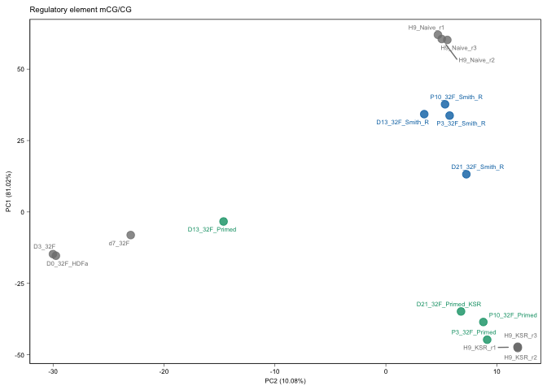<!-- -->

``` r
reg_mCG_pp1$data
```

    ##                Sample        PC1        PC2        PC3  State Timepoint
    ## RL399           RL399  -8.088093 -23.000711 -0.7691821  Early        d7
    ## RL411           RL411  33.743816   5.746562 -6.2017233  Naive        P3
    ## RL412           RL412  37.697939   5.333333 -5.7117134  Naive      P10+
    ## RL413           RL413 -14.744280 -30.010332  3.4574018  Early        d3
    ## RL414           RL414  34.251504   3.457313 -6.8693960  Naive       d13
    ## RL415           RL415 -15.320945 -29.746190  3.6312020  Early        d0
    ## RL416           RL416  -3.336787 -14.632903 -6.9507871 Primed       d13
    ## RL417           RL417 -44.722097   9.130516 -1.6560746 Primed        P3
    ## RL418           RL418 -38.528152   8.785413 -4.6268466 Primed      P10+
    ## RL697           RL697 -34.828979   6.773492 -7.2344364 Primed       d21
    ## RL698           RL698  13.200343   7.253925 -9.0385993  Naive       d21
    ## SRR1561745 SRR1561745 -47.339753  11.863845  6.7880031    ESC       ESC
    ## SRR1561746 SRR1561746 -47.645307  11.892226  6.7717057    ESC       ESC
    ## SRR1561747 SRR1561747 -47.170200  11.888802  6.7888779    ESC       ESC
    ## SRR1561748 SRR1561748  62.041582   4.692803  6.4994233    ESC       ESC
    ## SRR1561749 SRR1561749  60.557487   5.035474  6.8649434    ESC       ESC
    ## SRR1561750 SRR1561750  60.231923   5.536431  8.2572014    ESC       ESC
    ##                 Media              Label
    ## RL399      Fibroblast             d7_32F
    ## RL411         t2iLGoY     P3_32F_Smith_R
    ## RL412         t2iLGoY    P10_32F_Smith_R
    ## RL413      Fibroblast             D3_32F
    ## RL414         t2iLGoY    D13_32F_Smith_R
    ## RL415      Fibroblast        D0_32F_HDFa
    ## RL416             KSR     D13_32F_Primed
    ## RL417             KSR      P3_32F_Primed
    ## RL418             KSR     P10_32F_Primed
    ## RL697             KSR D21_32F_Primed_KSR
    ## RL698         t2iLGoY    D21_32F_Smith_R
    ## SRR1561745        KSR          H9_KSR_r1
    ## SRR1561746        KSR          H9_KSR_r2
    ## SRR1561747        KSR          H9_KSR_r3
    ## SRR1561748    t2iLGoY        H9_Naive_r1
    ## SRR1561749    t2iLGoY        H9_Naive_r2
    ## SRR1561750    t2iLGoY        H9_Naive_r3

``` r
wb_fig1 <- openxlsx::createWorkbook()
#openxlsx::addWorksheet(wb_fig1, sheetName = "Fig_1d")
#openxlsx::writeData(wb = wb_fig1, sheet = "Fig_1d",
#                    x = reg_mCG_pp1$data)
#openxlsx::saveWorkbook(wb = wb_fig1,
#                       file = "Figure_1_source_data.xlsx", overwrite = TRUE)
```

**Extended Data Figure 1i** Plot regulatory elements that change between
d0 and d7; day 13 and primed, and both to see OKSM induced changes

``` r
## import the genes gtf and make txdb
gtfPath <- "resources/genes.gtf.gz"
txdb <- makeTxDbFromGFF(file = gtfPath, format = "gtf")
```

    ## Import genomic features from the file as a GRanges object ... OK
    ## Prepare the 'metadata' data frame ... OK
    ## Make the TxDb object ... OK

``` r
pro_gr <- promoters(x = txdb)

## Select early reporgramming samples
mC_oksm <- reg_mCG_mat[ ,c("RL415", "RL413", "RL399")]
colnames(mC_oksm) <- c("d0", "d3", "d7")

mC_oksm_gr <- GRanges(rownames(mC_oksm))
mcols(mC_oksm_gr) <- mC_oksm

## Divide RE's into promoter and enhancer elements 
mC_oksm_gr$Element <- ifelse(test = overlapsAny(mC_oksm_gr, pro_gr),
                             yes = "Promoter", no = "Enhancer")

mC_oksm_gr$early_delta <- mC_oksm_gr$d7 - mC_oksm_gr$d0

#hist(mC_oksm_gr$early_delta)

## Select those with >0.2 mCG change
mC_oksm_gr$DMR <- abs(mC_oksm_gr$early_delta) > 0.2 

#table(mC_oksm_gr$DMR)

## Subset on direction
mC_oksm_gr$Direction <- ifelse(test = mC_oksm_gr$early_delta < 0, yes = "Decrease", no = "Increase")

# Make BED files for enhancers

gr_to_bed(gr = mC_oksm_gr[mC_oksm_gr$Element == "Enhancer" &
                              mC_oksm_gr$DMR == TRUE &
                              mC_oksm_gr$Direction == "Decrease"],
          out_path = "wgbs/processed_data/early_enhancer_demethylation.bed")

gr_to_bed(gr = mC_oksm_gr[mC_oksm_gr$Element == "Enhancer" &
                              mC_oksm_gr$DMR == TRUE &
                              mC_oksm_gr$Direction == "Increase"],
          out_path = "wgbs/processed_data/early_enhancer_increase_methylation.bed")

## craete table of data for plotting
element_change_table <- mcols(mC_oksm_gr)[ ,c(4,6,7)] %>% data.frame() %>% dplyr::group_by(Element, DMR, Direction) %>% dplyr::tally()

element_change_table <- element_change_table[element_change_table$DMR, ]

## plot the data
gg_mC_oksm <- ggplot(data = element_change_table,
                     aes(x = Direction, y = n)) +
        geom_col() + facet_grid(.~Element) + 
        ggtitle("Regulatory elements with \n>20% DNA methylation change \nbetween d0 and d7 of reprogramming ") +
        ylab("No. of elements") +
        xlab("Direction of DNA methylation change from d0") +
        scale_y_continuous( expand = c(0, 0)) +
        geom_text(aes(label=n), size=2, position=position_dodge(width=0.9), vjust=-0.5) +
        sams_pub_theme()

## Export the plot for adding to figure panel
pdf("wgbs/plots/oksm_regulatory_element_mC_change_barplots.pdf", width = 1.5, height = 2)
gg_mC_oksm
dev.off()
```

    ## quartz_off_screen 
    ##                 2

``` r
gg_mC_oksm$data
```

    ## # A tibble: 4 × 5
    ## # Groups:   Element, DMR [2]
    ##   Element  DMR   Direction     n .group
    ##   <chr>    <lgl> <chr>     <int>  <int>
    ## 1 Enhancer TRUE  Decrease   1023      1
    ## 2 Enhancer TRUE  Increase    283      1
    ## 3 Promoter TRUE  Decrease     37      2
    ## 4 Promoter TRUE  Increase      5      2

``` r
wb_ed_fig1 <- openxlsx::createWorkbook()
openxlsx::addWorksheet(wb_ed_fig1, sheetName = "ED_Fig_1h")
openxlsx::writeData(wb = wb_ed_fig1, sheet = "ED_Fig_1h",
                    x = gg_mC_oksm$data)
#openxlsx::saveWorkbook(wb = wb_ed_fig1,
#                       file = "ED_Figure_1_source_data.xlsx", overwrite = TRUE)
```

**Figure 1b,c** Plot genome-wide mC levels

``` r
# Global mCG expressed as mean 100kb window +/- SEM
window_100kb <- tileGenome(seqlengths = seqlengths(BSgenome.Hsapiens.UCSC.hg19),
                           tilewidth = 100000, cut.last.tile.in.chrom = TRUE)

window_100kb_mCG <- make_mC_matrix(obj_fls = CG_obj_fls, gr = window_100kb)

colnames(window_100kb_mCG) <- ds_sub$Library_id

window_100kb_mCG <- reshape2::melt(window_100kb_mCG)
window_100kb_mCG$timepoint <- ds_sub$Timepoint[match(window_100kb_mCG$Var2, 
                                                     ds_sub$Library_id)]
window_100kb_mCG$timepoint <- factor(window_100kb_mCG$timepoint,
                                     levels=c("d0", "d3", "d7", "d13", "d21", "P3",
                                                       "P10+", "ESC"))

window_100kb_mCG$media <- ds_sub$Media[match(window_100kb_mCG$Var2, 
                                                 ds_sub$Library_id)]

window_100kb_mCG$media[(window_100kb_mCG$timepoint == "ESC") &
                         (window_100kb_mCG$media == "t2iLGoY")] <- "ESC_naive"

window_100kb_mCG$media[(window_100kb_mCG$timepoint == "ESC") &
                         (window_100kb_mCG$media == "KSR")] <- "ESC_primed"

window_100kb_mCG$media <- factor(window_100kb_mCG$media, levels=c("Fibroblast", "KSR", "t2iLGoY", "ESC_primed", "ESC_naive"))
table(window_100kb_mCG$media)
```

    ## 
    ## Fibroblast        KSR    t2iLGoY ESC_primed  ESC_naive 
    ##      97464     129952     129952      97464      97464

``` r
gg_mCG_global <- ggplot2::ggplot(window_100kb_mCG, aes(x=timepoint,
                                            y=value, group=media, fill=media)) +
  scale_x_discrete(limits=levels(window_100kb_mCG$timepoint)) +
  scale_y_continuous(expand = c(0, 0), limits = c(0,1), breaks = c(0.25,0.5,0.75,1)) +
  stat_summary(mapping = aes(group=media, colour=media), geom="point",
               fun.data = mean_sdl, size=3) +
  stat_summary(mapping = aes(group=media, colour=media), geom="line",
               fun.data = mean_sdl, size=1) +
  #stat_summary(mapping = aes(group=media), geom="errorbar", width=0.2,
  #             fun.data = mean_se(), alpha=0.2, fun.args = list(mult=1)) +
  scale_color_manual(values = reprog_pal[c(3,1,2,1,2)]) +
  scale_fill_manual(values = reprog_pal[c(3,1,2,1,2)]) +
  theme_bw() +
  xlab("") + ylab("mCG/CG") +
  sams_pub_theme(legend_pos = "NA") +
  ggtitle("Global CG methylation")
gg_mCG_global
```

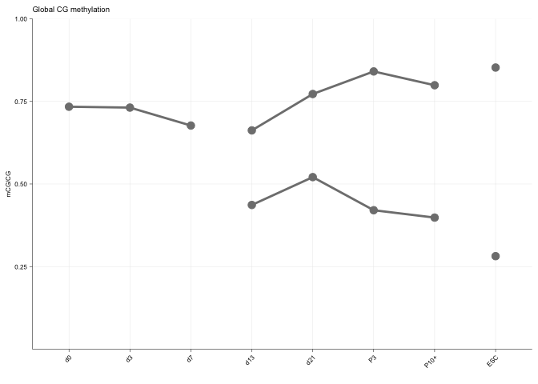<!-- -->

Global mCA expressed as mean 100kb window +/- SEM *This analysis is
unlikely to run locally and will need a high memory machine*

``` r
# Global mCA expressed as mean 100kb window +/- SEM
library(stringr)
library(magrittr)

source("R/server_libraries_and_functions.R")

ds <- read.csv("wgbs/metadata/wgbs_metadata_local.csv")

# Timecourse sample
timepoint <- c("d0", "d3", "d7", "Primed-intermediate", "Naive-intermediate", "Primed-hiPSC", "Naive-hiPSC", "hESC")
media <- c("KSR", "Fibroblast", "t2iLGoY")
donor <- c("32F", "H9")

ds_sub <- ds[(ds$Group %in% timepoint) & 
               (ds$Media %in% media) &
               (ds$Background %in% donor), ]

ds_sub <- ds_sub[ds_sub$Library_id != "RL2770", ]


CA_fls_local <- list.files("wgbs/CA_bsobj/") %>% basename()
all(basename(ds_sub$BSseq_CA) %in% CA_fls_local)

# Global mCA expressed as mean 100kb window +/- SEM
window_100kb <- tileGenome(seqlengths = seqlengths(BSgenome.Hsapiens.UCSC.hg19),
                           tilewidth = 100000, cut.last.tile.in.chrom = TRUE)

window_100kb <- window_100kb[seqnames(window_100kb) %in% str_c("chr", 1:22)]

CA_bs_obj_list <- str_c("wgbs/CA_bsobj/", basename(ds_sub$BSseq_CA))
all(file.exists(CA_bs_obj_list))

gr_windows <- window_100kb

calc_CA_window <- function(x, contigs=str_c("chr", 1:22), nc_subtract=FALSE){
  
  message(str_c("Reading ", basename(CA_bs_obj_list[x])))
  bs_obj <- readRDS(CA_bs_obj_list[x])
  
  calc_mC_window_contig <- function(contig){

    message(str_c("Processing ", contig))
    bs_sub <- chrSelectBSseq(BSseq = bs_obj, seqnames = contig)
    
    gr_sub <- gr_windows[seqnames(gr_windows) == contig]
    gr_sub <- dropSeqlevels(gr_sub, (!seqlevels(gr_sub) %in% contig))
    
    message("Calculating coverage...")
    Cov <- getCoverage(BSseq = bs_sub, regions = gr_sub, type = "Cov",
                       what = "perRegionTotal")
    
    message("Calculating methyation...")
    M <- getCoverage(BSseq = bs_sub, regions = gr_sub, type = "M",
                     what = "perRegionTotal")
    
    gr_sub$pc <- M / Cov
    
    return(gr_sub)
    
  }
  
  gr <- lapply(contigs, calc_mC_window_contig) %>%
    GRangesList() %>% unlist()
   
  # Subtract non-conversion rate
  nc_obj <- chrSelectBSseq(BSseq = bs_obj, seqnames = "chrL")
  nc_cov <- getCoverage(BSseq = nc_obj, type = "Cov",
                        what = "perBase")
  nc_m <- getCoverage(BSseq = nc_obj, type = "M",
                      what = "perBase")
  
  nc_rate <- sum(nc_m) / sum(nc_cov)
  
  # Subtract non-conversion rate with a floor of zero
  if (nc_subtract == TRUE){
    gr$pc <- gr$pc - nc_rate
    gr$pc[gr$pc < 0] <- 0
  }
  
  return(gr)
}

grl <- mclapply(X = 1:11, FUN = calc_CA_window, nc_subtract=TRUE, mc.cores = 2)
names(grl) <- basename(CA_bs_obj_list)[1:11]

grl2 <- mclapply(X = 12:17, FUN = calc_CA_window, mc.cores = 2)

grl_all <- c(unlist(grl[1:11]), unlist(grl2)) %>% GRangesList()
names(grl_all) <- basename(CA_bs_obj_list)

saveRDS(grl_all, "wgbs/processed_data/mCA_100kb_bin_GRangesList.Rds")
```

This section can be run locally on the processed data file

``` r
grl <- readRDS("wgbs/processed_data/mCA_100kb_bin_GRangesList.Rds")

loci <- gr_to_loci(grl[[1]])

window_100kb_mCA <- lapply(1:length(grl), function(x){grl[[x]]$pc})
window_100kb_mCA <- do.call(cbind, window_100kb_mCA)
rownames(window_100kb_mCA) <- loci

colnames(window_100kb_mCA) <- names(grl)
all(colnames(window_100kb_mCA) == basename(ds_sub$BSseq_CA))
```

    ## [1] TRUE

``` r
colnames(window_100kb_mCA) <- ds_sub$Library_id

plot_pca(window_100kb_mCA)
```

    ## Low variance features removed = 0

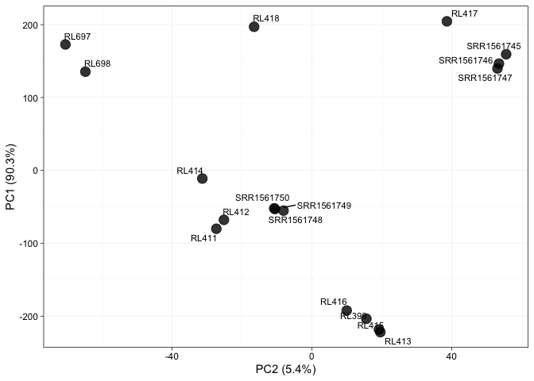<!-- -->

``` r
window_100kb_mCA <- reshape2::melt(window_100kb_mCA)
window_100kb_mCA$timepoint <- ds_sub$Timepoint[match(window_100kb_mCA$Var2, 
                                                     ds_sub$Library_id)]

window_100kb_mCA$timepoint <- factor(window_100kb_mCA$timepoint,
                                     levels=c("d0", "d3", "d7",
                                              "d13", "d21", "P3",
                                              "P10+", "ESC"))

window_100kb_mCA$media <- ds_sub$Media[match(window_100kb_mCA$Var2, 
                                             ds_sub$Library_id)]

window_100kb_mCA$media[(window_100kb_mCA$timepoint == "ESC") &
                         (window_100kb_mCA$media == "t2iLGoY")] <- "ESC_naive"

window_100kb_mCA$media[(window_100kb_mCA$timepoint == "ESC") &
                         (window_100kb_mCA$media == "KSR")] <- "ESC_primed"

window_100kb_mCA$media <- factor(window_100kb_mCA$media,
                                 levels=c("Fibroblast", "KSR",
                                          "t2iLGoY", "ESC_primed", "ESC_naive"))
table(window_100kb_mCA$media)
```

    ## 
    ## Fibroblast        KSR    t2iLGoY ESC_primed  ESC_naive 
    ##      86469     115292     115292      86469      86469

``` r
window_100kb_mCA$group2 <- as.character(window_100kb_mCA$media)
window_100kb_mCA$group2[window_100kb_mCA$Var2 == "SRR1561745"] <- "Primed_1"
window_100kb_mCA$group2[window_100kb_mCA$Var2 == "SRR1561746"] <- "Primed_2"
window_100kb_mCA$group2[window_100kb_mCA$Var2 == "SRR1561747"] <- "Primed_3"
window_100kb_mCA$group2[window_100kb_mCA$Var2 == "SRR1561748"] <- "Naive_1"
window_100kb_mCA$group2[window_100kb_mCA$Var2 == "SRR1561749"] <- "Naive_2"
window_100kb_mCA$group2[window_100kb_mCA$Var2 == "SRR1561750"] <- "Naive_3"


d7p <- window_100kb_mCA[window_100kb_mCA$timepoint == "d7", ]
d7p$media <- "KSR"

d7n <- window_100kb_mCA[window_100kb_mCA$timepoint == "d7", ]
d7n$media <- "t2iLGoY"

window_100kb_mCA_all <- rbind(window_100kb_mCA, d7p, d7n)

gg_mCA_global <- ggplot2::ggplot(window_100kb_mCA_all, aes(x=timepoint,
                                                       y=value, group=media,
                                                       fill=media)) +
  scale_x_discrete(limits=levels(window_100kb_mCG$timepoint)) +
  scale_y_continuous(expand = c(0, 0), limits = c(0,0.02)) +
  stat_summary(mapping = aes(group=media, colour=media), geom="point",
               fun.data = mean_sdl, size=3) +
  stat_summary(mapping = aes(group=media, colour=media), geom="line",
               fun.data = mean_sdl, size=1) +
  #stat_summary(mapping = aes(group=media, colour=media), geom="ribbon",
  #             fun.data = mean_sdl, alpha=0.2, fun.args = list(mult=1)) +
  #stat_summary(mapping = aes(group=media), geom="errorbar", width=0.2,
  #             fun.data = mean_sdl, alpha=0.2, fun.args = list(mult=1)) +
  scale_color_manual(values = reprog_pal[c(3,1,2,1,2)]) +
  scale_fill_manual(values = reprog_pal[c(3,1,2,1,1,2)]) +
  theme_bw() +
  xlab("") + ylab("mCA/CA") +
  sams_pub_theme(legend_pos = "NA") +
  ggtitle("Global CA methylation")
gg_mCA_global
```

    ## Warning: Removed 101567 rows containing non-finite values (`stat_summary()`).
    ## Removed 101567 rows containing non-finite values (`stat_summary()`).

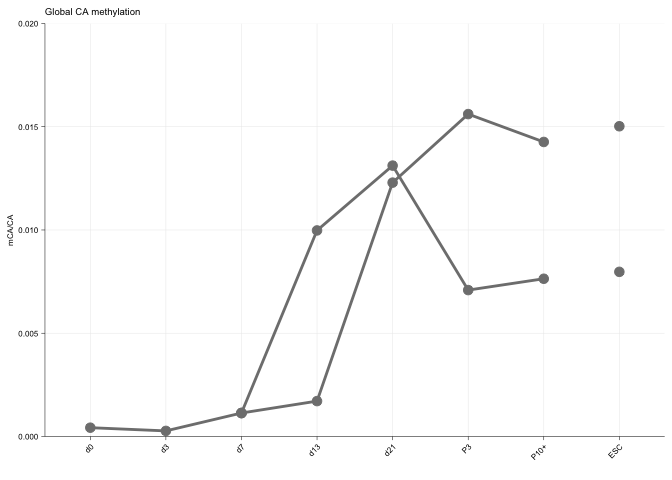<!-- -->

``` r
##### Create plot for manuscript
pdf(file = "wgbs/plots/Fig_1bcd_global_mC_plots.pdf", height = 2)
cowplot::plot_grid(gg_mCG_global, gg_mCA_global, reg_mCG_pp1,
                   nrow = 1, align = "h")
```

    ## Warning: Removed 62960 rows containing non-finite values (`stat_summary()`).

    ## Warning: Removed 62960 rows containing non-finite values (`stat_summary()`).

    ## Warning: Removed 101567 rows containing non-finite values (`stat_summary()`).
    ## Removed 101567 rows containing non-finite values (`stat_summary()`).

    ## Warning: ggrepel: 1 unlabeled data points (too many overlaps). Consider
    ## increasing max.overlaps

``` r
dev.off()
```

    ## quartz_off_screen 
    ##                 2

``` r
openxlsx::addWorksheet(wb_fig1, sheetName = "Fig_1b")
openxlsx::writeData(wb = wb_fig1, sheet = "Fig_1b",
                    x = gg_mCG_global$data)

openxlsx::addWorksheet(wb_fig1, sheetName = "Fig_1c")
openxlsx::writeData(wb = wb_fig1, sheet = "Fig_1c",
                    x = gg_mCA_global$data)

openxlsx::addWorksheet(wb_fig1, sheetName = "Fig_1d")
openxlsx::writeData(wb = wb_fig1, sheet = "Fig_1d",
                    x = reg_mCG_pp1$data)


openxlsx::saveWorkbook(wb = wb_fig1,
                       file = "Figure_1_source_data.xlsx", overwrite = TRUE)
```

**Figure 1e** C-means clustering of regulatory elements

``` r
## Load regulatory element data 
reg_mCG_mat <- readRDS("wgbs/processed_data/mCG_regulatory_element_data.Rds")

## Select timecourse 32F samples
primed_line <- ds_sub$Library_id[ds_sub$State %in% c("Early", "Primed") &
                                     (ds_sub$Timepoint %in% c("d0", "d3", "d7",
                                                         "d13", "d21", "P3", 
                                                         "P10+")) & ds_sub$Background == "32F"]

naive_line <- ds_sub$Library_id[ds_sub$State %in% c("Early", "Naive") &
                                     (ds_sub$Timepoint %in% c("d0", "d3", "d7",
                                                         "d13", "d21", "P3", 
                                                         "P10+"))  & ds_sub$Background == "32F"]

## Function to scale the data for C-means clustering
scale_df <- function(df){
        df_scaled <- as.matrix(df) %>%
                ExpressionSet() %>% standardise() %>% exprs() %>% data.frame()
        colnames(df_scaled) <- colnames(df)
        return(df_scaled)
}


## Function to run C-Means
run_cmeans <- function(df, centres=5, mC_var_threshold=0.2, membership=0.7){
        
        ## Calculate which loci have min-max difference > mC_var_threshold in subset columns
        change_pass <- function(x, threshold=mC_var_threshold){
                vec <- df[x, ]
                delta <- max(vec) - min(vec)
                pass <- delta >= threshold
        }
        
        df <- df[complete.cases(df), ] %>% as.matrix()
        dim(df)
        
        variance_pass <- lapply(1:nrow(df), change_pass) %>% unlist()
        table(variance_pass)
        e1 <- ExpressionSet(df) %>% standardise()
        
        e_variable <- e1[variance_pass, ]
        e_constant <- e1[!variance_pass, ]
        
        ## Estimate m value ( the fuzzifier )
        m1 <- mestimate(e_variable)
        
        ## Do the clustering. Setting the seed is essential for reproducability 
        set.seed(123); cl <- mfuzz(eset = e_variable,
                                   centers = centres, m = m1)
        
        ## Get cluser core loci
        cores <- acore(eset = e_variable, cl = cl, min.acore = membership)
        
        ## Add the static cluser
        length(cores)
        
        static_cluster <- data.frame(NAME=factor(rownames(e_constant)), MEM.SHIP=1)
        rownames(static_cluster) <- rownames(e_constant)
        
        cores[[centres+1]] <- static_cluster
        length(cores)
        
        return(list(e1, cores, cl))
}

cmeans_dat_primed <- run_cmeans(df = reg_mCG_mat[ ,colnames(reg_mCG_mat) %in% primed_line],
                         centres = 4, mC_var_threshold = 0.2, membership = 0.7)

cmeans_dat_naive <- run_cmeans(df = reg_mCG_mat[ ,colnames(reg_mCG_mat) %in% naive_line],
                                centres = 2, mC_var_threshold = 0.2, membership = 0.7)

#cmeans_dat_all <- run_cmeans(df = reg_mCG_mat_comb[ ,colnames(reg_mCG_mat_comb) %in% c(naive_line, primed_line)],
#                             centres = 6, mC_var_threshold = 0.2, membership = 0.7)

get_cluster_loci <- function(x, cmeans_dat, group="Primed"){
        clus_dat <- cmeans_dat[[2]][[x]]
        clus_gr <- GRanges(rownames(clus_dat))
        clus_gr$cluster <- str_c(group, x, sep = "_")
        clus_gr$loci <- gr_to_loci(clus_gr)
        clus_gr$membership <- clus_dat$MEM.SHIP
        return(clus_gr)
}

primed_clus_gr <- lapply(1:4, get_cluster_loci, cmeans_dat = cmeans_dat_primed, group="Primed")
naive_clus_gr <- lapply(1:2, get_cluster_loci, cmeans_dat = cmeans_dat_naive, group="Naive")

all_clus_gr <- c(GRangesList(primed_clus_gr), GRangesList(naive_clus_gr)) %>% unlist() %>% unique()
clus_grl <- c(GRangesList(primed_clus_gr), GRangesList(naive_clus_gr)) 

all_clus_df <- as.data.frame(all_clus_gr)

peakHits <- function(samplePeaks, unionPeaks){
        
        ## Function to get TRUE/FALSE of peak overlap in one sample
        peakOverlap <- function(x, unionPeaks)
        {
                overlapsAny(query = unionPeaks, subject = x, type = "any")
        }
        
        ## Apply function over all samples and format as matrix
        hits <- lapply(X = samplePeaks, FUN = peakOverlap, unionPeaks=unionPeaks)
        hits <- do.call(cbind, hits)
        
        ## Set a locus id as rownames
        id <- paste(start(unionPeaks), end(unionPeaks), sep = "-")
        id <- paste(seqnames(unionPeaks), id, sep = ":")
        rownames(hits) <- id
        
        ## Set peaks filename as colanmes
        colnames(hits) <- names(samplePeaks)
        
        ## return results in binary format
        return(hits + 0)
        
}

hits <- data.frame(peakHits(samplePeaks = clus_grl, unionPeaks = all_clus_gr))
colnames(hits) <- c("P1", "P2", "P3", "P4", "N1", "N2")

## Plot the overlaps 

#library(UpSetR)
upset(data = hits, nsets = 6,
      sets.x.label = "Total number of Elements",
      mainbar.y.label = "Number of elements in intersection",
      #group.by = "sets",
      #sets.bar.color = "#56B4E9",
      order.by = "freq")
```

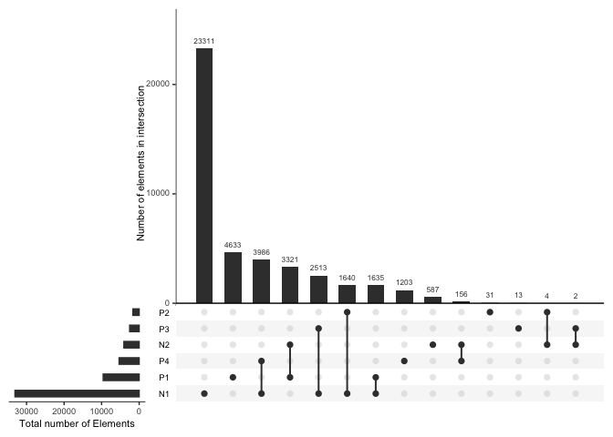<!-- -->

``` r
## Make new clusters... Subtract N2 clusters from P1
all_clus_dat <- c(GRangesList(primed_clus_gr), GRangesList(naive_clus_gr)) %>% unlist() %>% data.frame()

switch_loci <- all_clus_dat$loci[all_clus_dat$cluster == "Naive_2"]   

keep_dat <- !((all_clus_dat$cluster == "Primed_1") & (all_clus_dat$loci %in% switch_loci))
table(keep_dat)
```

    ## keep_dat
    ## FALSE  TRUE 
    ##  3321 52970

``` r
all_clus_dat <- all_clus_dat[keep_dat, ]

#all_clus_dat <- all_clus_dat[all_clus_dat$cluster != "Naive_2", ]

## Make cluster bed files for motif analysis

c_clusters <- unique(all_clus_dat$cluster)

make_cluster_bed <- function(x){
        c_clus_dat <- all_clus_dat[all_clus_dat$cluster == c_clusters[x], ]
        GRanges(seqnames = c_clus_dat$loci) %>%
                gr_to_bed(out_path = str_c("wgbs/processed_data/cmeans_cluster_",
                                           c_clusters[x], ".bed"))
}

lapply(1:length(c_clusters), make_cluster_bed)
```

    ## [[1]]
    ## NULL
    ## 
    ## [[2]]
    ## NULL
    ## 
    ## [[3]]
    ## NULL
    ## 
    ## [[4]]
    ## NULL
    ## 
    ## [[5]]
    ## NULL
    ## 
    ## [[6]]
    ## NULL

``` r
all_32F_df <- reg_mCG_mat[ ,colnames(reg_mCG_mat) %in% c(primed_line,
                                                         naive_line)]
#all_32F_df <- scale_df(all_32F_df)

all_clus_merge <- merge(all_clus_dat, all_32F_df, by.x="loci", by.y="row.names")
all_clus_merge <- all_clus_merge[all_clus_merge$cluster != "Naive_1", ]

all_clus_merge_annotated <- all_clus_merge

write.table(x = all_clus_merge_annotated, file = "wgbs/processed_data/all_cmeans_data_table.txt",
            quote = FALSE, row.names = TRUE, col.names = TRUE, sep = "\t")

all_clus_merge <- all_clus_merge[ ,-c(2:6,8)]
all_clus_melt <- reshape2::melt(all_clus_merge)
```

    ## Using loci, cluster as id variables

``` r
all_clus_melt$state <- ds$State[match(all_clus_melt$variable, ds$Library_id)]
all_clus_melt$timepoint <- ds$Timepoint[match(all_clus_melt$variable, ds$Library_id)]
        
# Remove noise cluster 
#all_clus_melt <- all_clus_melt[all_clus_melt$cluster != "Naive_2", ]
        
d7 <- all_clus_melt[all_clus_melt$timepoint == "d7", ]
d7_naive <- d7
d7_naive$state <- "Naive"
d7_primed <- d7
d7_primed$state <- "Primed"
        
all_clus_melt <- rbind(all_clus_melt, d7_naive, d7_primed)
all_clus_melt$timepoint %<>% gsub(pattern = "+", replacement = "", fixed = TRUE)
all_clus_melt$timepoint <- factor(all_clus_melt$timepoint, levels=c("d0","d3",
                                                                    "d7", "d13",
                                                                    "d21","P3",
                                                                       "P10"))

clusters <- table(all_clus_melt$cluster) %>% names()

all_clus_melt$cluster %<>% gsub(pattern = "Naive", replacement = "N") %>%
        gsub(pattern = "Primed", replacement = "P")

clusters <- table(all_clus_melt$cluster) %>% names()

all_clus_melt$cluster <- factor(all_clus_melt$cluster, levels = clusters[c(1,5,2,3,4)])

## Make the cluster labels
cluster_dat <- table(all_clus_melt$cluster[all_clus_melt$timepoint == "d0"]) %>% c()
cluster_labs <- str_c(names(cluster_dat),  " n=", cluster_dat)
names(cluster_labs) <- names(cluster_dat)

saveRDS(all_clus_melt, file = "wgbs/processed_data/cmeans_mC_plot_data.Rds")
```

Get gene expression data for clusters and plot together with mCG

``` r
all_clus_melt <- readRDS("wgbs/processed_data/cmeans_mC_plot_data.Rds")

gg_mC <- ggplot2::ggplot(all_clus_melt, aes(x=timepoint,
                                            y=value, group=loci)) +
                facet_grid(cluster~., scales = "free_y", labeller = labeller(cluster = cluster_labs)) +
                #ggtitle(title) +
                scale_x_discrete(limits=levels(all_clus_melt$timepoint),
                                 expand = c(0, 0)) +
                scale_y_continuous(expand = c(0, 0), limits = c(0,1), breaks = c(0.25,0.5,0.75,1)) +
                #scale_y_continuous(expand = c(0, 0), breaks = c(0, 0.25, 0.5, 0.75, 1)) +
                stat_summary(mapping = aes(group=state, colour=state), geom="line",
                             fun.data = mean_sdl, size=1) +
                stat_summary(mapping = aes(group=state, fill=state), geom="ribbon",
                             fun.data = mean_sdl, alpha=0.2, fun.args = list(mult=1)) +
                scale_color_manual(values = reprog_pal[c(3,2,1)]) +
                scale_fill_manual(values = reprog_pal[c(3,2,1)]) +
                theme_bw() +
                xlab("") + ylab("") +
                sams_pub_theme(legend_pos = "NA")

cm_df <- data.frame(loci = all_clus_melt$loci[all_clus_melt$timepoint == "d0"],
                    cluster = all_clus_melt$cluster[all_clus_melt$timepoint == "d0"])

cm_df <- cm_df[cm_df$cluster != "Naive_2", ]

cm_merge <- merge(x = cm_df, y = all_32F_df, by.x='loci', by.y='row.names')

cm_merge <- reshape2::melt(cm_merge, id.vars=c('loci', 'cluster'))

## Load the gene expression data
tpm <- read.table("RNAseq/processed_data/timcourse_RNAseq_hg19_UCSC_tpm.txt")

tpm_norm <- log2(tpm+1) %>% as.matrix() %>% normalize.quantiles() %>% 
        data.frame() %>% scale_df()

colnames(tpm_norm) <- colnames(tpm)
rownames(tpm_norm) <- rownames(tpm)

### MAke the expression plots for the clusters
## Get genes for each cluster

enh_dat <- read.table(file = "resources/hg19_USCS_geneHancerClusteredInteractionsDoubleElite.txt")
enh_gene_gr <- GRanges(seqnames = enh_dat$V9, ranges = IRanges(start = enh_dat$V10, end = enh_dat$V11))
enh_gene_gr$gene <- enh_dat$V17
enh_gene_gr$score <- enh_dat$V5
enh_gene_gr$loci <- gr_to_loci(enh_gene_gr)

keep <- enh_gene_gr$gene %in% rownames(tpm_norm)
enh_gene_gr <- enh_gene_gr[keep]

## Filter for top linked gene

# uniq_loci <- unique(enh_gene_gr$loci)
# loci <- uniq_loci[3]
# return_top <- function(loci){
#         loci_gr <- enh_gene_gr[enh_gene_gr$loci == loci]
#         loci_gr <- loci_gr[which.max(loci_gr$score)]
#         return(loci_gr)
#         
# }
# 
# enh_gene_gr <- lapply(uniq_loci, return_top) %>% GRangesList() %>% unlist()
# 

all_clus_merge_annotated <- read.table("wgbs/processed_data/all_cmeans_data_table.txt")


hits_sub <- findOverlaps(query = GRanges(seqnames = all_clus_merge_annotated$loci),
                         subject = enh_gene_gr)

enh_gene_clus_dat <- data.frame(loci=all_clus_merge_annotated$loci[hits_sub@from],
                                cluster=all_clus_merge_annotated$cluster[hits_sub@from],
                                gene=enh_gene_gr$gene[hits_sub@to],
                                score=enh_gene_gr$score[hits_sub@to],
                                membership=all_clus_merge_annotated$membership[hits_sub@from])

enh_gene_clus_dat$gene <- as.character(enh_gene_clus_dat$gene)

enh_gene_clus_dat <- enh_gene_clus_dat[!duplicated(enh_gene_clus_dat), ]

enh_gene_clus_dat <- merge(x = enh_gene_clus_dat, y = tpm_norm,
                     by.x="gene", by.y="row.names")

write.table(x = enh_gene_clus_dat,
            file = "wgbs/processed_data/all_cmeans_data_table_annotated.txt",
            quote = FALSE, row.names = TRUE, col.names = TRUE, sep = "\t")

hits <- findOverlaps(query = GRanges(seqnames = cm_merge$loci), subject = enh_gene_gr)

enh_gene_clus_dat <- data.frame(loci=cm_merge$loci[hits@from],
                                cluster=cm_merge$cluster[hits@from],
                                gene=enh_gene_gr$gene[hits@to],
                                score=enh_gene_gr$score[hits@to])

enh_gene_clus_dat$gene <- as.character(enh_gene_clus_dat$gene)

enh_gene_clus_dat <- enh_gene_clus_dat[!duplicated(enh_gene_clus_dat), ]

colnames(tpm_norm)
```

    ##  [1] "D0_32F_MEF"          "D3_32F_MEF"          "D7_32F_MEF"         
    ##  [4] "D13_Primed_32F_KSR"  "D21_Primed_32F_KSR"  "P3_Primed_32F_KSR"  
    ##  [7] "P10_Primed_32F_KSR"  "D13_Naive_32F_Naive" "D21_Naive_32F_Naive"
    ## [10] "P3_Naive_32F_Naive"  "P10_Naive_32F_Naive"

``` r
#primed_tpm_line <- c(1,2,3,4,6,8,10)
#naive_tpm_line <- c(1,2,3,5,7,9,11)
#line <- naive_tpm_line
library(dplyr)
```

    ## 
    ## Attaching package: 'dplyr'

    ## The following object is masked from 'package:VariantAnnotation':
    ## 
    ##     select

    ## The following object is masked from 'package:AnnotationDbi':
    ## 
    ##     select

    ## The following objects are masked from 'package:Biostrings':
    ## 
    ##     collapse, intersect, setdiff, setequal, union

    ## The following object is masked from 'package:XVector':
    ## 
    ##     slice

    ## The following objects are masked from 'package:data.table':
    ## 
    ##     between, first, last

    ## The following object is masked from 'package:bsseq':
    ## 
    ##     combine

    ## The following object is masked from 'package:matrixStats':
    ## 
    ##     count

    ## The following objects are masked from 'package:GenomicRanges':
    ## 
    ##     intersect, setdiff, union

    ## The following object is masked from 'package:GenomeInfoDb':
    ## 
    ##     intersect

    ## The following objects are masked from 'package:IRanges':
    ## 
    ##     collapse, desc, intersect, setdiff, slice, union

    ## The following objects are masked from 'package:S4Vectors':
    ## 
    ##     first, intersect, rename, setdiff, setequal, union

    ## The following object is masked from 'package:Biobase':
    ## 
    ##     combine

    ## The following objects are masked from 'package:BiocGenerics':
    ## 
    ##     combine, intersect, setdiff, union

    ## The following objects are masked from 'package:stats':
    ## 
    ##     filter, lag

    ## The following objects are masked from 'package:base':
    ## 
    ##     intersect, setdiff, setequal, union

``` r
tpm_cluster <- merge(x = enh_gene_clus_dat, y = tpm_norm,
                     by.x="gene", by.y="row.names")

## Weight each expression measure by enhancer interaction score
tpm_cluster[ ,5:ncol(tpm_cluster)] <- tpm_cluster[ ,5:ncol(tpm_cluster)] * tpm_cluster$score


## Get average weighted score for genes represented by cluster >1 time
mean_tpm <- tpm_cluster[ ,-c(2,4)] %>% group_by(gene, cluster) %>%
        summarise_each(funs(mean, .args = list(na.rm=TRUE)))
```

    ## Warning: `summarise_each_()` was deprecated in dplyr 0.7.0.
    ## ℹ Please use `across()` instead.
    ## ℹ The deprecated feature was likely used in the dplyr package.
    ##   Please report the issue at <]8;;https://github.com/tidyverse/dplyr/issueshttps://github.com/tidyverse/dplyr/issues]8;;>.

    ## Warning: `funs()` was deprecated in dplyr 0.8.0.
    ## ℹ Please use a list of either functions or lambdas:
    ## 
    ## # Simple named list: list(mean = mean, median = median)
    ## 
    ## # Auto named with `tibble::lst()`: tibble::lst(mean, median)
    ## 
    ## # Using lambdas list(~ mean(., trim = .2), ~ median(., na.rm = TRUE))

``` r
mean_tpm <- as.data.frame(mean_tpm)

tpm_cluster <- reshape2::melt(mean_tpm, id.vars=c("gene", "cluster"))

tpm_cluster$timepoint <- str_split(tpm_cluster$variable, pattern = "_", n = 2, simplify = TRUE)[,1] %>% tolower()
states <- sapply(str_split(tpm_cluster$variable, '_'), tail, 1)
tpm_cluster$state <- states
tpm_cluster$state[tpm_cluster$state == "MEF"] <- "Early"
tpm_cluster$state[tpm_cluster$state == "KSR"] <- "Primed"

tpm_cluster$timepoint <- str_replace(as.character(tpm_cluster$timepoint), pattern = "p", replacement = "P")

tpm_cluster$timepoint <- factor(tpm_cluster$timepoint, levels = c("d0", "d3", "d7",
                                                                        "d13", "d21", "P3",
                                                                        "P10"))

d7_tpm <- tpm_cluster[tpm_cluster$timepoint == "d7", ]
d7_tpm_naive <- d7_tpm
d7_tpm_naive$state <- "Naive"
d7_tpm_primed <- d7_tpm
d7_tpm_primed$state <- "Primed"

tpm_cluster <- rbind(tpm_cluster, d7_tpm_naive, d7_tpm_primed)

#tpm_cluster$id <- str_c(tpm_cluster$gene, tpm_cluster$loci, sep = "_")

rm_inf <- tpm_cluster$value %>% is.finite()

tpm_cluster <- tpm_cluster[rm_inf, ]
tpm_cluster$variable <- tpm_cluster$timepoint


## Make the cluster labels
d0_dat <- tpm_cluster[tpm_cluster$timepoint == "d0", ]
clus_ids <- unique(d0_dat$cluster)

get_gene_counts <- function(clus){
        
        n_genes <- d0_dat$gene[d0_dat$cluster == clus] %>% as.character() %>%
                unique() %>% length()
        return(n_genes)
}

cluster_dat_tpm <- lapply(clus_ids, get_gene_counts)
cluster_labs_tpm <- str_c("Genes=", cluster_dat_tpm)
names(cluster_labs_tpm) <- clus_ids

tpm_cluster$cluster <- factor(tpm_cluster$cluster, levels = clusters[c(1,5,2,3,4)])


gg_gene <- ggplot2::ggplot(tpm_cluster, aes(x=timepoint,
                                         y=value)) +
        facet_grid(cluster~., scales = "free_y",
                   labeller = labeller(cluster = cluster_labs_tpm)) +
        #ggtitle(title) +
        scale_x_discrete(limits=levels(tpm_cluster$timepoint),
                         expand = c(0, 0)) +
        scale_y_continuous(expand = c(0, 0)) +
        stat_summary(mapping = aes(group=state, colour=state), geom="line",
                     fun.data = mean_cl_boot, size=1,
                     fun.args = list(conf.int=.99)) +
        stat_summary(mapping = aes(group=state, fill=state), geom="ribbon",
                     fun.data  = mean_cl_boot, alpha=0.2,
                     fun.args = list(conf.int=.99)) +
        scale_color_manual(values = reprog_pal[c(3,2,1)]) +
        scale_fill_manual(values = reprog_pal[c(3,2,1)]) +
        theme_bw() +
        xlab("") + ylab("") +
        sams_pub_theme(legend_pos = "NA")
gg_gene
```

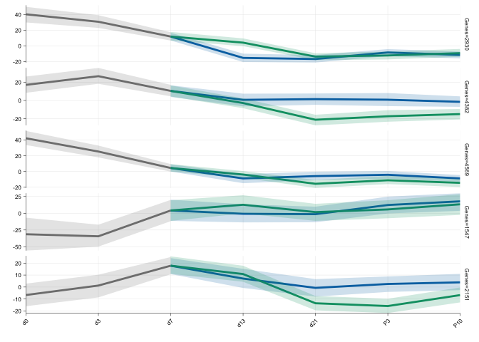<!-- -->

``` r
pdf("wgbs/plots/regulatory_elements_cmeans_summary_plots.pdf",
    width = 2.75, height = 3.75)
plot_grid(gg_mC, gg_gene, ncol = 2, nrow = 1, align = "hv")
dev.off()
```

    ## quartz_off_screen 
    ##                 2

``` r
plot_grid(gg_mC, gg_gene, ncol = 2, nrow = 1, align = "hv")
```

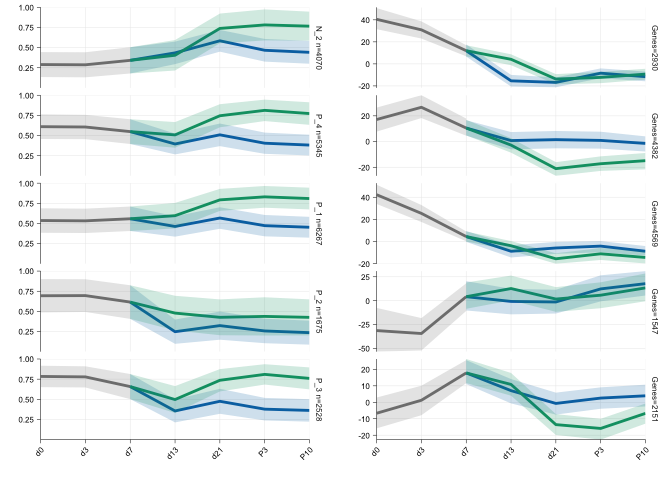<!-- -->

``` r
openxlsx::addWorksheet(wb_fig1, sheetName = "Fig_1e_mC")
openxlsx::writeData(wb = wb_fig1, sheet = "Fig_1e_mC",
                    x = gg_mC$data)

openxlsx::addWorksheet(wb_fig1, sheetName = "Fig_1e_rna")
openxlsx::writeData(wb = wb_fig1, sheet = "Fig_1e_rna",
                    x = gg_gene$data)
```

**Figure 1f** Export cluster gene lists for ontology analysis

``` r
clus_ids <- unique(tpm_cluster$cluster) %>% as.character()
clus_id <- clus_ids[1]
write_gene_lists <- function(clus_id){
        
        
        gene_ids <- tpm_cluster$gene[as.character(tpm_cluster$cluster) == as.character(clus_id)] %>%
                as.character() %>% unique()
        out <- str_c("wgbs/processed_data/cmeans_cluster_", clus_id, "_gene_list.txt")
        write.table(gene_ids, file = out, quote = FALSE, row.names = FALSE, col.names = FALSE)
        
}
lapply(clus_ids, write_gene_lists)
```

    ## [[1]]
    ## NULL
    ## 
    ## [[2]]
    ## NULL
    ## 
    ## [[3]]
    ## NULL
    ## 
    ## [[4]]
    ## NULL
    ## 
    ## [[5]]
    ## NULL

``` r
tpm <- read.table("RNAseq/processed_data/human_reprog_and_nat_methods_RNAseq_hg19_UCSC_tpm.txt")
bg_genes <- rownames(tpm)

cluster_id_files <- list.files(path = "wgbs/processed_data/", pattern = "_gene_list.txt", full.names = TRUE)

clus_file <- cluster_id_files[1]

run_ontology <- function(clus_file){
    
        gene_ids <- readLines(clus_file) %>% as.character()
        
        #gene_ids <- tpm_cluster$gene[as.character(tpm_cluster$cluster) == as.character(clus_id)] %>%
        #        as.character() %>% unique()
        
        go_dat <- gost(query = gene_ids, organism = "hsapiens",
                       significant = TRUE,
                       custom_bg = bg_genes,
                       correction_method = "fdr")
        
        go_df <- go_dat$result
        go_df$query <- basename(clus_file)
        return(go_df)
}

all_go_dat <- lapply(X = cluster_id_files, run_ontology)
```

    ## Detected custom background input, domain scope is set to 'custom'
    ## Detected custom background input, domain scope is set to 'custom'
    ## Detected custom background input, domain scope is set to 'custom'
    ## Detected custom background input, domain scope is set to 'custom'
    ## Detected custom background input, domain scope is set to 'custom'

``` r
all_go_dat <- do.call(rbind, all_go_dat)

all_go_dat$query <- str_remove(string = all_go_dat$query,
                               pattern = "cmeans_cluster_") %>%
    str_remove("_gene_list.txt")

table(all_go_dat$query)
```

    ## 
    ##   N_2   P_1   P_2   P_3   P_4 
    ##  9065 12988  6369  8361 12140

``` r
## Change cluster ID's to fit manuscript id's
all_go_dat$query[all_go_dat$query == "N_2"] <- "Cluster_1"
all_go_dat$query[all_go_dat$query == "P_4"] <- "Cluster_2"
all_go_dat$query[all_go_dat$query == "P_1"] <- "Cluster_3"
all_go_dat$query[all_go_dat$query == "P_2"] <- "Cluster_4"
all_go_dat$query[all_go_dat$query == "P_3"] <- "Cluster_5"

all_go_dat$parents <- as.character(all_go_dat$parents)

write.csv(x = all_go_dat,
          file = "wgbs/processed_data/timecourse_cluster_gene_ontology.csv",
          row.names = FALSE, quote = FALSE)

plot_ontology <- function(ont_source="KEGG", p_cut=1){
        
        sub_dat <- all_go_dat[all_go_dat$source == ont_source &
                                  all_go_dat$p_value < p_cut, ]
        
        sub_dat <- sub_dat[sub_dat$parents != "-", ]
        #unique(sub_dat$term_name) %>% length()
        sub_dat$pc_target <- sub_dat$intersection_size / sub_dat$term_size
        sub_dat$p_value <- -log10(sub_dat$p_value)
        
        gg_ontology <- ggplot(sub_dat, aes(y = factor(term_name),
                                       x = factor(query))) + ## global aes
                #geom_tile(aes(fill = pval)) + ## to get the rect filled
                geom_point(aes(fill = p_value, size = pc_target),
                           colour="black", pch=21, stroke=0.176389) + 
                scale_fill_gradient(low = "grey", high = "red") + ## color of the corresponding aes
                scale_size(range = c(1, 3))+ ## to tune the size of circles
                xlab("") +
                ylab("") +
                #scale_y_discrete(label="", limits=levels(res_df$tf_id)) +
                sams_pub_theme(legend_pos = "right")
        gg_ontology
}

plot_ontology(ont_source = "KEGG")
```

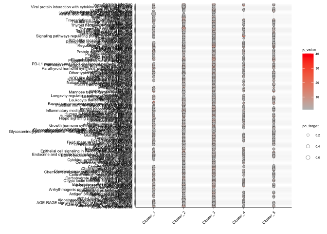<!-- -->

``` r
plot_ontology(ont_source = "KEGG", p_cut = 1e-5)
```

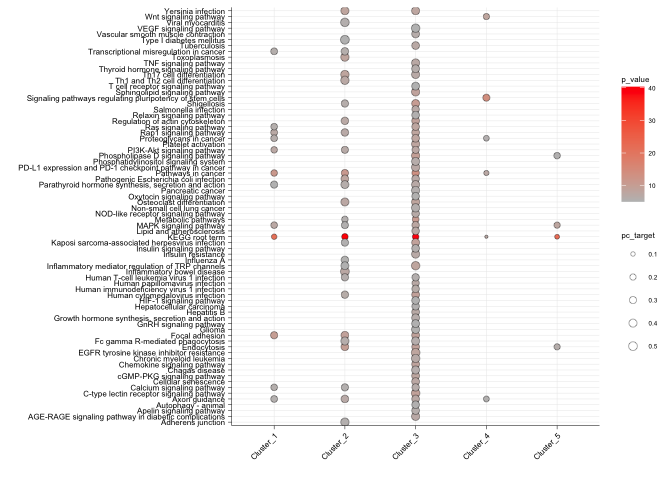<!-- -->

``` r
plot_ontology(ont_source = "GO:BP", p_cut = 1e-40)
```

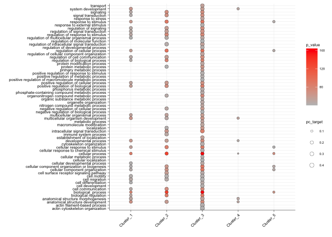<!-- -->

``` r
plot_ontology(ont_source = "GO:MF", p_cut = 1e-10)
```

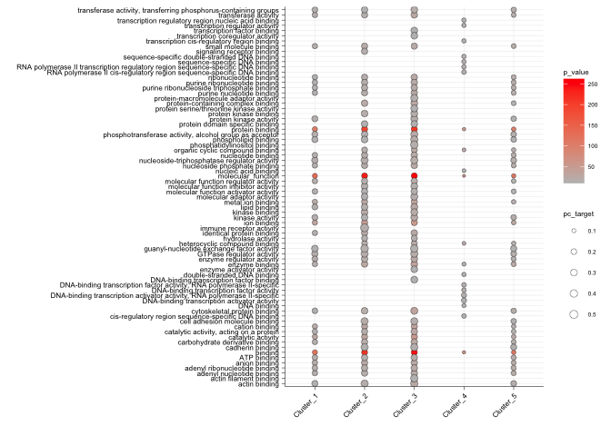<!-- -->

``` r
plot_ontology(ont_source = "HPA", p_cut = 1e-60)
```

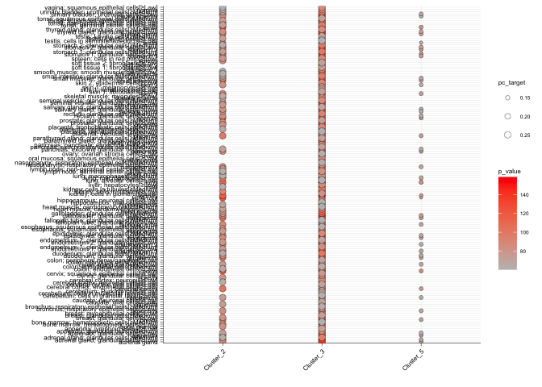<!-- -->

``` r
write.table(all_go_dat,
            file = "wgbs/processed_data/cmeans_ontology/all_ontology_results.txt",
            quote = FALSE, sep = "\t", row.names = TRUE, col.names = TRUE)
```

Run Homer to find motifs

``` bash
parallel -j5 findMotifsGenome.pl {} hg19 {.}homer/ -size given -p 6 ::: wgbs/processed_data/cmeans_cluster_*.bed
```

Plot motif enrichments

``` r
homer_known <- list.files("wgbs/processed_data/cmeans_motif_analysis/",
                          pattern = "knownResults.html", recursive = TRUE,
                          full.names = TRUE)

read_homer_known <- function(html, p_threshold=0.01, fdr_threshold=0.01,
                             fg_bg_cut=1.2){
        
        dat <- readHTMLTable(html, header = TRUE, as.data.frame = TRUE,
                             stringsAsFactors = FALSE)[[1]]
        
        ## Clean up the table
        dat <- dat[ ,c(3:10)]
        
        colnames(dat) <- c("Name", "P", "logP", "q", "nTarget", "pcTarget",
                           "nBackground", "pcBackground")
        
        tf<- str_split(dat$Name, pattern = "/", simplify = TRUE)[ ,1]
        
        # Get the stats
        pc_target <- str_replace(string = dat$pcTarget,
                                 pattern = "%",
                                 replacement = "") %>% as.numeric()
        
        pc_background <- str_replace(string = dat$pcBackground,
                                     pattern = "%",
                                     replacement = "") %>% as.numeric()
        
        pval <- as.character(dat$logP) %>% as.numeric()
        pval <- 10^pval
        
        fdr <- as.numeric(dat$q)
        
        # Get the cluster ID
        cluster <- dirname(html) %>% str_split(pattern = "/", simplify = TRUE)
        cluster <- cluster[ ,ncol(cluster)]
        
        clean_dat <- data.frame(TF=tf, pc_target=pc_target, 
                                pc_background=pc_background,
                                pval=pval, fdr=fdr,
                                cluster=cluster)
        
        ## Remove duplicate TFs
        clean_dat <- clean_dat[!duplicated(clean_dat$TF), ]
        
        ## Keep only those at present in more than 10% of sequences
        clean_dat <- clean_dat[clean_dat$pc_target > 10, ]
        
        ## Filter on FG:BG 
        clean_dat$fg_bg <- clean_dat$pc_target / clean_dat$pc_background
        clean_dat <- clean_dat[clean_dat$fg_bg >= fg_bg_cut, ]
        
        # Filter on P-value
        clean_dat <- clean_dat[clean_dat$fdr <= fdr_threshold, ]
        clean_dat <- clean_dat[clean_dat$pval <= p_threshold, ]
        
        return(clean_dat)
}

results <- lapply(homer_known, read_homer_known)

results <- do.call(rbind, results)

## Change name for reformatting
res_df <- results

## Convert the pvalues for plotting 
res_df$pval <- -log10(res_df$pval)
res_df$pval[is.infinite(res_df$pval)] <- max(res_df$pval[!is.infinite(res_df$pval)]) + 1


## Add TF id
tf_ids <- as.character(res_df$TF) %>%
        str_split(pattern = stringr::fixed("("), simplify = TRUE) %>% data.frame()

res_df$tf_id <- tf_ids$X1

res_df$tf_class <- str_replace(string = tf_ids$X2,
                               pattern = stringr::fixed(")"), replacement = "")

res_df$cluster %<>% str_remove_all(pattern = "cmeans_cluster_") %>%
    str_remove_all("homer") %>% 
    str_replace(pattern = "Naive", replacement = "N") %>%
    str_replace(pattern = "Primed", replacement = "P")

#res_df <- res_df[res_df$cluster %in% c("N1", ), ]
res_df$cluster <- factor(res_df$cluster, levels = clusters[c(1,2,4,3,5)])


gg_motif <- ggplot(res_df, aes(y = factor(tf_id),
                         x = factor(cluster), group=tf_class)) +        ## global aes
        #geom_tile(aes(fill = pval)) +         ## to get the rect filled
        geom_point(aes(fill = pval, size = pc_target),
                   colour="black", pch=21, stroke=0.176389)  +    ## geom_point for circle illusion
        scale_fill_gradient(low = "grey", high = "red") +       ## color of the corresponding aes
        scale_size(range = c(1, 3))+             ## to tune the size of circles
        xlab("") +
        ylab("") +
        facet_grid(tf_class~., scales = "free", space = "free") +
        #scale_y_discrete(label="", limits=levels(res_df$tf_id)) +
        sams_pub_theme()


pdf("wgbs/plots/regulatory_elements_cmeans_motif_plots.pdf",
    width = 2.1, height = 3.75)
gg_motif
dev.off()
```

    ## quartz_off_screen 
    ##                 2

``` r
try(openxlsx::removeWorksheet(wb = wb_fig1, sheet = "Fig_1f"))
```

    ## Error : Sheet 'Fig_1f' does not exist.

``` r
openxlsx::addWorksheet(wb_fig1, sheetName = "Fig_1f")
openxlsx::writeData(wb = wb_fig1, sheet = "Fig_1f",
                    x = gg_motif$data)

openxlsx::saveWorkbook(wb = wb_fig1,
                       file = "Figure_1_source_data.xlsx", overwrite = TRUE)

gg_motif
```

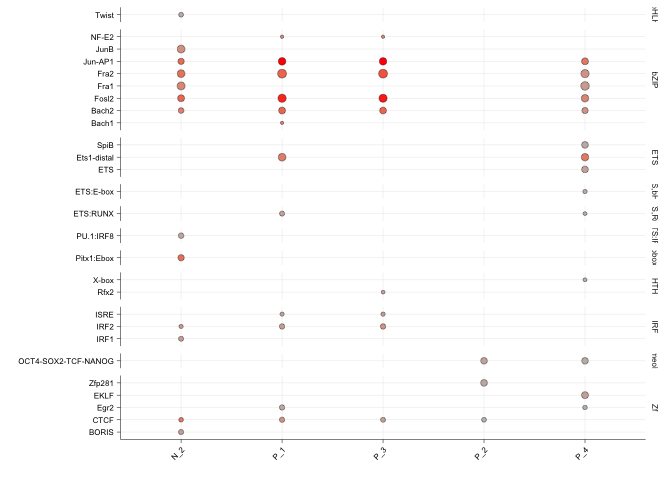<!-- -->

**Extended Data Figure 1c,d,e** Global mC stats

``` r
get_oz_plot_stats <- function(rds_path, cov_min=4){

        message(str_c("Reading ", rds_path, " ", Sys.time()))
        bs_obj <- read_bs_obj(rds_path)
        
        message("Calculating coverage...")
        Cov <- getCoverage(BSseq = bs_obj, type = "Cov",
                              what = "perBase")
        
        message("Calculating M...")
        M <- getCoverage(BSseq = bs_obj, type = "M",
                            what = "perBase")
        
        keep <- Cov >= cov_min
        
        message("Calculating methylation percentage...") 
        mCG_levels <- M[keep]/Cov[keep]
        
        covPos <- sum(keep)
        
        none <- sum(mCG_levels == 0) / covPos
        low <- sum(mCG_levels > 0 & mCG_levels <= 0.2) / covPos
        inter <- sum(mCG_levels > 0.2 & mCG_levels <= 0.8) / covPos
        high <- sum(mCG_levels > 0.8) / covPos
        
        oz_stat <- data.frame(id=basename(rds_path), none=none, low=low, inter=inter, high=high)
        
        return(oz_stat)        
        
        
}

oz_stats <- mclapply(CG_obj_fls, get_oz_plot_stats, mc.cores = 3)
oz_stats <- do.call(rbind, oz_stats)   
saveRDS(object = oz_stats, file = "wgbs/processed_data/oz_stats.Rds")
```

``` r
oz_stats <- readRDS(file = "wgbs/processed_data/oz_stats.Rds")

oz_stats$short_name <- ds_sub$Manuscript.Name[match(oz_stats$id, basename(ds_sub$BSseq_CG))]
oz_stats$state <- ds_sub$State[match(oz_stats$id, basename(ds_sub$BSseq_CG))]


oz_stats <- oz_stats[oz_stats$state %in% c("Early", "Primed", "Naive", "ESC"), ]

oz_stat_melt <- reshape2::melt(oz_stats)
```

    ## Using id, short_name, state as id variables

``` r
oz_stat_melt$variable <- factor(oz_stat_melt$variable,
                                levels=c("high", "inter", "low", "none"))

sample_order <- unique(oz_stat_melt$short_name)
sample_order <- sample_order[c(6,4,1,7,10,8,9,5,11,2,3,12:17)]


oz_stat_melt$short_name <- factor(oz_stat_melt$short_name, levels=sample_order)

oz_stat_melt$state <- factor(oz_stat_melt$state,
                 levels=c("Early", "Primed", "Naive", "ESC"))

gg <- ggplot(data = oz_stat_melt, aes(x = short_name,y = value, fill = variable)) + 
        geom_bar(position = "fill", stat = "identity") +
        theme_linedraw() +
        facet_grid(facets = .~state, scales = 'free', space = 'free_x') +
        
        scale_y_continuous(expand = c(0,0)) + 
        
        # X axis label
        xlab(label = "") + 
        
        # Y axis label
        ylab(label = "Proportion of \nCG dinucleotides") +
        
        #theme with white background
        theme_bw() +
        
        #eliminates background, gridlines, and chart border
        # theme(
        #         plot.background = element_blank()
        #         ,panel.grid.major = element_blank()
        #         ,panel.grid.minor = element_blank()
        #         ,panel.border = element_blank(),
        #         axis.text = element_text(colour = "black"),
        #         axis.line = element_line(color = 'black'),
        #         axis.text.x = element_text(angle = 90, size=8,
        #                                          hjust = 1, vjust = 0.5)
        # ) +
        sams_pub_theme() +
        # Edit legend
        scale_fill_manual(values = vitC[c(1:3,5)], name="mCG/CG level",
                          labels=rev(c("Zero (mCG/CG = 0) ",
                                   "Low (mCG/CG >0 and <0.2)",
                                   "Intermediate (mCG/CG >0.2 and <0.8)",
                                   "High (mCG/CG > 0.8)")))

pdf("wgbs/plots/oz_plot.pdf", height = 2.5, width = 4)
print(gg)
dev.off()
```

    ## quartz_off_screen 
    ##                 2

``` r
openxlsx::addWorksheet(wb_ed_fig1, sheetName = "ED_Fig_1c")
openxlsx::writeData(wb = wb_ed_fig1, sheet = "ED_Fig_1c",
                    x = gg$data[!grepl(pattern = "H9_", x = gg$data$id), ])
#openxlsx::saveWorkbook(wb = wb_ed_fig1,
#                       file = "ED_Figure_1_source_data.xlsx", overwrite = TRUE)

gg
```

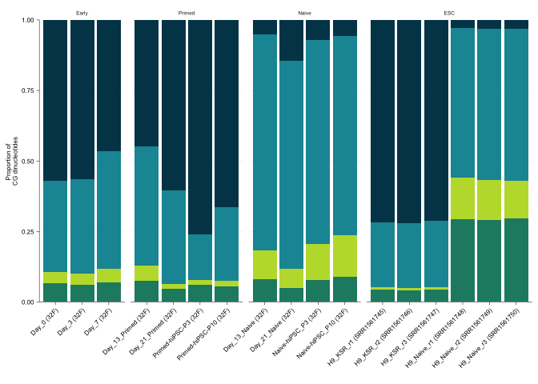<!-- -->

Global mCH plots

``` r
ids <- gg$data$id[!grepl(pattern = "H9_", x = gg$data$id)]
stats_ind <- match(ids, basename(ds$BSseq_CG))

read_stats_mCH <- function(x){
    
    df <- read.table(ds$Stats_file[x], header = TRUE)
    
    df <- data.frame(context = c("CG", "CA", "CC", "CT"),
                     mCH = as.numeric(df[ ,c("mCG", "mCA", "mCC", "mCT")]),
                     non_conversion = as.numeric(df[ ,c("nc_mCG", "nc_mCA",
                                             "nc_mCC", "nc_mCT")]))
    
    df$mCH_corrected <- df$mCH - df$non_conversion
    
    df$library <- ds$Library_id[x]
    
    return(df)
    
}

stats_df <- lapply(X = stats_ind, FUN = read_stats_mCH) %>%
    do.call(rbind, .)

id_ind <- match(stats_df$library, ds$Library_id)

stats_df$id <- ds$Manuscript.Name[id_ind]
stats_df$id <- factor(stats_df$id, levels = sample_order)

### Smith ESCs did not have lambda spike. 
### Need to just use non-corrected mCH levels

stats_df$mCH_corrected[grepl(pattern = "H9", x = stats_df$id)] <- 
    stats_df$mCH[grepl(pattern = "H9", x = stats_df$id)]

stats_df$state <- ds$State[id_ind]
#stats_df$state <- factor(stats_df$state, levels = c("Early", "Primed",
#                                                    "Naive", "ESC"))
stats_df$media <- ds$Media[id_ind]

gg_global_mCH <- ggplot(stats_df[stats_df$context != "CG" & stats_df$state != "ESC", ],
                        aes(x = id, y = mCH, fill=state)) +
    geom_col() + 
    ylab("Global mCH/CH") + xlab("") +
    scale_fill_manual(values = reprog_pal[c(3,1,2,4)]) +
    facet_grid(context~state+media, scales = "free_x", space = "free", drop = TRUE) +
    sams_pub_theme()

pdf("wgbs/plots/global_mCH_barplots.pdf", height = 4, width = 2.5)
gg_global_mCH
dev.off()
```

    ## quartz_off_screen 
    ##                 2

``` r
openxlsx::addWorksheet(wb_ed_fig1, sheetName = "ED_Fig_1e")
openxlsx::writeData(wb = wb_ed_fig1, sheet = "ED_Fig_1e",
                    x = gg_global_mCH$data)
```

Calculate per-read stats. Run on server as parsing bam files, so no eval
here.

``` bash
#!/bin/bash

bam=$1
bed=$2

# Outputs chr, left-most mapping base, cigar string and mC call string

intersectBed -abam "$bam" -b "$bed" | samtools view | cut -f3,4,6,15 | sed 's/XM:Z://g' | sed 's/-//g' | awk -F'\t' '$3!=""' | pigz > "$bam"_per_read_mC_calls.txt.gz

samtools view "$bam" | cut -f3,4,6,15 | sed 's/XM:Z://g' | sed 's/-//g' | awk -F'\t' '$3!=""' | perl -pe "s/[-yYzZ]//g" | sed '/^[[:space:]]*$/d' | pigz > "$bam"_per_read_mC_calls.txt.gz
```

``` r
### Calculate per read stats

per_read_files <- list.files("wgbs/processed_data/per_read/",
                             pattern = ".txt.gz$",
                             full.names = TRUE)

library(readr)

load_per_read_data <- function(fl, min_c=4){

        calc_read_stats <- function(x, pos) {
                c_call <- str_count(x, "x")
                mc_call <- str_count(x, "X")
                total_c <- c_call + mc_call
                keep <- total_c >= min_c
                
                mc_call <- mc_call[keep]
                total_c <- total_c[keep]
                
                mCG <- mc_call / total_c
                return(data.frame(mCG=mCG, count=total_c))
        }

        df <- read_lines_chunked(file = fl, progress = TRUE,
                                 callback = DataFrameCallback$new(calc_read_stats),
                                 chunk_size = 10000)
        df$file <- str_split_fixed(string = basename(fl), pattern = "_", n = 2)[ ,1]
        return(df)
}

test <- load_per_read_data(per_read_files[1])


per_read_dat <- lapply(per_read_files, load_per_read_data)
per_read_dat <- do.call(rbind, per_read_dat)

#### Mistake in previous code that must be fixed
per_read_dat$mCG <- 1 - per_read_dat$mCG

per_read_dat$mCG <- signif(per_read_dat$mCG, digits = 3)

saveRDS(per_read_dat, file = "wgbs/processed_data/per_read_data_WGBS.Rds")

per_read_dat <- readRDS("wgbs/processed_data/per_read_data_WGBS.Rds")
dim(per_read_dat)

ids <- unique(per_read_dat$file)
id <- ids[1]

calc_discordant_pc <- function(id){
        
        dat <- per_read_dat[per_read_dat$file == id, ]

        meth_count <- sum(dat$mCG == 1)
        unmeth_count <- sum(dat$mCG == 0)
        discord_count <- nrow(dat) - sum(meth_count, unmeth_count)

        df <- data.frame(Library=id,
                         Methylated=meth_count/nrow(dat),
                   Unmethylated=unmeth_count/nrow(dat),
                   Partial_methylation=discord_count/nrow(dat))
        return(df)
}


pc_discord <- lapply(ids, calc_discordant_pc)
pc_discord <- do.call(rbind, pc_discord)
rm(per_read_dat)

pc_discord$short_name <- ds$Short_name[match(pc_discord$Library, ds$Library)]


pc_discord$state <- ds$State[match(pc_discord$Library, ds$Library)]


pc_discord_melt <- melt(pc_discord)

pc_discord_melt <- pc_discord_melt[!grepl(pc_discord_melt$short_name, pattern = "38F"), ]
pc_discord_melt$short_name <- factor(pc_discord_melt$short_name, levels=c("d0", "d3", "d7",
                                                        "d13_Primed", "d21_Primed", "P3_Primed", "P10_Primed",
                                                        "d13_Naive", "d21_Naive", "P3_Naive", "P10_Naive"))

pc_discord_melt$state <- factor(pc_discord_melt$state, levels=c("Early", "Primed", "Naive"))
pc_discord_melt$variable <- factor(pc_discord_melt$variable,
                                   levels = c("Methylated", "Partial_methylation", "Unmethylated"))

gg <- ggplot(data = pc_discord_melt, aes(x = short_name, y = value, fill = variable)) + 
        geom_bar(position = "fill", stat = "identity") +
        theme_linedraw() +
        facet_grid(facets = .~state, scales = 'free', space = 'free_x') +
        
        scale_y_continuous(expand = c(0,0)) + 
        
        # X axis label
        xlab(label = "") + 
        
        # Y axis label
        ylab(label = "Proportion of WGBS reads") +
        
        #theme with white background
        theme_bw() +
        
        #eliminates background, gridlines, and chart border
        theme(
                plot.background = element_blank()
                ,panel.grid.major = element_blank()
                ,panel.grid.minor = element_blank()
                ,panel.border = element_blank(),
                axis.text = element_text(colour = "black"),
                axis.line = element_line(color = 'black'),
                axis.text.x = element_text(angle = 90, size=8,
                                           hjust = 1, vjust = 0.5)
        ) +
        
        # Edit legend
        scale_fill_manual(values = vitC[c(1,3,5)], name="Read class")

pdf("wgbs/plots/per_read_mCG_stats_barplots.pdf", height = 3, width = 7)
gg
dev.off()
```

**Extended Data Figure 1b,f,g** Gene expression plots run with script
“RNAseq/analysis_scripts/plot-gene-timecourse.R”

``` r
tpm <- read.table("RNAseq/processed_data/timcourse_RNAseq_hg19_UCSC_tpm.txt")
mdat <- read.csv("RNAseq/rna-timecourse-sample-sheet.csv", header = TRUE)

tpm <- tpm[ ,mdat$id]

stopifnot(all(colnames(tpm)==mdat$id))

# Quantile normalise expression
#tpm <- normalizeBetweenArrays(log2(tpm+1), method = "quantile")

plot_gene <- function(geneID, y_min=NA, y_max=NA){

    #dat <- tpm[rownames(tpm) == geneID, ] %>% as.numeric()
    dat <- log2(tpm[rownames(tpm) == geneID, ]+1) %>% as.numeric()
    dat <- data.frame(timepoints=mdat$timepoint, tpm=dat, media=mdat$media)

    # Add in naive and primed d7 pseudo-timepoints for plotting
    dat2 <- data.frame(timepoints=c("d7", "d7"),
                      tpm=dat$tpm[dat$timepoints == "d7"],
                      media=c("Primed", "Naive"))
    dat <- rbind(dat2, dat)

    dat$timepoints <- str_replace(string = dat$timepoints,
                                  pattern = "^d", replacement = "day_")

    dat$timepoints <- factor(dat$timepoints, levels = c("day_0", "day_3", "day_7",
                                                        "day_13", "day_21", "P3",
                                                        "P10"))

    dat$media <- as.character(dat$media)
    dat$media[dat$media == "Fibroblast"] <- "Early"
    dat$media <- factor(dat$media, levels=c("Early", "Naive", "Primed"))

    gg <- ggplot2::ggplot(dat, aes(x=timepoints, group=media,
                                   col=media, fill=media, y=tpm)) +
        scale_x_discrete(limits=levels(dat$timepoints)) +
        scale_y_continuous(limits = c(y_min, y_max)) +
        geom_point(size=1) +
        stat_summary(mapping = aes(group=media, colour=media), geom="line",
                     fun = mean, size=0.5) +
        scale_color_manual(values = reprog_pal[c(3, 2, 1)]) +
        scale_fill_manual(values = reprog_pal[c(3, 2, 1)]) +
        ggtitle(geneID) +
        xlab("") + ylab("") +
        sams_pub_theme(legend_pos = "NA")
    gg
}

### Cluster genes

# Naive_2
p1 <- plot_gene(geneID = "LMNA") + ylab("Cluster 1")
p2 <- plot_gene(geneID = "NFIX")

# Primed_4
p3 <- plot_gene(geneID = "LGALS3") + ylab("Cluster 2")
p4 <- plot_gene(geneID = "COL6A3")

# Primed_1
p5 <- plot_gene(geneID = "STARD13") + ylab("Cluster 3")
p6 <- plot_gene(geneID = "KLF6")

# Primed_2 cluster
p7 <- plot_gene(geneID = "SNHG1") + ylab("Cluster 4")
p8 <- plot_gene(geneID = "TUBB2A")

# Primed_3 transient cluster
p9 <- plot_gene(geneID = "RNASET2") + ylab("Cluster 5")
p10 <- plot_gene(geneID = "ZMAT3")

# Plot all together
pdf("RNAseq/plots/Fig1_cluster_example_genes.pdf", height = 6, width = 2.6)
plot_grid(plotlist = list(p1, p2, p3, p4, p5,
                          p6, p7, p8, p9, p10),
          align = "hv", nrow = 5, ncol = 2)
dev.off()
```

    ## quartz_off_screen 
    ##                 2

``` r
### Pluripotency genes
pl_gene_plots <- list(plot_gene(geneID = "ANPEP", y_min = 0),
                    plot_gene(geneID = "SNAI2", y_min = 0),
                    plot_gene(geneID = "SERPINE1", y_min = 0),
                    plot_gene(geneID = "MMP1", y_min = 0),
                    plot_gene(geneID = "ESM1", y_min = 0),
                    plot_gene(geneID = "ZIC2", y_min = 0),
                    plot_gene(geneID = "SOX11", y_min = 0),
                    plot_gene(geneID = "ZIC3", y_min = 0),
                    plot_gene(geneID = "SFRP2", y_min = 0),
                    plot_gene(geneID = "SALL2", y_min = 0),
                    plot_gene(geneID = "KLF4", y_min = 0),
                    plot_gene(geneID = "KLF5", y_min = 0),
                    plot_gene(geneID = "KLF17", y_min = 0),
                    plot_gene(geneID = "TFCP2L1", y_min = 0),
                    plot_gene(geneID = "DPPA5", y_min = 0))

pdf("RNAseq/plots/Fig1_pluripotency_genes.pdf", height = 6, width = 3.9)
plot_grid(plotlist = pl_gene_plots, align = "hv", nrow = 5, ncol = 3,
          byrow = FALSE)
dev.off()
```

    ## quartz_off_screen 
    ##                 2

``` r
### DNA methylation genes
mC_gene_plots <- list(plot_gene(geneID = "DNMT1", y_min = 0),
                      plot_gene(geneID = "DNMT3A", y_min = 0),
                      plot_gene(geneID = "DNMT3B", y_min = 0),
                      plot_gene(geneID = "DNMT3L", y_min = 0),
                      plot_gene(geneID = "TET1", y_min = 0),
                      plot_gene(geneID = "TET2", y_min = 0),
                      plot_gene(geneID = "TET3", y_min = 0),
                      plot_gene(geneID = "DPPA3", y_min = 0))

pdf("RNAseq/plots/Fig1_methylation_genes.pdf", height = 5, width = 2.6)
plot_grid(plotlist = mC_gene_plots, align = "hv", nrow = 4, ncol = 2,
          byrow = FALSE)
dev.off()
```

    ## quartz_off_screen 
    ##                 2

``` r
ed_1g <- c("LMNA",  "NFIX", "LGALS3", "COL6A3", "STARD13", "KLF6",
           "SNHG1", "TUBB2A", "RNASET2", "ZMAT3")
ed_1g_tpm <- tpm[rownames(tpm) %in% ed_1g, ]
openxlsx::addWorksheet(wb_ed_fig1, sheetName = "ED_Fig_1g")
openxlsx::writeData(wb = wb_ed_fig1, sheet = "ED_Fig_1g",
                    x = ed_1g_tpm)

ed_1b <- c("ANPEP","SNAI2", "SERPINE1", 
             "MMP1", "ESM1",  "ZIC2", "SOX11", "ZIC3", "SFRP2", "SALL2",  "KLF4",
             "KLF5", "KLF17", "TFCP2L1", "DPPA5")
ed_1b_tpm <- tpm[rownames(tpm) %in% ed_1b, ]
openxlsx::addWorksheet(wb_ed_fig1, sheetName = "ED_Fig_1b")
openxlsx::writeData(wb = wb_ed_fig1, sheet = "ED_Fig_1b",
                    x = ed_1b_tpm)

ed_1f <- c("DNMT1",  "DNMT3A", "DNMT3B", "DNMT3L", "TET1", "TET2",
             "TET3", "DPPA3")
ed_1f_tpm <- tpm[rownames(tpm) %in% ed_1f, ]
openxlsx::addWorksheet(wb_ed_fig1, sheetName = "ED_Fig_1f")
openxlsx::writeData(wb = wb_ed_fig1, sheet = "ED_Fig_1f",
                    x = ed_1f_tpm)

openxlsx::saveWorkbook(wb = wb_ed_fig1,
                       file = "ED_Figure_1_source_data.xlsx", overwrite = TRUE)
```

### Session info

``` r
sessionInfo()
```

    ## R version 4.2.1 (2022-06-23)
    ## Platform: x86_64-apple-darwin17.0 (64-bit)
    ## Running under: macOS Big Sur ... 10.16
    ## 
    ## Matrix products: default
    ## BLAS:   /Library/Frameworks/R.framework/Versions/4.2/Resources/lib/libRblas.0.dylib
    ## LAPACK: /Library/Frameworks/R.framework/Versions/4.2/Resources/lib/libRlapack.dylib
    ## 
    ## locale:
    ## [1] en_AU.UTF-8/en_AU.UTF-8/en_AU.UTF-8/C/en_AU.UTF-8/en_AU.UTF-8
    ## 
    ## attached base packages:
    ##  [1] grid      parallel  stats4    stats     graphics  grDevices utils    
    ##  [8] datasets  methods   base     
    ## 
    ## other attached packages:
    ##  [1] dplyr_1.0.10                           
    ##  [2] RColorBrewer_1.1-3                     
    ##  [3] XML_3.99-0.12                          
    ##  [4] ggExtra_0.10.0                         
    ##  [5] gprofiler2_0.2.1                       
    ##  [6] gt_0.8.0                               
    ##  [7] Gviz_1.40.1                            
    ##  [8] edgeR_3.38.4                           
    ##  [9] limma_3.52.4                           
    ## [10] UpSetR_1.4.0                           
    ## [11] gtools_3.9.4                           
    ## [12] ggdendro_0.1.23                        
    ## [13] TxDb.Hsapiens.UCSC.hg19.knownGene_3.2.2
    ## [14] ChIPpeakAnno_3.30.1                    
    ## [15] ggridges_0.5.4                         
    ## [16] ggalluvial_0.12.3                      
    ## [17] alluvial_0.1-2                         
    ## [18] VariantAnnotation_1.42.1               
    ## [19] Rsamtools_2.12.0                       
    ## [20] ggthemes_4.2.4                         
    ## [21] cowplot_1.1.1                          
    ## [22] ggrepel_0.9.2                          
    ## [23] ggfortify_0.4.15                       
    ## [24] pheatmap_1.0.12                        
    ## [25] GenomicFeatures_1.48.4                 
    ## [26] AnnotationDbi_1.58.0                   
    ## [27] BSgenome.Hsapiens.UCSC.hg19_1.4.3      
    ## [28] BSgenome_1.64.0                        
    ## [29] rtracklayer_1.56.1                     
    ## [30] Biostrings_2.64.1                      
    ## [31] XVector_0.36.0                         
    ## [32] data.table_1.14.6                      
    ## [33] readxl_1.4.1                           
    ## [34] openxlsx_4.2.5.1                       
    ## [35] stringr_1.5.0                          
    ## [36] magrittr_2.0.3                         
    ## [37] bsseq_1.32.0                           
    ## [38] SummarizedExperiment_1.26.1            
    ## [39] MatrixGenerics_1.8.1                   
    ## [40] matrixStats_0.63.0                     
    ## [41] GenomicRanges_1.48.0                   
    ## [42] GenomeInfoDb_1.32.4                    
    ## [43] IRanges_2.30.1                         
    ## [44] S4Vectors_0.34.0                       
    ## [45] e1071_1.7-12                           
    ## [46] caret_6.0-93                           
    ## [47] lattice_0.20-45                        
    ## [48] ggplot2_3.4.1                          
    ## [49] Biobase_2.56.0                         
    ## [50] BiocGenerics_0.42.0                    
    ## [51] preprocessCore_1.58.0                  
    ## 
    ## loaded via a namespace (and not attached):
    ##   [1] rappdirs_0.3.3            ModelMetrics_1.2.2.2     
    ##   [3] R.methodsS3_1.8.2         tidyr_1.2.1              
    ##   [5] bit64_4.0.5               knitr_1.41               
    ##   [7] DelayedArray_0.22.0       R.utils_2.12.2           
    ##   [9] rpart_4.1.19              KEGGREST_1.36.3          
    ##  [11] hardhat_1.2.0             RCurl_1.98-1.9           
    ##  [13] AnnotationFilter_1.20.0   generics_0.1.3           
    ##  [15] lambda.r_1.2.4            RSQLite_2.2.19           
    ##  [17] proxy_0.4-27              future_1.29.0            
    ##  [19] bit_4.0.5                 xml2_1.3.3               
    ##  [21] lubridate_1.9.0           httpuv_1.6.6             
    ##  [23] assertthat_0.2.1          gower_1.0.0              
    ##  [25] xfun_0.35                 hms_1.1.2                
    ##  [27] evaluate_0.18             promises_1.2.0.1         
    ##  [29] fansi_1.0.4               restfulr_0.0.15          
    ##  [31] progress_1.2.2            dbplyr_2.2.1             
    ##  [33] DBI_1.1.3                 htmlwidgets_1.5.4        
    ##  [35] futile.logger_1.4.3       purrr_0.3.5              
    ##  [37] ellipsis_0.3.2            backports_1.4.1          
    ##  [39] permute_0.9-7             biomaRt_2.52.0           
    ##  [41] deldir_1.0-6              sparseMatrixStats_1.8.0  
    ##  [43] vctrs_0.5.2               ensembldb_2.20.2         
    ##  [45] cachem_1.0.6              withr_2.5.0              
    ##  [47] checkmate_2.1.0           GenomicAlignments_1.32.1 
    ##  [49] prettyunits_1.1.1         cluster_2.1.4            
    ##  [51] lazyeval_0.2.2            crayon_1.5.2             
    ##  [53] labeling_0.4.2            recipes_1.0.3            
    ##  [55] pkgconfig_2.0.3           nlme_3.1-160             
    ##  [57] ProtGenerics_1.28.0       nnet_7.3-18              
    ##  [59] rlang_1.0.6               globals_0.16.2           
    ##  [61] lifecycle_1.0.3           miniUI_0.1.1.1           
    ##  [63] filelock_1.0.2            BiocFileCache_2.4.0      
    ##  [65] dichromat_2.0-0.1         VennDiagram_1.7.3        
    ##  [67] cellranger_1.1.0          graph_1.74.0             
    ##  [69] Matrix_1.5-3              Rhdf5lib_1.18.2          
    ##  [71] base64enc_0.1-3           png_0.1-8                
    ##  [73] viridisLite_0.4.1         rjson_0.2.21             
    ##  [75] bitops_1.0-7              R.oo_1.25.0              
    ##  [77] rhdf5filters_1.8.0        pROC_1.18.0              
    ##  [79] blob_1.2.3                DelayedMatrixStats_1.18.2
    ##  [81] regioneR_1.28.0           parallelly_1.32.1        
    ##  [83] jpeg_0.1-10               scales_1.2.1             
    ##  [85] memoise_2.0.1             plyr_1.8.8               
    ##  [87] zlibbioc_1.42.0           compiler_4.2.1           
    ##  [89] BiocIO_1.6.0              cli_3.6.0                
    ##  [91] listenv_0.8.0             htmlTable_2.4.1          
    ##  [93] formatR_1.12              Formula_1.2-4            
    ##  [95] MASS_7.3-58.1             tidyselect_1.2.0         
    ##  [97] stringi_1.7.12            highr_0.9                
    ##  [99] yaml_2.3.6                locfit_1.5-9.6           
    ## [101] latticeExtra_0.6-30       tools_4.2.1              
    ## [103] timechange_0.1.1          future.apply_1.10.0      
    ## [105] rstudioapi_0.14           foreach_1.5.2            
    ## [107] foreign_0.8-83            gridExtra_2.3            
    ## [109] prodlim_2019.11.13        farver_2.1.1             
    ## [111] digest_0.6.30             shiny_1.7.3              
    ## [113] lava_1.7.0                Rcpp_1.0.9               
    ## [115] later_1.3.0               httr_1.4.4               
    ## [117] biovizBase_1.44.0         colorspace_2.1-0         
    ## [119] splines_4.2.1             RBGL_1.72.0              
    ## [121] multtest_2.52.0           plotly_4.10.1            
    ## [123] xtable_1.8-4              jsonlite_1.8.3           
    ## [125] futile.options_1.0.1      timeDate_4021.106        
    ## [127] ipred_0.9-13              R6_2.5.1                 
    ## [129] Hmisc_4.7-2               pillar_1.8.1             
    ## [131] htmltools_0.5.3           mime_0.12                
    ## [133] glue_1.6.2                fastmap_1.1.0            
    ## [135] BiocParallel_1.30.4       class_7.3-20             
    ## [137] codetools_0.2-18          utf8_1.2.3               
    ## [139] tibble_3.1.8              curl_4.3.3               
    ## [141] zip_2.2.2                 interp_1.1-3             
    ## [143] survival_3.4-0            rmarkdown_2.18           
    ## [145] InteractionSet_1.24.0     munsell_0.5.0            
    ## [147] rhdf5_2.40.0              GenomeInfoDbData_1.2.8   
    ## [149] iterators_1.0.14          HDF5Array_1.24.2         
    ## [151] reshape2_1.4.4            gtable_0.3.1
