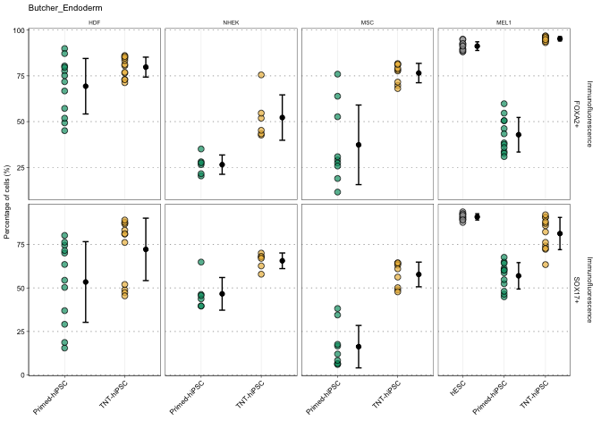
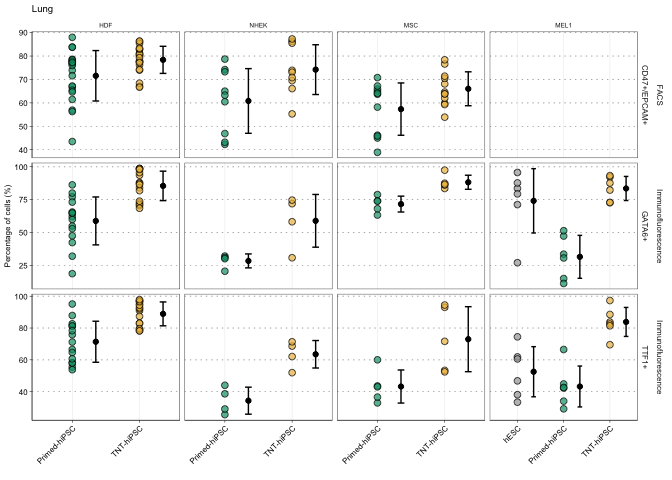
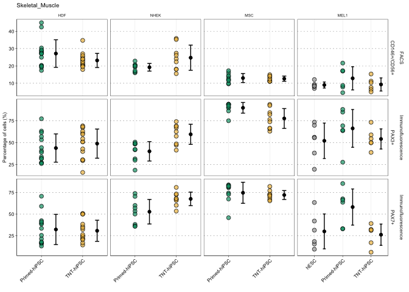

hiPSC differentiation analysis
================
Sam Buckberry
2023-06-23

``` r
source("R/project_functions.R")
```

    ## Loading required package: BiocGenerics

    ## 
    ## Attaching package: 'BiocGenerics'

    ## The following objects are masked from 'package:stats':
    ## 
    ##     IQR, mad, sd, var, xtabs

    ## The following objects are masked from 'package:base':
    ## 
    ##     anyDuplicated, append, as.data.frame, basename, cbind, colnames,
    ##     dirname, do.call, duplicated, eval, evalq, Filter, Find, get, grep,
    ##     grepl, intersect, is.unsorted, lapply, Map, mapply, match, mget,
    ##     order, paste, pmax, pmax.int, pmin, pmin.int, Position, rank,
    ##     rbind, Reduce, rownames, sapply, setdiff, sort, table, tapply,
    ##     union, unique, unsplit, which.max, which.min

    ## Welcome to Bioconductor
    ## 
    ##     Vignettes contain introductory material; view with
    ##     'browseVignettes()'. To cite Bioconductor, see
    ##     'citation("Biobase")', and for packages 'citation("pkgname")'.

    ## Loading required package: ggplot2

    ## Loading required package: lattice

    ## Loading required package: GenomicRanges

    ## Loading required package: stats4

    ## Loading required package: S4Vectors

    ## 
    ## Attaching package: 'S4Vectors'

    ## The following objects are masked from 'package:base':
    ## 
    ##     expand.grid, I, unname

    ## Loading required package: IRanges

    ## Loading required package: GenomeInfoDb

    ## Loading required package: SummarizedExperiment

    ## Loading required package: MatrixGenerics

    ## Loading required package: matrixStats

    ## 
    ## Attaching package: 'matrixStats'

    ## The following objects are masked from 'package:Biobase':
    ## 
    ##     anyMissing, rowMedians

    ## 
    ## Attaching package: 'MatrixGenerics'

    ## The following objects are masked from 'package:matrixStats':
    ## 
    ##     colAlls, colAnyNAs, colAnys, colAvgsPerRowSet, colCollapse,
    ##     colCounts, colCummaxs, colCummins, colCumprods, colCumsums,
    ##     colDiffs, colIQRDiffs, colIQRs, colLogSumExps, colMadDiffs,
    ##     colMads, colMaxs, colMeans2, colMedians, colMins, colOrderStats,
    ##     colProds, colQuantiles, colRanges, colRanks, colSdDiffs, colSds,
    ##     colSums2, colTabulates, colVarDiffs, colVars, colWeightedMads,
    ##     colWeightedMeans, colWeightedMedians, colWeightedSds,
    ##     colWeightedVars, rowAlls, rowAnyNAs, rowAnys, rowAvgsPerColSet,
    ##     rowCollapse, rowCounts, rowCummaxs, rowCummins, rowCumprods,
    ##     rowCumsums, rowDiffs, rowIQRDiffs, rowIQRs, rowLogSumExps,
    ##     rowMadDiffs, rowMads, rowMaxs, rowMeans2, rowMedians, rowMins,
    ##     rowOrderStats, rowProds, rowQuantiles, rowRanges, rowRanks,
    ##     rowSdDiffs, rowSds, rowSums2, rowTabulates, rowVarDiffs, rowVars,
    ##     rowWeightedMads, rowWeightedMeans, rowWeightedMedians,
    ##     rowWeightedSds, rowWeightedVars

    ## The following object is masked from 'package:Biobase':
    ## 
    ##     rowMedians

    ## 
    ## Attaching package: 'magrittr'

    ## The following object is masked from 'package:GenomicRanges':
    ## 
    ##     subtract

    ## 
    ## Attaching package: 'data.table'

    ## The following object is masked from 'package:SummarizedExperiment':
    ## 
    ##     shift

    ## The following object is masked from 'package:GenomicRanges':
    ## 
    ##     shift

    ## The following object is masked from 'package:IRanges':
    ## 
    ##     shift

    ## The following objects are masked from 'package:S4Vectors':
    ## 
    ##     first, second

    ## Loading required package: BSgenome

    ## Loading required package: Biostrings

    ## Loading required package: XVector

    ## 
    ## Attaching package: 'Biostrings'

    ## The following object is masked from 'package:base':
    ## 
    ##     strsplit

    ## Loading required package: rtracklayer

    ## Loading required package: AnnotationDbi

    ## 
    ## Attaching package: 'ggthemes'

    ## The following object is masked from 'package:cowplot':
    ## 
    ##     theme_map

    ## Loading required package: Rsamtools

    ## 
    ## Attaching package: 'VariantAnnotation'

    ## The following object is masked from 'package:stringr':
    ## 
    ##     fixed

    ## The following object is masked from 'package:base':
    ## 
    ##     tabulate

    ## 
    ## Attaching package: 'ChIPpeakAnno'

    ## The following object is masked from 'package:VariantAnnotation':
    ## 
    ##     info

    ## 
    ## Attaching package: 'gtools'

    ## The following object is masked from 'package:e1071':
    ## 
    ##     permutations

    ## 
    ## Attaching package: 'UpSetR'

    ## The following object is masked from 'package:lattice':
    ## 
    ##     histogram

    ## Loading required package: limma

    ## 
    ## Attaching package: 'limma'

    ## The following object is masked from 'package:BiocGenerics':
    ## 
    ##     plotMA

    ## Loading required package: grid

    ## 
    ## Attaching package: 'grid'

    ## The following object is masked from 'package:Biostrings':
    ## 
    ##     pattern

List the data files for differentiations

``` r
dat <- read.csv("differentiation_expts/plot_data/221204_all_diffs.csv")
```

Plotting functions

Plot differentiation results for each genetic background

``` r
plot_line <- function(line, fill_cols=c("#009e73", "#eebc4c")){
    
    line_dat <- dat[dat$Line == line, ]
    line_dat$Measure <- str_remove(string = line_dat$Measure, pattern = "Percentage of ")
    
    ## Add plot identifier
    line_dat$ids <- str_c(line_dat$Experiment, line_dat$Platform, line_dat$Measure, sep = "_")
    ids <- unique(line_dat$ids)
    
    plot_expt <- function(id){
        gg <- ggplot(data = line_dat[line_dat$ids == id, ], aes(x = Group, y = Value,
                                      fill=Group, colour="black")) +
    geom_point(size=2, alpha=0.7, shape=21) +
    scale_color_manual(values = c("#000000")) +
    scale_fill_manual(values = fill_cols) +
    stat_summary(fun.data=mean_sdl, fun.args = list(mult=1),
                 geom="errorbar", color="black", width=0.1,
                 position = position_nudge(x = 0.25)) +
    stat_summary(fun=mean, geom="point", color="black",
                 position = position_nudge(x = 0.25)) +
    ylab("Percentage of cells (%)") + xlab("") +
    facet_wrap(Experiment~Platform+Measure,
               scales = "free_x", drop = TRUE) +
    #scale_y_continuous(breaks = c(10,20,30,40,50,60)) +
    theme_bw(base_size = 7, base_line_size = line_mm) +
    theme(axis.text.x = element_text(angle = 45, hjust = 1,
                                                 colour = 'black'),
          plot.background = element_blank(),
                      panel.grid.minor = element_blank(),
                      panel.grid.major.y = element_line(size = line_mm,
                                                        colour = "grey30",
                                                        linetype = "dotted"),
          legend.position = "none") +
            sams_pub_theme()
        
    return(gg)    
    }
    
    pl <- lapply(ids, plot_expt)
    
    plot_grid(plotlist = pl, ncol = 4)
    
}

pdf("differentiation_expts/plots/MSC_all_diff_quant.pdf", width = 4, height = 7)
plot_line("MSC")
```

    ## Warning: The `size` argument of `element_line()` is deprecated as of ggplot2 3.4.0.
    ## ℹ Please use the `linewidth` argument instead.

``` r
dev.off()
```

    ## quartz_off_screen 
    ##                 2

``` r
pdf("differentiation_expts/plots/NHEK_all_diff_quant.pdf", width = 4, height = 7)
plot_line("NHEK")
dev.off()
```

    ## quartz_off_screen 
    ##                 2

``` r
pdf("differentiation_expts/plots/HDF_32F_all_diff_quant.pdf", width = 4, height = 7)
plot_line("HDF", fill_cols = c("#009e73", "#eebc4c", "#a3a3a3"))
dev.off()
```

    ## quartz_off_screen 
    ##                 2

``` r
pdf("differentiation_expts/plots/MEL1_all_diff_quant.pdf", width = 4, height = 7)
plot_line("MEL1", fill_cols = c("#a3a3a3", "#009e73", "#eebc4c"))
dev.off()
```

    ## quartz_off_screen 
    ##                 2

Plot for each type of differentiation

``` r
plot_diff <- function(diff="Butcher_Endoderm",
                      fill_cols=c("#a3a3a3", "#009e73", "#eebc4c")){
    
    line_dat <- dat[dat$Experiment == diff, ]
    line_dat$Measure <- str_remove(string = line_dat$Measure,
                                   pattern = "Percentage of ")
    
    line_dat$Line <- factor(line_dat$Line, levels = c("HDF", "NHEK", "MSC", "MEL1", "H9"))
    
    ## Add plot identifier
    line_dat$ids <- str_c(line_dat$Experiment, line_dat$Platform, line_dat$Measure, sep = "_")
    ids <- unique(line_dat$ids)
    
    gg <- ggplot(data = line_dat, aes(x = Group, y = Value,
                                      fill=Group, colour="black")) +
    geom_point(size=2, alpha=0.7, shape=21) +
    scale_color_manual(values = c("#000000")) +
    scale_fill_manual(values = fill_cols) +
    stat_summary(fun.data=mean_sdl, fun.args = list(mult=1),
                 geom="errorbar", color="black", width=0.1,
                 position = position_nudge(x = 0.35)) +
    stat_summary(fun=mean, geom="point", color="black",
                 position = position_nudge(x = 0.35)) +
    ylab("Percentage of cells (%)") + xlab("") +
    facet_grid(Platform+Measure~Line,
               scales = "free", drop = TRUE) +
    scale_y_continuous() +
    theme_bw(base_size = 7, base_line_size = line_mm) +
    theme(
          legend.position = "none",
          plot.background = element_blank(),
                      panel.grid.minor = element_blank(),
                      panel.grid.major = element_line(size = line_mm),
                      axis.text.x = element_text(angle = 45, hjust = 1, size = 6,
                                                 colour = 'black'),
                      axis.text.y = element_text(size=6, colour='black', angle = 0),
                      strip.text.y = element_text(size = 6),
                      text = element_text(size=6),
                      strip.background = element_blank(),
          panel.grid.major.y = element_line(size = line_mm,
                                                        colour = "grey30",
                                                        linetype = "dotted"),
                      axis.line.x = element_line(color = 'black', size = line_mm),
                      axis.line.y = element_line(color = 'black', size = line_mm),
                      axis.ticks = element_line(color = 'black', size = line_mm)) +
        ggtitle(diff)
    return(gg)
}

pdf("differentiation_expts/plots/butcher_endoderm_all.pdf", height = 3, width = 3)
plot_diff(diff = "Butcher_Endoderm")
dev.off()
```

    ## quartz_off_screen 
    ##                 2

``` r
pdf("differentiation_expts/plots/lung_all.pdf", height = 4, width = 3)
plot_diff(diff = "Lung")
dev.off()
```

    ## quartz_off_screen 
    ##                 2

``` r
pdf("differentiation_expts/plots/skeletal_muscle_all.pdf", height = 4, width = 3)
plot_diff(diff = "Skeletal_Muscle")
dev.off()
```

    ## quartz_off_screen 
    ##                 2

``` r
pdf("differentiation_expts/plots/neural_all.pdf", height = 4, width = 3)
plot_diff(diff = "Neural")
dev.off()
```

    ## quartz_off_screen 
    ##                 2

``` r
pdf("differentiation_expts/plots/nsc_all.pdf", height = 1.95, width = 3)
plot_diff(diff = "NSC")
dev.off()
```

    ## quartz_off_screen 
    ##                 2

``` r
plot_diff(diff = "Butcher_Endoderm")
```

<!-- -->

``` r
plot_diff(diff = "Lung")
```

<!-- -->

``` r
plot_diff(diff = "Skeletal_Muscle")
```

<!-- -->

``` r
plot_diff(diff = "Neural")
```

<!-- -->

``` r
plot_diff(diff = "NSC")
```

<!-- -->

Calculate differentiation stats

``` r
dat$stats_group <- str_c(dat$Line, dat$Experiment, dat$Platform, dat$Measure, sep="_")

dat$origin_layer <- NA

dat$origin_layer[dat$Line == "HDF"] <- "Mesoderm"
dat$origin_layer[dat$Line == "MEL1"] <- "Mesoderm"
dat$origin_layer[dat$Line == "MSC"] <- "Mesoderm"
dat$origin_layer[dat$Line == "NHEK"] <- "Ectoderm"

dat$diff_layer <- NA
dat$diff_layer[dat$Experiment == "Butcher_Endoderm"] <- "Endoderm"
dat$diff_layer[dat$Experiment == "Lung"] <- "Endoderm"
dat$diff_layer[dat$Experiment == "Neural"] <- "Ectoderm"
dat$diff_layer[dat$Experiment == "Skeletal_Muscle"] <- "Mesoderm"
dat$diff_layer[dat$Experiment == "NSC"] <- "Ectoderm"

grps <- unique(dat$stats_group)
grps <- grps[grps != "H9_NSC_FACS_Percentage of NCAM+/FAP-"]


run_t_test <- function(stats_grp){
    
    print(stats_grp)
    df <- dat[dat$stats_group == stats_grp, ]
    
    alt <- NA
    
    if (df$origin_layer[1] == df$diff_layer[1]) {
        alt <- "less"
    } else if (df$origin_layer[1] != df$diff_layer[1]){
        alt <- "greater"
    }
    
    m1 <- df$Value[df$Group == "Primed-hiPSC"] %>% mean()
    m2 <- df$Value[df$Group == "TNT-hiPSC"] %>% mean()
    
    fc <- m2/m1
    
    tt <- t.test(y = df$Value[df$Group == "Primed-hiPSC"], 
           x = df$Value[df$Group == "TNT-hiPSC"],
           #alternative=alt,
           alternative="two.sided")
    
    out <- data.frame(Differentiation=df$Experiment[1],
                      Group = stats_grp, Line=df$Line[1],
                      Method=df$Platform[1],
                      Measure=df$Measure[1],
                      Lab=df$Lab[1],
                      Origin=df$origin_layer[1],
                      Differentiation=df$diff_layer[1],
                      n_primed=length(df$Value[df$Group == "Primed-hiPSC"]),
                      n_tnt=length(df$Value[df$Group == "TNT-hiPSC"]),
                      primed_mean=round(m1, digits = 1),
                      tnt_mean=round(m2, digits = 1),
                      #t_test=str_c("TNT ", alt),
                      t_statistic=round(tt$statistic,digits = 1),
                      log_fc = round(log2(fc),digits = 1),
                      p=format(tt$p.value, scientific = TRUE, digits = 2))
    
    return(out)
}

tt_dat <- lapply(grps, run_t_test) %>% do.call(rbind, .)
```

    ## [1] "HDF_Butcher_Endoderm_Immunofluorescence_Percentage of SOX17+"
    ## [1] "HDF_Butcher_Endoderm_Immunofluorescence_Percentage of FOXA2+"
    ## [1] "MSC_Butcher_Endoderm_Immunofluorescence_Percentage of SOX17+"
    ## [1] "MSC_Butcher_Endoderm_Immunofluorescence_Percentage of FOXA2+"
    ## [1] "NHEK_Butcher_Endoderm_Immunofluorescence_Percentage of SOX17+"
    ## [1] "NHEK_Butcher_Endoderm_Immunofluorescence_Percentage of FOXA2+"
    ## [1] "HDF_Lung_FACS_Percentage of CD47+/EPCAM+"
    ## [1] "MSC_Lung_FACS_Percentage of CD47+/EPCAM+"
    ## [1] "NHEK_Lung_FACS_Percentage of CD47+/EPCAM+"
    ## [1] "HDF_Lung_Immunofluorescence_Percentage of TTF1+"
    ## [1] "HDF_Lung_Immunofluorescence_Percentage of GATA6+"
    ## [1] "MSC_Lung_Immunofluorescence_Percentage of TTF1+"
    ## [1] "MSC_Lung_Immunofluorescence_Percentage of GATA6+"
    ## [1] "NHEK_Lung_Immunofluorescence_Percentage of TTF1+"
    ## [1] "NHEK_Lung_Immunofluorescence_Percentage of GATA6+"
    ## [1] "HDF_Neural_FACS_Percentage of CD56+/CD57+"
    ## [1] "MSC_Neural_FACS_Percentage of CD56+/CD57+"
    ## [1] "NHEK_Neural_FACS_Percentage of CD56+/CD57+"
    ## [1] "HDF_Neural_Immunofluorescence_Percentage of SOX1+"
    ## [1] "HDF_Neural_Immunofluorescence_Percentage of PAX6+"
    ## [1] "MSC_Neural_Immunofluorescence_Percentage of SOX1+"
    ## [1] "MSC_Neural_Immunofluorescence_Percentage of PAX6+"
    ## [1] "NHEK_Neural_Immunofluorescence_Percentage of SOX1+"
    ## [1] "NHEK_Neural_Immunofluorescence_Percentage of PAX6+"
    ## [1] "HDF_Skeletal_Muscle_FACS_Percentage of CD146+/CD56+"
    ## [1] "MSC_Skeletal_Muscle_FACS_Percentage of CD146+/CD56+"
    ## [1] "NHEK_Skeletal_Muscle_FACS_Percentage of CD146+/CD56+"
    ## [1] "HDF_Skeletal_Muscle_Immunofluorescence_Percentage of PAX7+"
    ## [1] "HDF_Skeletal_Muscle_Immunofluorescence_Percentage of PAX3+"
    ## [1] "MSC_Skeletal_Muscle_Immunofluorescence_Percentage of PAX7+"
    ## [1] "MSC_Skeletal_Muscle_Immunofluorescence_Percentage of PAX3+"
    ## [1] "NHEK_Skeletal_Muscle_Immunofluorescence_Percentage of PAX7+"
    ## [1] "NHEK_Skeletal_Muscle_Immunofluorescence_Percentage of PAX3+"
    ## [1] "MEL1_Neural_FACS_Percentage of CD56+/CD57+"
    ## [1] "MEL1_Skeletal_Muscle_FACS_Percentage of CD146+/CD56+"
    ## [1] "MEL1_Butcher_Endoderm_Immunofluorescence_Percentage of SOX17+"
    ## [1] "MEL1_Butcher_Endoderm_Immunofluorescence_Percentage of FOXA2+"
    ## [1] "MEL1_Lung_Immunofluorescence_Percentage of TTF1+"
    ## [1] "MEL1_Lung_Immunofluorescence_Percentage of GATA6+"
    ## [1] "MEL1_Neural_Immunofluorescence_Percentage of SOX1+"
    ## [1] "MEL1_Neural_Immunofluorescence_Percentage of PAX6+"
    ## [1] "MEL1_Skeletal_Muscle_Immunofluorescence_Percentage of PAX7+"
    ## [1] "MEL1_Skeletal_Muscle_Immunofluorescence_Percentage of PAX3+"
    ## [1] "HDF_NSC_FACS_Percentage of NCAM+/FAP-"
    ## [1] "NHEK_NSC_FACS_Percentage of NCAM+/FAP-"
    ## [1] "MSC_NSC_FACS_Percentage of NCAM+/FAP-"
    ## [1] "MEL1_NSC_FACS_Percentage of NCAM+/FAP-"

``` r
tt_clean <- tt_dat[ ,-c(2,6:8)]

tt_clean$Measure <- str_remove(string = tt_clean$Measure, pattern = "Percentage of ")
tt_clean$Method[tt_clean$Method == "Immunofluorescence"] <- "IF"

tt_clean <- tt_clean[order(tt_clean$Differentiation, tt_clean$Line, tt_clean$Method, tt_clean$Measure), ]

options(scipen = 999)

write.csv(x = tt_clean, file = "differentiation_expts/stats_tests_summary_table.csv", quote = FALSE)
```

Run stats for hESC vs TNT, and hESC vs Primed for MEL1 line

``` r
mel1_dat <- dat[dat$Line == "MEL1", ]
stats_grp <- "MEL1_Neural_FACS_Percentage of CD56+/CD57+"

run_t_test_hesc <- function(stats_grp){
    
    print(stats_grp)
    df <- mel1_dat[mel1_dat$stats_group == stats_grp, ]
    
    alt <- NA
    
    m1 <- df$Value[df$Group == "Primed-hiPSC"] %>% mean()
    m2 <- df$Value[df$Group == "TNT-hiPSC"] %>% mean()
    m3 <- df$Value[df$Group == "hESC"] %>% mean()
    
    fc_tnt <- m2/m3
    fc_primed <- m1/m3
    
    tt_primed <- t.test(y = df$Value[df$Group == "hESC"], 
           x = df$Value[df$Group == "Primed-hiPSC"],
           #alternative=alt,
           alternative="two.sided")
    
    tt_tnt <- t.test(y = df$Value[df$Group == "hESC"], 
           x = df$Value[df$Group == "TNT-hiPSC"],
           #alternative=alt,
           alternative="two.sided")
    
    out <- data.frame(Differentiation=df$Experiment[1],
                      Group = stats_grp, Line=df$Line[1],
                      Method=df$Platform[1],
                      Measure=df$Measure[1],
                      Lab=df$Lab[1],
                      Origin=df$origin_layer[1],
                      Differentiation=df$diff_layer[1],
                      n_primed=length(df$Value[df$Group == "Primed-hiPSC"]),
                      n_tnt=length(df$Value[df$Group == "TNT-hiPSC"]),
                      n_hesc=length(df$Value[df$Group == "hESC"]),
                      primed_mean=round(m1, digits = 1),
                      tnt_mean=round(m2, digits = 1),
                      hesc_mean=round(m3, digits = 1),
                      #t_test=str_c("TNT ", alt),
                      t_statistic_primed=round(tt_primed$statistic,digits = 1),
                      t_statistic_tnt=round(tt_tnt$statistic,digits = 1),
                      log_fc_primed = round(log2(fc_primed),digits = 1),
                      log_fc_tnt = round(log2(fc_tnt),digits = 1),
                      p_primed=format(tt_primed$p.value, scientific = TRUE, digits = 2),
                      p_tnt=format(tt_tnt$p.value, scientific = TRUE, digits = 2),
                      significant_primed = (tt_primed$p.value < 0.05),
                      significant_tnt= (tt_tnt$p.value < 0.05),
                      primed_direction=ifelse(test = (m1 < m3), yes = "Less", no = "Greater"),
                      tnt_direction=ifelse(test = (m2 < m3), yes = "Less", no = "Greater"))
    
    return(out)
}


mel1_stats_groups <- unique(mel1_dat$stats_group)


tt_dat_mel1 <- lapply(mel1_stats_groups, run_t_test_hesc) %>% do.call(rbind, .)
```

    ## [1] "MEL1_Neural_FACS_Percentage of CD56+/CD57+"
    ## [1] "MEL1_Skeletal_Muscle_FACS_Percentage of CD146+/CD56+"
    ## [1] "MEL1_Butcher_Endoderm_Immunofluorescence_Percentage of SOX17+"
    ## [1] "MEL1_Butcher_Endoderm_Immunofluorescence_Percentage of FOXA2+"
    ## [1] "MEL1_Lung_Immunofluorescence_Percentage of TTF1+"
    ## [1] "MEL1_Lung_Immunofluorescence_Percentage of GATA6+"
    ## [1] "MEL1_Neural_Immunofluorescence_Percentage of SOX1+"
    ## [1] "MEL1_Neural_Immunofluorescence_Percentage of PAX6+"
    ## [1] "MEL1_Skeletal_Muscle_Immunofluorescence_Percentage of PAX7+"
    ## [1] "MEL1_Skeletal_Muscle_Immunofluorescence_Percentage of PAX3+"
    ## [1] "MEL1_NSC_FACS_Percentage of NCAM+/FAP-"

``` r
tt_dat_mel1$Measure <- str_remove(string = tt_dat_mel1$Measure, pattern = "Percentage of ")
tt_dat_mel1$Method[tt_dat_mel1$Method == "Immunofluorescence"] <- "IF"

options(scipen = 999)

wb_ed_fig10_all <- openxlsx::createWorkbook()
openxlsx::addWorksheet(wb_ed_fig10_all, sheetName = "wb_ed_fig10_all")
openxlsx::writeData(wb = wb_ed_fig10_all, sheet = "wb_ed_fig10_all",
                    x = tt_dat_mel1)
openxlsx::saveWorkbook(wb = wb_ed_fig10_all,
                       file = "ED_Figure_10_source_data.xlsx", overwrite = TRUE)
```

``` r
library(gt)

colnames(tt_clean)[5:11] <- c("Primed(n)", "TNT(n)", "Primed(%)", "TNT(%)",
                              "t-stat", "Log2 FC", "P-value")

tt_clean$Significance <- gtools::stars.pval(p.value = as.numeric(tt_clean$`P-value`))

tt_clean$Differentiation[tt_clean$Differentiation == "Butcher_Endoderm"] <- "Endoderm differentiation"

tt_clean$Differentiation[tt_clean$Differentiation == "Lung"] <- "Lung epithelial differentiation"
tt_clean$Differentiation[tt_clean$Differentiation == "Neural"] <- "Cortical neuron differentiation"
tt_clean$Differentiation[tt_clean$Differentiation == "NSC"] <- "Neural stem cell differentiation"
tt_clean$Differentiation[tt_clean$Differentiation == "Skeletal_Muscle"] <- "Skeletal muscle differentiation"


tt_clean$Line[tt_clean$Line == "MEL1"] <- "MEL1 2° Fib"
tt_clean$Line[tt_clean$Line == "HDF"] <- "HDF (32F)"

b <- colnames(tt_clean)
D <- matrix(rep(b, times=length(unique(tt_clean$Differentiation))),
            nrow = length(unique(tt_clean$Differentiation)),
            byrow = TRUE) %>% as.data.frame() %>%
    janitor::row_to_names(1,remove_row = F)
D$Differentiation <- unique(tt_clean$Differentiation)


tt_join <- rbind(D, tt_clean)

tab <- tt_join %>% gt(groupname_col ="Differentiation") %>% 
    tab_options(column_labels.hidden = F) %>% 
    tab_style(style = list(cell_fill(color = "Grey")),
              locations = cells_body(rows = Differentiation == "Differentiation")) %>%
    tab_header(title = "Quantification of Primed-hiPSC and TNT-hiPSC differentiation efficiency") %>%
    tab_options(heading.background.color = "#EFFBFC",
                table.font.size = 8,
                data_row.padding = 1,
                stub.border.style = "dashed",
                stub.border.color = "#989898",stub.border.width = "1px",
                summary_row.border.color = "#989898",
                table.width = "75%",
                grand_summary_row.background.color = "Navy",
                #column_labels.background.color = "black",
                table.font.color = "black",
                row_group.border.bottom.color = "black",
                row_group.font.weight = "bold",               
                row_group.border.bottom.width = 1,
                row_group.padding = 5,
                row_group.background.color = "grey",
                footnotes.font.size = 8,
                stub.font.weight = "bold") %>% 
    tab_options(column_labels.hidden = F) %>% 
    tab_style(style = list(cell_fill(color = "Grey")),
              locations = cells_body(rows = Differentiation == "Differentiation")) %>%
    tab_footnote(footnote = "For Method column, IF = Immunofluorescence, FACS = Fluoroescent Activated Cell Sorting") %>%
    tab_footnote(footnote = "All statistical comparisons performed using two-sided t-test") %>%
    tab_footnote(footnote = "Significance:  <0.0001 '***', <0.001 '**', <0.01 '*', <0.05 '.'") %>%
    tab_footnote(footnote = "Primed(n) and TNT(n) represent the number of samples in each group for statistical testing")

gtsave(data = tab, filename = "differentiation-stats-table.pdf", path = "differentiation_expts/")
```
