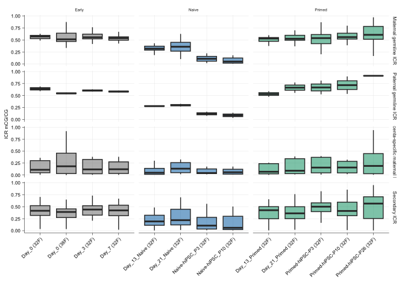
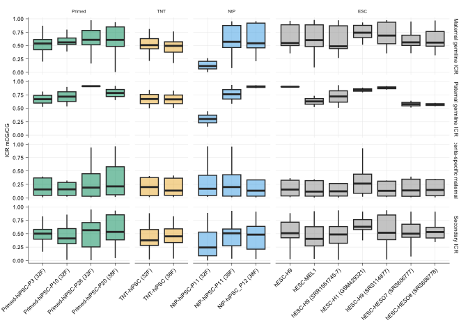
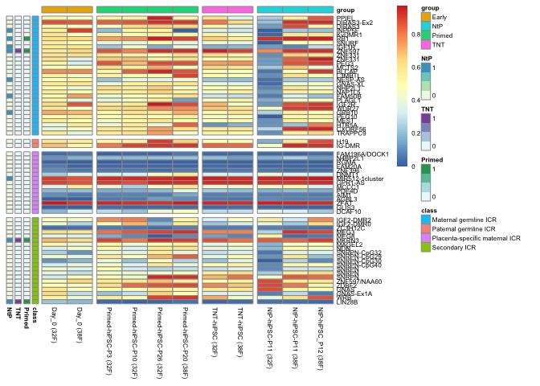
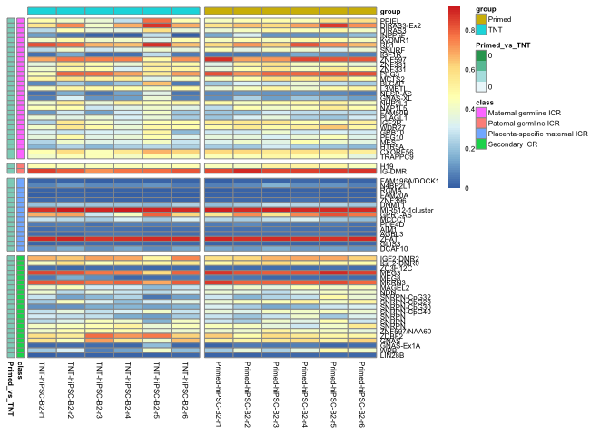
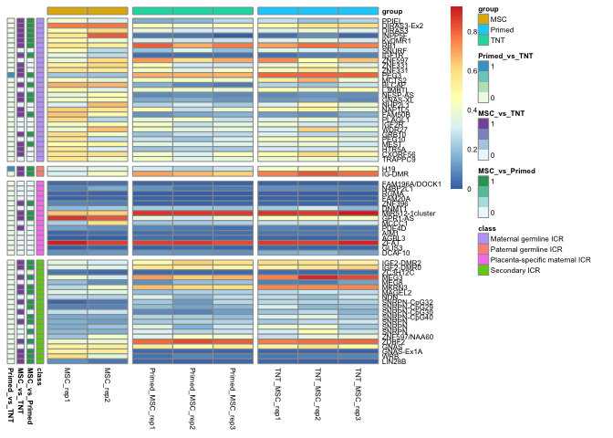
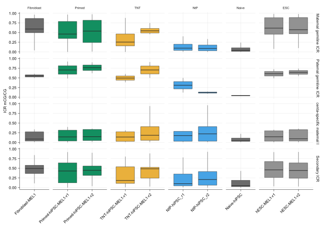
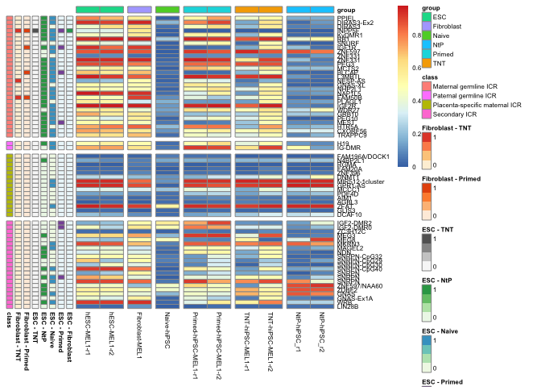

REVISION_imprint_analyses
================
Sam Buckberry
2023-07-15

Load project functions and libraries

``` r
source("R/project_functions.R")
```

    ## Loading required package: BiocGenerics

    ## 
    ## Attaching package: 'BiocGenerics'

    ## The following objects are masked from 'package:stats':
    ## 
    ##     IQR, mad, sd, var, xtabs

    ## The following objects are masked from 'package:base':
    ## 
    ##     anyDuplicated, append, as.data.frame, basename, cbind, colnames,
    ##     dirname, do.call, duplicated, eval, evalq, Filter, Find, get, grep,
    ##     grepl, intersect, is.unsorted, lapply, Map, mapply, match, mget,
    ##     order, paste, pmax, pmax.int, pmin, pmin.int, Position, rank,
    ##     rbind, Reduce, rownames, sapply, setdiff, sort, table, tapply,
    ##     union, unique, unsplit, which.max, which.min

    ## Welcome to Bioconductor
    ## 
    ##     Vignettes contain introductory material; view with
    ##     'browseVignettes()'. To cite Bioconductor, see
    ##     'citation("Biobase")', and for packages 'citation("pkgname")'.

    ## Loading required package: ggplot2

    ## Loading required package: lattice

    ## Loading required package: GenomicRanges

    ## Loading required package: stats4

    ## Loading required package: S4Vectors

    ## 
    ## Attaching package: 'S4Vectors'

    ## The following objects are masked from 'package:base':
    ## 
    ##     expand.grid, I, unname

    ## Loading required package: IRanges

    ## Loading required package: GenomeInfoDb

    ## Loading required package: SummarizedExperiment

    ## Loading required package: MatrixGenerics

    ## Loading required package: matrixStats

    ## 
    ## Attaching package: 'matrixStats'

    ## The following objects are masked from 'package:Biobase':
    ## 
    ##     anyMissing, rowMedians

    ## 
    ## Attaching package: 'MatrixGenerics'

    ## The following objects are masked from 'package:matrixStats':
    ## 
    ##     colAlls, colAnyNAs, colAnys, colAvgsPerRowSet, colCollapse,
    ##     colCounts, colCummaxs, colCummins, colCumprods, colCumsums,
    ##     colDiffs, colIQRDiffs, colIQRs, colLogSumExps, colMadDiffs,
    ##     colMads, colMaxs, colMeans2, colMedians, colMins, colOrderStats,
    ##     colProds, colQuantiles, colRanges, colRanks, colSdDiffs, colSds,
    ##     colSums2, colTabulates, colVarDiffs, colVars, colWeightedMads,
    ##     colWeightedMeans, colWeightedMedians, colWeightedSds,
    ##     colWeightedVars, rowAlls, rowAnyNAs, rowAnys, rowAvgsPerColSet,
    ##     rowCollapse, rowCounts, rowCummaxs, rowCummins, rowCumprods,
    ##     rowCumsums, rowDiffs, rowIQRDiffs, rowIQRs, rowLogSumExps,
    ##     rowMadDiffs, rowMads, rowMaxs, rowMeans2, rowMedians, rowMins,
    ##     rowOrderStats, rowProds, rowQuantiles, rowRanges, rowRanks,
    ##     rowSdDiffs, rowSds, rowSums2, rowTabulates, rowVarDiffs, rowVars,
    ##     rowWeightedMads, rowWeightedMeans, rowWeightedMedians,
    ##     rowWeightedSds, rowWeightedVars

    ## The following object is masked from 'package:Biobase':
    ## 
    ##     rowMedians

    ## 
    ## Attaching package: 'magrittr'

    ## The following object is masked from 'package:GenomicRanges':
    ## 
    ##     subtract

    ## 
    ## Attaching package: 'data.table'

    ## The following object is masked from 'package:SummarizedExperiment':
    ## 
    ##     shift

    ## The following object is masked from 'package:GenomicRanges':
    ## 
    ##     shift

    ## The following object is masked from 'package:IRanges':
    ## 
    ##     shift

    ## The following objects are masked from 'package:S4Vectors':
    ## 
    ##     first, second

    ## Loading required package: BSgenome

    ## Loading required package: Biostrings

    ## Loading required package: XVector

    ## 
    ## Attaching package: 'Biostrings'

    ## The following object is masked from 'package:base':
    ## 
    ##     strsplit

    ## Loading required package: rtracklayer

    ## Loading required package: AnnotationDbi

    ## 
    ## Attaching package: 'ggthemes'

    ## The following object is masked from 'package:cowplot':
    ## 
    ##     theme_map

    ## Loading required package: Rsamtools

    ## 
    ## Attaching package: 'VariantAnnotation'

    ## The following object is masked from 'package:stringr':
    ## 
    ##     fixed

    ## The following object is masked from 'package:base':
    ## 
    ##     tabulate

    ## 
    ## Attaching package: 'ChIPpeakAnno'

    ## The following object is masked from 'package:VariantAnnotation':
    ## 
    ##     info

    ## 
    ## Attaching package: 'gtools'

    ## The following object is masked from 'package:e1071':
    ## 
    ##     permutations

    ## 
    ## Attaching package: 'UpSetR'

    ## The following object is masked from 'package:lattice':
    ## 
    ##     histogram

    ## Loading required package: limma

    ## 
    ## Attaching package: 'limma'

    ## The following object is masked from 'package:BiocGenerics':
    ## 
    ##     plotMA

    ## Loading required package: grid

    ## 
    ## Attaching package: 'grid'

    ## The following object is masked from 'package:Biostrings':
    ## 
    ##     pattern

Load sample metadata sheet

``` r
mdat <- read.csv("wgbs/metadata/wgbs_metadata_local.csv")
```

Load the ICR data

``` r
icrs <- read_xlsx("resources/journal.pgen.1004868.s006.XLSX")

icr_gr <- GRanges(seqnames = icrs$Chromosome,
                  IRanges(start = icrs$Start, end = icrs$End))

mcols(icr_gr) <- icrs

icr_gr$Categoly[grepl("Secondary", icr_gr$Categoly)] <- "Secondary ICR"
icr_gr$Categoly[grepl("Maternal", icr_gr$Categoly)] <- "Maternal germline ICR"
icr_gr$Categoly[grepl("Paternal", icr_gr$Categoly)] <- "Paternal germline ICR"
icr_gr$Categoly[grepl("Placenta", icr_gr$Categoly)] <- "Placenta-specific maternal ICR"

saveRDS(icr_gr, "resources/imprint_control_regions_granges_hg19.Rds")
```

Calculate mCG/CG for all ICRs for all samples

``` r
icr_mCG <- make_mC_matrix(obj_fls = mdat$BSseq_CG, gr = icr_gr, cores = 4)
```

    ## Making matrix of mC levels for regions...

``` r
colnames(icr_mCG) <- mdat$Library_id
saveRDS(icr_mCG, "wgbs/processed_data/icr_mcg_all.Rds")
```

### Timecourse ICR plots for Fig. 2 and Fig. S2 ——-

Create timecourse boxplot for Fig 2 and Fig S2

``` r
icr_timecourse <- c("RL415", "RL702", "RL413", "RL399",
                     "RL414", "RL698", "RL411", "RL412",
                     "RL416", "RL697", "RL417", "RL418", "RL1751_1771")

icr_time_df <- icr_mCG[ ,icr_timecourse] %>% data.frame()
icr_time_df$class <- as.character(icr_gr$Categoly)

icr_time_df <- reshape2::melt(icr_time_df)
```

    ## Using class as id variables

``` r
icr_time_ind <- match(icr_time_df$variable, mdat$Library_id)
icr_time_ind2 <- match(icr_timecourse, mdat$Library_id)
 
icr_time_df$id <- factor(mdat$Manuscript.Name[icr_time_ind],
                         levels=mdat$Manuscript.Name[icr_time_ind2])

icr_time_df$group <- mdat$State[icr_time_ind]

gg_icr_time_box <- ggplot(icr_time_df, aes(x = id, y = value,
                                           fill=group, alpha=0.8)) +
    geom_boxplot(outlier.shape = NA) +
    facet_grid(class~group, drop = TRUE, space = "free_x", scales = "free_x") +
    scale_fill_manual(values = reprog_pal[c(3,2,1)]) +
    ylab("ICR mCG/CG") + xlab("") +
    sams_pub_theme()
```

    ## Warning: The `size` argument of `element_line()` is deprecated as of ggplot2 3.4.0.
    ## ℹ Please use the `linewidth` argument instead.

``` r
pdf("wgbs/plots/icr_timecourse_boxplots_maternal_germline.pdf",
    height = 2, width = 2.25)

    ggplot(icr_time_df[icr_time_df$class == "Maternal germline ICR", ],
           aes(x = id, y = value, fill=group)) +
    geom_boxplot(outlier.shape = NA, lwd=0.18) +
    facet_grid(.~group, drop = TRUE, space = "free_x", scales = "free_x") +
    scale_fill_manual(values = reprog_pal[c(3,2,1)]) +
    ylab("ICR mCG/CG") + xlab("") +
    sams_pub_theme()
    
dev.off()
```

    ## quartz_off_screen 
    ##                 2

``` r
pdf("wgbs/plots/icr_timecourse_boxplots_NOT_maternal_germline.pdf",
    height = 3.5, width = 2.25)

    ggplot(icr_time_df[icr_time_df$class != "Maternal germline ICR", ],
           aes(x = id, y = value, fill=group)) +
    geom_boxplot(outlier.shape = NA, lwd=0.18) +
    facet_grid(class~group, drop = TRUE, space = "free_x", scales = "free_x") +
    scale_fill_manual(values = reprog_pal[c(3,2,1)]) +
    ylab("ICR mCG/CG") + xlab("") +
    sams_pub_theme()
    
dev.off()
```

    ## quartz_off_screen 
    ##                 2

``` r
gg_icr_time_box
```

<!-- -->

### ICR plots for Fig. 3 and Fig. S4

``` r
icr_endpoint <- c("RL417", "RL418", "RL1751_1771", "RL703",  ## Primed
                    "RL1124", "RL1125", # TNT
                    "RL936", "RL937", "RL837", #NtP
                    "RL2351_merge", "RL2352_merge",
                    "SRR1561745_merge", "SRS004213", "SRS114877",
                    "SRS606777", "SRS606778") ## ESC

icr_endpoint_df <- icr_mCG[ ,icr_endpoint] %>% data.frame()
icr_endpoint_df$class <- as.character(icr_gr$Categoly)

icr_endpoint_df <- reshape2::melt(icr_endpoint_df)
```

    ## Using class as id variables

``` r
icr_endpoint_ind <- match(icr_endpoint_df$variable, mdat$Library_id)
icr_endpoint_ind2 <- match(icr_endpoint, mdat$Library_id)
 
icr_endpoint_df$id <- factor(mdat$Manuscript.Name[icr_endpoint_ind],
                         levels=mdat$Manuscript.Name[icr_endpoint_ind2])

icr_endpoint_df$group <- factor(mdat$State[icr_endpoint_ind],
                                levels = c("Primed", "TNT", "NtP",
                                           "Naive", "ESC"))


gg_icr_endpoint_box <- ggplot(icr_endpoint_df, aes(x = id, y = value,
                                           fill=group, alpha=0.8)) +
    geom_boxplot(outlier.shape = NA) +
    facet_grid(class~group, drop = TRUE, space = "free_x", scales = "free_x") +
    scale_fill_manual(values = reprog_pal2[c(2,1,3,4)]) +
    ylab("ICR mCG/CG") + xlab("") +
    sams_pub_theme()


pdf("wgbs/plots/icr_endpoint_boxplots_maternal_germline.pdf",
    height = 2, width = 3)

    ggplot(icr_endpoint_df[icr_endpoint_df$class == "Maternal germline ICR", ],
           aes(x = id, y = value, fill=group)) +
    geom_boxplot(outlier.shape = NA, lwd=0.18) +
    facet_grid(.~group, drop = TRUE, space = "free_x", scales = "free_x") +
    geom_hline(yintercept = c(0.25, 0.75), linetype="dashed", size=line_mm) +
    scale_fill_manual(values = reprog_pal2[c(2,1,3,4)]) +
    ylab("ICR mCG/CG") + xlab("") +
    sams_pub_theme()
```

    ## Warning: Using `size` aesthetic for lines was deprecated in ggplot2 3.4.0.
    ## ℹ Please use `linewidth` instead.

``` r
dev.off()
```

    ## quartz_off_screen 
    ##                 2

``` r
pdf("wgbs/plots/icr_endpoint_boxplots_NOT_maternal_germline.pdf",
    height = 3.5, width = 3)

    ggplot(icr_endpoint_df[icr_endpoint_df$class != "Maternal germline ICR", ],
           aes(x = id, y = value, fill=group)) +
    geom_boxplot(outlier.shape = NA, lwd=0.18) +
    geom_hline(yintercept = c(0.25, 0.75), linetype="dashed", size=line_mm) +
    facet_grid(class~group, drop = TRUE, space = "free_x", scales = "free_x") +
    scale_fill_manual(values = reprog_pal2[c(2,1,3,4)]) +
    ylab("ICR mCG/CG") + xlab("") +
    sams_pub_theme()
    
dev.off()
```

    ## quartz_off_screen 
    ##                 2

``` r
gg_icr_endpoint_box
```

<!-- -->

Do some ‘wider’ statistics for ICRs, as asked by reviewer 4

``` r
icr_df <- icr_mCG[ ,c("RL415", "RL702", icr_endpoint)] %>% data.frame()


## Setup anova for each ICR

groups <- factor(mdat$State[match(colnames(icr_df), mdat$Library_id)])

design <- model.matrix(~ 0+groups)
colnames(design) <- c("Fibroblast", "ESC", "NtP", "Primed", "TNT")

contrast.matrix <- makeContrasts(Fibroblast - Primed,
                                 Fibroblast - TNT,
                                 Fibroblast - NtP,
                                 Primed - TNT,
                                 Primed - NtP,
                                 levels = design)

fit <- lmFit(icr_df, design)

fit2 <- contrasts.fit(fit, contrast.matrix)

fit2 <- eBayes(fit2)

tt_primed <- topTable(fit2, coef=1, adjust="BH",
                      number = nrow(icr_df), sort="none")
#tt_primed <- tt_primed[match(rownames(icr_df), rownames(tt_primed)), ]

tt_tnt <- topTable(fit2, coef=2, adjust="BH",
                   number = nrow(icr_df), sort="none")
tt_ntp <- topTable(fit2, coef=3, adjust="BH",
                   number = nrow(icr_df), sort="none")

row_dat <- data.frame(row.names = rownames(icr_df),
                      class = icr_gr$Categoly,
                      Primed = as.numeric(tt_primed$adj.P.Val < 0.05),
                      TNT = as.numeric(tt_tnt$adj.P.Val < 0.05),
                      NtP = as.numeric(tt_ntp$adj.P.Val < 0.05)
                      )

col_dat <- data.frame(row.names = colnames(icr_df), 
                      group = groups)

icr_hm <- pheatmap(icr_df[ ,1:11],
         annotation_row = row_dat,
         fontsize = 6,
         annotation_col = col_dat,
         labels_col = mdat$Manuscript.Name[match(colnames(icr_df),
                                                 mdat$Library_id)][1:11],
         labels_row = icr_gr$Name,
         cluster_cols = FALSE, cluster_rows = FALSE,
         gaps_col = c(2, 6, 8),
         gaps_row = c(29, 31, 46))
```

<!-- -->

``` r
pdf("wgbs/plots/icr_endpoint_annotated_heatmap.pdf", width = 5)
icr_hm
dev.off()
```

    ## quartz_off_screen 
    ##                 2

### Fibroblast replicate ICR plots

``` r
plot_icr_boxplots <- function(lib_ids){
    
    df <- icr_mCG[ ,lib_ids] %>% data.frame()
    df$class <- as.character(icr_gr$Categoly)

    df <- reshape2::melt(df)
    
    ind <- match(df$variable, mdat$Library_id)
    ind2 <- match(lib_ids, mdat$Library_id)
     
    df$id <- factor(mdat$Manuscript.Name[ind],
                             levels=mdat$Manuscript.Name[ind2])
    
    df$group <- factor(mdat$State[ind],
                       levels = c("Fibroblast",
                                  "Keratinocyte",
                                  "MSC",
                                  "Primed", "TNT",
                                  "NtP", "Naive", "ESC"))
    
    gg_icr_endpoint_box <- ggplot(df, aes(x = id, y = value,
                                               fill=group)) +
        geom_boxplot(outlier.shape = NA, lwd=0.18) +
        facet_grid(class~group, drop = TRUE,
                   space = "free_x", scales = "free_x") +
        scale_fill_manual(values = reprog_pal2[c(2,1,3,4)]) +
        ylab("ICR mCG/CG") + xlab("") +
        sams_pub_theme()
    
    gg_icr_endpoint_box
    
}

fibroblast_rep_ids <- paste0("RL30", 61:72)

plot_icr_boxplots(lib_ids = fibroblast_rep_ids)
```

    ## Using class as id variables

<!-- -->

``` r
pdf("wgbs/plots/icr_fibroblast_rep_boxplots.pdf", width = 2.5, 4)
plot_icr_boxplots(lib_ids = fibroblast_rep_ids)
```

    ## Using class as id variables

``` r
dev.off()
```

    ## quartz_off_screen 
    ##                 2

Heatmap and stats for fibroblast iPSC ICRs

``` r
icr_fib_df <- icr_mCG[ ,fibroblast_rep_ids] %>% data.frame()

## Setup anova for each ICR

groups <- factor(mdat$State[match(colnames(icr_fib_df), mdat$Library_id)])

design <- model.matrix(~ 0+groups)
colnames(design) <- c("Primed", "TNT")

contrast.matrix <- makeContrasts(Primed - TNT,
                                 levels = design)

fit <- lmFit(icr_fib_df, design)

fit2 <- contrasts.fit(fit, contrast.matrix)

fit2 <- eBayes(fit2)

tt_fib <- topTable(fit2, coef=1, adjust="BH",
                      number = nrow(icr_fib_df), sort="none")

row_dat <- data.frame(row.names = rownames(icr_fib_df),
                      class = icr_gr$Categoly,
                      Primed_vs_TNT = as.numeric(tt_fib$adj.P.Val < 0.05))

col_dat <- data.frame(row.names = colnames(icr_fib_df), 
                      group = groups)

icr_fib_hm <- pheatmap(icr_fib_df,
         annotation_row = row_dat,
         fontsize = 6,
         annotation_col = col_dat,
         labels_col = mdat$Manuscript.Name[match(colnames(icr_fib_df),
                                                 mdat$Library_id)],
         labels_row = icr_gr$Name,
         cluster_cols = FALSE, cluster_rows = FALSE,
         gaps_col = c(6),
         gaps_row = c(29, 31, 46))
```

<!-- -->

``` r
pdf("wgbs/plots/icr_fibroblast_rep_endpoint_annotated_heatmap.pdf", width = 5)
icr_fib_hm
dev.off()
```

    ## quartz_off_screen 
    ##                 2

``` r
wb_ed_fig9h <- openxlsx::createWorkbook()
openxlsx::addWorksheet(wb_ed_fig9h, sheetName = "ED_Fig_9h_HDF")
openxlsx::writeData(wb = wb_ed_fig9h, sheet = "ED_Fig_9h_HDF",
                    x = icr_fib_df)
```

### MSC ICR plots

MSC ICR boxplots

``` r
msc_ids <- paste0("RL31", 55:62)

pdf("wgbs/plots/icr_msc_boxplots.pdf", width = 2.5, height = 4)
plot_icr_boxplots(lib_ids = msc_ids)
```

    ## Using class as id variables

``` r
dev.off()
```

    ## quartz_off_screen 
    ##                 2

MSC ICR stats with heatmap

``` r
icr_msc_df <- icr_mCG[ ,msc_ids[c(7,8,1:6)]] %>% data.frame()

## Setup anova for each ICR
msc_groups <- factor(mdat$State[match(colnames(icr_msc_df), mdat$Library_id)])

msc_design <- model.matrix(~ 0+msc_groups)
colnames(msc_design) <- c("MSC", "Primed", "TNT")

msc_matrix <- makeContrasts(MSC - Primed,
                                 MSC - TNT,
                                 Primed - TNT,
                                 levels = msc_design)

msc_fit <- lmFit(icr_msc_df, msc_design)

msc_fit2 <- contrasts.fit(msc_fit, msc_matrix)

msc_fit2 <- eBayes(msc_fit2)

tt_msc_primed <- topTable(msc_fit2, coef=1, adjust="BH",
                      number = nrow(icr_msc_df), sort="none")

tt_msc_tnt <- topTable(msc_fit2, coef=2, adjust="BH",
                      number = nrow(icr_msc_df), sort="none")

tt_msc_primed_v_tnt <- topTable(msc_fit2, coef=3, adjust="BH",
                      number = nrow(icr_msc_df), sort="none")

row_dat <- data.frame(row.names = rownames(icr_msc_df),
                      class = icr_gr$Categoly,
                      MSC_vs_Primed = as.numeric(tt_msc_primed$adj.P.Val < 0.05),
                      MSC_vs_TNT = as.numeric(tt_msc_tnt$adj.P.Val < 0.05),
                      Primed_vs_TNT = as.numeric(tt_msc_primed_v_tnt$adj.P.Val < 0.05))

col_dat <- data.frame(row.names = colnames(icr_msc_df), 
                      group = msc_groups)

icr_msc_hm <- pheatmap(icr_msc_df,
         annotation_row = row_dat,
         fontsize = 6,
         annotation_col = col_dat,
         labels_col = mdat$Manuscript.Name[match(colnames(icr_msc_df),
                                                 mdat$Library_id)],
         labels_row = icr_gr$Name,
         cluster_cols = FALSE, cluster_rows = FALSE,
         gaps_col = c(2,5),
         gaps_row = c(29, 31, 46))
```

<!-- -->

``` r
pdf("wgbs/plots/icr_msc_annotated_heatmap.pdf", width = 5)
icr_msc_hm
dev.off()
```

    ## quartz_off_screen 
    ##                 2

``` r
openxlsx::addWorksheet(wb_ed_fig9h, sheetName = "ED_Fig_9h_MSC")
openxlsx::writeData(wb = wb_ed_fig9h, sheet = "ED_Fig_9h_MSC",
                    x = icr_msc_df)
```

### Keratinocyte ICR plots

``` r
nkek_ids <- paste0("RL32", 39:47)
plot_icr_boxplots(lib_ids = nkek_ids)
```

    ## Using class as id variables

<!-- -->

``` r
pdf("wgbs/plots/isc_nhek_boxplots.pdf", width = 2.5, height = 4)
plot_icr_boxplots(lib_ids = nkek_ids)
```

    ## Using class as id variables

``` r
dev.off()
```

    ## quartz_off_screen 
    ##                 2

``` r
icr_nhek_df <- icr_mCG[ ,nkek_ids[c(7:9,1:6)]] %>% data.frame()

## Setup anova for each ICR

nhek_groups <- factor(mdat$State[match(colnames(icr_nhek_df), mdat$Library_id)])

nhek_design <- model.matrix(~ 0+nhek_groups)
colnames(nhek_design) <- c("NHEK", "Primed", "TNT")

nhek_matrix <- makeContrasts(NHEK - Primed,
                                 NHEK - TNT,
                                 Primed - TNT,
                                 levels = nhek_design)

nhek_fit <- lmFit(icr_nhek_df, nhek_design)

nhek_fit2 <- contrasts.fit(nhek_fit, nhek_matrix)

nhek_fit2 <- eBayes(nhek_fit2)

tt_nhek_primed <- topTable(nhek_fit2, coef=1, adjust="BH",
                      number = nrow(icr_nhek_df), sort="none")

tt_nhek_tnt <- topTable(nhek_fit2, coef=2, adjust="BH",
                      number = nrow(icr_nhek_df), sort="none")

tt_nhek_primed_v_tnt <- topTable(nhek_fit2, coef=3, adjust="BH",
                      number = nrow(icr_nhek_df), sort="none")

nhek_row_dat <- data.frame(row.names = rownames(icr_nhek_df),
                      class = icr_gr$Categoly,
                      MSC_vs_Primed = as.numeric(tt_nhek_primed$adj.P.Val < 0.05),
                      MSC_vs_TNT = as.numeric(tt_nhek_tnt$adj.P.Val < 0.05),
                      Primed_vs_TNT = as.numeric(tt_nhek_primed_v_tnt$adj.P.Val < 0.05))

nhek_col_dat <- data.frame(row.names = colnames(icr_nhek_df), 
                      group = nhek_groups)

icr_nhek_hm <- pheatmap(icr_nhek_df,
         annotation_row = nhek_row_dat,
         annotation_col = nhek_col_dat,
         labels_col = mdat$Manuscript.Name[match(colnames(icr_nhek_df),
                                                 mdat$Library_id)],
         labels_row = icr_gr$Name,
         cluster_cols = FALSE,
         cluster_rows = FALSE,
        fontsize = 6,
         gaps_col = c(3,6),
         gaps_row = c(29, 31, 46))
```

<!-- -->

``` r
pdf("wgbs/plots/icr_nhek_annotated_heatmap.pdf", width = 5)
icr_nhek_hm
dev.off()
```

    ## quartz_off_screen 
    ##                 2

``` r
openxlsx::addWorksheet(wb_ed_fig9h, sheetName = "ED_Fig_9h_NHEK")
openxlsx::writeData(wb = wb_ed_fig9h, sheet = "ED_Fig_9h_NHEK",
                    x = icr_nhek_df)

openxlsx::saveWorkbook(wb = wb_ed_fig9h,
                       file = "ED_Figure_9h_source_data.xlsx", overwrite = TRUE)
```

### Secondary MEL1 system plots

``` r
mel1_ids <- c("RL1980", "RL1981", "RL1982", "RL1983",
  "RL1984", "RL1985", "RL1986", "RL2352",
  "RL2560", "RL2561")

plot_icr_boxplots(lib_ids = mel1_ids)
```

    ## Using class as id variables

<!-- -->

``` r
icr_mel1_df <- icr_mCG[ ,mel1_ids[c(2,8,
                                    7,1,
                                    3,9,
                                    4,10,
                                    5,6)]] %>% data.frame()


## Setup anova for each ICR

mel1_groups <- factor(mdat$State[match(colnames(icr_mel1_df), mdat$Library_id)])

mel1_design <- model.matrix(~ 0+mel1_groups)
colnames(mel1_design) <- c("ESC", "Fibroblast", "Naive", "NtP", "Primed", "TNT")

mel1_matrix <- makeContrasts(ESC - Fibroblast,
                             ESC - Primed,
                             ESC - Naive,
                             ESC - NtP,
                             ESC - TNT,
                             Fibroblast - Primed,
                             Fibroblast - TNT,
                             levels = mel1_design)

mel1_fit <- lmFit(icr_mel1_df, mel1_design)

mel1_fit2 <- contrasts.fit(mel1_fit, mel1_matrix)

mel1_fit2 <- eBayes(mel1_fit2)

get_tt <- function(x){
    
    tt <- topTable(mel1_fit2, coef=x, adjust="BH",
                      number = nrow(icr_mel1_df), sort="none")
    
}

mel1_tt_list <- lapply(1:ncol(mel1_matrix), get_tt)
names(mel1_tt_list) <- colnames(mel1_matrix)

get_sig <- function(x){
    
    mel1_tt_list[[x]]$adj.P.Val < 0.05
    
}

mel1_row_dat <- lapply(1:length(mel1_tt_list), get_sig) %>% 
    do.call(cbind, .) %>% data.frame()
mel1_row_dat <- mel1_row_dat + 0
colnames(mel1_row_dat) <- names(mel1_tt_list)
rownames(mel1_row_dat) <- rownames(icr_mel1_df)
mel1_row_dat$class <- icr_gr$Categoly

mel1_col_dat <- data.frame(row.names = colnames(icr_mel1_df), 
                      group = mel1_groups)

icr_mel1_hm <- pheatmap(icr_mel1_df,
         annotation_row = mel1_row_dat,
         annotation_col = mel1_col_dat,
         labels_col = mdat$Manuscript.Name[match(colnames(icr_mel1_df),
                                                 mdat$Library_id)],
         labels_row = icr_gr$Name,
         cluster_cols = FALSE,
         cluster_rows = FALSE,
        fontsize = 6,
        gaps_col = c(2,3,4,6,8),
         gaps_row = c(29, 31, 46))
```

<!-- -->

``` r
pdf("wgbs/plots/icr_mel1_annotated_heatmap.pdf", width = 5)
icr_mel1_hm
dev.off()
```

    ## quartz_off_screen 
    ##                 2

``` r
wb_ed_fig8d <- openxlsx::createWorkbook() 
openxlsx::addWorksheet(wb_ed_fig8d, sheetName = "ED_Fig_8d")
openxlsx::writeData(wb = wb_ed_fig8d, sheet = "ED_Fig_8d",
                    x = icr_mel1_df)
openxlsx::saveWorkbook(wb = wb_ed_fig8d,
                       file = "ED_Figure_8d_source_data.xlsx", overwrite = TRUE)
```
