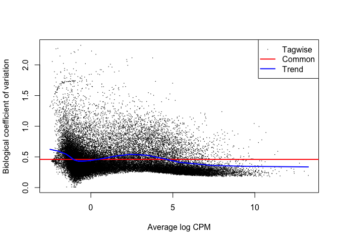
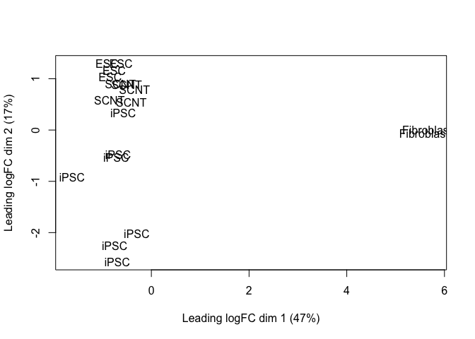
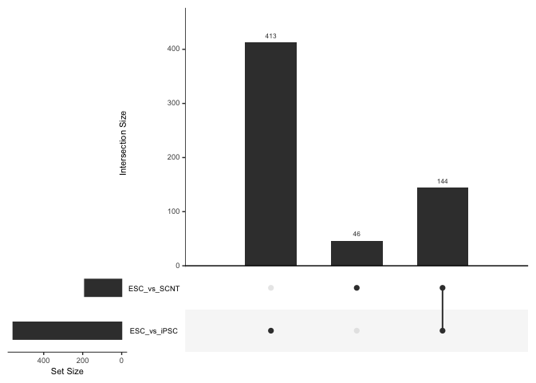
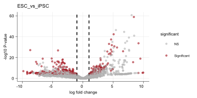
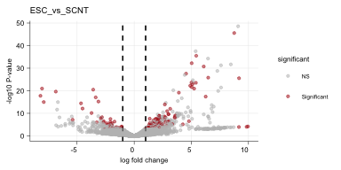
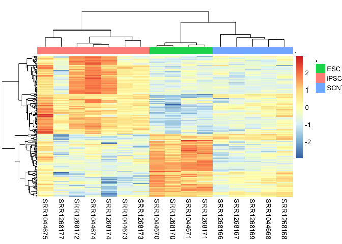

Differential expression: SCNT reprogramming (Ma et al. Nature 2014 data)
================
Sam Buckberry
2023-05-16

# Measuring differential expression of transposable elements

## Preliminaries

Load the libraries and scripts

``` r
# Differential expression testing
library(limma)
library(edgeR)
library(magrittr)
library(ggplot2)
library(GenomicFeatures)
library(ChIPpeakAnno)
library(stringr)
library(reshape2)
library(gridExtra)
library(cowplot)
library(tidyr)
library(jsonlite)
```

Load the script that contains functions used in the project

``` r
source("R/project_functions.R")
```

## Load the RNA-seq count data and associated sample meta-data

Read the sample count tables and combine into matrix

``` r
# List the counts tables for all samples
# cnt_files <- list.files(path = "RNAseq/mitalipov_data/", full.names = TRUE, pattern = "cntTable.gz")
# 
# dat2 <- lapply(cnt_files, read.table, header = TRUE, row.names = 1) %>% do.call(cbind, .)
# libs <- colnames(dat2) %>% str_sub(start = 1, end = 10)
# colnames(dat2) <- libs
# 
# #remove rows with all zero's 
# keep_row <- rowSums(dat2) > 0
# table(keep_row)
# dat2 <- dat2[keep_row, ]
# saveRDS(dat2, file = "RNAseq/mitalipov_data/scnt_te_and_gene_counts.Rds")
# dim(dat2)

dat2 <- readRDS("RNAseq/mitalipov_data/scnt_te_and_gene_counts.Rds")
```

Read the meta-data table and match to expression data

``` r
sample_dat <- fread("RNAseq/mitalipov_data/PRJNA230824_SraRunTable.txt")
sample_dat <- sample_dat[match(colnames(dat2), sample_dat$Run), ]
all(colnames(dat2) == sample_dat$Run)
```

    ## [1] TRUE

``` r
sample_dat$cell_line <- str_remove(pattern = " Derived", string = sample_dat$cell_line) %>% 
    str_replace(pattern = " ", replacement = "_") %>% str_replace(pattern = "-", replacement = "_") %>%
    str_replace(pattern = "Sendai_Virus", replacement = "iPSC") %>% 
    str_replace(pattern = "Retro_Virus", replacement = "iPSC") %>% 
    str_replace(pattern = "IVF", replacement = "ESC") %>%
    str_replace(pattern = "Nuclear_Transfer", replacement = "SCNT") %>%
    str_replace(pattern = "Parental", replacement = "Fibroblast") %>%
    str_replace(pattern = "Tissue", replacement = "Fibroblast")
```

Read in the count data, and setup experimental design matrix

``` r
y2 <- DGEList(counts = dat2)
y2$samples <- cbind(y2$samples, sample_dat)

design <- model.matrix(~cell_line, data=y2$samples)
colnames(design) <- str_remove(string = colnames(design), pattern = "cell_line")

keep <- filterByExpr(y2, design)
table(keep)
```

    ## keep
    ##  FALSE   TRUE 
    ## 757399  38103

``` r
y2 <- y2[keep, ,keep.lib.sizes=FALSE]
y2 <- calcNormFactors(y2)

y2 <- estimateDisp(y2, design = design, robust = TRUE)
```

Inspect the BCV plots for all tags

``` r
plotBCV(y2)
```

<!-- -->

Inspect MDS plot using only the TE signal

``` r
plotMDS(y2[grepl(pattern = "_dup", rownames(y2)), ], labels = y2$samples$cell_line)
```

<!-- -->

Setup the differential expression testing

``` r
fit <- glmFit(y2, design)

# list of contrasts for differential expression vs ESCs
cont_list <- list(ESC_vs_iPSC=c(0,0,-1,0), ESC_vs_SCNT=c(0,0,0,-1))

# Get the TE genome co-ordinates
# repeat_gtf <- read.table("resources/hg19_rmsk_TE.gtf.gz")
# repeat_gr <- GRanges(seqnames = repeat_gtf$V1,
#                      ranges = IRanges(start = repeat_gtf$V4,
#                                       end = repeat_gtf$V5))
# strand(repeat_gr) <- repeat_gtf$V7
# repeat_gr$class <- repeat_gtf$V19
# repeat_gr$family <- repeat_gtf$V16
# repeat_gr$gene <- repeat_gtf$V10
# repeat_gr$transcript <- repeat_gtf$V13
# repeat_gr$id <- str_c(repeat_gr$transcript, repeat_gr$family, repeat_gr$class, sep = ":")
# rm(repeat_gtf)

repeat_gr <- readRDS("resources/hg19_rmsk_TE_granges.Rds")

# Calculate differential expression, then subset for TE's and re-calculate FDR as we are only interested in finding DE TE's here
calc_de_for_te <- function(x){
        cont <- cont_list[[x]]
        lrt <- glmLRT(fit, contrast = cont)
        tt <- topTags(lrt, n = nrow(y2))
        tt_table <- tt$table
        tt_table$gene_id <- rownames(tt_table)
        tt_table$contrast <- names(cont_list)[x]
        
        # Subset for TE's and recalculate FDR
        tt_table <- tt_table[tt_table$gene_id %in% repeat_gr$id, ]
        tt_table$FDR <- p.adjust(p = tt_table$PValue, method = "fdr")
        
        return(tt_table)
}

calc_de_for_te <- function(cont, fit){
        
        lrt <- glmLRT(glmfit = fit, contrast = cont)

        tt <- topTags(lrt, n = nrow(fit$counts))
        tt_table <- tt$table
        tt_table$gene_id <- rownames(tt_table)
        tt_table$contrast <- lrt$comparison
        
        # Subset for TE's and recalculate FDR
        tt_table <- tt_table[tt_table$gene_id %in% repeat_gr$id, ]
        tt_table$FDR <- p.adjust(p = tt_table$PValue, method = "fdr")
    
    
        tt_table$significant <- (abs(tt_table$logFC) > 1) & (tt_table$FDR < 0.05) & (tt_table$logCPM > 0)
        tt_table$significant <- ifelse(test = tt_table$significant, yes = "Significant", no = "NS")
        tt_table$significant <- factor(tt_table$significant, levels = c("NS", "Significant"))
    
        # Add the TE locus information
        ind <- match(tt_table$gene_id, repeat_gr$id)

        tt_table <- cbind(tt_table, as.data.frame(repeat_gr)[ind, ])
        
}


all_tt <- lapply(X = cont_list, FUN = calc_de_for_te, fit=fit)
```

Plot upset overlaps of DE TE’s

``` r
get_de_list <- function(x){
    df <- all_tt[[x]]
    sig_genes <- df$id[df$significant == "Significant"] %>% as.character()
    return(sig_genes)
}

de_list <- lapply(1:length(all_tt), get_de_list)

# Make a matrix of intersecting DE gene lists
get_olaps <- function(de_list){
        all_sig_genes <- unlist(de_list) %>% unique() 
        hits <- lapply(1:length(de_list), function(x){ (all_sig_genes %in% de_list[[x]]) + 0 })
        hits <- do.call(cbind, hits)
        rownames(hits) <- all_sig_genes
        return(hits)
}

hits <- get_olaps(de_list = de_list) %>% data.frame()
colnames(hits) <- c(names(cont_list))
#colnames(hits) <- c(names(contrast_list_A), names(contrast_list_B))
upset(hits)
```

<!-- -->

MA and volcano plots DE plot functions

``` r
plot_tt_volcano <- function(x, tt_list, lfc=1, ids=""){

        tt <- tt_list[[x]]

        id_dat <- tt[tt$transcript %in% ids, ]

        title <- names(tt_list[x])
        
        set.seed(12)
        ggplot(data = tt, aes(x = logFC, y = -log10(PValue), colour=significant)) +
                geom_vline(xintercept = c(-lfc, lfc), linetype="dashed") +
                ggtitle(title) +
                scale_colour_manual(values = c("grey", "firebrick")) +
                geom_point(alpha=0.5, size=0.8) +
                geom_vline(xintercept = c(-lfc, lfc), alpha=0.5, linetype='dashed') +
                ylab("-log10 P-value") + xlab("log fold change") +
                theme(strip.text.y = element_text(angle = 0)) +
                sams_pub_theme(x.text.angle = 0, legend_pos = "right")
}

plot_tt_ma <- function(x, tt_list, lfc=1, ids=""){
        
        tt <- tt_list[[x]]
  
        id_dat <- tt[tt$transcript %in% ids, ]

        title <- names(tt_list[x])
        
        tt <- tt[order(tt$significant), ]
        
        set.seed(12)
        ggplot(data = tt, aes(x = logCPM, y = logFC, colour=significant)) +
                geom_hline(yintercept = c(-lfc, lfc), linetype="dashed") +
                geom_point(alpha=0.5, size=0.8) +
                xlab("Mean log2 CPM") +
                ylab("Fold-change (log2)") +
                ggtitle(title) +
                scale_colour_manual(values = c("grey", "firebrick")) +
                geom_point(alpha=0.5, size=0.8) +
                theme(strip.text.y = element_text(angle = 0)) +
                sams_pub_theme(x.text.angle = 0, legend_pos = "right")
}
```

``` r
pdf("RNAseq/plots/SCNT_TE_loci_volcano_plots.pdf", height = 2, width = 3)
lapply(1:length(all_tt), plot_tt_volcano, tt_list=all_tt)
```

    ## Warning: The `size` argument of `element_line()` is deprecated as of ggplot2 3.4.0.
    ## ℹ Please use the `linewidth` argument instead.

    ## [[1]]

    ## 
    ## [[2]]

``` r
dev.off()
```

    ## quartz_off_screen 
    ##                 2

``` r
pdf("RNAseq/plots/SCNT_TE_loci_ma_plots.pdf", height = 2, width = 3)
lapply(1:length(all_tt), plot_tt_ma, tt_list=all_tt)
```

    ## [[1]]

    ## 
    ## [[2]]

``` r
dev.off()
```

    ## quartz_off_screen 
    ##                 2

``` r
lapply(1:length(all_tt), plot_tt_volcano, tt_list=all_tt)
```

    ## [[1]]

<!-- -->

    ## 
    ## [[2]]

<!-- -->

``` r
lapply(1:length(all_tt), plot_tt_ma, tt_list=all_tt)
```

    ## [[1]]

<!-- -->

    ## 
    ## [[2]]

<!-- -->

``` r
te_de_df <- do.call(rbind, all_tt)

te_de_df <- te_de_df[order(te_de_df$significant), ]

gg_ma <- ggplot(te_de_df,
       aes(y = -logFC, x = logCPM, color=significant)) +
    facet_grid(.~contrast) +
        scale_colour_manual(values = c("grey", "firebrick")) +
        geom_point(alpha=0.5, size=0.8) +
        xlab("log CPM") + ylab("log fold change") +
        geom_hline(yintercept = c(-1, 1), alpha=0.5, linetype='dashed') +
        geom_vline(xintercept = 0, alpha=0.5, linetype='dashed') +
        facet_grid(.~contrast, drop = TRUE, scales = "free_y", space = "free") +
        theme(strip.text.y = element_text(angle = 0)) +
        sams_pub_theme(x.text.angle = 0, legend_pos = "right")


pdf("RNAseq/plots/SCNT_TE_loci_ma_plots.pdf", height = 2, width = 5)
gg_ma
dev.off()
```

    ## quartz_off_screen 
    ##                 2

``` r
te_de_df$direction <- ifelse(te_de_df$logFC < 0, yes = "down", no = "up")

te_de_df %>% dplyr::group_by(significant, direction, contrast) %>% dplyr::tally()
```

    ## # A tibble: 8 × 4
    ## # Groups:   significant, direction [4]
    ##   significant direction contrast     n
    ##   <fct>       <chr>     <chr>    <int>
    ## 1 NS          down      -1*iPSC   9881
    ## 2 NS          down      -1*SCNT   9301
    ## 3 NS          up        -1*iPSC   8342
    ## 4 NS          up        -1*SCNT   9289
    ## 5 Significant down      -1*iPSC    323
    ## 6 Significant down      -1*SCNT     56
    ## 7 Significant up        -1*iPSC    234
    ## 8 Significant up        -1*SCNT    134

``` r
all_cpm <- cpm(y2, log = TRUE, prior.count = 1)
all_cpm <- all_cpm[ ,y2$samples$cell_line != "Fibroblast"]

hm_annot_dat <- y2$samples[ ,c("cell_line")] %>% data.frame() 
rownames(hm_annot_dat) <-  y2$samples$Run

#col_ids <- with(data = y2$samples, expr = str_c(Group, Passage, sep = "_"))


heatmap_te <- function(ids, title=""){
        
        plot_dat <- all_cpm[rownames(all_cpm) %in% ids, ]
        plot_dat <- plot_dat[complete.cases(plot_dat), ] %>% data.frame()

        pheatmap(plot_dat, scale = 'row', annotation_col = hm_annot_dat, 
                 #labels_col = col_ids,
                 main = title,
                 annotation_names_col = TRUE,
                 show_rownames = FALSE, border_color = NA,
                 clustering_distance_rows = 'correlation',
                 clustering_distance_cols = 'correlation')
}


sig_te <- all_tt$ESC_vs_iPSC$id[all_tt$ESC_vs_iPSC$significant == "Significant"]

sig_herv <- sig_te[grepl("HERVH-int", sig_te)]


heatmap_te(ids = sig_te)
```

<!-- -->

``` r
heatmap_te(ids = sig_herv)
```

<!-- -->

``` r
pdf("RNAseq/plots/Ma_SCNT_TE_differential_expression_heatmap.pdf", width = 4, height = 4)
heatmap_te(ids = sig_te)
dev.off()
```

    ## pdf 
    ##   3

``` r
plot_dat <- all_cpm[rownames(all_cpm) %in% sig_te, ]
plot_dat <- plot_dat[complete.cases(plot_dat), ] %>% data.frame()

wb_ed_fig8l <- openxlsx::createWorkbook()
openxlsx::addWorksheet(wb_ed_fig8l, sheetName = "ED_Fig_8l")
openxlsx::writeData(wb = wb_ed_fig8l, sheet = "ED_Fig_8l",
                    x = plot_dat)
openxlsx::saveWorkbook(wb = wb_ed_fig8l,
                       file = "ED_Figure_8l_source_data.xlsx", overwrite = TRUE)
```
